### Adding Parameters

[previous](../material-instances/README.md#user-content-material-instances) • [home](../README.md#user-content-ue4-intro-to-materials) • [next](../texture-masks/README.md#user-content-texture-masks)

See how we can add other parameters in the Material Instance. We can edit the master material and the material instances will immediately adopt all the changes to the parent material.

 

---

##### `Step 1.`\|`SUU&G`|:small_blue_diamond:
Download [T_Brick_Clay_Beveled_AmbientOccRougnessMetalic](../Assets/T_Brick_Clay_Beveled_AmbientOccRougnessMetalic.TGA) and add it to the **Textures** folder.

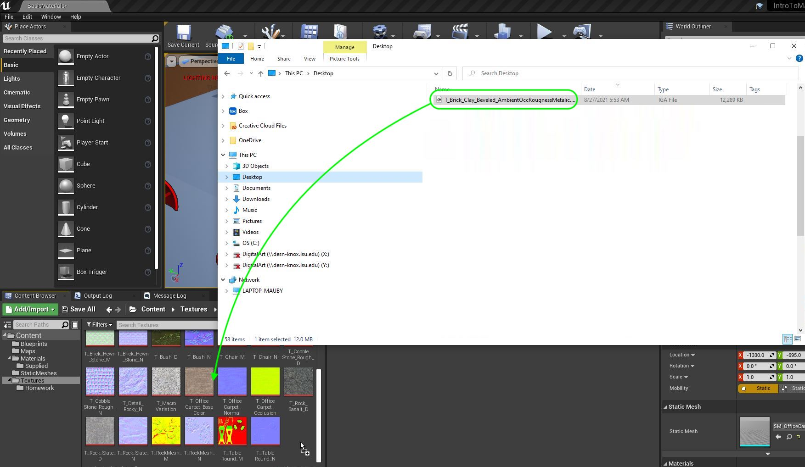

##### `Step 2.`\|`FHIU`|:small_blue_diamond: :small_blue_diamond: 

Now we are going to add an instance parameter directly for a texture.  Right click on the graph and select **TextureSampleParameter2D**.  Call this node `Normal Map`. Assign `T_OfficeCarpetNormal` to this material.

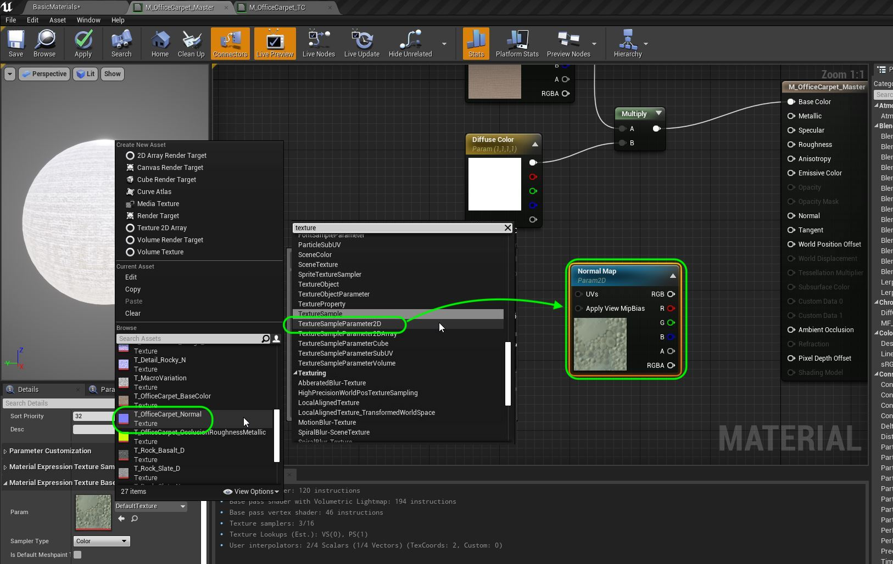

##### `Step 3.`\|`SUU&G`|:small_blue_diamond: :small_blue_diamond: :small_blue_diamond:

Now add a new **Group** called `Normal` (just type it in the box as it is not in the current drop down).  This will help separate the different editable material properties in the instance. Connect the **RGB** in the **Normal Map** node to the **Normal** pin in the shader node.

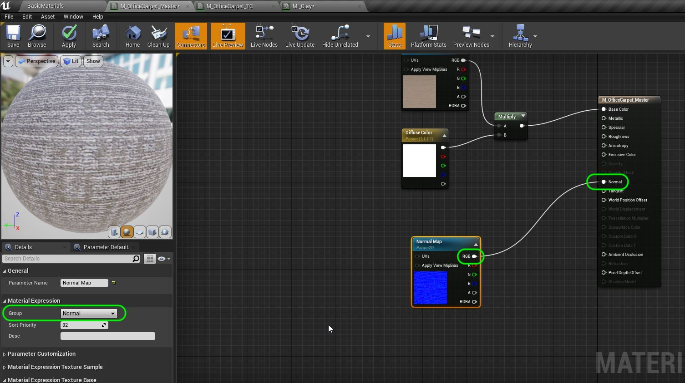

##### `Step 4.`\|`SUU&G`|:small_blue_diamond: :small_blue_diamond: :small_blue_diamond: :small_blue_diamond:

Add another **TextureSampleParameter2D** and call it **AmbientRoughnessMetalic**. Assign `T_OfficeCarpet_OcclusionRoughnessMetalic` to it.  Put it in **Group** `AO RoughMet`.  Connect **R** to **Ambient Occlusion**, **G** to **Roughness** and finally **B** to **Metallic**.  Press the <kbd>Apply</kbd> button.

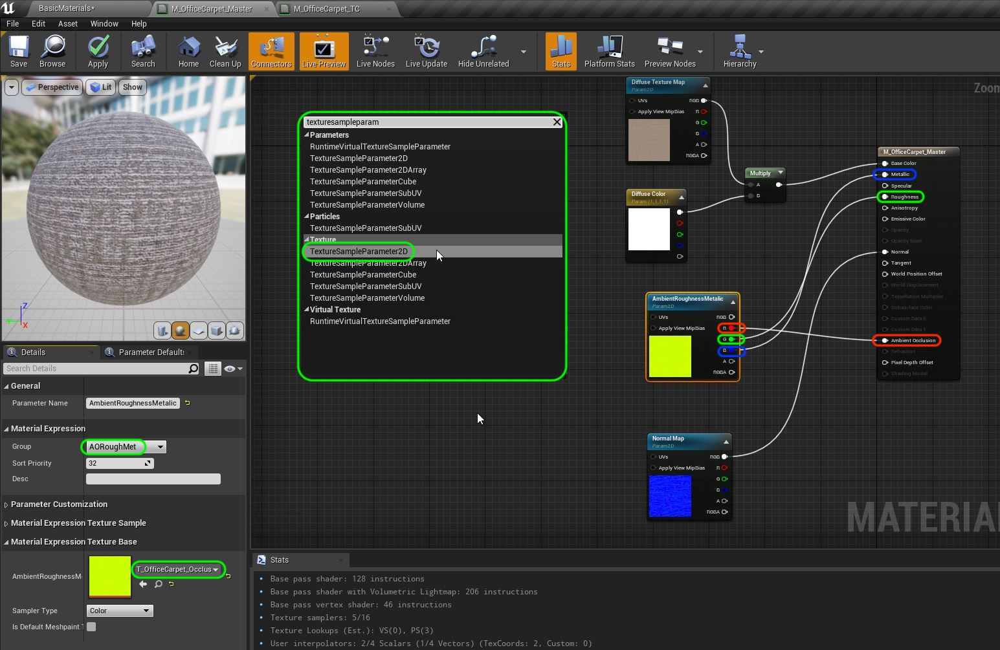

##### `Step 5.`\|`SUU&G`| :small_orange_diamond:

Now this should improve the carpet as it is now using all of its texture maps to make the material rendre properly.  Now our clay material will have the wrong texture maps outside the base color.

Open up **MI_Clay** and adjust  the **AmbientRoughnessMetalic** texture map and the **Normal Map** to ge the ones for the beveled clay brick.

##### `Step 6.`\|`SUU&G`| :small_orange_diamond: :small_blue_diamond:

Play the game and look at the textures on the carpets and clay tile.  They are all rendering correctly now based on the same master material.

https://user-images.githubusercontent.com/5504953/131147572-434e5529-f019-4014-bf07-e9f68a079692.mp4

##### `Step 7.`\|`SUU&G`| :small_orange_diamond: :small_blue_diamond: :small_blue_diamond:

Now we can alter more than just textures and colors.  We can also have scalars in our instance that we can edit.  Lets add a **Constant** node by right clicking and selecting it or by left mouse clicking with the <kbd>1</kbd> key pressed.

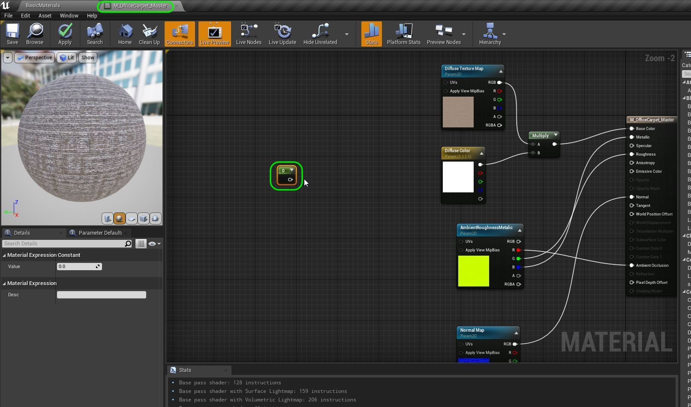

##### `Step 8.`\|`SUU&G`| :small_orange_diamond: :small_blue_diamond: :small_blue_diamond: :small_blue_diamond:

Right click on the **Scalar** node and select **Convert to Parameter** and call it `UV Scalar`.

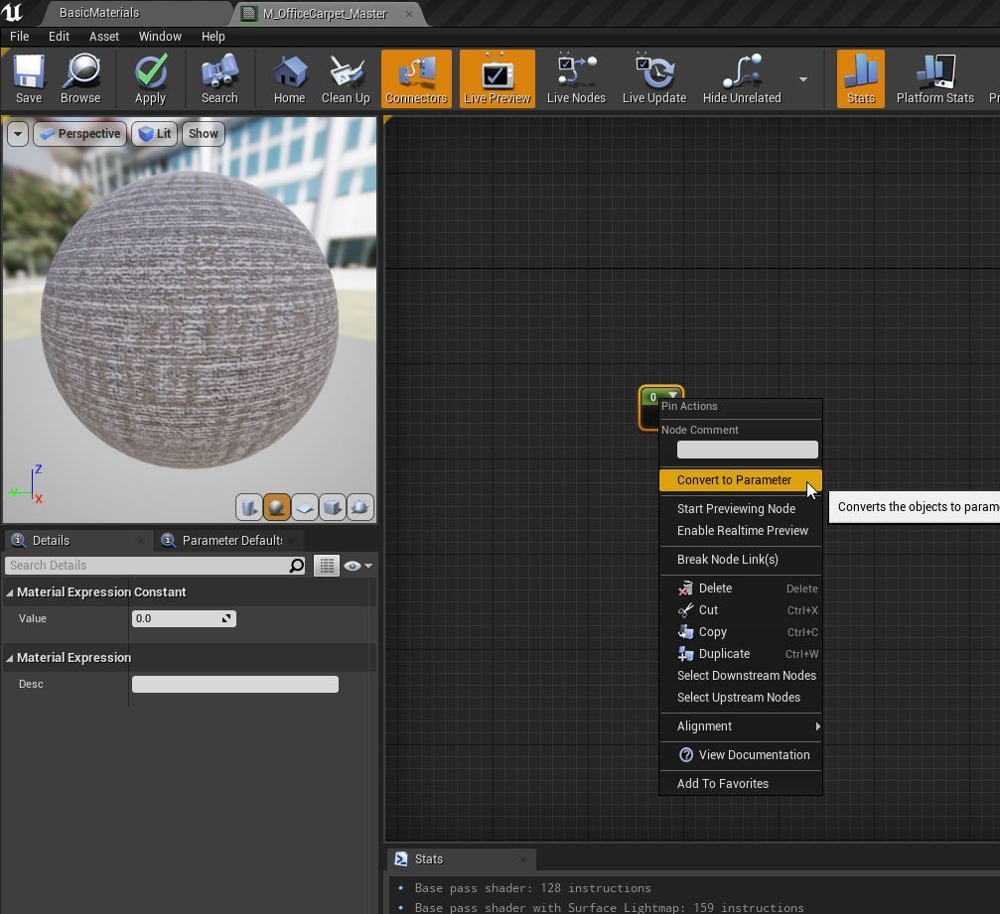

##### `Step 9.`\|`SUU&G`| :small_orange_diamond: :small_blue_diamond: :small_blue_diamond: :small_blue_diamond: :small_blue_diamond:

Add it to a new **Group** called `UC`.  Make the **Default Value** `1`.

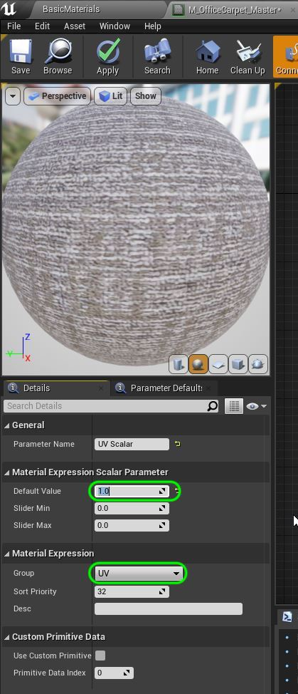

##### `Step 10.`\|`SUU&G`| :large_blue_diamond:

Add a **TextureCoordinate** node to the chart. Then we want to multiply the UV scalar by pressing the <kbd>M</kbd> key to select a **Multiply** node.

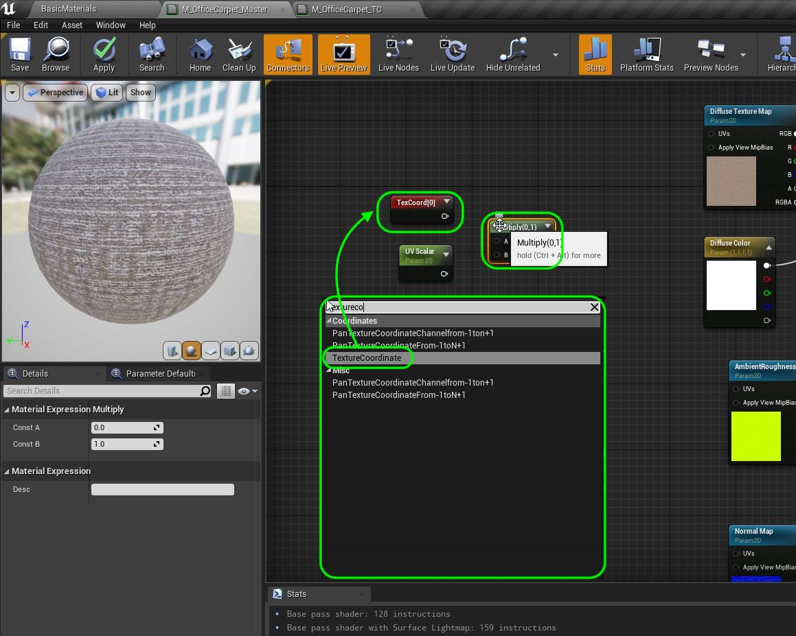

##### `Step 11.`\|`SUU&G`| :large_blue_diamond: :small_blue_diamond: 

Attach the output of the **TexCoord** to the **A** channel of the **Multiply** node and **UV Scalar** to the **B** channel.  We could create two scalars to adjust U & V seperately but I am assumning you will want  to scale the UV's symmetrically with the same value on both channels to not chnage the aspect ratio of the texture.  Connect the output of the **Multiply** node to the **UVs** input of the three **TextureSampleParameter2D** nodes.

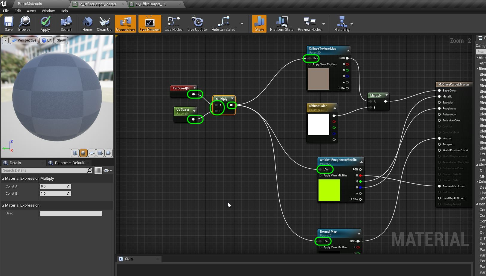

##### `Step 12.`\|`SUU&G`| :large_blue_diamond: :small_blue_diamond: :small_blue_diamond: 
 Now lets open **MI_Clay** and set the **UV Scalar** to `2.0` making the repeated texture smaller doubling the count per face.

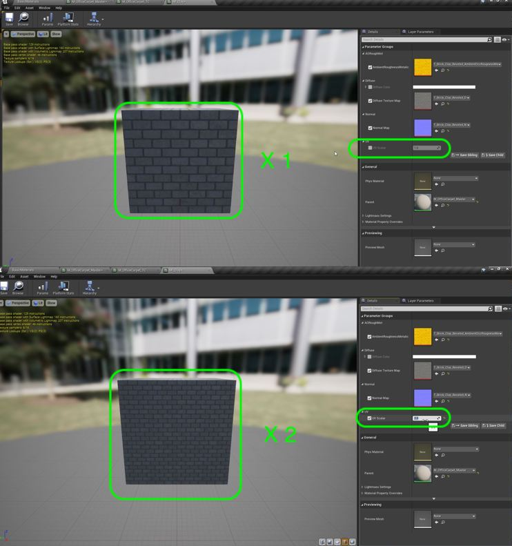

##### `Step 13.`\|`SUU&G`| :large_blue_diamond: :small_blue_diamond: :small_blue_diamond:  :small_blue_diamond: 

Open up **MI_OfficeCarpet_Blue** and adjust the **UV Scalar** to `1.5`.

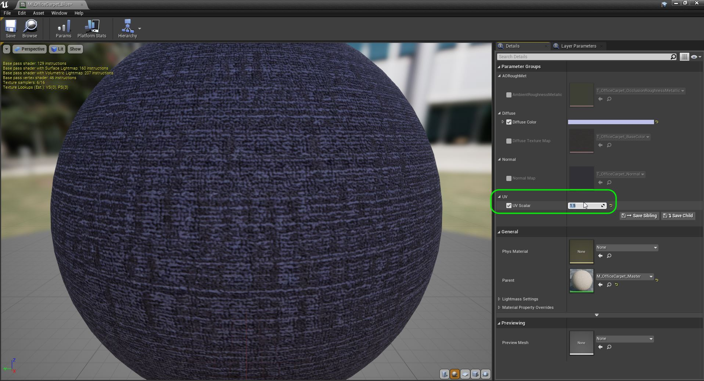

##### `Step 14.`\|`SUU&G`| :large_blue_diamond: :small_blue_diamond: :small_blue_diamond: :small_blue_diamond:  :small_blue_diamond: 

Play the game and look at the UV's that can now be quickly changed in the material instance without re-applying the material and waiting for long compile times!

https://user-images.githubusercontent.com/5504953/131130911-9b0957d8-a5b9-4cc4-b591-38aafd75deed.mp4

##### `Step 15.`\|`SUU&G`| :large_blue_diamond: :small_orange_diamond: 

OK, now lets finish up this section by savin our work and uploading it to GitHub.  Press **File | Save All** then **Source Conrol | Submit to Source Control...** and add a description.  Press the <kbd>Submit</kbd> button.  Open up **GitHub Desktop** and **Push** the commited work.

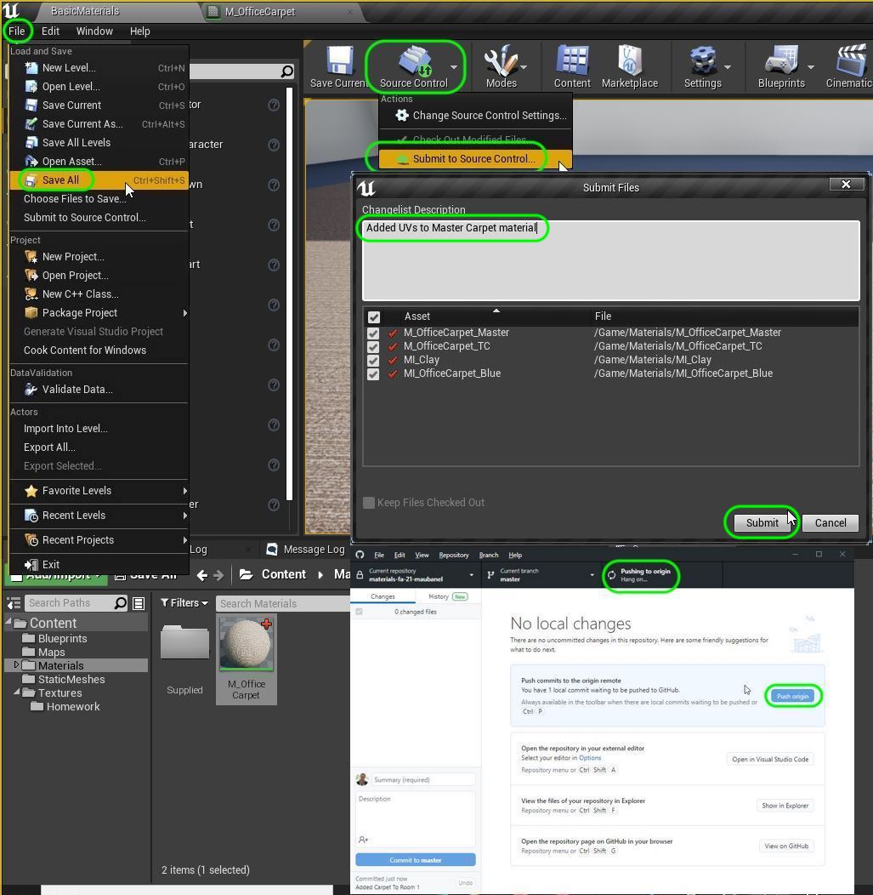

___

| [previous](../material-instances/README.md#user-content-material-instances)| [home](../README.md#user-content-ue4-intro-to-materials) | [next](../texture-masks/README.md#user-content-texture-masks)|
|---|---|---|
