### Animate UVs

[previous](../animation/README.md#user-content-animation) • [home](../README.md#user-content-ue4-intro-to-materials) • [next](../master-material-1/README.md#user-content-complex-master-material---part-i)

We can not only animate elements like the color but we can also animate the UV's on teh static mesh.  This will leave the object still but the mesh can translate or rotate.  Lets give it a go!

 

---

##### `Step 1.`\|`SUU&G`|:small_blue_diamond:

Animate UV's on Chevron",
    Now lets try another technique and animate the UV's.  Not only can these position the texture within the model but we can animate them.  Lets animate a Chevron like in a race track that lights the direction to move in.  Go to the **Textures** directory and drag into the project **[T_Chevron_DandA.tga](../Assets/T_Chevron_DandA.tga)**.  

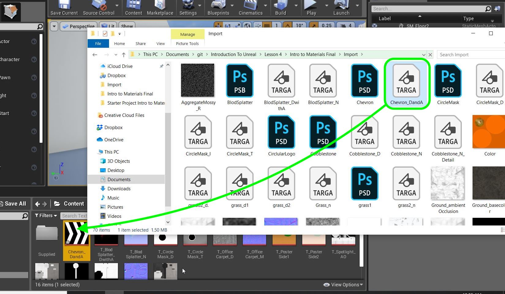

##### `Step 2.`\|`FHIU`|:small_blue_diamond: :small_blue_diamond: 

Create a new **Material** and put it in the **Materials Folder**.  Call it `M_Chevron`. Add a **Texture Sample** to the graph and assign the Chevron texture. Now we don't need all channels as this is a two tone image.  We can just grab the red channel as it is a two tone image and connect it to the **Base Color** input on the main Material node. Use the **plane** shape to preview as this is not supposed to be on a sphere.

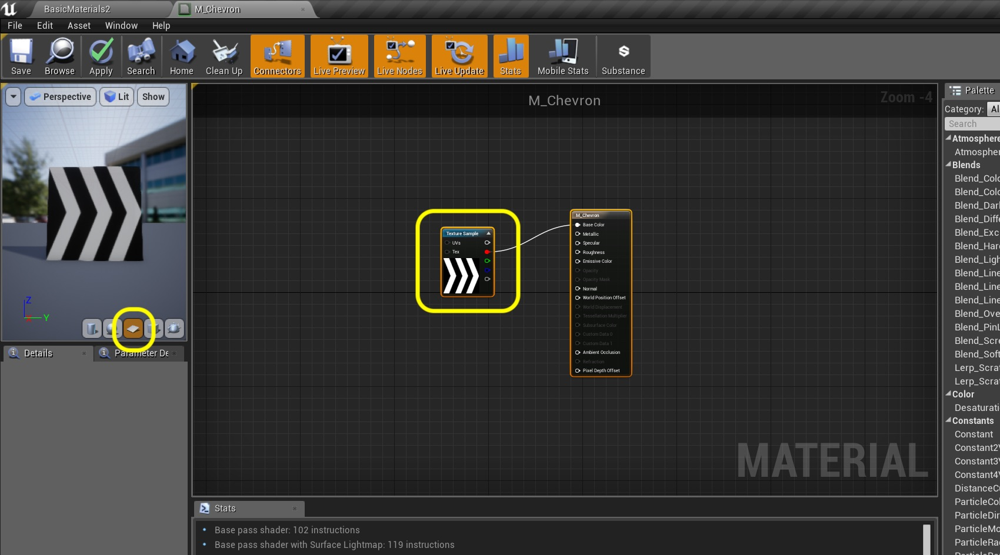

##### `Step 3.`\|`SUU&G`|:small_blue_diamond: :small_blue_diamond: :small_blue_diamond:

Now black and white is not what we wanted, so lets multiply this by a green color. Add a **Constant 3** vector and make it bright green.  Add a **Multiply** node to hook up to this existing texture which will leave black as black but change the white to green.  Add a comment to this group `Diffuse Texture`.

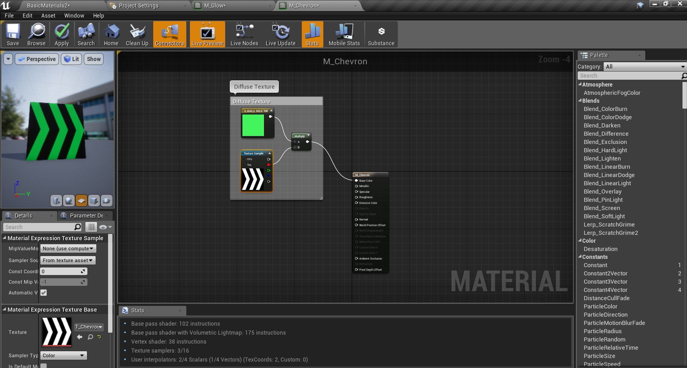

##### `Step 4.`\|`SUU&G`|:small_blue_diamond: :small_blue_diamond: :small_blue_diamond: :small_blue_diamond:

Now this is great but it is supposed to be a lit sign. So it is an emissive surface.  Now we can use the same texture as our emissive filter as the entire white portion is emissive.  Add a **Multiply** and **Constant** Node set to `6`.

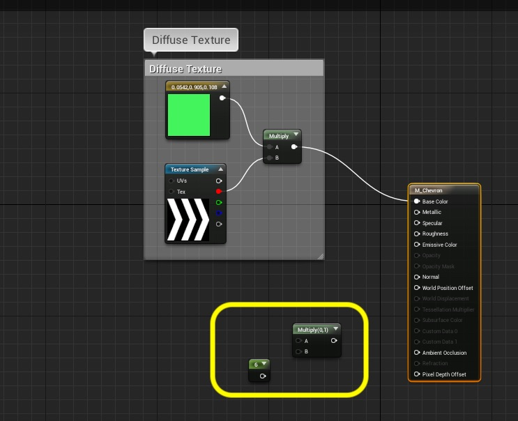

##### `Step 5.`\|`SUU&G`| :small_orange_diamond:

Now connect the output of the first **Mutliply** node (above the new one) in the texture to the input **A** of the newly created **Multiply** node.  Put the **Constant** `6` in the **B** channel of the bottom **Multiply** node.  Send the output of the **Multiply** node into the **Emissive Color** node.  Add a comment to explain what this is doing.  Press the <kbd>Apply</kbd> button.

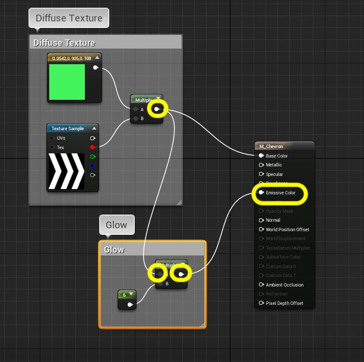

##### `Step 6.`\|`SUU&G`| :small_orange_diamond: :small_blue_diamond:

Now go to the game and drop a **plane** into the level.

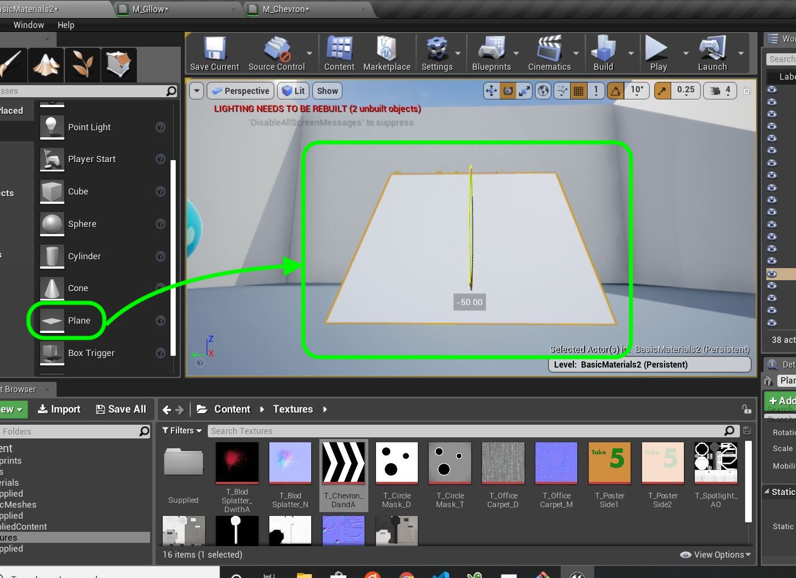

##### `Step 7.`\|`SUU&G`| :small_orange_diamond: :small_blue_diamond: :small_blue_diamond:

Rotate the plane 90 degrees so that it is facing you.

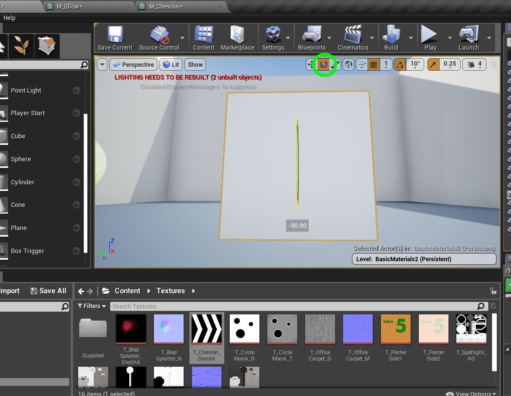

##### `Step 8.`\|`SUU&G`| :small_orange_diamond: :small_blue_diamond: :small_blue_diamond: :small_blue_diamond:

Assign the M_Chevron material to the plane.

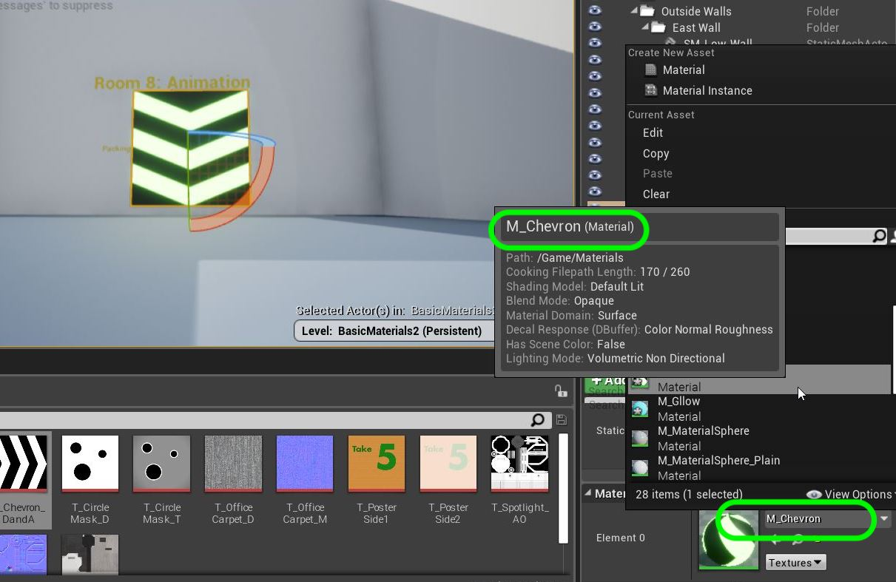

##### `Step 9.`\|`SUU&G`| :small_orange_diamond: :small_blue_diamond: :small_blue_diamond: :small_blue_diamond: :small_blue_diamond:

Rotate so arrows face the right.

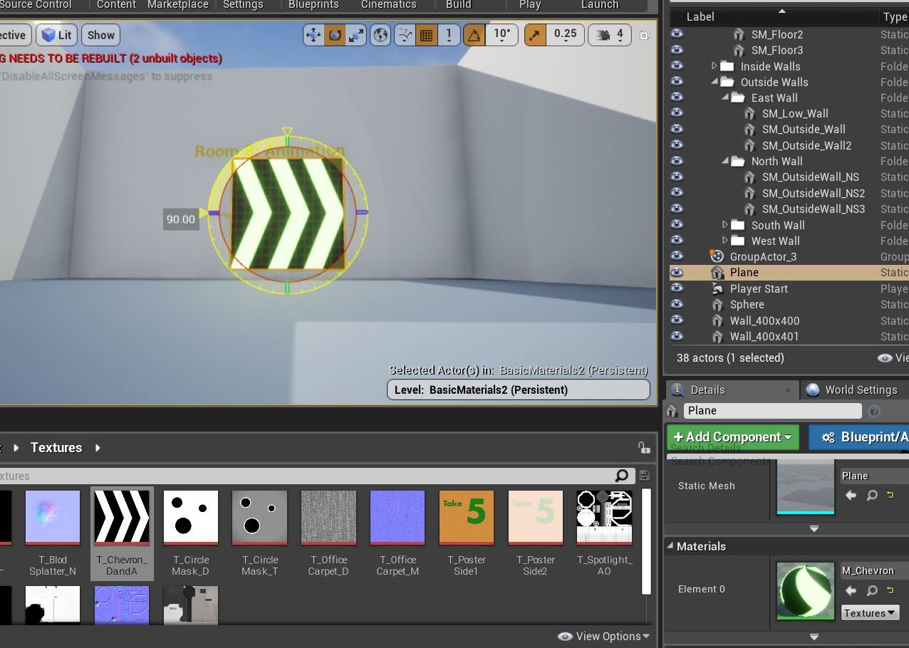

##### `Step 10.`\|`SUU&G`| :large_blue_diamond:

I have squashed the texture's width by 50%.  So I expect this texture to be on a plane that is twice as wide as it is high.  So I adjusted my plane's scale to be larger in all dimensions but to have a 2:1 ratio as shown. I set **X Scale** to `4.0` and **Y Scale** to `2.0`.

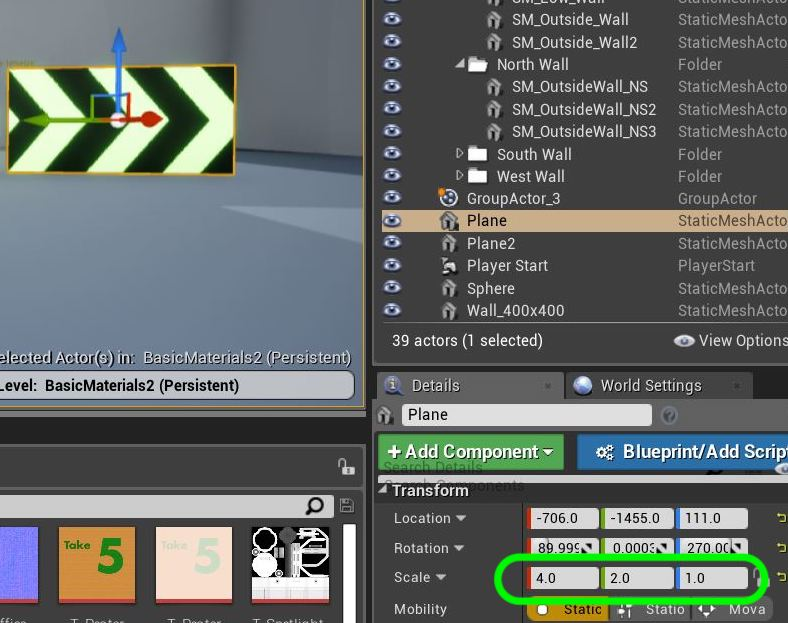

##### `Step 11.`\|`SUU&G`| :large_blue_diamond: :small_blue_diamond: 

Add a second Chevron and put the two planes in Room 8.

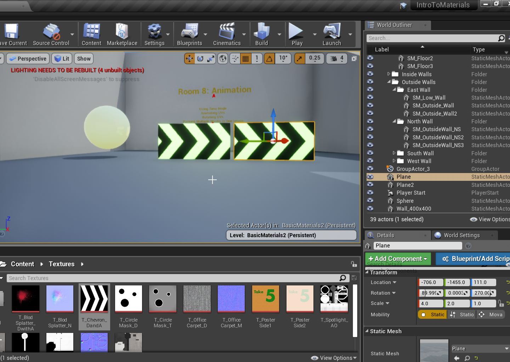

##### `Step 12.`\|`SUU&G`| :large_blue_diamond: :small_blue_diamond: :small_blue_diamond: 

Now how do we animate it?  Open the Material and add a **Panner** node.  This will pan the UVs in both dimensions along the plane.

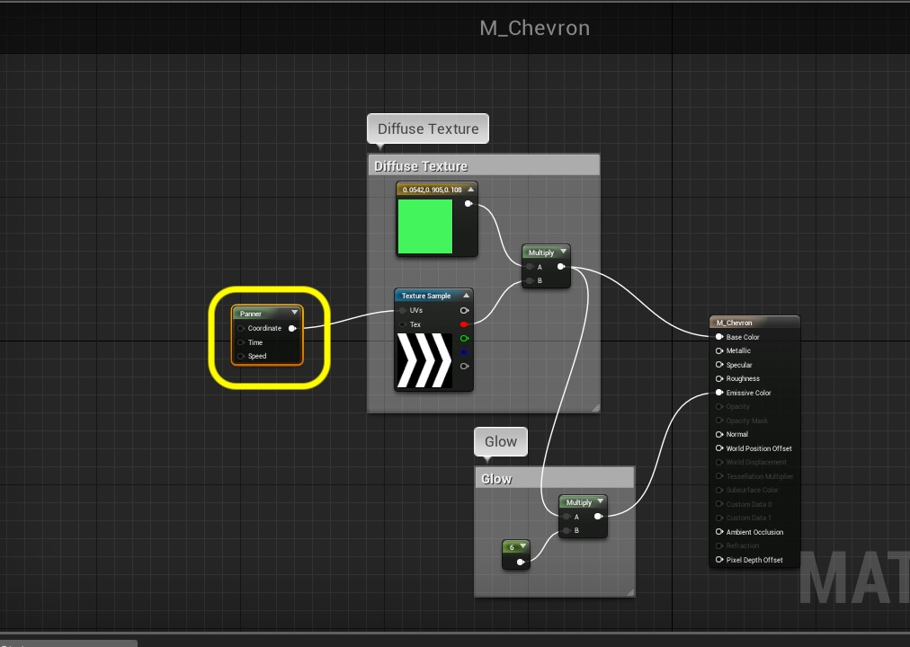

##### `Step 13.`\|`SUU&G`| :large_blue_diamond: :small_blue_diamond: :small_blue_diamond:  :small_blue_diamond: 

Connect the output of the Panner to the UV of the Texture Sample.  Also set the **Speed X** to `.3`.  Now go in game and look at the nice panning!

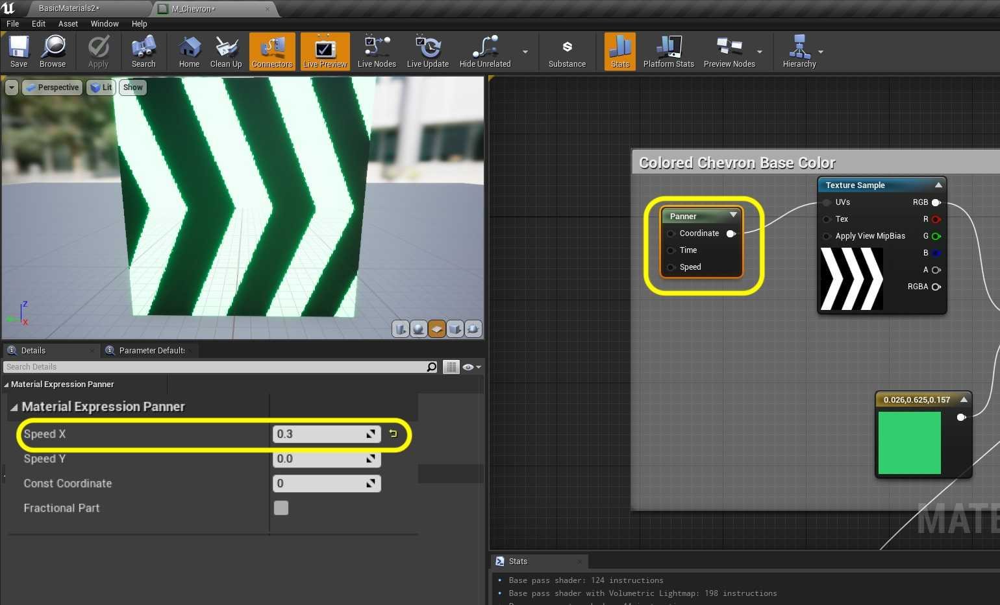

##### `Step 14.`\|`SUU&G`| :large_blue_diamond: :small_blue_diamond: :small_blue_diamond: :small_blue_diamond:  :small_blue_diamond: 

To change directions, change the sign on the UV animation.  You can now select either positive or negative based on what direction you want the sign to animate. Press the <kbd>Apply</kbd> button and look at it in game.

https://user-images.githubusercontent.com/5504953/131260383-3d689c98-137c-4293-a149-8c65df381859.mp4

##### `Step 15.`\|`SUU&G`| :large_blue_diamond: :small_orange_diamond: 

In the final part of this room we will do the same thing but rotate the UV's as oppose to scrolling them.  Import **[T_CircularLogo_M.png](../Assets/T_CircularLogo_M.png)** to the **Textures** folder.

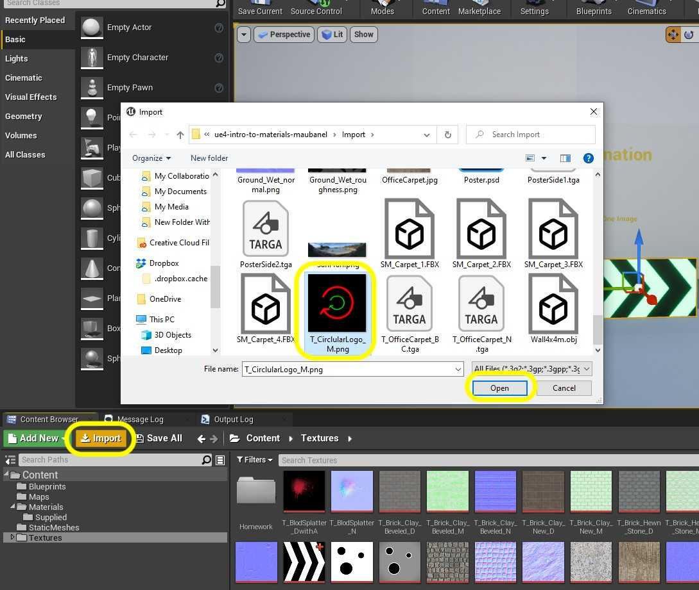

##### `Step 16.`\|`SUU&G`| :large_blue_diamond: :small_orange_diamond:   :small_blue_diamond: 

I have two masks in two different channels in the PNG.  The outer ring in the Red channel and the inner ring in the green channel.  We can save space in the game by combining our masks as we have 4 channels available in an PNG or TGA.  Open the Texture and under **View** just turn on the red channel and you should see.

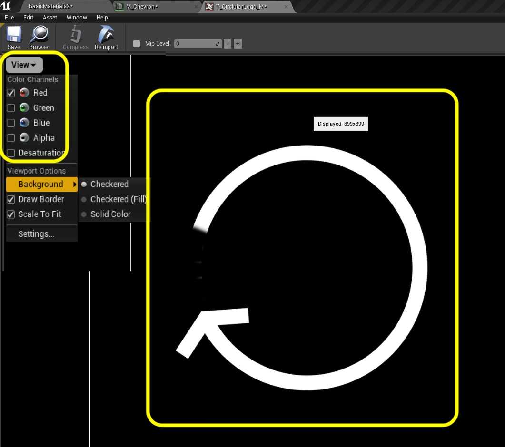

##### `Step 17.`\|`SUU&G`| :large_blue_diamond: :small_orange_diamond: :small_blue_diamond: :small_blue_diamond:

Now look at the green channel.  It contains the inner ring.

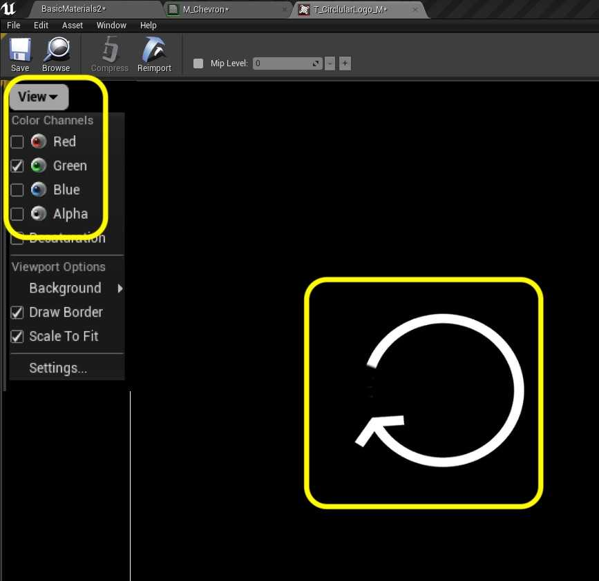

##### `Step 18.`\|`SUU&G`| :large_blue_diamond: :small_orange_diamond: :small_blue_diamond: :small_blue_diamond: :small_blue_diamond:

Create a new **Material** called `M_CircleSign`. Add a **Texture Sample** node and assign the downloaded texture.  Multiply the **red** channel by an Orange **Constant 3** node and send to the **Base Color** pin. Change the preview model to a **Plane**.

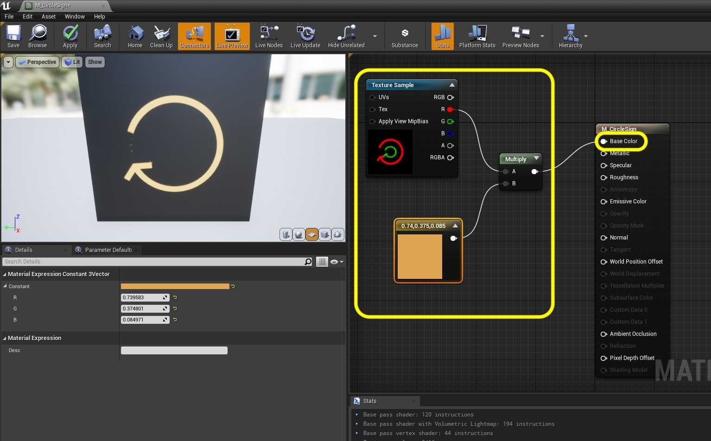

##### `Step 19.`\|`SUU&G`| :large_blue_diamond: :small_orange_diamond: :small_blue_diamond: :small_blue_diamond: :small_blue_diamond: :small_blue_diamond:

Add a **Rotator** node and change the **Speed** to `-1` to turn clockwise.  Connect the output of the **Rotator** node to the **UVs** input node of the **Texture Sample** node. The **CenterX** and **Y** of the rotator should be find as is.  You can adjust those to pick a different point to rotate on.  Right now it is in the very center of the UV, which makes sense.

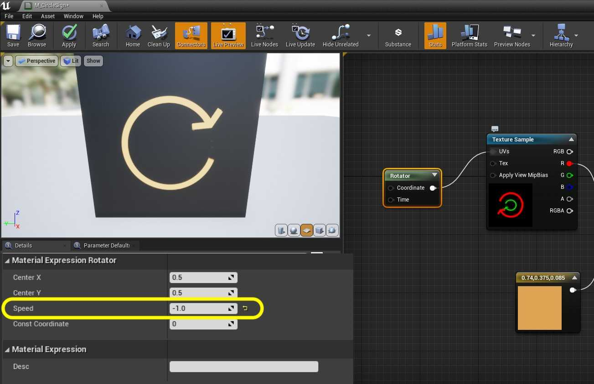

##### `Step 20.`\|`SUU&G`| :large_blue_diamond: :large_blue_diamond:

Copy and paste all the nodes to animate and color the inner ring.

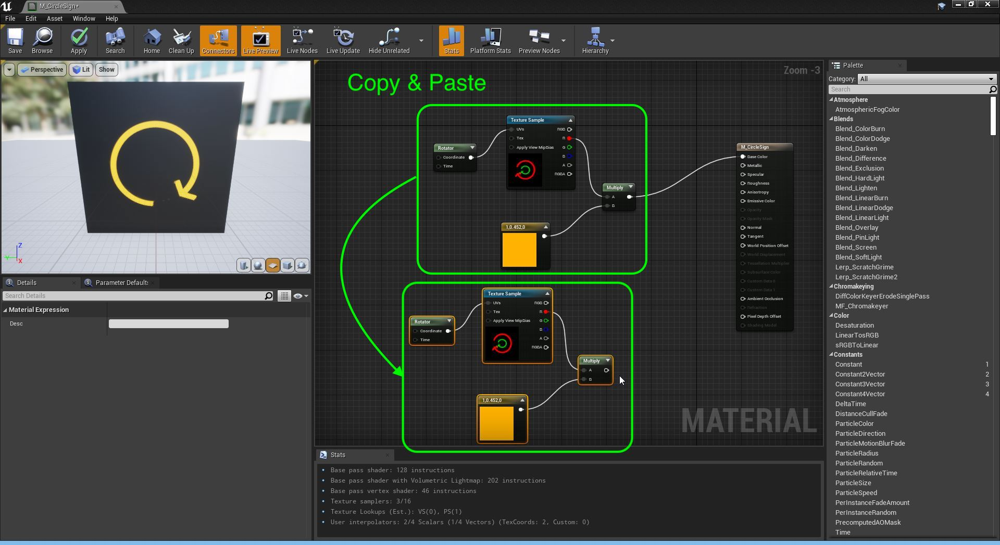

##### `Step 21.`\|`SUU&G`| :large_blue_diamond: :large_blue_diamond: :small_blue_diamond:

In the bottom set chnage the output pin of the **Texture Sample** from the **R** to the **G** pin which is the inner arrow of this texture.  Change the color of the vector to a blue color.  Put a **Add** node to the right and attach the output of both **Multiply** nodes into it.  Take the output of the **Add** node and send it to **Base Color**.  Now select the second bottom **Rotator** node and change the direction to `1.0`.

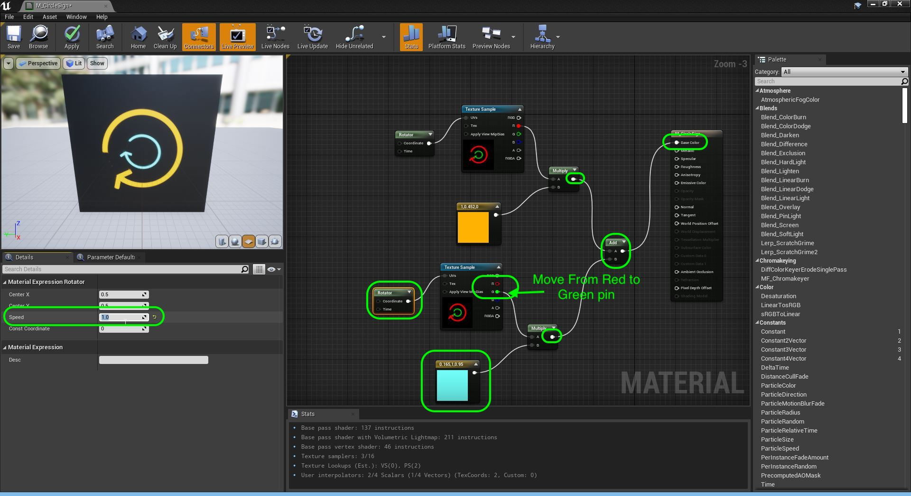

##### `Step 22.`\|`SUU&G`| :large_blue_diamond: :large_blue_diamond: :small_blue_diamond: :small_blue_diamond:

Add a comment both sets of nodes so we know which group affects which ring.

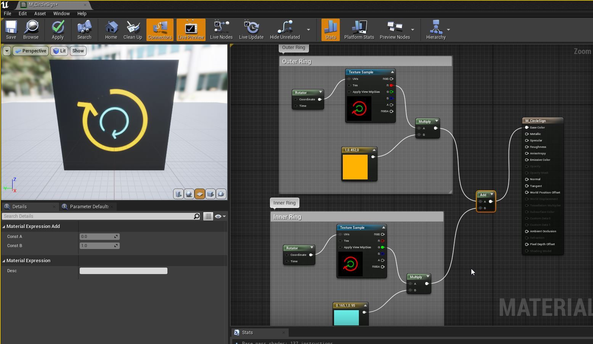

##### `Step 23.`\|`SUU&G`| :large_blue_diamond: :large_blue_diamond: :small_blue_diamond: :small_blue_diamond: :small_blue_diamond:

We have a black background that we want to be clear.  So lets change the **Blend Mode** to **Translucent** in the **Details** panel.

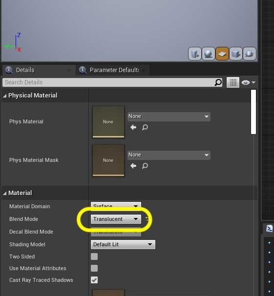

##### `Step 24.`\|`SUU&G`| :large_blue_diamond: :large_blue_diamond: :small_blue_diamond: :small_blue_diamond: :small_blue_diamond: :small_blue_diamond:

Take the output of the **Add** node and send it to the output in the **Opacity** node. We can use both those channels as our alpha!

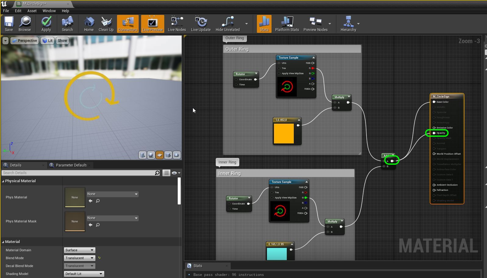

##### `Step 25.`\|`SUU&G`| :large_blue_diamond: :large_blue_diamond: :small_orange_diamond:

Take the output of the **Add** node into a new **Multiply** node and attach to the **A** pin.  Add a **Constant** node set to `7` and send it to the **B** side of the **Multiply** pin.  Send the ouptu of the **Multiply** node to the **Emissive Color** to make it glow like a neon sign. Press the <kbd>Apply</kbd> button.

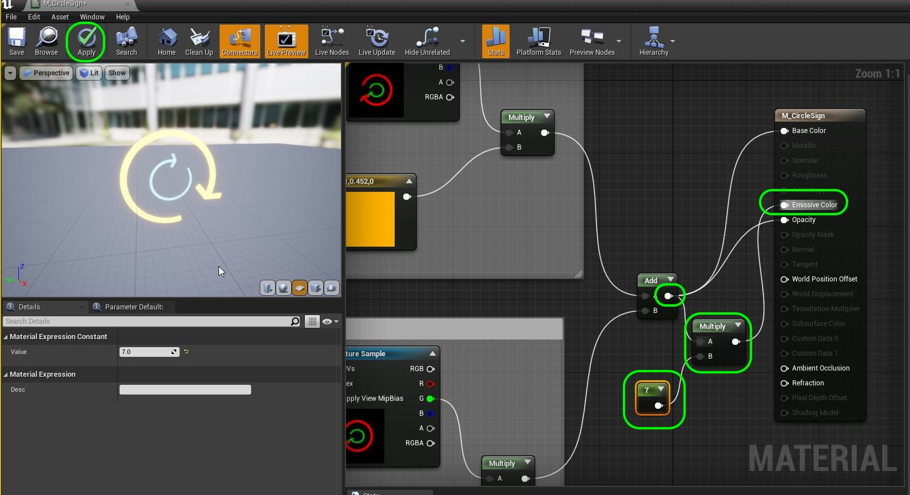

##### `Step 26.`\|`SUU&G`| :large_blue_diamond: :large_blue_diamond: :small_orange_diamond: :small_blue_diamond:

Go back to the game and add a **Plane** to the room.  Add **M_CircleSign** material to the plane. Change the scale on all axis to `5.0`.  Rotate it to face the player.  Notice, it is one sided so you could go back and make the material two sided if you like!

https://user-images.githubusercontent.com/5504953/131262044-318e6077-cac8-4774-9508-bccba9925ffb.mp4

##### `Step 27.`\|`SUU&G`| :large_blue_diamond: :large_blue_diamond: :small_orange_diamond: :small_blue_diamond: :small_blue_diamond:

That's it for Room 8. Press **Save All** and update Github by **committing** and **pushing** all the changes made. 

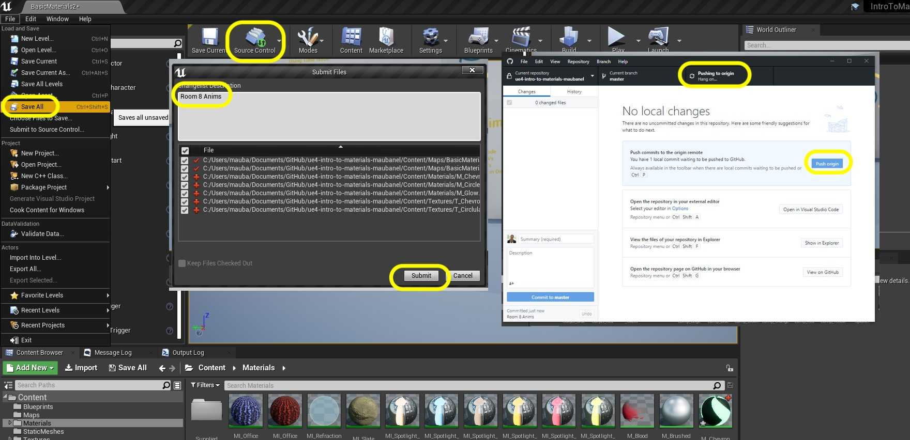

___

| [previous](../animation/README.md#user-content-animation)| [home](../README.md#user-content-ue4-intro-to-materials) | [next](../master-material-1/README.md#user-content-complex-master-material---part-i)|
|---|---|---|
