### Animation

[previous](../world-alignment/README.md#user-content-world-aligned-materials) • [home](../README.md#user-content-ue4-intro-to-materials) • [next](../anim-uv/README.md#user-content-animate-uvs)

Materials can also be animated.  You can make the texture move along the uv's and create interesting effects.

 

---

##### `Step 1.`\|`SUU&G`|:small_blue_diamond:

We can animate many parts of a material.  There are too many to get into in one exercise. We will do two techniques.  This first is to animate a Linear Interpolation (LERP).  This allows us to change between two input pints gradually over time based on whether it is `0` - pin A or `1` - pin B. Scoot the camera over to **Room 8** and add a **Sphere** to the level changing its scale to `3.0, 3.0, 3.0`.

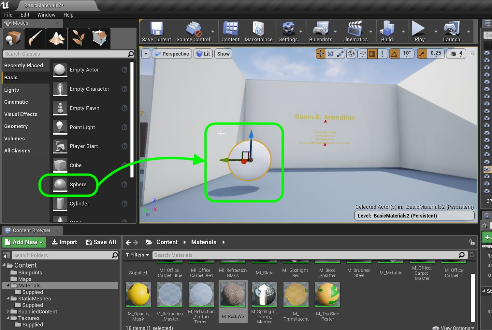

##### `Step 2.`\|`FHIU`|:small_blue_diamond: :small_blue_diamond: 

Create a new **Material** in the **Materials Folder** called `M_Glow`.

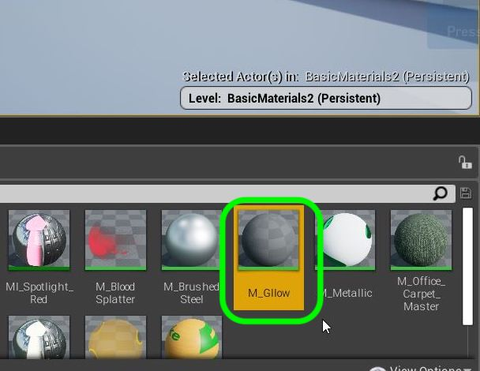

##### `Step 3.`\|`SUU&G`|:small_blue_diamond: :small_blue_diamond: :small_blue_diamond:

Add a **Constant 3 Vector** node and make it ice blue by settintg the **RGB** to `0.518, 0.696, 0.921` and plug the output to **Base Color**.

##### `Step 4.`\|`SUU&G`|:small_blue_diamond: :small_blue_diamond: :small_blue_diamond: :small_blue_diamond:

Set Roughness to `0.0` by adding a **Constant** node and attaching it to the **Roughness** pin in the shader node.

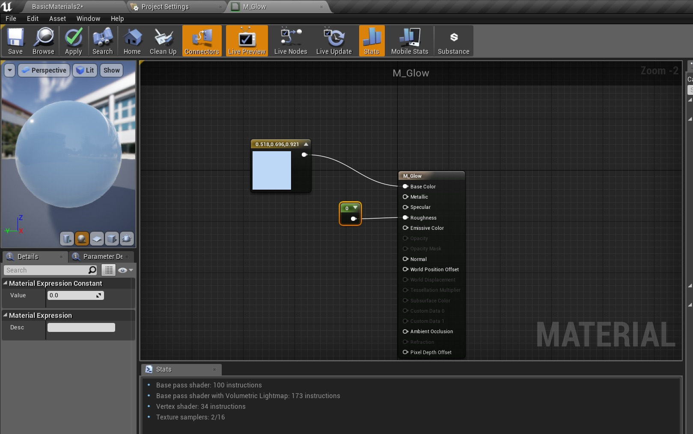

##### `Step 5.`\|`SUU&G`| :small_orange_diamond:

Add a **LinearInterpolate** (LERP) node.

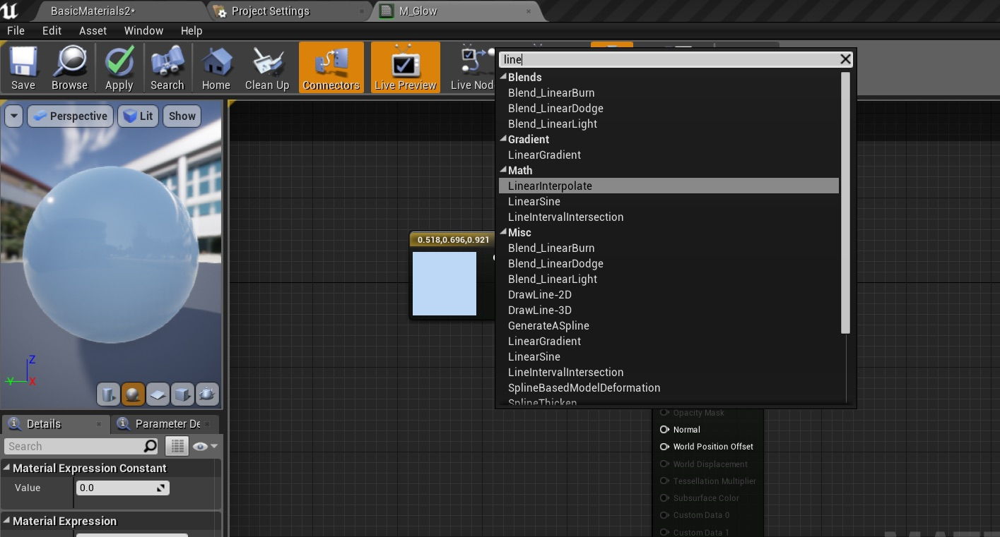

##### `Step 6.`\|`SUU&G`| :small_orange_diamond: :small_blue_diamond:

We are going to have no flashing glow at the B input so add a **Constant** node and leave it as its default `0` and place it in the **B** pin of the LERP.

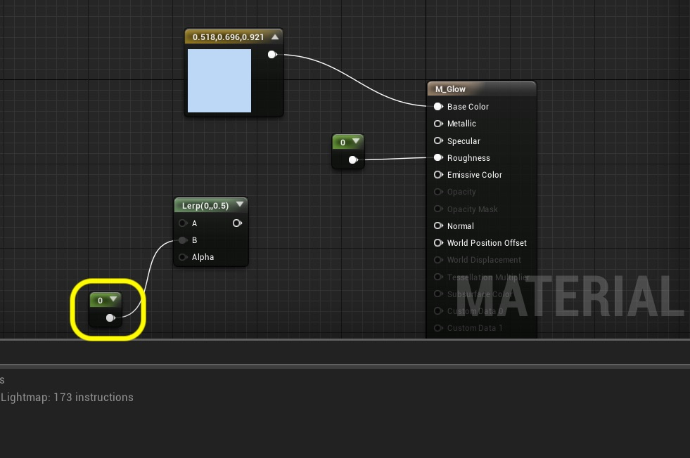

##### `Step 7.`\|`SUU&G`| :small_orange_diamond: :small_blue_diamond: :small_blue_diamond:

Add a **Constant 3 Vector** node and make it yellow (`1.0, .964, .111`.  Add a **Multiply** node.  Feed the output of the **Constant 3 Vector** into the **A** input of a **Multiply** node.

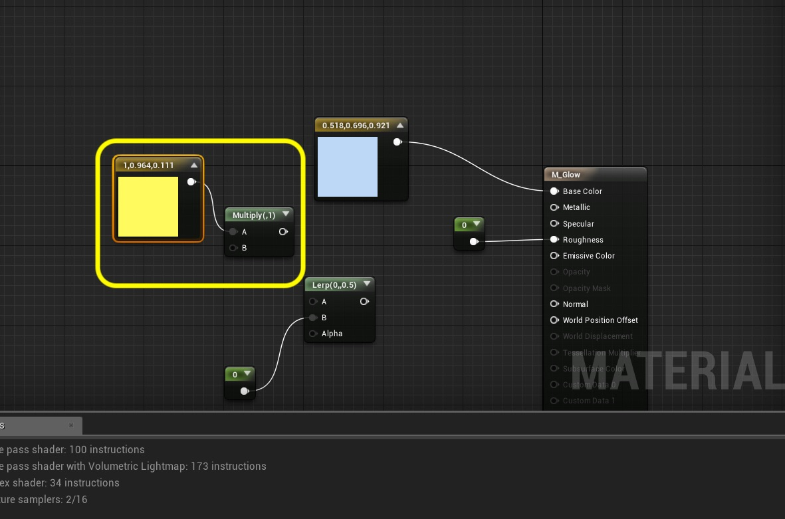

##### `Step 8.`\|`SUU&G`| :small_orange_diamond: :small_blue_diamond: :small_blue_diamond: :small_blue_diamond:

Multiply this by a **Constant** node set to `4`.  Plug this into the **B** input of the **Multiply** node.  Send the output of the **MUltiply** node to the **A** input of the **LERP** node.  Connect the outpt of the **LERP** node to the **Emissive Color** of the main node.

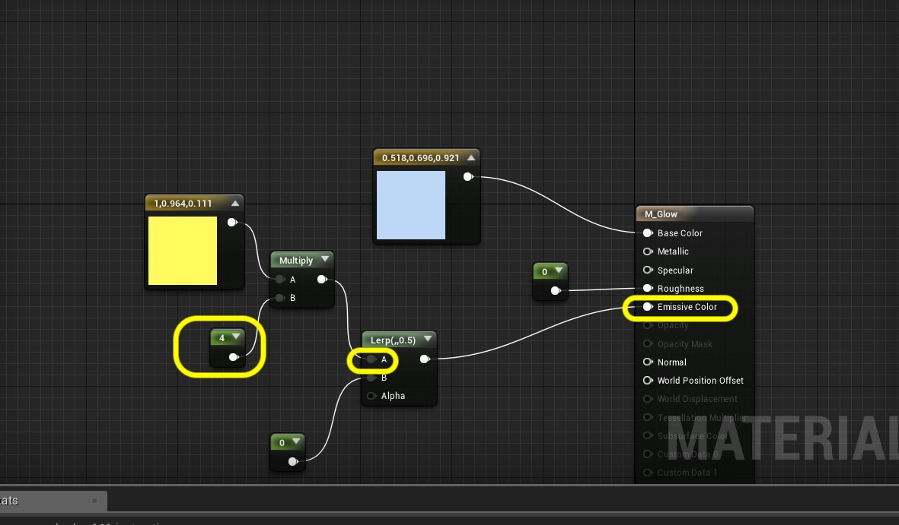

##### `Step 9.`\|`SUU&G`| :small_orange_diamond: :small_blue_diamond: :small_blue_diamond: :small_blue_diamond: :small_blue_diamond:

So when the Alpha in the LERP node is set to `1` we get no glow as it selects the B input which sends 0 to the glow.

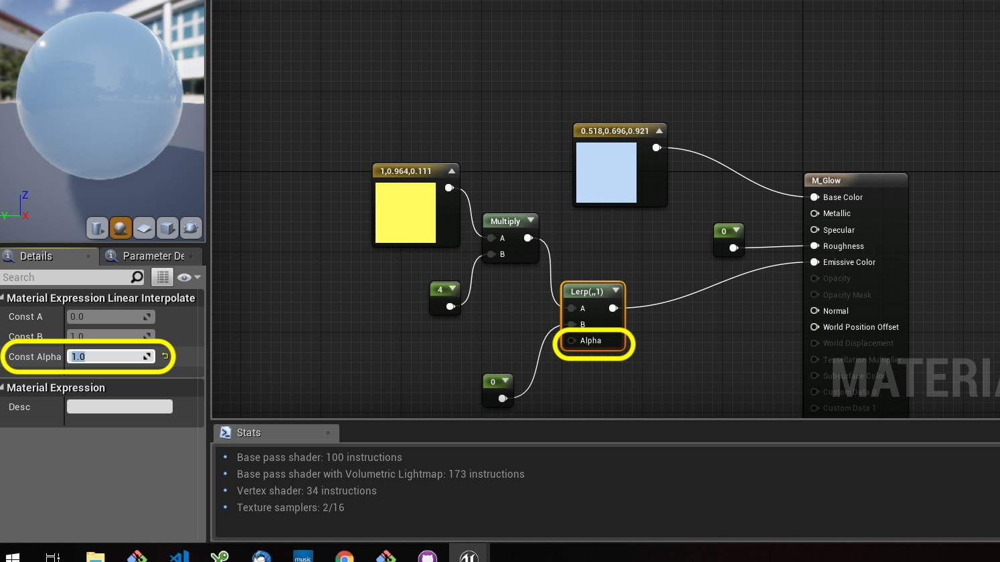

##### `Step 10.`\|`SUU&G`| :large_blue_diamond:

Change the Alpha to `0` and you get the A input which is a multiplied yellow glow. Press the <kbd>Apply</kbd> button.

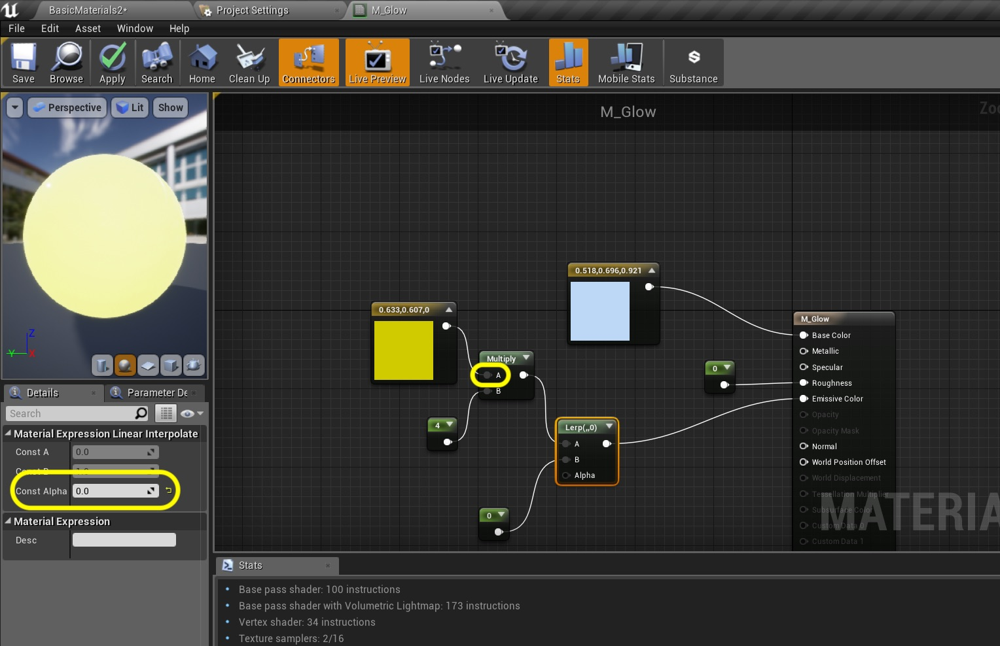

##### `Step 11.`\|`SUU&G`| :large_blue_diamond: :small_blue_diamond: 

Go into the room and assign the **M_Glow** material to the sphere static mesh. We have a glowing sphere that doesn't animate. Wouldn't it be cool if we could slowly change that Alpha value from 0 to 1 then back to 0 to animate it?

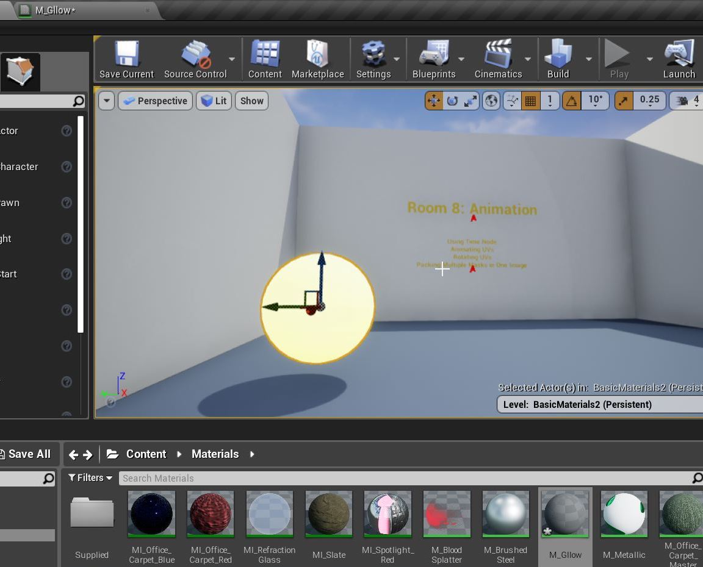

##### `Step 12.`\|`SUU&G`| :large_blue_diamond: :small_blue_diamond: :small_blue_diamond: 

Add a comment to your Glow LERP.  Now to the left drop a **Time** node.  This will give us a ticking clock based on game time.

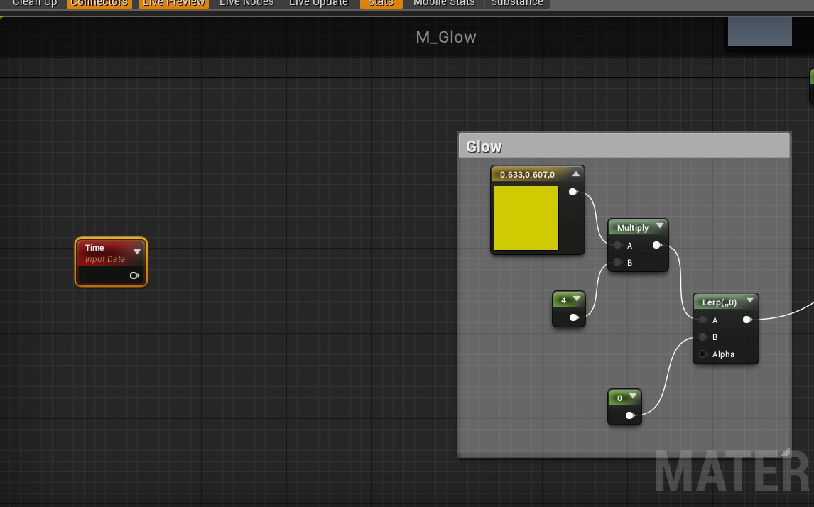

##### `Step 13.`\|`SUU&G`| :large_blue_diamond: :small_blue_diamond: :small_blue_diamond:  :small_blue_diamond: 

Send the output of Time into a **Sine** node.  A sine will return a value between -1 and 1 depending on the input (Time).

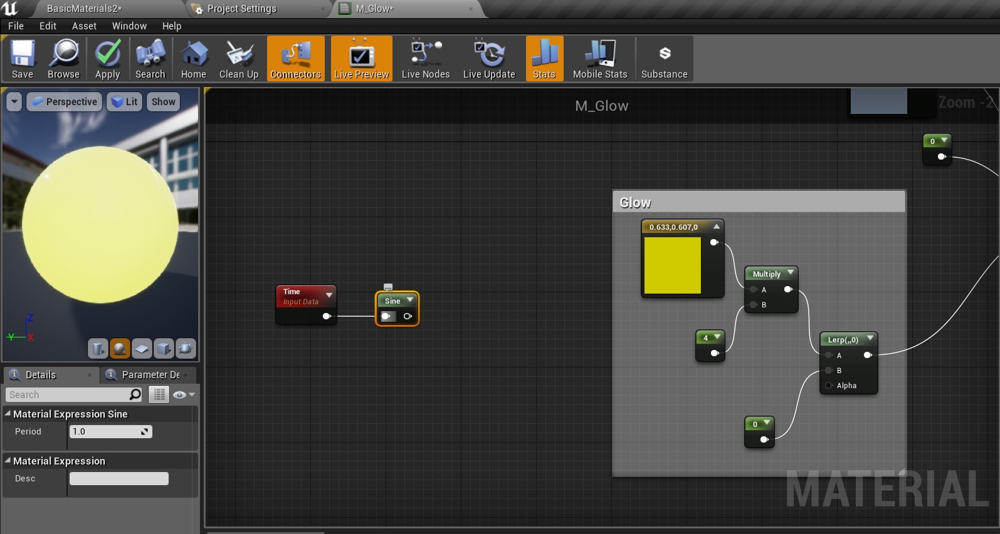

##### `Step 14.`\|`SUU&G`| :large_blue_diamond: :small_blue_diamond: :small_blue_diamond: :small_blue_diamond:  :small_blue_diamond: 

Clamp the value between 0 and 1 (its default setting) by adding a Clamp Node. Then take the output and send it to the **Alpha** in the LERP.

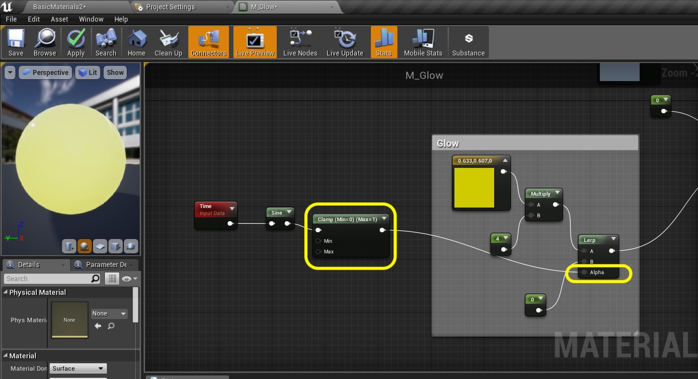

##### `Step 15.`\|`SUU&G`| :large_blue_diamond: :small_orange_diamond: 
Comment this section and I called it `Animation`. Press the **Apply** button. Now go into the game and assign the **M_Glow** material to the sphere. Run the game. I find the blinking to be off too much.  That is because the sine function doesn't return a nice value between 0 and 1.  Lets invert the output.

##### `Step 16.`\|`SUU&G`| :large_blue_diamond: :small_orange_diamond:   :small_blue_diamond: 

Invert the result by adding a **One Minus** node before the Clamp.  Run it in game and it is better.  But what if I want to control the speed?

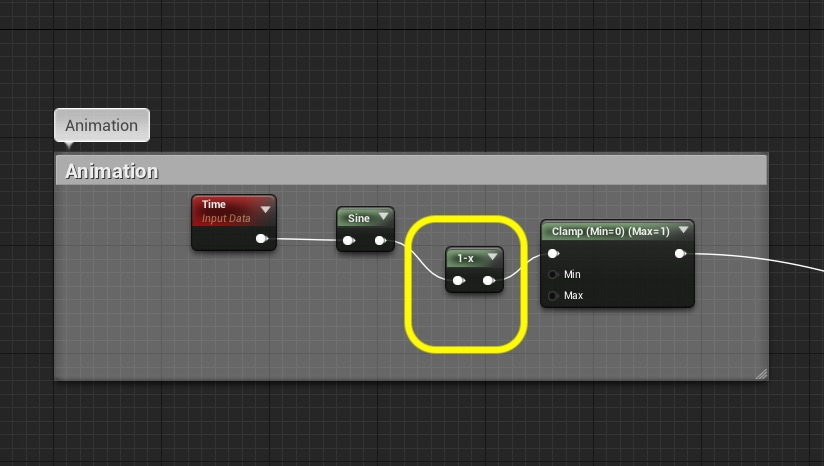

##### `Step 17.`\|`SUU&G`| :large_blue_diamond: :small_orange_diamond: :small_blue_diamond: :small_blue_diamond:

We divide Time to make it smaller and slow the transition down.  Add a **Divide** and **Constant** node. Set the constant node to `4`. Make sure you **DON'T DIVIDE BY 0!**.  Press the <kbd>Apply</kbd> button.

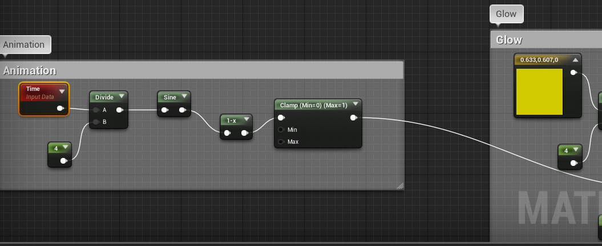

##### `Step 18.`\|`SUU&G`| :large_blue_diamond: :small_orange_diamond: :small_blue_diamond: :small_blue_diamond: :small_blue_diamond:

Run it in game and you should see a nice flashing animation on the sphere glow:

https://user-images.githubusercontent.com/5504953/131259680-0a63d138-1cf6-4fea-b903-de1739a72fbd.mp4

##### `Step 19.`\|`SUU&G`| :large_blue_diamond: :small_orange_diamond: :small_blue_diamond: :small_blue_diamond: :small_blue_diamond: :small_blue_diamond:

Next up we will look at animating the **UVs** of a texture.

___

| [previous](../world-alignment/README.md#user-content-world-aligned-materials)| [home](../README.md#user-content-ue4-intro-to-materials) | [next](../anim-uv/README.md#user-content-animate-uvs)|
|---|---|---|
