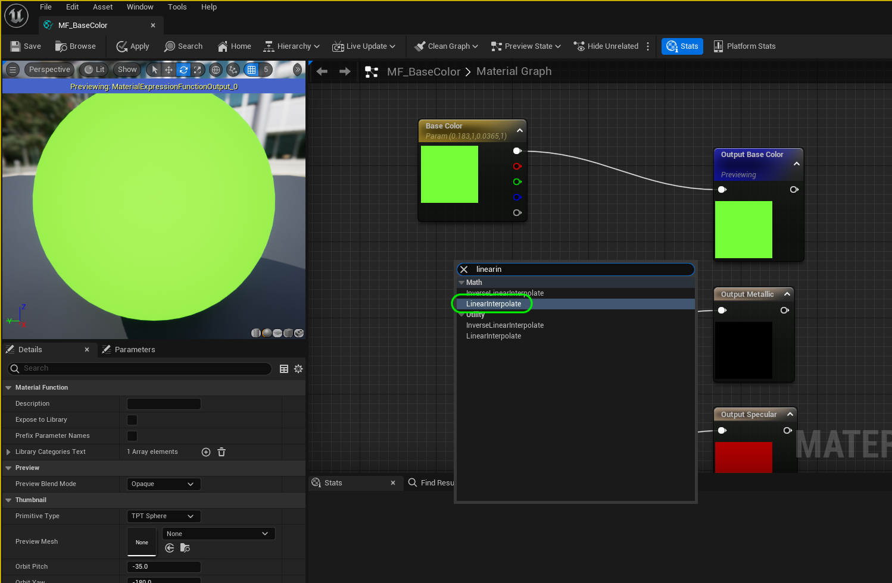
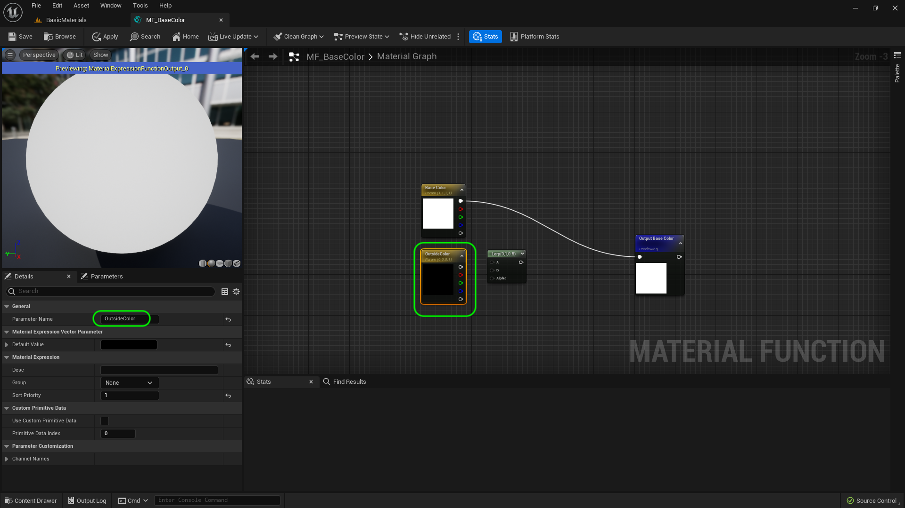
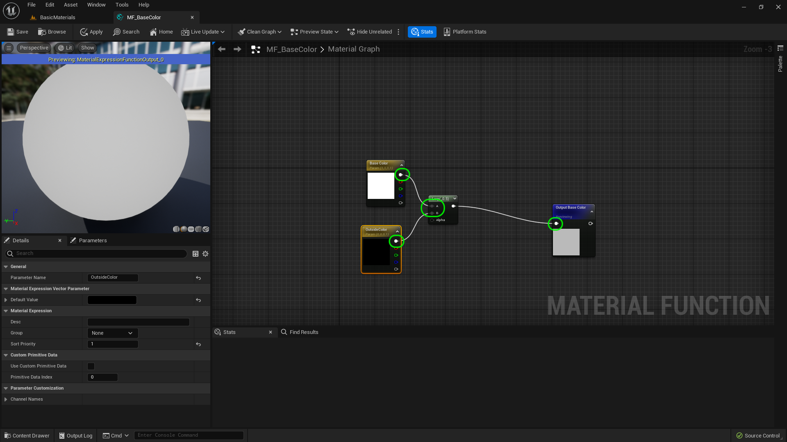
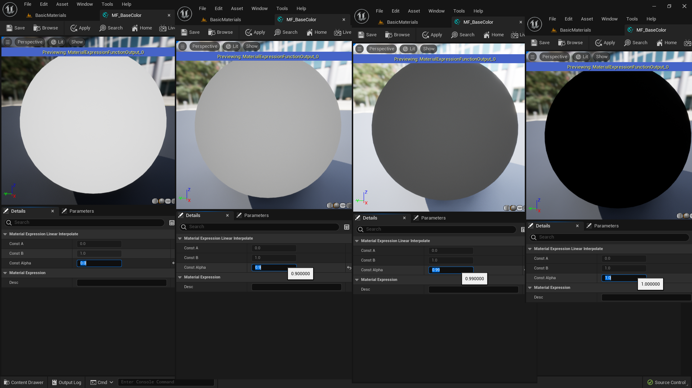
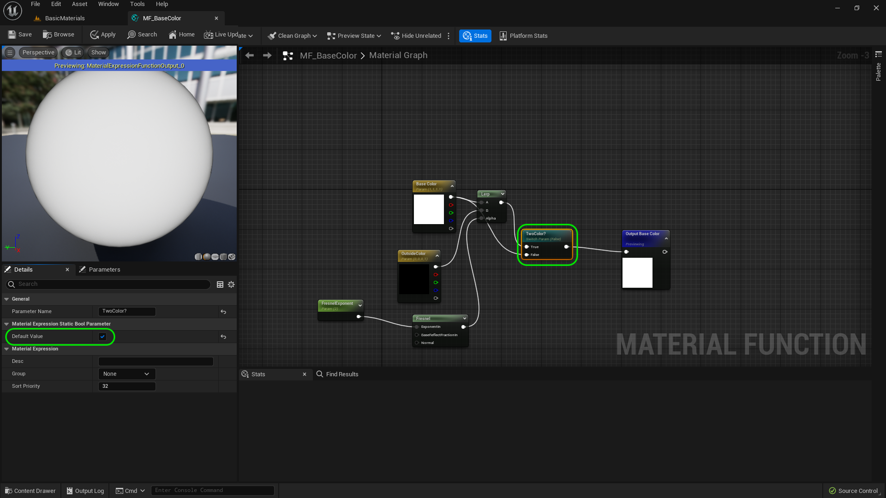
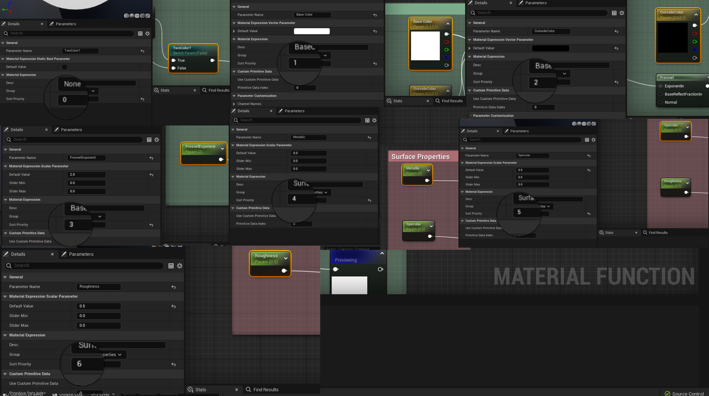
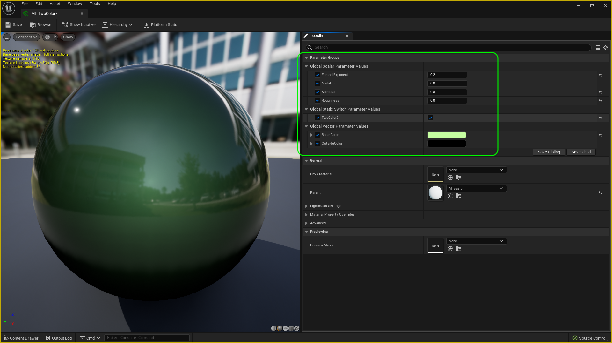

### Basic Material II

[previous](../basic/README.md#user-content-basic-material) • [home](../README.md#user-content-ue5-intro-to-materials) • [next](../basic-iii/README.md#user-content-basic-material-iii)

Lets finish implementing the material function then add a second color with a fresnel.

 

---

##### `Step 1.`\|`UE5MAT`|:small_blue_diamond:

Open up **M_Basic**.  Copy and cut all of the nodes in this material.  Open up **MF_BaseColor**.  Cut the 4 nodes into this material function.  Now we will need four outputs to represent base color, metallic, specular and roughness. So add three **Output** nodes to the material.  Name the top one `Base Color`, then `Metallic`, then `Specular` and finally the last one at the bottom `Roughness`. 

To organize these ouptut nodes, we can select all 4 outputs and right click and select **Alignment | Align Left** and **Alignment | Distribute Vertical**.  This will make the node chart neater and easier to read.

https://user-images.githubusercontent.com/5504953/185414628-327fe3e2-1c58-4f3d-b698-114df14cfb67.mp4

##### `Step 2.`\|`UE5MAT`|:small_blue_diamond: :small_blue_diamond: 

Then we connect the pins.  **Roughness** to **Output Roughness**, **Specular** to **Output Specular**, **Metallic** to **Output Metallic** and finally **Base Color** to **Output Base Color**.

Now we want to control what order the pins come up in order in the Material Function.  We want it to match the order that unreal sorts the pins in the material to be consistent.  Go to **Base Color** and set the **Sort Priority** to `0`, **Metallic | Sort Priority** to `1`, **Specular | Sort Priority** to `2` and finally **Roughness | Sort** priority to `3`.  

We also want to sort the order of the ouput pins with **Output Base Color | Sort Priority** leave at `0`, **Output Specular | Sort Priority** to `2` and finally **Roughness | Sort** priority to `3`.

Press the <kbd>Apply</kbd> and <kbd>Save</kbd> buttons to render and save the changes.  Make sure there are no errors.

https://github.com/LSU-UE5/UE5-Materials/assets/5504953/2c9da615-5efc-40df-814e-e616ae3ebed8

##### `Step 3.`\|`UE5MAT`|:small_blue_diamond: :small_blue_diamond: :small_blue_diamond:

Now open up **M_Basic** again delete all the nodes. Drag a copy of the **MF_BaseColor** material function into the graph.  Now it is just a matter of connecting the four output pins to the aptly named input pins that are all in the correct order. Press the <kbd>Apply</kbd> and <kbd>Save</kbd> buttons to render and save the changes.  Make sure there are no errors. Now *press* the <kbd>Play</kbd> button in the top menu bar to launch the game. Now it should be exactly the same as it was before we included the material function.  This is exactly what we want!

https://github.com/LSU-UE5/UE5-Materials/assets/5504953/57e2a891-8094-45b4-9164-b72426cc5793

##### `Step 4.`\|`UE5MAT`|:small_blue_diamond: :small_blue_diamond: :small_blue_diamond: :small_blue_diamond:

Now let's create one more material instance called `M_ShinyPlastic`.  Set the **Metallic** and **Roughness** to `0`. Duplicate another material ball and update the title.  Now *press* the <kbd>Play</kbd> button in the top menu bar to launch the game and now you should have three material balls using the same parent material and a material function.

https://user-images.githubusercontent.com/5504953/185414976-940b6f61-a481-4d12-b9b0-8bd480753100.mp4

##### `Step 5.`\|`UE5MAT`| :small_orange_diamond:

Lets add some functionality to our material function.  We will be lerping between two colors using a [fresnel](https://marmoset.co/posts/basic-theory-of-physically-based-rendering/#Fresnel).  This affects the material based on the normal at that point in the model.  We can use this in concert with a linear interpolation node to change colors based on the angle of the object in the scene and give it a colored rim effect.

So lets start there, add a **Linear Interpolate** node to the node graph.

##### `Step 6.`\|`UE5MAT`| :small_orange_diamond: :small_blue_diamond:

Now you should have a new node that is abbreviated to **LERP**. 

##### `Step 7.`\|`UE5MAT`| :small_orange_diamond: :small_blue_diamond: :small_blue_diamond:

Right click on the open graph and select a **Vector Paremeter** node and call it `EdgeColor`. Make sure it is solid black.

##### `Step 8.`\|`UE5MAT`| :small_orange_diamond: :small_blue_diamond: :small_blue_diamond: :small_blue_diamond:

Connect **Base Color** to the **A** input pin on the **LERP** node and the output pin from **Output Color** to the **B** side of the **LERP** node.  Connect the outpt of the **LERP** to the **Output Base Color** pin.

##### `Step 9.`\|`UE5MAT`| :small_orange_diamond: :small_blue_diamond: :small_blue_diamond: :small_blue_diamond: :small_blue_diamond:

Now how the *Alpha* pin works on a Lerp node is that a value of `0` will be 100% the **A** pin, and a value of `1` will be 100% of the **B** pin.  Any fractional number between will be a blend of A & B by the fractional amount (so `0.9` would be 90% B pin)l

##### `Step 10.`\|`UE5MAT`| :large_blue_diamond:
 
Now we may not always want to use two colors.  So lets add a switch that lets us turn this on and off.  Right click on the open graph and look for a **StaticSwitchParamete**.  Call it `EdgeColor?`.  

Also, we don't want to alter the existing materials in our level which have a single color.  Make sure that the default is `false`. Now when it is false (so NOT two colors) put the output of the **Base Color** to the **False** pin.  And then the output of the **Lerp** node to the **True** pin (this will lerp in an edge color).  Now send the output of teh **EdgeColor?** node to the **Output Base Color** pin.

##### `Step 11.`\|`UE5MAT`| :large_blue_diamond: :small_blue_diamond: 

 Now right click on the empty graph and add a **Fresnel** node.  Connect the output pin to the **Alpha** pin in the **Lerp** node.

##### `Step 12.`\|`UE5MAT`| :large_blue_diamond: :small_blue_diamond: :small_blue_diamond: 

Right click on the graph and create a **Scalar Parameter** and call it `Fresnel Exponent`.  Plug it into the **Exponent** pin in the **Fresnel** node.

##### `Step 13.`\|`UE5MAT`| :large_blue_diamond: :small_blue_diamond: :small_blue_diamond:  :small_blue_diamond: 

To see the effect of the fresnel we need to select the **Two Color?** switch node and set the **Default** value to `true`. 

##### `Step 14.`\|`UE5MAT`| :large_blue_diamond: :small_blue_diamond: :small_blue_diamond: :small_blue_diamond:  :small_blue_diamond: 

Now the closer the number is to `0` the more the fresnel angle is pronounced and the larger the number the more it is sent to the edges. Lets leave the **Fresnel Exponent** at a **Default Value** of `2.0` as it is subtle and we can tweak it in the material instance.

##### `Step 15.`\|`UE5MAT`| :large_blue_diamond: :small_orange_diamond: 

Now lets beautify our material function. Open up **MF_BaseColor** and select all the nodes going to the **Output Base Color**.  Press the <kbd>C</kbd> key. Call it `Base Color`.  Select a color, I picked green.  Now not only have we organized the nodes in a comment box, but we can move them all by draggin the box around and the nodes move within it, making it easier to organize the nodes.

Now select all the other nodes and call it `Surface Properties` and pick a good color. 

https://user-images.githubusercontent.com/5504953/185432395-6ce97b8e-e79e-4352-9185-bef150d24482.mp4

##### `Step 16.`\|`UE5MAT`| :large_blue_diamond: :small_orange_diamond:   :small_blue_diamond: 

Now I am guessing we will use a single color more than two so lets set the **Two Color?** node default back to `false`.  Also, this will mean that the other nodes in the level is effectively not changes as they are meant to be single color. Press the <kbd>Apply</kbd> button.

##### `Step 17.`\|`UE5MAT`| :large_blue_diamond: :small_orange_diamond: :small_blue_diamond: :small_blue_diamond:

Now right click on **MI_ShinyPlastic** and select the **Duplicate** button.  Name it `MI_TwoColor`.  Select a material ball and title and press the <kbd>Alt</kbd> key then drag an arrow to make another copy to the right. Change the text to `MI_TwoColor`.  Now change the material on this new material ball to `MI_TwoColor`. Turn on **Base Color** and **Outside Color** and pick two colors.  Adjust the **Fresnel Exponent** to your liking.  Play the game and notice that no matter what angle you are at the fresnel effect is relative to the angle between the material ball and the camera so it is always tinged on the edges regardless of the angle we pick.

https://user-images.githubusercontent.com/5504953/185438313-b30cbc3d-dd3b-42ac-afc3-39415ca979dd.mp4

##### `Step 18.`\|`UE5MAT`| :large_blue_diamond: :small_orange_diamond: :small_blue_diamond: :small_blue_diamond: :small_blue_diamond:

Now that we have added more nodes we need to update the sort priority.  We will alter **TwoColor?** **Sort Priority** to `0`, **Base Color** to `1`, **Outside Color** to `2`, **Fresnel Exponent** to `3`, **Metallic** to `4`, **Specular** to `5` and **Roughness** to `6`.

##### `Step 19.`\|`UE5MAT`| :large_blue_diamond: :small_orange_diamond: :small_blue_diamond: :small_blue_diamond: :small_blue_diamond: :small_blue_diamond:

Open up **MI_TwoColor**.  You will notice that is is separating into self named groups and not in the order we set. 

##### `Step 20.`\|`UE5MAT`| :large_blue_diamond: :large_blue_diamond:

Go back to **MF_BaseColor** and select the four parameters (shift select) and then go to **Group** and type in `BaseColor`. 

##### `Step 21.`\|`UE5MAT`| :large_blue_diamond: :large_blue_diamond: :small_blue_diamond:

Repeat this by selecting the three surface property nodes and changing their **Group** to `Surface Properties`.  Press the <kbd>Apply</kbd> and <kbd>Save</kbd> buttons.

##### `Step 21.`\|`UE5MAT`| :large_blue_diamond: :large_blue_diamond: :small_blue_diamond:

Now open up **MI_TwoColor** and the parameters will appear in the correct order in the assigned groups.

<!--  -->

| [previous](../basic/README.md#user-content-basic-material)| [home](../README.md#user-content-ue5-intro-to-materials) | [next](../basic-iii/README.md#user-content-basic-material-iii)|
|---|---|---|
