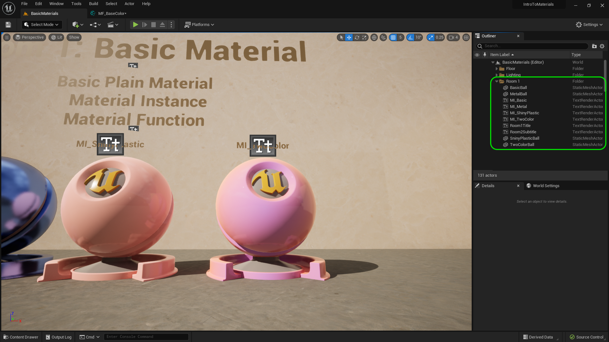

### Basic Material III

[previous](../basic-ii/README.md#user-content-basic-material-ii) • [home](../README.md#user-content-ue5-intro-to-materials) • [next](../)

Final clean up of room 1.

 

---

##### `Step 1.`\|`UE5MAT`|:small_blue_diamond:

Now make sure all the material balls are in the **Room 1** folder.  Also, give them appropriate names.  I have named the material balls and the materials so I know which one pairs with which one.

##### `Step 2.`\|`UE5MAT`|:small_blue_diamond: :small_blue_diamond: 

Now you can add some more materials to test out the material instance in this room if you like.  Then play the game, make sure everything is to your liking.

https://user-images.githubusercontent.com/5504953/185446475-3f9fc9c9-ac30-4016-8016-86c348917640.mp4

##### `Step 3.`\|`UE5MAT`|:small_blue_diamond: :small_blue_diamond: :small_blue_diamond:

Select the **File | Save All** then press the <kbd>Source Control</kbd> button and select **Submit Content**.  If you are prompted, select **Check Out** for all items that are not checked out of source control. Update the **Changelist Description** message and with the latest changes. Make sure all the files are correct and press the <kbd>Submit</kbd> button. A confirmation will pop up on the bottom right with a message about a changelist was submitted with a commit number.

https://user-images.githubusercontent.com/5504953/185447657-6a67db19-b2c8-4eef-88d1-05c0ffd41009.mp4

<!--  -->

| [previous](../basic-ii/README.md#user-content-basic-material-ii)| [home](../README.md#user-content-ue5-intro-to-materials) | [next](../)|
|---|---|---|
