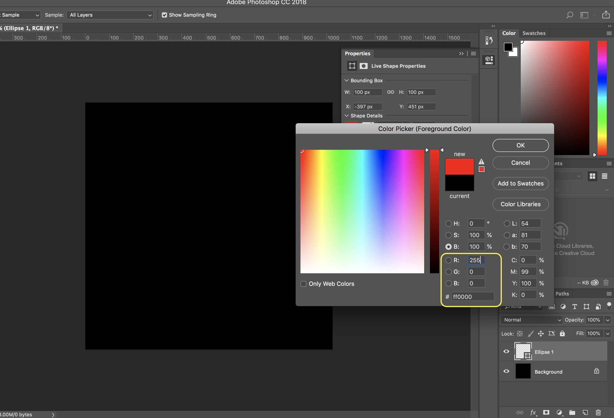
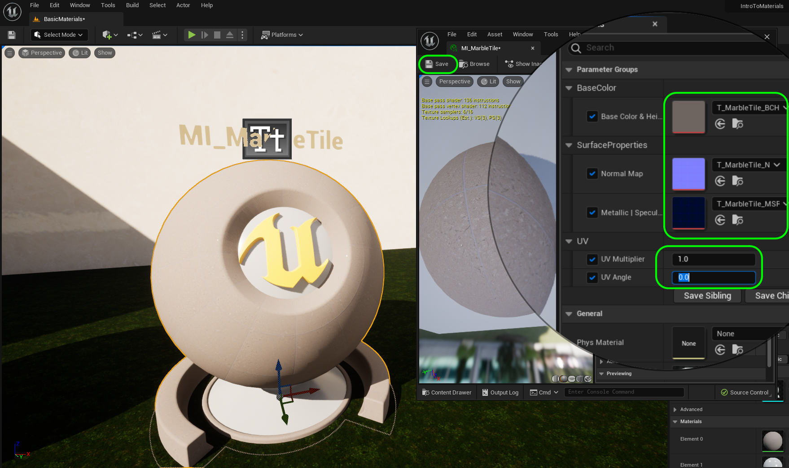
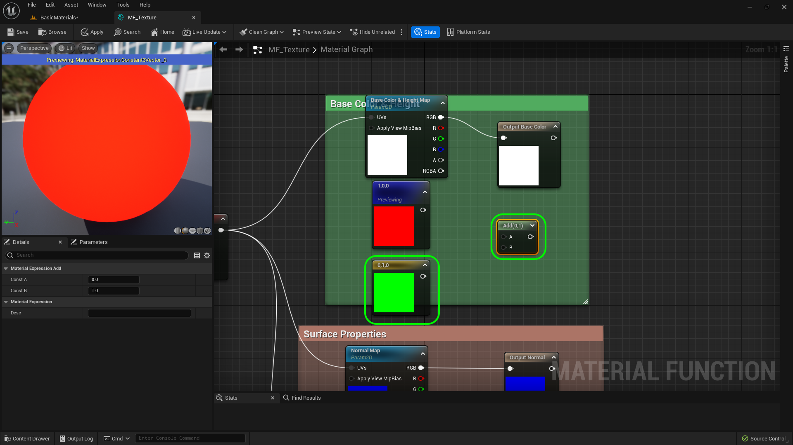
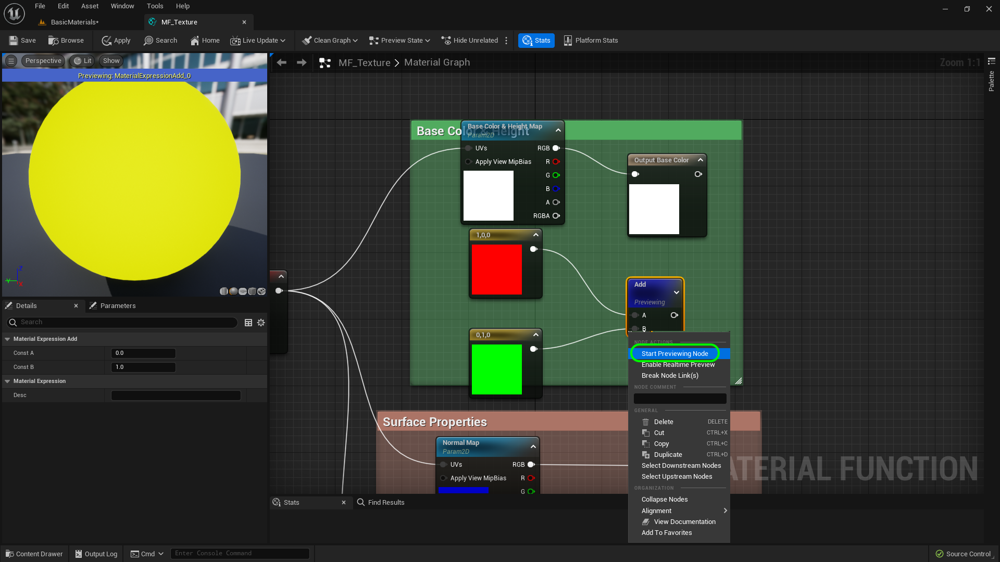
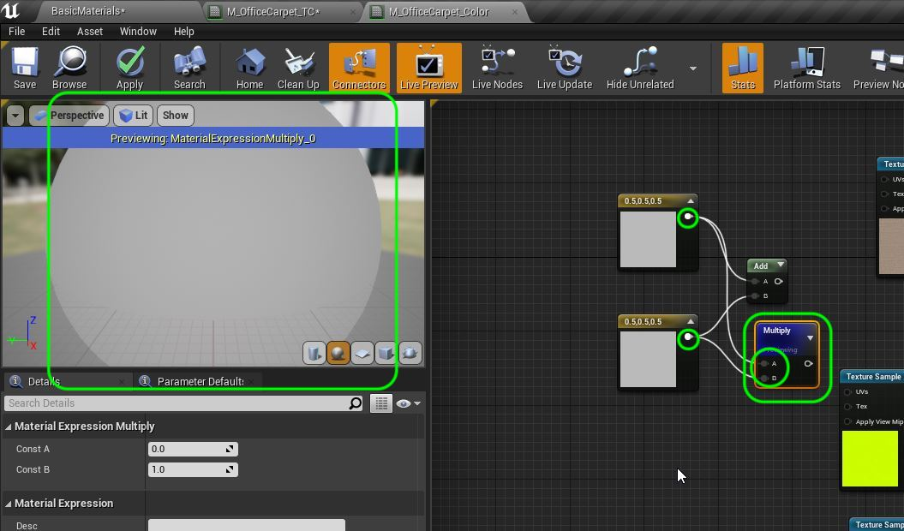
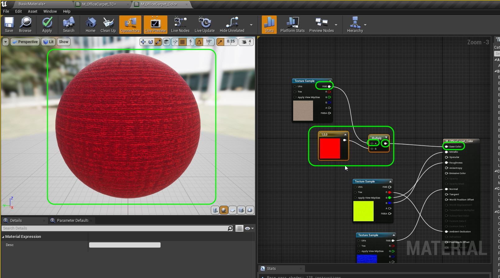
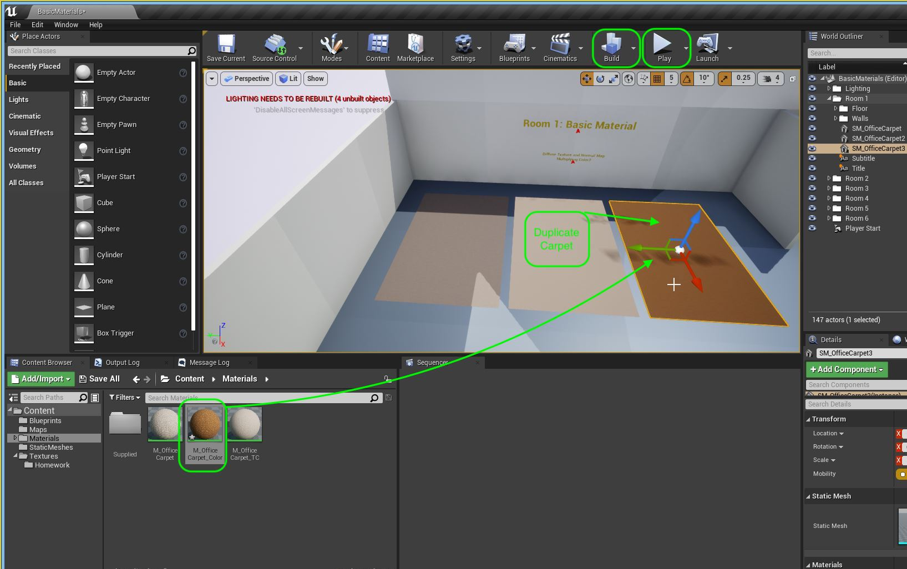
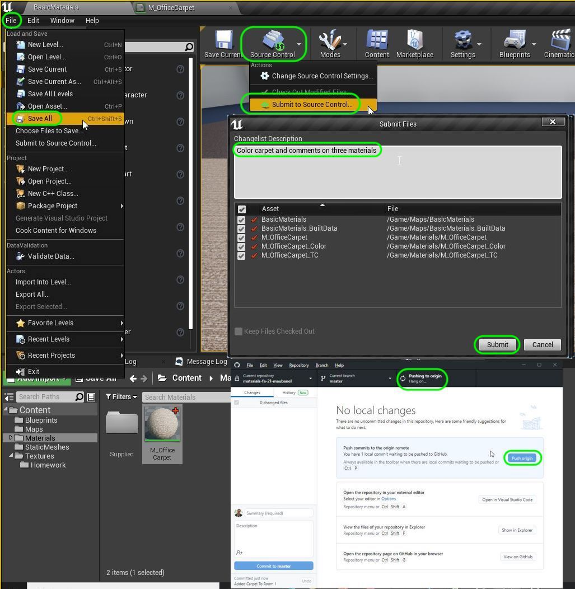

### Material Color Math

[previous](../solid-material-iv/README.md#user-content-solid-material-iv) • [home](../README.md#user-content-ue4-intro-to-materials) • [next](../material-instances/README.md#user-content-material-instances)

Lets look at how we can use basic addition and multiplication to alter colors in a material.  This allows us to make changes without necessarily having to go back to **Substance** or **Photoshop** to adjust colors.

 

---

##### `Step 1.`\|`UE5MAT`|:small_blue_diamond:

Now lets look at how **Unreal** handles colors.  In **Photoshop's** color picker we can see four representations of color, but the most important to computer graphics are RGB and Hexadecimal.  We also care about a 4th Alpha channel but we do not have any alphas in this texture so we will deal with it later. All colors are derived from 256 values of Red, Green and Blue.  They are represented in Photoshop by 0 through 255.  White is 255, 255, 255 and black is 0, 0, 0.  In this example we see pure Red 255, 0 0.

##### `Step 2.`\|`UE5MAT`|:small_blue_diamond: :small_blue_diamond: 

Download [T_MarbleTile_BCH.png](../Assets/T_MarbleTile_BCH.png), [T_MarbleTile_N.png](../Assets/T_MarbleTile_N.png) and [T_MarbleTile_MSRAO.png](../Assets/T_MarbleTile_MSRAO.png). Drag them into the **Textures | Surface** folder.  Make sure the normal map has the correct type of compression.

##### `Step 3.`\|`UE5MAT`|:small_blue_diamond: :small_blue_diamond: :small_blue_diamond:

Go to **Material | Surfaces** and select **MI_WildGrass** and select **Duplicate**. Call this new material `MI_MarbleTile`.  Duplicate the material ball and title.  Slide it to the right. Change the text in the title to `MI_MarbleTile`.

##### `Step 4.`\|`UE5MAT`|:small_blue_diamond: :small_blue_diamond: :small_blue_diamond: :small_blue_diamond:

Assign **MI_MarbleTile** to the new material ball.  Open up the material and change the three textures to `T_MarbleTile...`.  Set the **UV Multiplier** to `1` and **UV Angle** of `0.0` degrees.

##### `Step 5.`\|`UE5MAT`| :small_orange_diamond:

Open up **MI_MarbleTile** and add a **Constant3Vector** to the node chart under the **Base Color**.

##### `Step 6.`\|`UE5MAT`| :small_orange_diamond: :small_blue_diamond:

Now in **Unreal** it represents each channel with a number from `0` to `1`.  So if we want to convert from Photoshop style RGB to Unreal we need to divide the value by `/255`.  So the same representation of pure **Red** in UE4 is `255/255`, `0/255`, `0/255`.  This ends up with `1,0,0`.  So UE5 normalizes each range of each color channel between `0` and `1`.

Double click the **Constant 3 Vector** and change red to `1`.  Right click on the color and select **Start Previewing Node**.  This allows you to look at the color in different parts of the flowchart.  This is the best way to debug materials.  Notice the red ball is now read.

##### `Step 7.`\|`UE5MAT`| :small_orange_diamond: :small_blue_diamond: :small_blue_diamond:

Now lets add another **Constant 3 Vector**.  Make the second vector solid green with a **G** value of `1.0`. This will allow us to add the two vectors together. Right mouse click and select an **Add** node. We will add the two nodes together. Now how do additions work?  When you add two vectors together (RGB1 & RGB2) it just adds the red channel R1 + R2, green channel G1 + G2 and blue channel B1 + B2. Even though the add node has a single pin, it will add up all three channels individually.

##### `Step 8.`\|`UE5MAT`| :small_orange_diamond: :small_blue_diamond: :small_blue_diamond: :small_blue_diamond:

Connect the two **Constant Vector 3** nodes to the **Add**. Hit **Start Previewing Node** on the **Add** node.  Now it adds the two channels together (1,0,0 + 0,1,0) making the resulting color 1, 1, 0.  When you have solid Red and solid Green we get yellow. 

##### `Step 9.`\|`UE5MAT`| :small_orange_diamond: :small_blue_diamond: :small_blue_diamond: :small_blue_diamond: :small_blue_diamond:

Right click and add a **Multiply** node. Connect the two **Constant Vector 3** nodes to the **Multiply**. Hit **Start Previewing Node** on the **Mulitpy** node.  Now it multiplies up all three channels making them .5 x .5 so each channel is `.25`.  This makes it much darker.

To exagerate the effect take one of the constant vectors and change it to `.1` on all three channels.  Now it is even darker - `.05` in each channel.

##### `Step 10.`\|`UE5MAT`| :large_blue_diamond:

Flip between viewing the mid gray on its own and then the two added and multiplied.  Think about what the add and multiply node are doing. Try using different values and see if you can guess what will happen.  It is just adding and multiplying each color in each channel.

https://user-images.githubusercontent.com/5504953/130356614-5152993d-70ff-48bf-a900-0b7a0df8265a.mp4

##### `Step 11.`\|`UE5MAT`| :large_blue_diamond: :small_blue_diamond: 

OK, lets delete all of these nodes except the **Constant Vector 3** and **Multiply** node. Now adjust the color of the **Constant Vector 3** to `1`, `0`, `0` or pure red.  Connect the **Texture Sample | RGB** output to the **Multiply** input.  Connect the output of the **Multiply** node into the **Base Color** node in the shader. Notice that this shades the texture red as it multplies the blue and the green channel by `0` leaving only the red channel (probably not at a full value of one).

##### `Step 12.`\|`UE5MAT`| :large_blue_diamond: :small_blue_diamond: :small_blue_diamond: 

Double click on the black square and you will get a color picker.  Pick a nice color for the carpet.  I picked `.537862, .299251, .109385`. You can pick it by double clicking on the node and using the **Color Picker** or editing the **Details** panel of the node. Press the <kbd>Apply</kbd> button when you are done.

##### `Step 13.`\|`UE5MAT`| :large_blue_diamond: :small_blue_diamond: :small_blue_diamond:  :small_blue_diamond: 

Duplicate the carpet and add it to the first room.  Drag the **M_OfficeCarpet_Color** onto this third carpet.  Press the <kbd>Build</kbd> to bake the shadows into this third carpet.  Play the game and take a look!

https://user-images.githubusercontent.com/5504953/130363649-5c11e393-8024-4c27-9861-76054f67d7eb.mp4

##### `Step 14.`\|`UE5MAT`| :large_blue_diamond: :small_blue_diamond: :small_blue_diamond: :small_blue_diamond:  :small_blue_diamond: 

Add comments to nodes in three materials. Select the nodes you want to comment by dragging a box around them with the left mouse button.  The press the <kbd>C</kbd> key to write a comment.

https://user-images.githubusercontent.com/5504953/130367242-941b5c87-1d10-4ee5-8b1b-31a04f0fda7e.mp4

##### `Step 15.`\|`UE5MAT`| :large_blue_diamond: :small_orange_diamond: 

OK, now lets finish up this section by savin our work and uploading it to GitHub.  Press **Tile | Save All** then **Source Conrol | Submit to Source Control...** and add a description.  Press the <kbd>Submit</kbd> button.  Open up **GitHub Desktop** and **Push** the commited work.

<!--  -->

| [previous](../solid-material-iv/README.md#user-content-solid-material-iv)| [home](../README.md#user-content-ue4-intro-to-materials) | [next](../material-instances/README.md#user-content-material-instances)|
|---|---|---|
