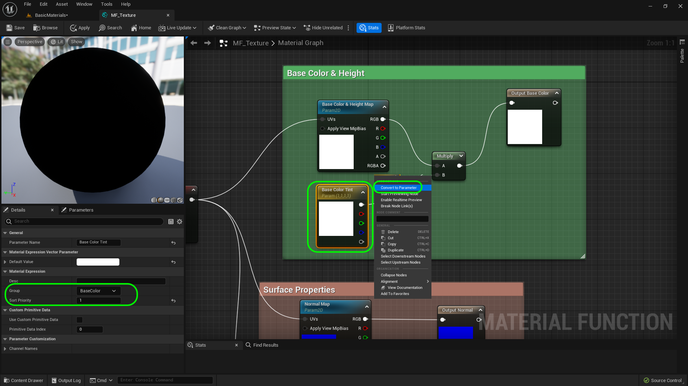
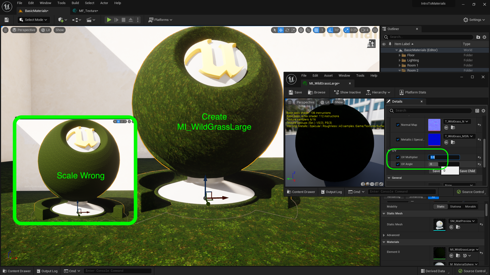

### Material Color Math

[previous](../solid-material-iv/README.md#user-content-solid-material-iv) • [home](../README.md#user-content-ue4-intro-to-materials) • [next](../material-instances/README.md#user-content-material-instances)

Lets look at how we can use basic addition and multiplication to alter colors in a material.  This allows us to make changes without necessarily having to go back to **Substance** or **Photoshop** to adjust colors.

 

---

##### `Step 1.`\|`UE5MAT`|:small_blue_diamond:

Now lets look at how **Unreal** handles colors.  In **Photoshop's** color picker we can see four representations of color, but the most important to computer graphics are RGB and Hexadecimal.  We also care about a 4th Alpha channel but we do not have any alphas in this texture so we will deal with it later. All colors are derived from 256 values of Red, Green and Blue.  They are represented in Photoshop by 0 through 255.  White is 255, 255, 255 and black is 0, 0, 0.  In this example we see pure Red 255, 0 0.

##### `Step 2.`\|`UE5MAT`|:small_blue_diamond: :small_blue_diamond: 

Download [T_MarbleTile_BCH.png](../Assets/T_MarbleTile_BCH.png), [T_MarbleTile_N.png](../Assets/T_MarbleTile_N.png) and [T_MarbleTile_MSRAO.png](../Assets/T_MarbleTile_MSRAO.png). Drag them into the **Textures | Surface** folder.  Make sure the normal map has the correct type of compression.

##### `Step 3.`\|`UE5MAT`|:small_blue_diamond: :small_blue_diamond: :small_blue_diamond:

Go to **Material | Surfaces** and select **MI_WildGrass** and select **Duplicate**. Call this new material `MI_MarbleTile`.  Duplicate the material ball and title.  Slide it to the right. Change the text in the title to `MI_MarbleTile`.

##### `Step 4.`\|`UE5MAT`|:small_blue_diamond: :small_blue_diamond: :small_blue_diamond: :small_blue_diamond:

Assign **MI_MarbleTile** to the new material ball.  Open up the material and change the three textures to `T_MarbleTile...`.  Set the **UV Multiplier** to `1` and **UV Angle** of `0.0` degrees.

##### `Step 5.`\|`UE5MAT`| :small_orange_diamond:

Open up **MI_MarbleTile** and add a **Constant3Vector** to the node chart under the **Base Color**.

##### `Step 6.`\|`UE5MAT`| :small_orange_diamond: :small_blue_diamond:

Now in **Unreal** it represents each channel with a number from `0` to `1`.  So if we want to convert from Photoshop style RGB to Unreal we need to divide the value by `/255`.  So the same representation of pure **Red** in UE4 is `255/255`, `0/255`, `0/255`.  This ends up with `1,0,0`.  So UE5 normalizes each range of each color channel between `0` and `1`.

Double click the **Constant 3 Vector** and change red to `1`.  Right click on the color and select **Start Previewing Node**.  This allows you to look at the color in different parts of the flowchart.  This is the best way to debug materials.  Notice the red ball is now read.

##### `Step 7.`\|`UE5MAT`| :small_orange_diamond: :small_blue_diamond: :small_blue_diamond:

Now lets add another **Constant 3 Vector**.  Make the second vector solid green with a **G** value of `1.0`. This will allow us to add the two vectors together. Right mouse click and select an **Add** node. We will add the two nodes together. Now how do additions work?  When you add two vectors together (RGB1 & RGB2) it just adds the red channel R1 + R2, green channel G1 + G2 and blue channel B1 + B2. Even though the add node has a single pin, it will add up all three channels individually.

##### `Step 8.`\|`UE5MAT`| :small_orange_diamond: :small_blue_diamond: :small_blue_diamond: :small_blue_diamond:

Connect the two **Constant Vector 3** nodes to the **Add**. Hit **Start Previewing Node** on the **Add** node.  Now it adds the two channels together (1,0,0 + 0,1,0) making the resulting color 1, 1, 0.  When you have solid Red and solid Green we get yellow. 

##### `Step 9.`\|`UE5MAT`| :small_orange_diamond: :small_blue_diamond: :small_blue_diamond: :small_blue_diamond: :small_blue_diamond:

Right click and add a **Multiply** node. Connect the two **Constant Vector 3** nodes to the **Multiply**. Hit **Start Previewing Node** on the **Mulitpy** node.  Now it multiplies up all three channelsinstead of adding them.  So the red channel multiplies 1 x 0, the green 0 x 1, and the blue 0 x 0.  This leaves our vector at 0,0,0 or *black*.

##### `Step 10.`\|`UE5MAT`| :large_blue_diamond:

Change the red to white make it **R** of `1`, **G** of `1` and **B** of `1`.  Now when you multiply it by green the white gets tinted green.  So multiplication of two numbers between 0 and 1 will always remove detail (or leave it the same).  We can use this to alter the hue and tint textures!

##### `Step 11.`\|`UE5MAT`| :large_blue_diamond: :small_blue_diamond: 

OK, lets delete the second vector and addition nodes. Now adjust the color of the **Constant Vector 3** to `1`, `1`, `1` or pure white.  Connect the **Texture Parameter | RGB** output to the **Multiply | A** input.  Connect the output of the **Multiply | B** node into the **Base Color** node in the shader. Now multiplying by 1,1,1 does nothing so it will not affect any of our previous work. So our original texture stays white.

##### `Step 12.`\|`UE5MAT`| :large_blue_diamond: :small_blue_diamond: :small_blue_diamond: 

Now right click the vector and select **Convert to Parameter**.  Call it `Base Color Tint` and make the **Group** `Base Color` and **Sort Priority** `1`.

##### `Step 13.`\|`UE5MAT`| :large_blue_diamond: :small_blue_diamond: :small_blue_diamond:  :small_blue_diamond: 

Now since we have added a parameter lets change the **Metallic** node to **Sort Priority** `11` and **Metallic | Specular | Roughness | AO** to `12`.

##### `Step 14.`\|`UE5MAT`| :large_blue_diamond: :small_blue_diamond: :small_blue_diamond: :small_blue_diamond:  :small_blue_diamond: 

Duplicate the marble material ball and text and move it to the right. Change the text on the title to `Green Marble Tile`.

##### `Step 15.`\|`UE5MAT`| :large_blue_diamond: :small_orange_diamond: 

Duplicate **Materials | Surfaces | MI_MarbleTile** and call it `MI_GreenMarbleTile`. Assign this as to the material on the new material ball you just copied.

##### `Step 16.`\|`UE5MAT`| :large_blue_diamond: :small_orange_diamond:   :small_blue_diamond: 

Now open up **MI_GreenMarbleTile** and change the default tint color from white, to a color such as a light green.

##### `Step 17.`\|`UE5MAT`| :large_blue_diamond: :small_orange_diamond: :small_blue_diamond: :small_blue_diamond:

Now if we go back to the first material ball the tiling looks very wrong on the ball versus the floor.  Right click on **MI_WildGrass** and select **Duplicate**.  Name it `MI_WildGrassLarge`.  Assign it to the material ball and change the **UV Multiplier** to `3` and **UV Angle** to `0`.

##### `Step 18.`\|`UE5MAT`| :large_blue_diamond: :small_orange_diamond: :small_blue_diamond: :small_blue_diamond: :small_blue_diamond:

Now make sure that the **UV Angle** on both marble tile materials is set to `0` otherwise the lines of the tile will not work.  A tile with a pattern like this should not be rotated. *Press* the <kbd>Play</kbd> button  and look at the three material balls and grass ground.  Make sure you are happy with everything.

##### `Step 19.`\|`UE5MAT`| :large_blue_diamond: :small_orange_diamond: :small_blue_diamond: :small_blue_diamond: :small_blue_diamond: :small_blue_diamond:

##### `Step 20.`\|`UE5MAT`| :large_blue_diamond: :large_blue_diamond:

##### `Step 21.`\|`UE5MAT`| :large_blue_diamond: :large_blue_diamond: :small_blue_diamond:

<!--  -->

| [previous](../solid-material-iv/README.md#user-content-solid-material-iv)| [home](../README.md#user-content-ue4-intro-to-materials) | [next](../material-instances/README.md#user-content-material-instances)|
|---|---|---|
