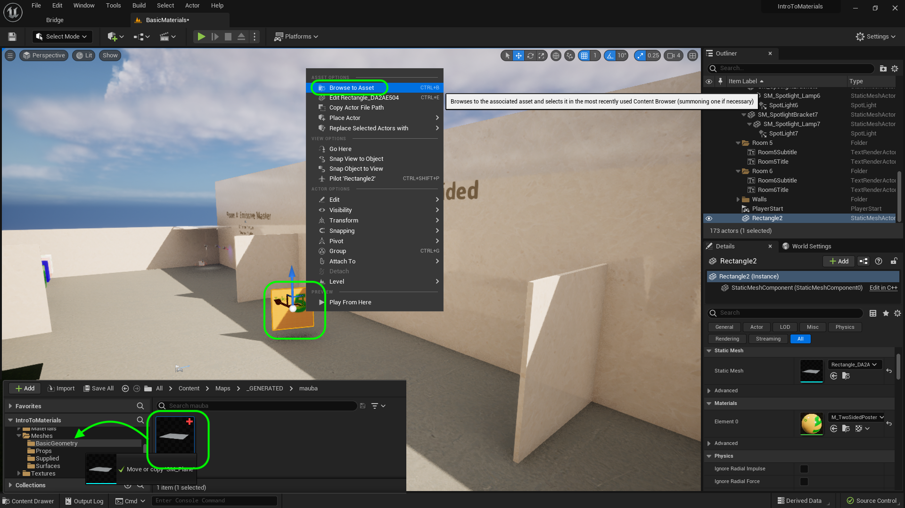
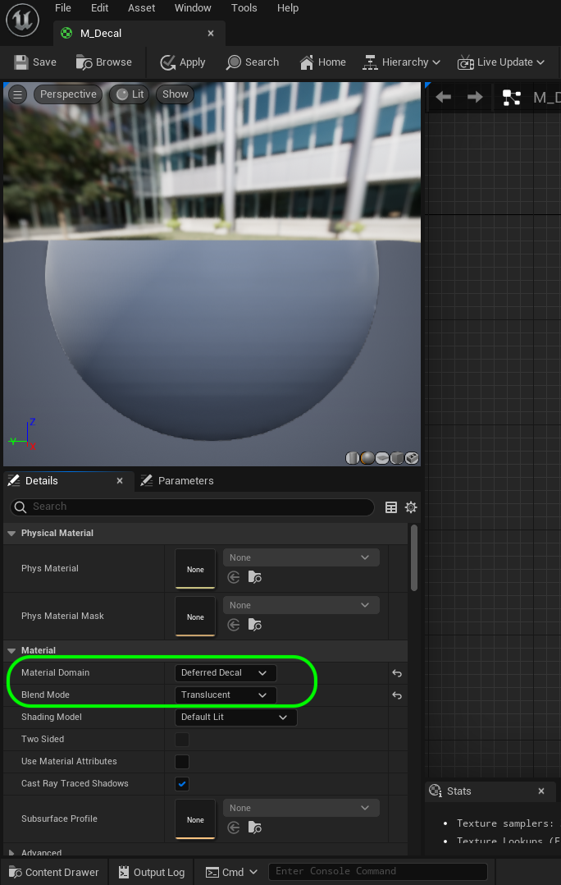
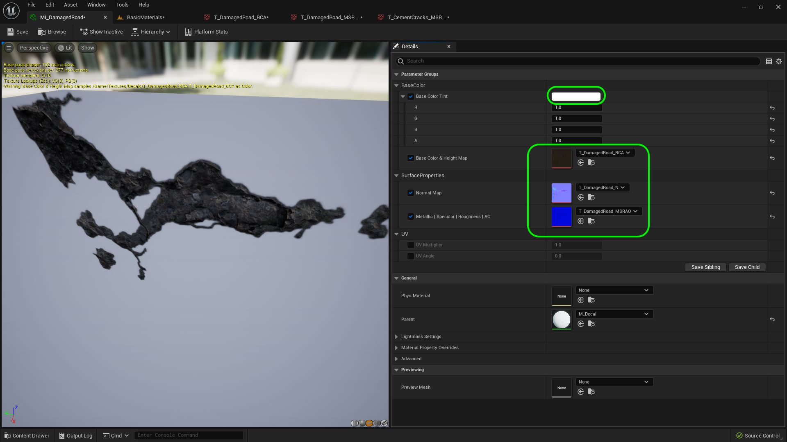
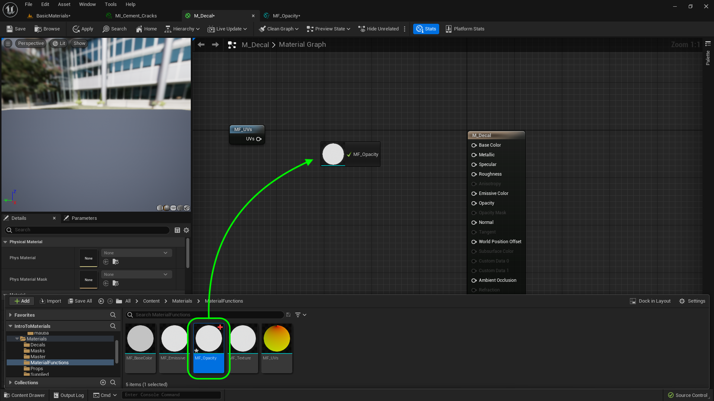
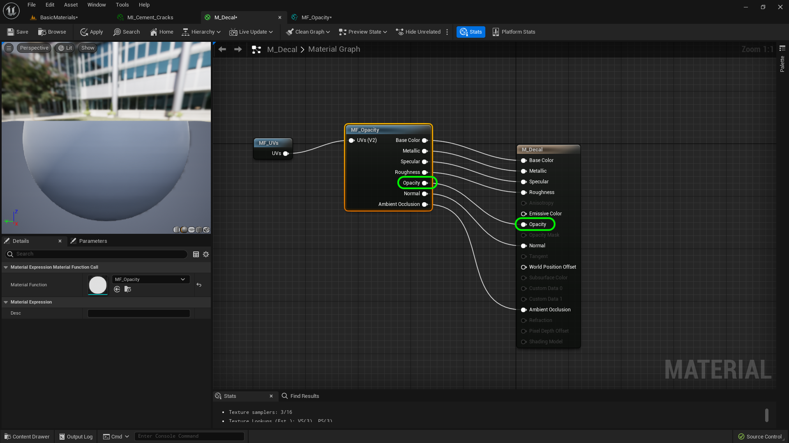
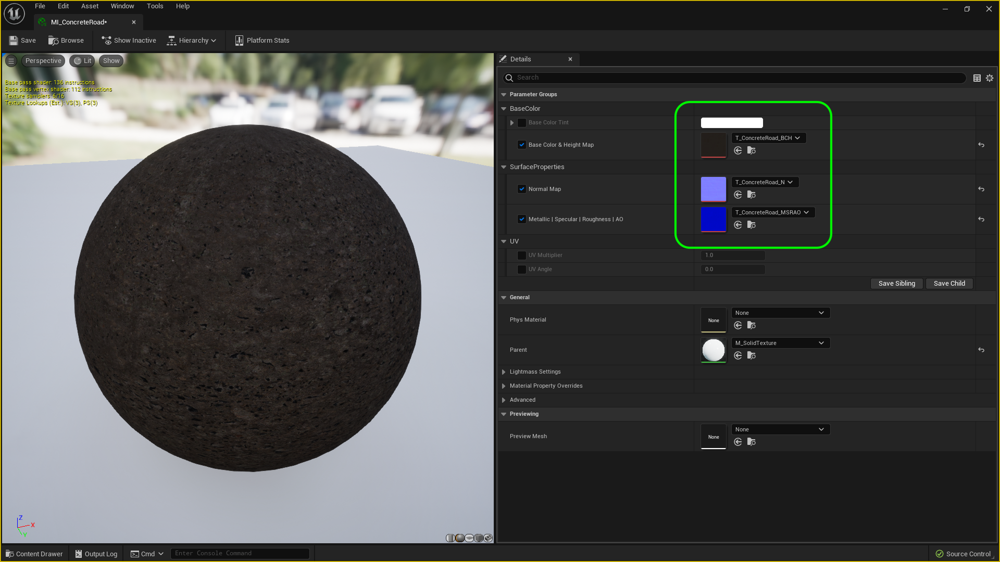
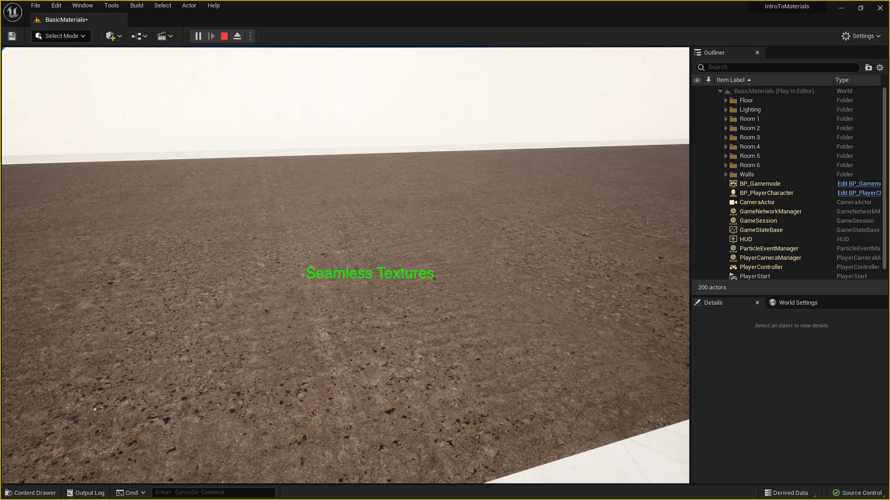

### Decals

[previous](../two-sided-ii/README.md#user-content-two-sided-material-ii) • [home](../README.md#user-content-ue4-intro-to-materials) • [next](../decals-ii/README.md#user-content-decals-ii)

We can also change materials dynamically by using decals.  These can be placed over existing materials and cover mesh and uv boundaries. So you can add graphiti to a wall made up of diverse meshes with multiple UVs.  This does require transparencies so it will not work on nanite meshes.

 

---
Lets start by moving the **Player Start** actor to the front of room 6.

Now we want to be able to scale that opacity.  So add a **Scalar Parameter** and call it `Opacity Intensity`.  Set it's **Group** to `Base Color` and **Sort Priority** to `4`.  Add a **Multiply** node and send the **Output Intensity** and **Base Color | A** nodes to the **Multiply** input pin.  Then send the output to **Output Opacity**.

##### `Step 1.`\|`UE5MAT`|:small_blue_diamond:

*Open* up the **Modeling Mode** and creaeta a **Shape | Box** that fills the room and subdivide the polygons resonably.  Turn **Align to Normals** to `false`.  Place the plane in the middle of Room #6.

##### `Step 2.`\|`UE5MAT`|:small_blue_diamond: :small_blue_diamond: 

*Right click *on the newly created plane and select **Browse to Asset**.  Rename it to `SM_Road` and move it to the **Meshes | Props** folder.

##### `Step 3.`\|`UE5MAT`|:small_blue_diamond: :small_blue_diamond: :small_blue_diamond:

Lift the plane up and press the <kbd>End</kbd> key to get it to the ground.  Notice that the plane quickly goes from hidden beneath the floor, to above it.  If the planes are at the same level there will be z fighting where the renderer will have a hard time sorting which surface to display and it will be glitchy.  Go to the **Location | Z** and raise it by `.05` units. Raise it more if it doesn't stop the z fighting on your computer.

##### `Step 4.`\|`UE5MAT`|:small_blue_diamond: :small_blue_diamond: :small_blue_diamond: :small_blue_diamond:

*Right click* on **M_Transparent_MSRAO** and select **Duplicate**.  Call the new material `M_Decal`.

##### `Step 5.`\|`UE5MAT`| :small_orange_diamond:

Now select **M_Decal** and change the **Material Domain** to `Deferred Decal` and make sure the **Blend Mode** is set to `Translucent`. This is a special material type that can be placed on top of another material.  So think footsteps in the ground, or tire marks on the road.

##### `Step 6.`\|`UE5MAT`| :small_orange_diamond: :small_blue_diamond:

Create a folder called `Decals` in the **Textures** folder. Download two decals worth of textures: [T_CementCracks_BCA.png](../Assets/T_CementCracks_BCA.png),  [T_CementCracks_N.png](../Assets/T_CementCracks_N.png), [T_CementCracks_MSRAO.png](../Assets/T_CementCracks_MSRAO.png).  Download [T_DamagedRoad_BCA.png](../Assets/T_DamagedRoad_BCA.png), [T_DamagedRoad_N.png](../Assets/T_DamagedRoad_N.png) and [T_DamagedRoad_MSRAO.png](../Assets/T_DamagedRoad_MSRAO.png).

Drag the above 6 textures into the **Textures | Decals** folder.  Make sure the normal textures are recognized as such and that the **MSRAO** are set to masks.

##### `Step 7.`\|`UE5MAT`| :small_orange_diamond: :small_blue_diamond: :small_blue_diamond:

Right click on **M_Decal** and select **Create Material Instance**.  Call it `MI_Cement_Cracks`.  Move the instance to the **Material Instances** folder.  

##### `Step 8.`\|`UE5MAT`| :small_orange_diamond: :small_blue_diamond: :small_blue_diamond: :small_blue_diamond:

Open up **MI_Cement_Cracks** and assign `T_DamagedRoad_BCA` to **Base Color**, `T_DamagedRoad_N` to **Normal Map** and `T_DamagedRoad_MSRA)` to **Metallic | Specular | Roughness | AO**.

##### `Step 9.`\|`UE5MAT`| :small_orange_diamond: :small_blue_diamond: :small_blue_diamond: :small_blue_diamond: :small_blue_diamond:

##### `Step 10.`\|`UE5MAT`| :large_blue_diamond:

##### `Step 11.`\|`UE5MAT`| :large_blue_diamond: :small_blue_diamond: 

##### `Step 12.`\|`UE5MAT`| :large_blue_diamond: :small_blue_diamond: :small_blue_diamond: 

Replace **MF_Texture** with **MF_Opacity**.  

##### `Step 13.`\|`UE5MAT`| :large_blue_diamond: :small_blue_diamond: :small_blue_diamond:  :small_blue_diamond: 

Connect all the pins from the **MF_UVs to the MF_Opacity** and from **MF_Opacity**  t0 **M_Decal**.  They are the same as the **M_TextureSolid** except we have an **Alpha** channel we are using to hold the **Opacity**.

##### `Step 14.`\|`UE5MAT`| :large_blue_diamond: :small_blue_diamond: :small_blue_diamond: :small_blue_diamond:  :small_blue_diamond: 

##### `Step 15.`\|`UE5MAT`| :large_blue_diamond: :small_orange_diamond: 

##### `Step 16.`\|`UE5MAT`| :large_blue_diamond: :small_orange_diamond:   :small_blue_diamond: 

##### `Step 17.`\|`UE5MAT`| :large_blue_diamond: :small_orange_diamond: :small_blue_diamond: :small_blue_diamond:

Now we have noting to put the decal on.  Lets put a road texture on our planes in room 6. Go to **Materials | Master** and right click on **M_SolidTexture** and select **Create Material Instance**.  Call it `MI_ContreteRoad`.  Move it to the **Surfaces** directory.

##### `Step 18.`\|`UE5MAT`| :large_blue_diamond: :small_orange_diamond: :small_blue_diamond: :small_blue_diamond: :small_blue_diamond:

Now we need to access the three textures for the road.  Download [T_ConcreteRoad_BCH.png](../Assets/T_ConcreteRoad_BCH.png), [T_ConcreteRoad_N.png](../Assets/T_ConcreteRoad_N.png) and [T_ConcreteRoad_MSRAO.png](../Assets/T_ConcreteRoad_MSRAO.png). Drag the three files into the **Textures | Surfaces** folder. Make sure the normal map texture is set correctly.

##### `Step 19.`\|`UE5MAT`| :large_blue_diamond: :small_orange_diamond: :small_blue_diamond: :small_blue_diamond: :small_blue_diamond: :small_blue_diamond:

Assign `T_CementRoad_BCH` to **Base Color** and `T_ConcreteRoad_N` to **Normal Map** and finally `T_ConcreateRoad_MSRAO` to **Metallic | Specular | Roughness | AO**.

##### `Step 20.`\|`UE5MAT`| :large_blue_diamond: :large_blue_diamond:

Select all 16 faces and assign **MI_ContreteRoad** as the material.

##### `Step 21.`\|`UE5MAT`| :large_blue_diamond: :large_blue_diamond: :small_blue_diamond:

Now we have a nice seamless texture that we can apply our decal we just created.

<!--  -->

| [previous](../two-sided-ii/README.md#user-content-two-sided-material-ii)| [home](../README.md#user-content-ue4-intro-to-materials) | [next](../decals-ii/README.md#user-content-decals-ii)|
|---|---|---|
