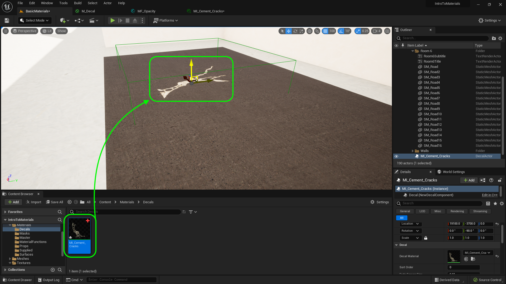
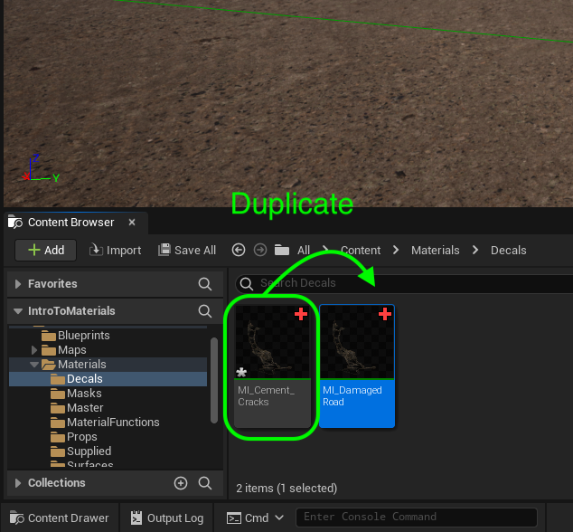

### Decals

[previous](../two-sided-ii/README.md#user-content-two-sided-material-ii) • [home](../README.md#user-content-ue4-intro-to-materials) • [next](../decals-ii/README.md#user-content-decals-ii)

We can also change materials dynamically by using decals.  These can be placed over existing materials and cover mesh and uv boundaries. So you can add graphiti to a wall made up of diverse meshes with multiple UVs.  This does require transparencies so it will not work on nanite meshes.

 

---

##### `Step 1.`\|`UE5MAT`|:small_blue_diamond:

*Open* up the **Modeling Mode** and creaeta a **Shape | Box** that fills the room and subdivide the polygons resonably.  Turn **Align to Normals** to `false`.  Place the plane in the middle of Room #6.

##### `Step 2.`\|`UE5MAT`|:small_blue_diamond: :small_blue_diamond: 

*Right click* on the newly created plane and select **Browse to Asset**.  Rename it to `SM_Road` and move it to the **Meshes | Props** folder.

##### `Step 3.`\|`UE5MAT`|:small_blue_diamond: :small_blue_diamond: :small_blue_diamond:

Lift the plane up and press the <kbd>End</kbd> key to get it to the ground.  Notice that the plane quickly goes from hidden beneath the floor, to above it.  If the planes are at the same level there will be z fighting where the renderer will have a hard time sorting which surface to display and it will be glitchy.  Go to the **Location | Z** and raise it by `.05` units. Raise it more if it doesn't stop the z fighting on your computer.

##### `Step 4.`\|`UE5MAT`|:small_blue_diamond: :small_blue_diamond: :small_blue_diamond: :small_blue_diamond:

*Right click* on **M_Transparent_MSRAO** and select **Duplicate**.  Call the new material `M_Decal`.

##### `Step 5.`\|`UE5MAT`| :small_orange_diamond:

Now select **M_Decal** and change the **Material Domain** to `Deferred Decal` and make sure the **Blend Mode** is set to `Translucent`. This is a special material type that can be placed on top of another material.  So think footsteps in the ground, or tire marks on the road.

##### `Step 6.`\|`UE5MAT`| :small_orange_diamond: :small_blue_diamond:

Create a folder called `Decals` in the **Textures** folder. Download two decals worth of textures: [T_CementCracks_BCA.png](../Assets/T_CementCracks_BCA.png),  [T_CementCracks_N.png](../Assets/T_CementCracks_N.png), [T_CementCracks_MSRAO.png](../Assets/T_CementCracks_MSRAO.png).  Download [T_DamagedRoad_BCA.png](../Assets/T_DamagedRoad_BCA.png), [T_DamagedRoad_N.png](../Assets/T_DamagedRoad_N.png) and [T_DamagedRoad_MSRAO.png](../Assets/T_DamagedRoad_MSRAO.png).

Drag the above 6 textures into the **Textures | Decals** folder.  Make sure the normal textures are recognized as such and that the **MSRAO** are set to masks.

##### `Step 7.`\|`UE5MAT`| :small_orange_diamond: :small_blue_diamond: :small_blue_diamond:

Right click on **M_Decal** and select **Create Material Instance**.  Call it `MI_Cement_Cracks`.  Move the instance to the **Material Instances** folder.  

##### `Step 8.`\|`UE5MAT`| :small_orange_diamond: :small_blue_diamond: :small_blue_diamond: :small_blue_diamond:

Open up **MI_Cement_Cracks** and assign `T_DamagedRoad_BCA` to **Base Color**, `T_DamagedRoad_N` to **Normal Map** and `T_DamagedRoad_MSRA)` to **Metallic | Specular | Roughness | AO**.

##### `Step 9.`\|`UE5MAT`| :small_orange_diamond: :small_blue_diamond: :small_blue_diamond: :small_blue_diamond: :small_blue_diamond:

Now we have nothing to put the decal on.  Lets put a road texture on our planes in room 6. Go to **Materials | Material Instances** and right click on **MI_MarbleTile** and select **Duplicate**.  Call it `MI_ConcreteRoad`.  

##### `Step 10.`\|`UE5MAT`| :large_blue_diamond:

Now we need to access the three textures for the road.  Download [T_ConcreteRoad_BCH.png](../Assets/T_ConcreteRoad_BCH.png), [T_ConcreteRoad_N.png](../Assets/T_ConcreteRoad_N.png) and [T_ConcreteRoad_MSRAO.png](../Assets/T_ConcreteRoad_MSRAO.png). Drag the three files into the **Textures | Surfaces** folder. Make sure the normal map texture is set correctly. Change the comporessoin on **T_ConcreteRoad_MSRAO** to `Masks`.

##### `Step 11.`\|`UE5MAT`| :large_blue_diamond: :small_blue_diamond: 

Assign the three textures to **MI_ConcreteRoad**.  Assign `T_CementRoad_BCH` to **Base Color** and `T_ConcreteRoad_N` to **Normal Map** and finally `T_ConcreateRoad_MSRAO` to **Metallic | Specular | Roughness | AO**. 

Make sure all other settings are default.

##### `Step 12.`\|`UE5MAT`| :large_blue_diamond: :small_blue_diamond: :small_blue_diamond: 

Drag **MI_ConcreteRoad** onto the plane we created for the road surface.  It is a bit dark.

##### `Step 13.`\|`UE5MAT`| :large_blue_diamond: :small_blue_diamond: :small_blue_diamond:  :small_blue_diamond: 

Now in my game the texture looks dark.  Change the **Intensity** of the **Directional Light** (the sun).

##### `Step 14.`\|`UE5MAT`| :large_blue_diamond: :small_blue_diamond: :small_blue_diamond: :small_blue_diamond:  :small_blue_diamond: 

Now the decals do not take a texture slot they lie on top of the textures and act as a layer in photoshop but project over existing polygons and uvs.  So drag **MI_CementCracks** over to the road.  You can move it around, rotate it and scale it.  I made it a bit smaller as it seemed a bit big to me.

##### `Step 15.`\|`UE5MAT`| :large_blue_diamond: :small_orange_diamond: 

Now we want to be able to adjust how opaque the decal is.  So add a **Scalar Parameter** and call it `OpacityIntensity`.  Set it's **Group** to `Opacity` and **Sort Priority** to `12`.  

##### `Step 16.`\|`UE5MAT`| :large_blue_diamond: :small_orange_diamond:   :small_blue_diamond: 

Set the default value of **OpacityIntensity** to `1.0` (essenctially no effect). Add a **Multiply** node and send the **OutputIntensity** and **MF_BaseTexture | Alpha** nodes to the **Multiply** input pin.  Then send the output to **Opacity**.

##### `Step 17.`\|`UE5MAT`| :large_blue_diamond: :small_orange_diamond: :small_blue_diamond: :small_blue_diamond:

Click on the **Base Color Tint** and select the eye dropper and pick a color from the dement.  I made it even darker to make it more realistic. Adjust the alpha to blend it in nicely to the road to your liking.

##### `Step 18.`\|`UE5MAT`| :large_blue_diamond: :small_orange_diamond: :small_blue_diamond: :small_blue_diamond: :small_blue_diamond:

Right click on **Materials | Decals | MI_CementCracks** and call it `MI_DamagedRoad`. Now open up **MI_DamagedRoad** and assign the textures you downloaded.  Assign **T_DamagedRoad_BCA**, **T_DamagedRoad_N** and **T_DamagedRoad_MSRAO**.

##### `Step 19.`\|`UE5MAT`| :large_blue_diamond: :small_orange_diamond: :small_blue_diamond: :small_blue_diamond: :small_blue_diamond: :small_blue_diamond:

Drag **MI_DamagedRoad** onto the plane surface in room 6. Adjust the color, tint scale and rotation.  Make any final choices ot make it look as good as possible.

##### `Step 20.`\|`UE5MAT`| :large_blue_diamond: :large_blue_diamond:

Lets look at it in game, so start by moving the **Player Start** actor to facing the front of Room 6.

##### `Step 21.`\|`UE5MAT`| :large_blue_diamond: :large_blue_diamond: :small_blue_diamond:

*Press* the <kbd>Play</kbd> button make sure the cracks blend into the ground.

<!--  -->

| [previous](../two-sided-ii/README.md#user-content-two-sided-material-ii)| [home](../README.md#user-content-ue4-intro-to-materials) | [next](../decals-ii/README.md#user-content-decals-ii)|
|---|---|---|
