### Decals

[previous](../two-sided-ii/README.md#user-content-two-sided-material-ii) • [home](../README.md#user-content-ue4-intro-to-materials) • [next](../refract/README.md#user-content-refraction-and-fresnel)

We can also change materials dynamically by using decals.  This could be used for bullet holes or footsteps.

 

---

##### `Step 1.`\|`SUU&G`|:small_blue_diamond:

Lets move onto decals (ignore the title in the room it is not stencils).  This is a type of material that can be added to surfaces.  Think of signs painted into walls or blood splatters.  Lets set up two surfaces to test out decals.

##### `Step 2.`\|`FHIU`|:small_blue_diamond: :small_blue_diamond: 

Drag **StaticMehses | SM_OfficeCarpet** onto the floor next to the wall.

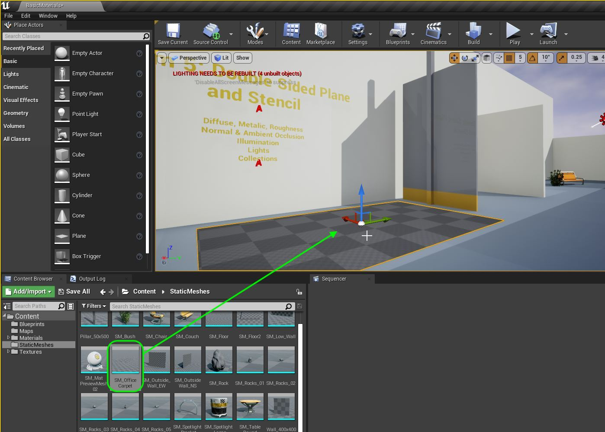

##### `Step 3.`\|`SUU&G`|:small_blue_diamond: :small_blue_diamond: :small_blue_diamond:

Assign one of the **MI_OfficeCarpet_Blue** material to the static mesh.  Adjust the height so it is just above the ground texture and renders correctly.  Put it above and press the <kbd>end</kbd> key.

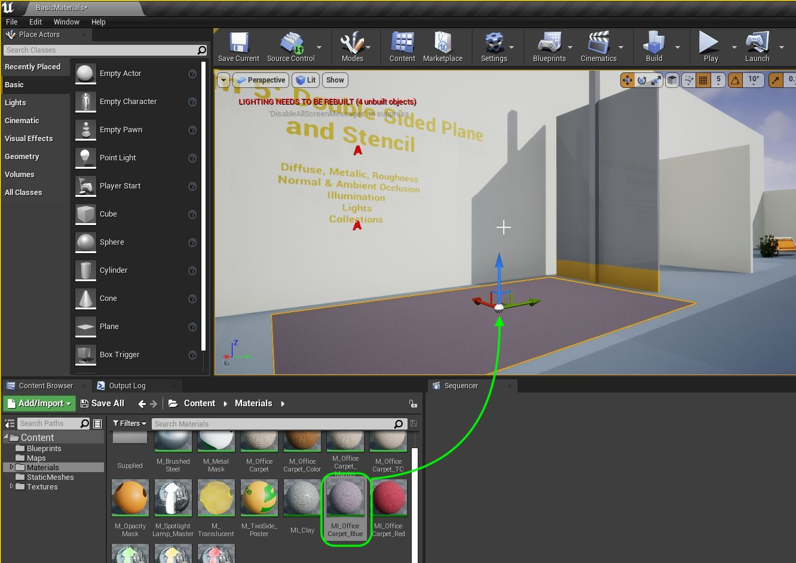

##### `Step 4.`\|`SUU&G`|:small_blue_diamond: :small_blue_diamond: :small_blue_diamond: :small_blue_diamond:

Go to the **Materials** folder and create a new material calling it `M_BloodSplatter_Decal`.

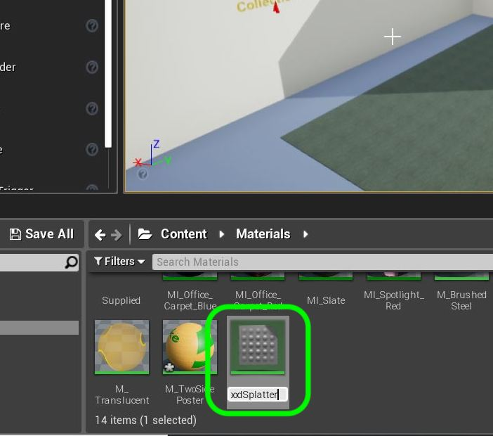

##### `Step 5.`\|`SUU&G`| :small_orange_diamond:

Go into the Textures folder and import **[T_BloodSplatter_DwithA.tga](../Assets/T_BloodSplatter_DwithA.tga)** and **[T_BloodSplatter_N.tga](../Assets/T_BloodSplatter_N.tga)**.

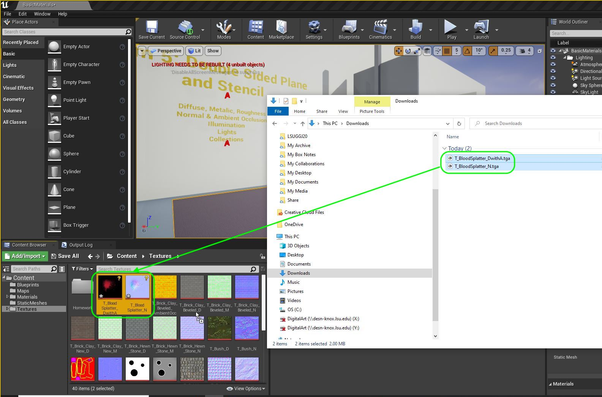

##### `Step 6.`\|`SUU&G`| :small_orange_diamond: :small_blue_diamond:

The bump looks backwards so the normal map did not get recognized. Open up **T_BloodSplatter_N.tga** and take a look.

##### `Step 7.`\|`SUU&G`| :small_orange_diamond: :small_blue_diamond: :small_blue_diamond:

Now change the **Compression Settings** to `Normalmap (CXT5, GC5 on DX11)`.  Also flip the normal map's bump by checking the box next to **Flip Green Channel**.

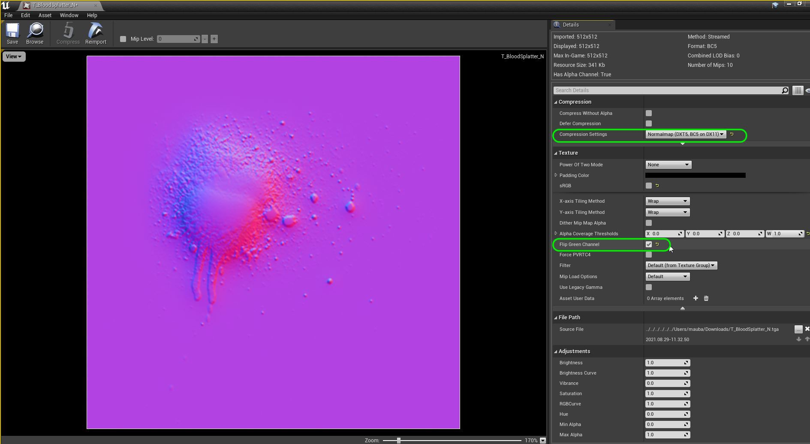

##### `Step 8.`\|`SUU&G`| :small_orange_diamond: :small_blue_diamond: :small_blue_diamond: :small_blue_diamond:

Open up the **M_BloodSplatter_Decal** Material. Change the **Material Domain** in the **Details** panel from **Surface** to **Deferred Decal**.

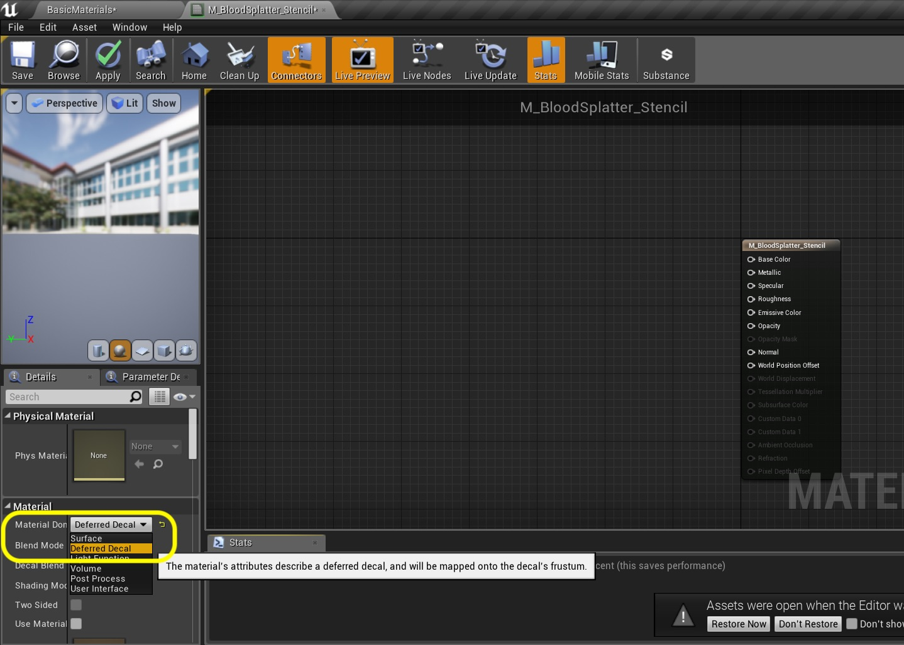

##### `Step 9.`\|`SUU&G`| :small_orange_diamond: :small_blue_diamond: :small_blue_diamond: :small_blue_diamond: :small_blue_diamond:

Make sure the project is set to allow **DBuffer** rendering.  Open up **Settings | Project Settings | Rendering** and look for **DBuffer Decals** and make sure the item is selected (`true`).

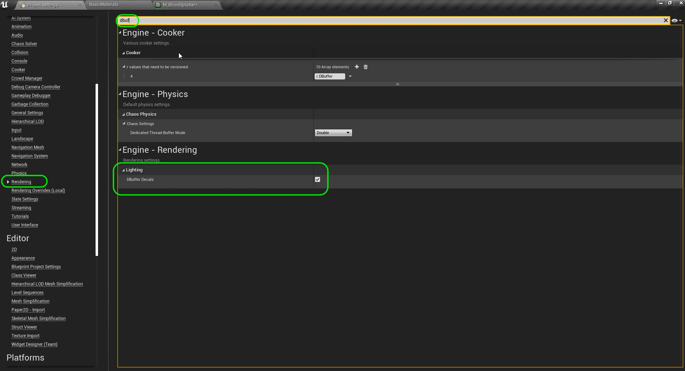

##### `Step 10.`\|`SUU&G`| :large_blue_diamond:

Now for us to be able to preview the decals our previewer needs to be set up correctly.  Open up any static mesh and make sure that **Preview Scene Settings** are set to show both **Show Environment** and **Show Floor**.  Without these we will not see the decal in the previewer.

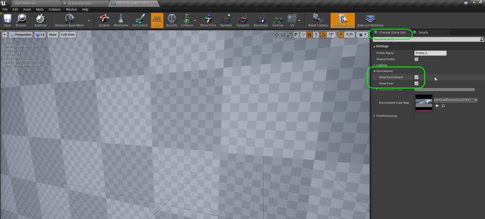

##### `Step 11.`\|`SUU&G`| :large_blue_diamond: :small_blue_diamond: 

Make sure  the **Blend Mode** is set to **Translucent**. Change the **Decal Blend Mode** to `DBuffer Transluicent Color, Normal, Roughness`.

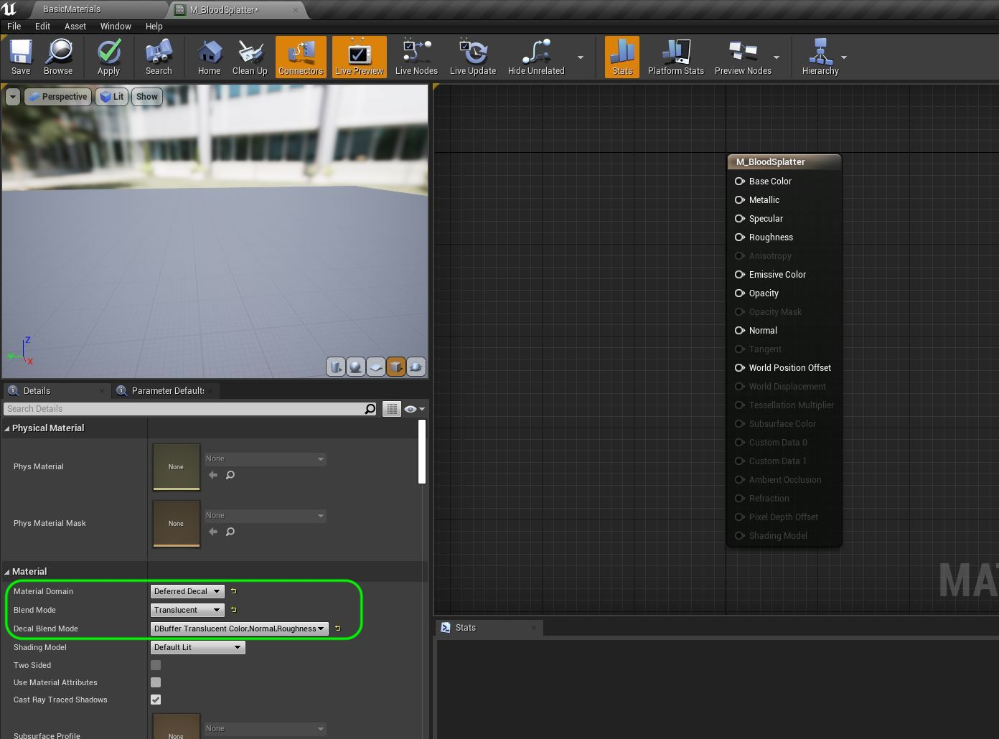

##### `Step 12.`\|`SUU&G`| :large_blue_diamond: :small_blue_diamond: :small_blue_diamond: 

Add two new **Texture Sample** nodes to the material graph.  Assign the Diffuse material to one and the Normal map to the other. Connect them to the appropriate nodes. Look in the top left corner and see the problem. Our background shows through.  The alpha channel is not working. What do we do?

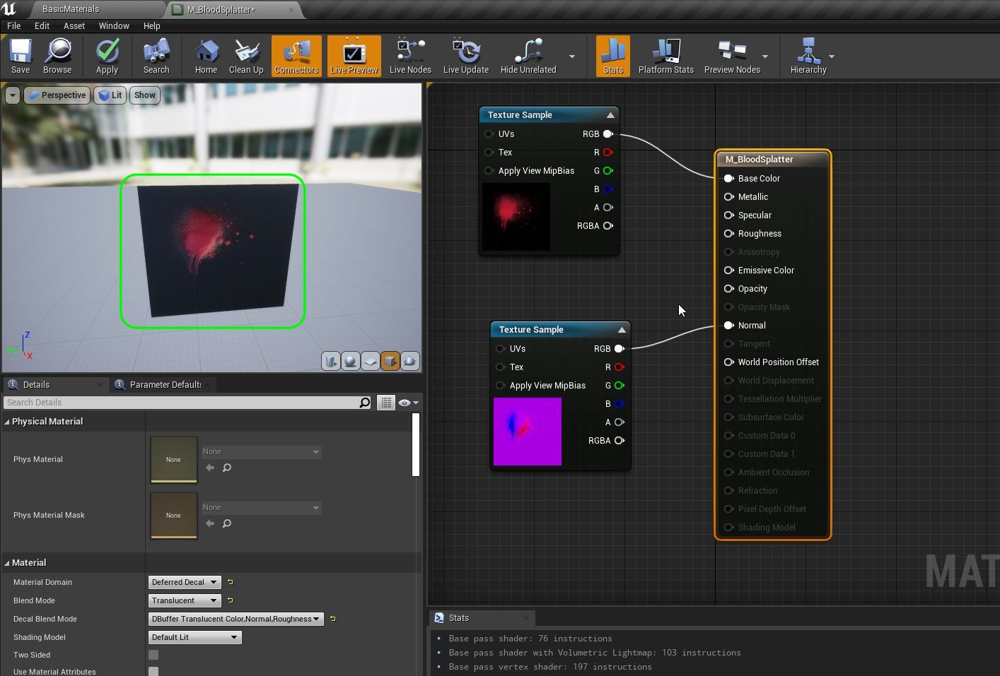

##### `Step 13.`\|`SUU&G`| :large_blue_diamond: :small_blue_diamond: :small_blue_diamond:  :small_blue_diamond: 

There is an alpha channel in the texture so we connect this channel to opacity and voila, black gone. Now press the <kbd>Apply</kbd> button.

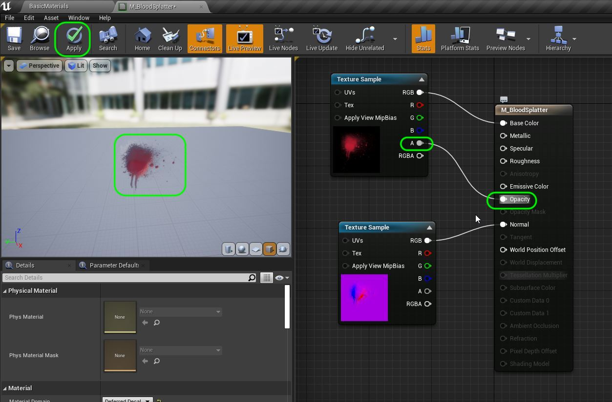

##### `Step 14.`\|`SUU&G`| :large_blue_diamond: :small_blue_diamond: :small_blue_diamond: :small_blue_diamond:  :small_blue_diamond: 

You do not need to do the following as I have already done this for you.  I just wanted to show how to add an Alpha to a file.  Now photoshop doesn't automatically create this 4th Alpha channel for you.  The checkerboard that we think of as an alpha is not a true alpha channel.  Try and save a photoshop file with transparency in a **TGA** format.

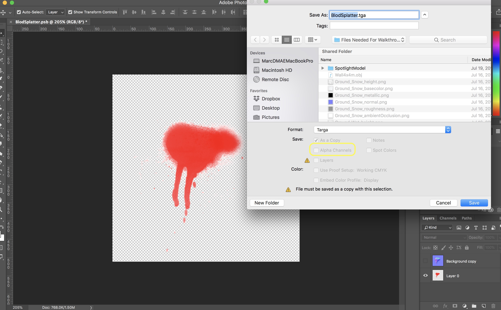

##### `Step 15.`\|`SUU&G`| :large_blue_diamond: :small_orange_diamond: 

Now press Command (Cntrl on PC) Left Click on the Thumnail to add to select the image.  You should see the marching ants around all opaque pixels.

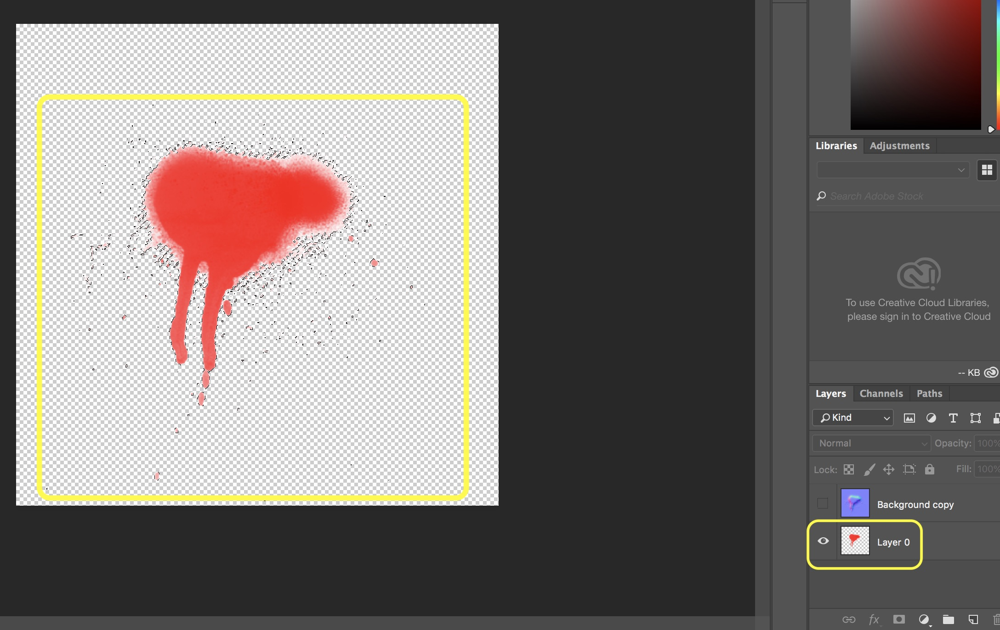

##### `Step 16.`\|`SUU&G`| :large_blue_diamond: :small_orange_diamond:   :small_blue_diamond: 

Now go into the **Channels** tab and press the **Save Channel As Selection** button.

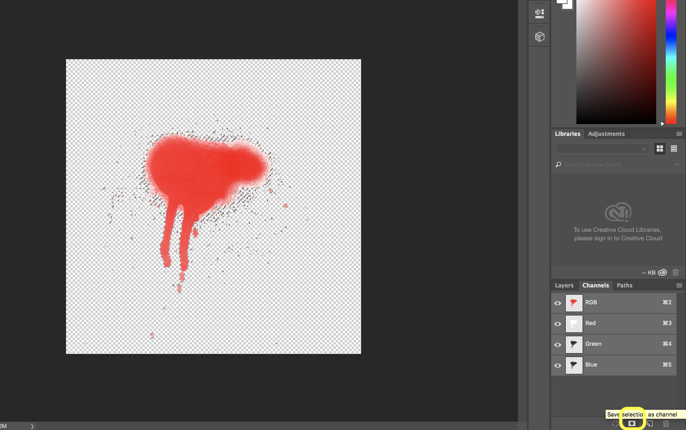

This adds a channel called **Alpha1** and looks like a photoshop mask.

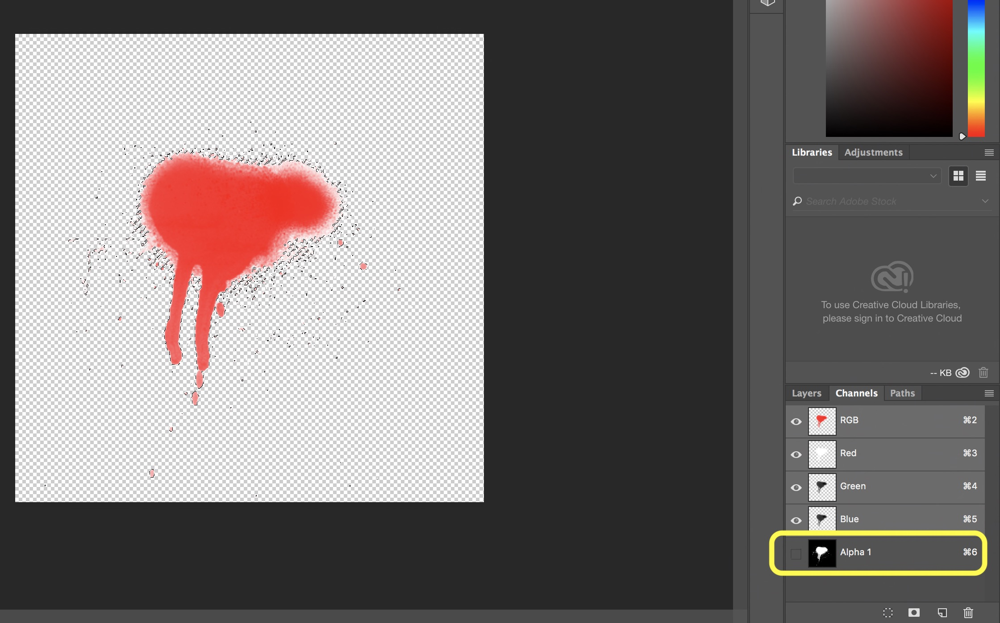

##### `Step 17.`\|`SUU&G`| :large_blue_diamond: :small_orange_diamond: :small_blue_diamond: :small_blue_diamond:

Add a background layer at the bottom and make sure it is pure black (0,  0, 0 RGB). Now you can save the image as a **TGA** with an alpha.

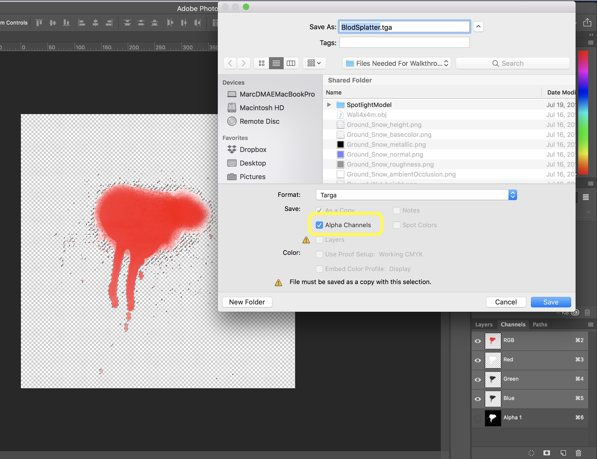

##### `Step 18.`\|`SUU&G`| :large_blue_diamond: :small_orange_diamond: :small_blue_diamond: :small_blue_diamond: :small_blue_diamond:

You can confirm that this channel imported correctly by double clicking the **T_BloodSplatter_DandA** and pressing the **View** drop down and turning all channels off except for Alpha.  You see that you get a channel where white is opaque and black is transparent.

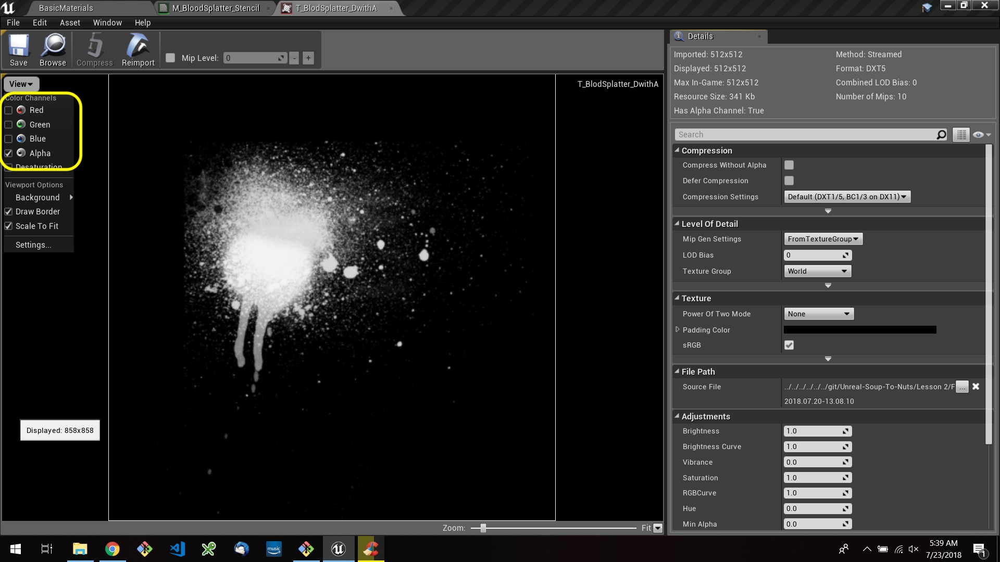

##### `Step 19.`\|`SUU&G`| :large_blue_diamond: :small_orange_diamond: :small_blue_diamond: :small_blue_diamond: :small_blue_diamond: :small_blue_diamond:

Let's go back to the game. You do not need to place this material on a mesh you can apply it to any existing mesh on the level and it will be added on top.  It will create a **Decal** actor in the **World Outliner**.  Just drag the **M_BloodSplatter_Decal** into the level and place next to the shiny wall. Now we do not apply it to a plane, we add the decal to an existing geometry even if it is not flat.  If the decal doesn't show up it is because that the purple arrow on the Decal points towards the surface that you want the decal to be on.  

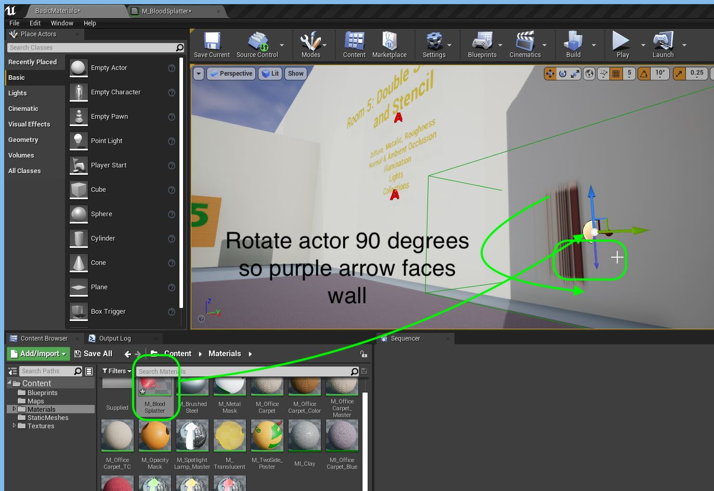

If the purple arrow points to the wrong location rotate it to point to the surface you want the decal on. Position it so the green box overlaps the wall geometry.

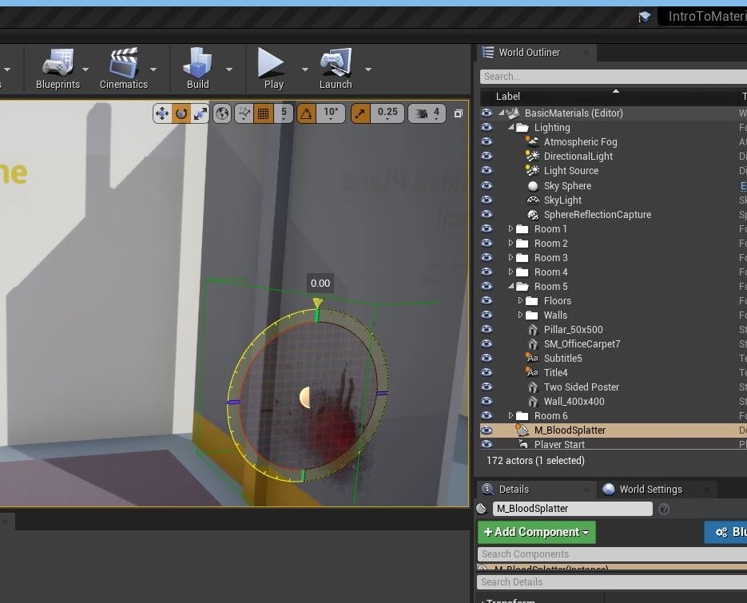

##### `Step 20.`\|`SUU&G`| :large_blue_diamond: :large_blue_diamond:

Adjust the scale of the **Decal** actor so the green box is not too deep.  If it is it will show up on both sides of the wall.  If this was a dynamic blood splatter we would just want it on one side. In my case it is scaling the **X** axis down.

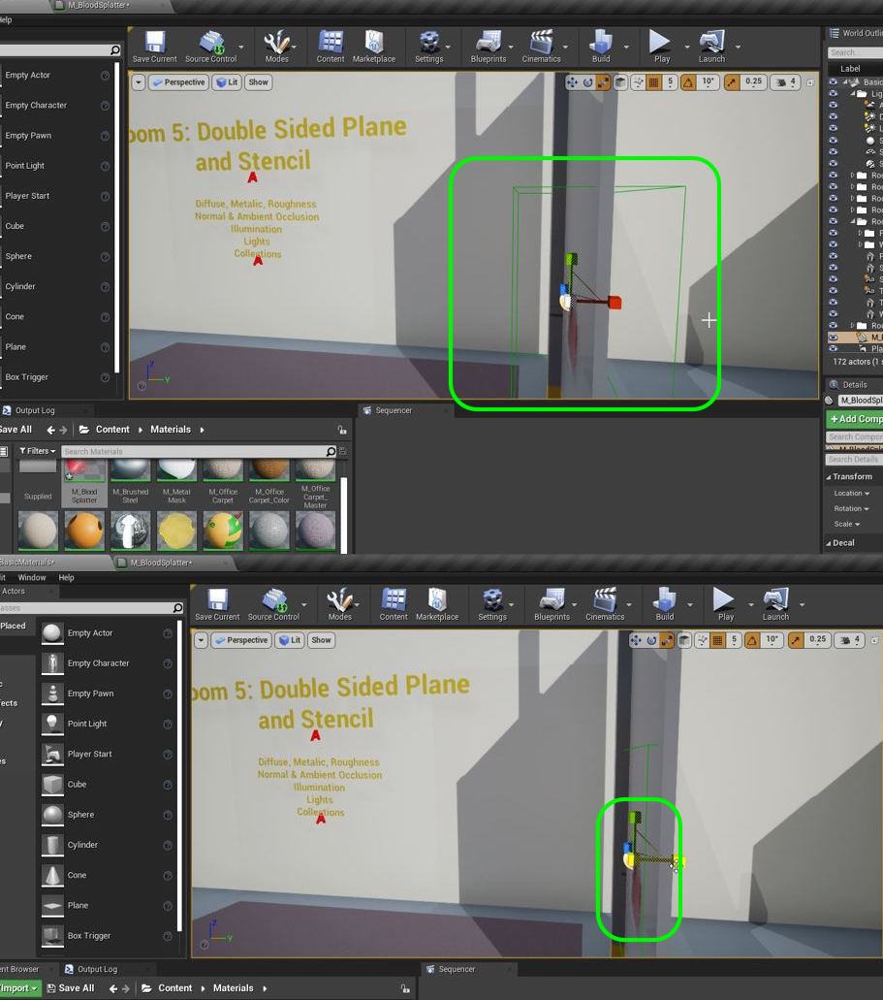

##### `Step 21.`\|`SUU&G`| :large_blue_diamond: :large_blue_diamond: :small_blue_diamond:

Now play the game and look at the decal and make sure nothing bleeds ot the other side of the wall.

https://user-images.githubusercontent.com/5504953/131252525-2d8a7e3e-2f4e-4b9f-b598-e0b119b479e0.mp4

##### `Step 22.`\|`SUU&G`| :large_blue_diamond: :large_blue_diamond: :small_blue_diamond: :small_blue_diamond:

Drop another blood material onto the carpet.  Rotate, position and scale it appropiately.

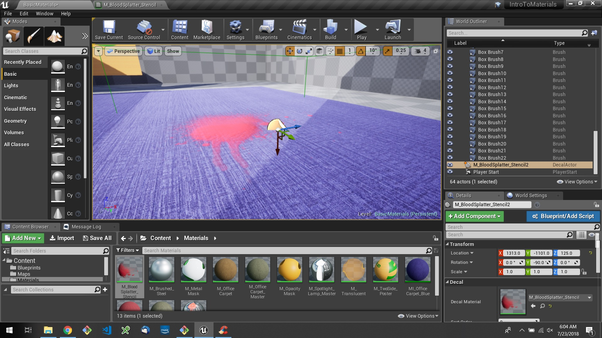

##### `Step 23.`\|`SUU&G`| :large_blue_diamond: :large_blue_diamond: :small_blue_diamond: :small_blue_diamond: :small_blue_diamond:

Play the game and enjoy your decals! Double check that everything is OK.  I forgot to put the two actors in the **Room 5** folder in **World Outliner**.  My blood was also upside down with it dripping upwards which is wrong.  I rotated and repositioned the decal.  

https://user-images.githubusercontent.com/5504953/131253121-26f751dd-6575-409a-9aaa-0be22e15063f.mp4

##### `Step 24.`\|`SUU&G`| :large_blue_diamond: :large_blue_diamond: :small_blue_diamond: :small_blue_diamond: :small_blue_diamond: :small_blue_diamond:

Press **Save All** and update Github by **committing** and **pushing** all the changes made.

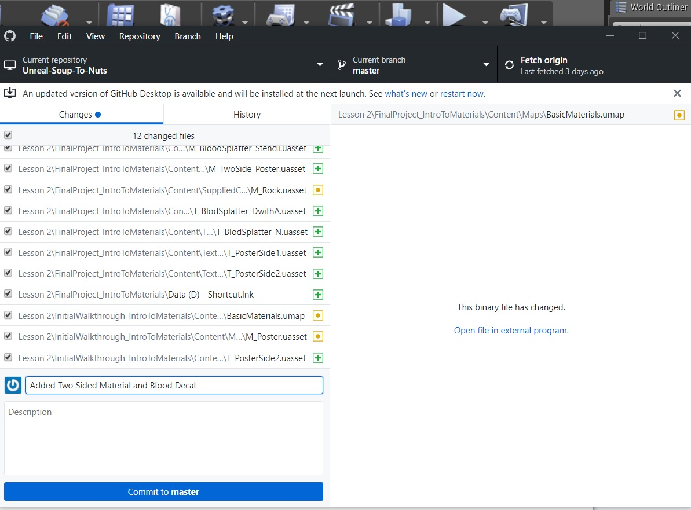

___

| [previous](../two-sided-ii/README.md#user-content-two-sided-material-ii)| [home](../README.md#user-content-ue4-intro-to-materials) | [next](../refract/README.md#user-content-refraction-and-fresnel)|
|---|---|---|
