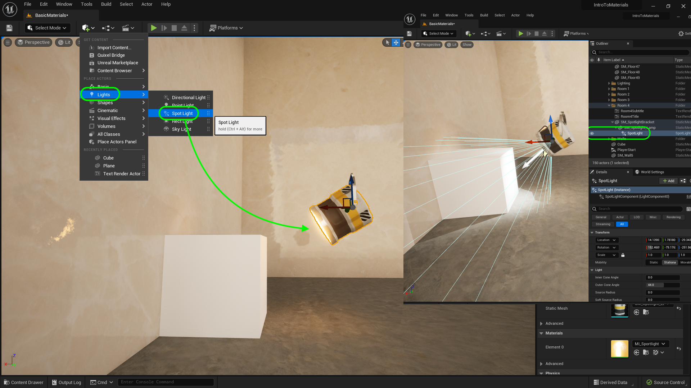
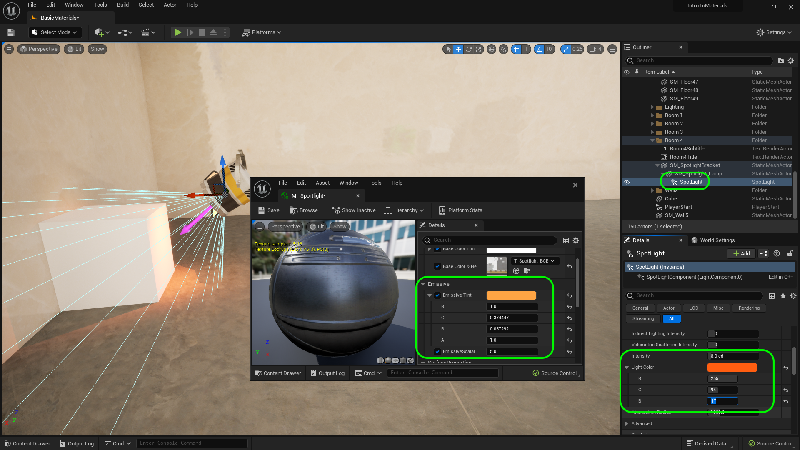

### Emissive Material II

[previous](../illumination/README.md#user-content-emissive-material) • [home](../README.md#user-content-ue5-intro-to-materials) • [next](../two-sided/README.md#user-content-two-sided-material)

Lets add a spotlight to the glowing material to bring this effect to its full realization.

 

---

##### `Step 1.`\|`UE5MAT`|:small_blue_diamond:

So this is not a glowing watch or TV, or fire.  This is a spotlight.  So we will also need a light to really pull off the effect we want.  Add a **Lights | Spotlight** to the scene and make it a child of the **SM_SpotlightLamp** in the **Outliner**. This way the spotlight moves when either the bracket or lamp moves.

##### `Step 2.`\|`UE5MAT`|:small_blue_diamond: :small_blue_diamond: 

Now open up your **MI_Emissive** and try and match the color in the emissive texture with the **Light Color**.  Now the light color uses a scale of 0 to 255 so you will have to multiply all the values in the **Emissive Tint** by 255.  For example my **G** (Green) channel is .374.  So if I multipley .372 by 255 I get  95.37. Also, adjust the **Intensity** to a value that makes sense in the scene for you.

##### `Step 3.`\|`UE5MAT`|:small_blue_diamond: :small_blue_diamond: :small_blue_diamond:

##### `Step 4.`\|`UE5MAT`|:small_blue_diamond: :small_blue_diamond: :small_blue_diamond: :small_blue_diamond:

##### `Step 5.`\|`UE5MAT`| :small_orange_diamond:

##### `Step 6.`\|`UE5MAT`| :small_orange_diamond: :small_blue_diamond:

##### `Step 7.`\|`UE5MAT`| :small_orange_diamond: :small_blue_diamond: :small_blue_diamond:

##### `Step 8.`\|`UE5MAT`| :small_orange_diamond: :small_blue_diamond: :small_blue_diamond: :small_blue_diamond:

##### `Step 9.`\|`UE5MAT`| :small_orange_diamond: :small_blue_diamond: :small_blue_diamond: :small_blue_diamond: :small_blue_diamond:

##### `Step 10.`\|`UE5MAT`| :large_blue_diamond:

##### `Step 11.`\|`UE5MAT`| :large_blue_diamond: :small_blue_diamond: 

##### `Step 12.`\|`UE5MAT`| :large_blue_diamond: :small_blue_diamond: :small_blue_diamond: 

##### `Step 13.`\|`UE5MAT`| :large_blue_diamond: :small_blue_diamond: :small_blue_diamond:  :small_blue_diamond: 

##### `Step 14.`\|`UE5MAT`| :large_blue_diamond: :small_blue_diamond: :small_blue_diamond: :small_blue_diamond:  :small_blue_diamond: 

##### `Step 15.`\|`UE5MAT`| :large_blue_diamond: :small_orange_diamond: 

##### `Step 16.`\|`UE5MAT`| :large_blue_diamond: :small_orange_diamond:   :small_blue_diamond: 

##### `Step 17.`\|`UE5MAT`| :large_blue_diamond: :small_orange_diamond: :small_blue_diamond: :small_blue_diamond:

##### `Step 18.`\|`UE5MAT`| :large_blue_diamond: :small_orange_diamond: :small_blue_diamond: :small_blue_diamond: :small_blue_diamond:

##### `Step 19.`\|`UE5MAT`| :large_blue_diamond: :small_orange_diamond: :small_blue_diamond: :small_blue_diamond: :small_blue_diamond: :small_blue_diamond:

##### `Step 20.`\|`UE5MAT`| :large_blue_diamond: :large_blue_diamond:

##### `Step 21.`\|`UE5MAT`| :large_blue_diamond: :large_blue_diamond: :small_blue_diamond:

<!--  -->

| [previous](../illumination/README.md#user-content-emissive-material)| [home](../README.md#user-content-ue5-intro-to-materials) | [next](../two-sided/README.md#user-content-two-sided-material)|
|---|---|---|
