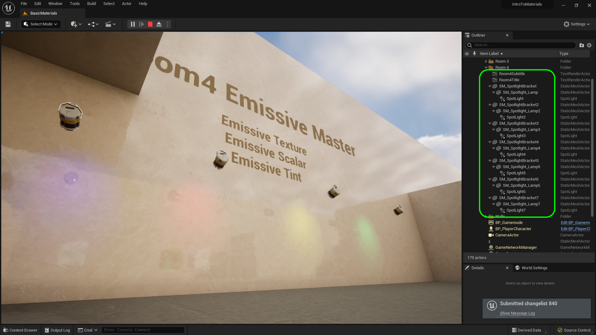

### Emissive Material II

[previous](../illumination/README.md#user-content-emissive-material) • [home](../README.md#user-content-ue5-intro-to-materials) • [next](../two-sided/README.md#user-content-two-sided-material)

Lets add a spotlight to the glowing material to bring this effect to its full realization.

 

---

##### `Step 1.`\|`UE5MAT`|:small_blue_diamond:

##### `Step 2.`\|`UE5MAT`|:small_blue_diamond: :small_blue_diamond: 

Adjust tint NEED SCREENSHOT

##### `Step 3.`\|`UE5MAT`|:small_blue_diamond: :small_blue_diamond: :small_blue_diamond:

https://github.com/LSU-UE5/UE5-Materials/assets/5504953/6fe029c9-adb7-4f50-8e9f-602625606d49

##### `Step 4.`\|`UE5MAT`|:small_blue_diamond: :small_blue_diamond: :small_blue_diamond: :small_blue_diamond:

https://github.com/LSU-UE5/UE5-Materials/assets/5504953/e5c3f12d-47e4-4b3d-88a0-cd0f7269e85b

##### `Step 5.`\|`UE5MAT`| :small_orange_diamond:

##### `Step 6.`\|`UE5MAT`| :small_orange_diamond: :small_blue_diamond:

##### `Step 7.`\|`UE5MAT`| :small_orange_diamond: :small_blue_diamond: :small_blue_diamond:

##### `Step 8.`\|`UE5MAT`| :small_orange_diamond: :small_blue_diamond: :small_blue_diamond: :small_blue_diamond:

##### `Step 9.`\|`UE5MAT`| :small_orange_diamond: :small_blue_diamond: :small_blue_diamond: :small_blue_diamond: :small_blue_diamond:

*

##### `Step 10.`\|`UE5MAT`| :large_blue_diamond:

Now make sure that all the objects are in the **Room 4** folder and rename anything that is generic and can't be understood by the name.

##### `Step 11.`\|`UE5MAT`| :large_blue_diamond: :small_blue_diamond: 

Select the **File | Save All** then press the <kbd>Revision Control</kbd> button and select **Submit Content**.  If you are prompted, select **Check Out** for all items that are not checked out of source control. Update the **Changelist Description** message and with the latest changes. Make sure all the files are correct and press the <kbd>Submit</kbd> button. A confirmation will pop up on the bottom right with a message about a changelist was submitted with a commit number.

<!--  -->

| [previous](../illumination/README.md#user-content-emissive-material)| [home](../README.md#user-content-ue5-intro-to-materials) | [next](../two-sided/README.md#user-content-two-sided-material)|
|---|---|---|
