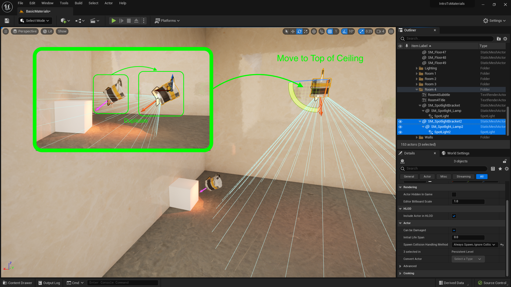
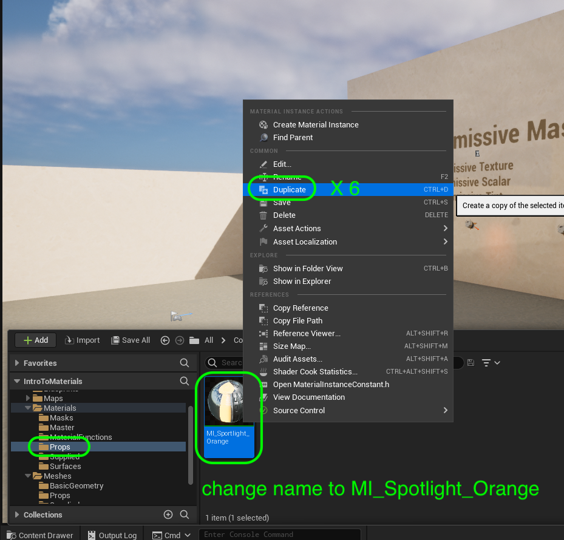

### Emissive Material II

[previous](../illumination/README.md#user-content-emissive-material) • [home](../README.md#user-content-ue5-intro-to-materials) • [next](../two-sided/README.md#user-content-two-sided-material)

Lets add a spotlight to the glowing material to bring this effect to its full realization.

 

---

##### `Step 1.`\|`UE5MAT`|:small_blue_diamond:

##### `Step 2.`\|`UE5MAT`|:small_blue_diamond: :small_blue_diamond: 

Adjust tint NEED SCREENSHOT

##### `Step 3.`\|`UE5MAT`|:small_blue_diamond: :small_blue_diamond: :small_blue_diamond:

##### `Step 4.`\|`UE5MAT`|:small_blue_diamond: :small_blue_diamond: :small_blue_diamond: :small_blue_diamond:

##### `Step 5.`\|`UE5MAT`| :small_orange_diamond:

Now duplicate the bracket, lamp and light and rotate it and move it to the ceiling pointing straight down. Make sure you are moving the location with the bracket and rotating along a single axis on the lamp.  The light should then point in the right direction.

##### `Step 6.`\|`UE5MAT`| :small_orange_diamond: :small_blue_diamond:

Repeat this 5 more times to a have a total of 7 lights in the room.  Point them at the wall and adjust the brightness so they show up correctly.

##### `Step 7.`\|`UE5MAT`| :small_orange_diamond: :small_blue_diamond: :small_blue_diamond:

Ranme **MI_Spotlight** to `MI_Spolight_Orange` (or whatever color your light and glow are). Right click and duplicate this material 6 times. 

##### `Step 8.`\|`UE5MAT`| :small_orange_diamond: :small_blue_diamond: :small_blue_diamond: :small_blue_diamond:

Rename each material instance copy and change both the **Emissive Tint** in the material and the **Light Color** in the spotlight. Name it the new color of the light and glow.  So if you have a yellow light call it `MI_Spotlight_Yellow`.

##### `Step 9.`\|`UE5MAT`| :small_orange_diamond: :small_blue_diamond: :small_blue_diamond: :small_blue_diamond: :small_blue_diamond:

*Press* the <kbd>Play</kbd> button and make sure that the glow matches the color of the light on the wall.  Make any adjustments, like its brightness and get it to look like it matches the environment.

https://user-images.githubusercontent.com/5504953/186139493-95a4de1c-5d3d-49b4-89ef-86b6d03a2315.mp4

##### `Step 10.`\|`UE5MAT`| :large_blue_diamond:

Now make sure that all the objects are in the **Room 4** folder and rename anything that is generic and can't be understood by the name.

##### `Step 11.`\|`UE5MAT`| :large_blue_diamond: :small_blue_diamond: 

Select the **File | Save All** then press the <kbd>Revision Control</kbd> button and select **Submit Content**.  If you are prompted, select **Check Out** for all items that are not checked out of source control. Update the **Changelist Description** message and with the latest changes. Make sure all the files are correct and press the <kbd>Submit</kbd> button. A confirmation will pop up on the bottom right with a message about a changelist was submitted with a commit number.

<!--  -->

| [previous](../illumination/README.md#user-content-emissive-material)| [home](../README.md#user-content-ue5-intro-to-materials) | [next](../two-sided/README.md#user-content-two-sided-material)|
|---|---|---|
