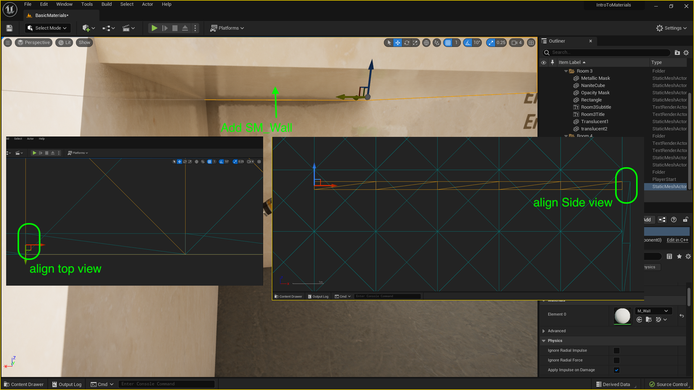
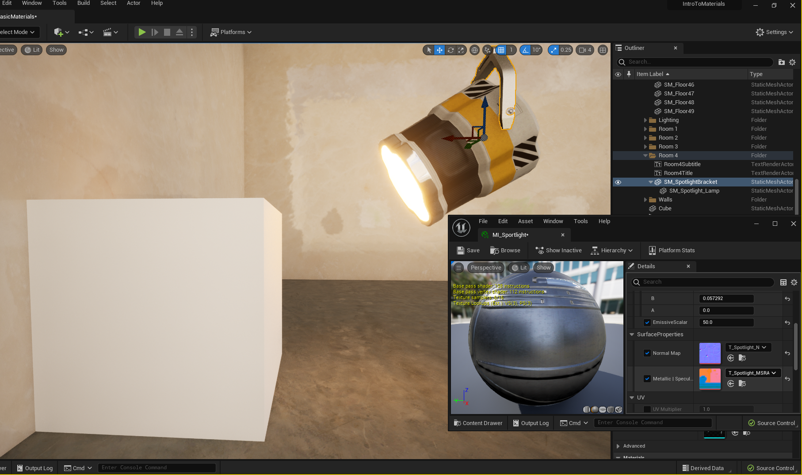

### Emmisive Material

[previous](../translucent/README.md#user-content-translucent-blend-mode) • [home](../README.md#user-content-ue4-intro-to-materials) • [next](../two-sided/README.md#user-content-two-sided-material)

Now for some objects in the game, they will also be a light source.  Think of the sun, a lamp, a TV set etc...  So our materials can handle light blooms and glow to create the illusion that it is illumiating in game.  We will create a new master material and material function to handle this extra mask that will be used to indicate what part of the model will emit light.

 

---

##### `Step 1.`\|`UE5MAT`|:small_blue_diamond:

We will be using a spotlight which will have a glow on the lightbulb as well as a light placed in it.  Create a new folder called `Props` inside the **Textures** folder. We need to download **[T_Spotlight_BCE.png](../Assets/T_Spotlight_BCE.png)**, **[T_Spotlight_N.png](../Assets/T_Spotlight_N.png)** and **[T_Spotlight_MSRAO.png](../Assets/T_Spotlight_MSRAO.png)**. Drag them into the textures folder. Double check that the engine recognized the normal map of **T_Spotlight_N** and is using normal map image compression.

##### `Step 2.`\|`UE5MAT`|:small_blue_diamond: :small_blue_diamond: 

Create a new folder in **Meshes** called `Props`. Drag the **[SM_Spotlight.fbx](../Assets/SM_Spotlight.fbx)** into the **Meshes | Props** folder.  The emissive channel works on nanite models and we need to create a collision volume for these models.  Also, do not create a default material. Press the <kbd>Import All</kbd> button.

##### `Step 3.`\|`UE5MAT`|:small_blue_diamond: :small_blue_diamond: :small_blue_diamond:

You should have a bracket and lamp mesh.  They are separate meshes so we can rotate the lamp at different angles. Rename them to `SM_SpotlightBracket` and `SM_SpotlightLamp`.

##### `Step 4.`\|`UE5MAT`|:small_blue_diamond: :small_blue_diamond: :small_blue_diamond: :small_blue_diamond:

Go to the **Materials | Master** folder and right click on **M_Basic** and select **Create Material Instance**. Call this new material instance `MI_BrushedSteel`. Move it to the **Material | Surfaces** folder.

##### `Step 5.`\|`UE5MAT`| :small_orange_diamond:

Open up **MI_BrushedSteel** Add change the **Base Color** from white to  `.913`, `.921` and `.915` as the RGB values. Change **Metalic** to `1.0`, **Specular** to `0.3` and **Roughness** to `0.4`.

##### `Step 6.`\|`UE5MAT`| :small_orange_diamond: :small_blue_diamond:

Double click the **SM_SpotlightBracket** static mesh. Assign the material you just created **MI_BrushedSteel**.

##### `Step 7.`\|`UE5MAT`| :small_orange_diamond: :small_blue_diamond: :small_blue_diamond:

Right click **MaterialFunctions | MF_Texture** and select duplicate.  Call it `MF_Emissive`.

##### `Step 8.`\|`UE5MAT`| :small_orange_diamond: :small_blue_diamond: :small_blue_diamond: :small_blue_diamond:

Now the emissive mask is going to be in the **Alpha** channel of the base color texture.  So add a new **Output** node and call it `Emissive` and set the **Sort Priority** to `4`. 

##### `Step 9.`\|`UE5MAT`| :small_orange_diamond: :small_blue_diamond: :small_blue_diamond: :small_blue_diamond: :small_blue_diamond:

Now that we have added an emissive pin we need to move the priority for the **Output Normal** to `5` and **Ambient Occlusion** to `6 `.

##### `Step 10.`\|`UE5MAT`| :large_blue_diamond:

Go to the **Materials | Master** folder and create a new material named `M_EmissiveTexture`.  Open it up and add a **MF_UVs** and a **MF_Emissive**.  Connect the **UV** to the **Emissive** node.  Then connect all the output pins of the **MF_Emissive** node.  These should be the same as the regular texture but with the addition of the emissive mask.

##### `Step 11.`\|`UE5MAT`| :large_blue_diamond: :small_blue_diamond: 

Go back to the **Master** folder and right click on **M_EmissiveTexture** and select **Create Material Instance**. Call it `MI_Spotlight`.  Create a new folder in **Material** called `Props` and move **MI_Spotlight** into this new folder.

##### `Step 12.`\|`UE5MAT`| :large_blue_diamond: :small_blue_diamond: :small_blue_diamond: 

Open up **SM_Spotlight_Lamp** and assign to **Material Slots | Element 0** `MI_Spotlight`.  Assign `T_Spotlight_BCE` to **Base Color & Emissive**.  Assign `T_Spotlight_N` to **Normal Map**.  Finally assign `T_Spotlight_MSRA` to **Metallic | Specular | Roughness | AO**.

##### `Step 13.`\|`UE5MAT`| :large_blue_diamond: :small_blue_diamond: :small_blue_diamond:  :small_blue_diamond: 

Go to Room 4 and drag both meshes (with both selected) into the game (**SM_SpotlightBracket** and **SM_SpotlightLamp**). By selecting both the position will be correct relative to each other with the lap in the hinge correctly.  You can press **F** for focus to get the camera close to where they go in the scene.  Move them to be close to the wall.  Rotate the lamp part to point at the wall so we can have a light shine on it.

##### `Step 14.`\|`UE5MAT`| :large_blue_diamond: :small_blue_diamond: :small_blue_diamond: :small_blue_diamond:  :small_blue_diamond: 

Now it is easier to control the lamp and bracket if we have a proper parent child relationship.  So if we move or rotate the bracket we want the lamp to move and rotate.  But if we rotate the lamp we want it to rotate seperately.

We can just drag **SM_SpotlightLamp** on top of **SM_SpotlightBracket** in the outliner and the lamp should be indented (a child of the bracket).

##### `Step 15.`\|`UE5MAT`| :large_blue_diamond: :small_orange_diamond: 

Now when you move or rotate the bracket both objects move, but you can control the lamp independantly.  

https://user-images.githubusercontent.com/5504953/186121713-0352440d-7b82-4d49-91ce-b7a0c3679685.mp4

##### `Step 16.`\|`UE5MAT`| :large_blue_diamond: :small_orange_diamond:   :small_blue_diamond: 

Now we want to also be able to tint the color of the emission.  So lets open up **MF_Emission** and add a **Vector Pamameter** node that we will call `Emissive Test`.  Make this **Group** `Emissive` and **Sort Priority** `3`.  Create a **Scalar Parameter** node and call it `Emissive Scalar`.  Make the default value `1`, **Group `Emissive` and **Sort Priority** `3`.

Multiply the **Tint** by the **Emissive Color**.  Multiply the output of this multiply by the emissive mask which is the **A** (alpha) channel of the **Base Color & Emissive** texture. Send the output of the second multiply to the **Output Emissive** node.

##### `Step 17.`\|`UE5MAT`| :large_blue_diamond: :small_orange_diamond: :small_blue_diamond: :small_blue_diamond:

Now open up **MI_Spotlight** and adjust the **Emissive Scalar**.  Now with the illumination channel you can go beyond 0 to 1.  You can set the value into the 100s (or higher maybe)?  So you can affect the brightness of the source from the illumination by cranking this number up.  If you tint the light though, a heavily overdriven emission will appear white (all light get closer to white when brighter) so be judicious.

https://user-images.githubusercontent.com/5504953/186125632-571afd31-eaa6-4b78-89ac-6aa6c3b2e973.mp4

##### `Step 18.`\|`UE5MAT`| :large_blue_diamond: :small_orange_diamond: :small_blue_diamond: :small_blue_diamond: :small_blue_diamond:

Now lets drag a wall piece to act as a ceiling of Room 4 to give it a bit of shade to see the glow a bit better.  Go to **Meshes | Supplied** and add a **SM_Wall** to the level.  Rotate it and align it to the top of the edge wall piece to act as a ceiling.

##### `Step 19.`\|`UE5MAT`| :large_blue_diamond: :small_orange_diamond: :small_blue_diamond: :small_blue_diamond: :small_blue_diamond: :small_blue_diamond:

Now perss the **Add Actor** button and search for a **Cube**.  Add this to this under the ceiling then move the light close by.  Adjust the **Brightness Scalar** so you can see the glow of the illumination on the cube. Now this is new to Unreal Engine 5, in the previous version the illuminations did not project light into the world.

##### `Step 20.`\|`UE5MAT`| :large_blue_diamond: :large_blue_diamond:

Now move the **Player Start** actor and rotate it so you start at the center of room 4.

##### `Step 21.`\|`UE5MAT`| :large_blue_diamond: :large_blue_diamond: :small_blue_diamond:

*Press* the <kbd>Play</kbd> button and notice that you do not see the glow at a distance.  It clips in as you get closer to it.  Now this might be acceptable if this was a TV set but this is a stage light.  We don't want to crank it up so bright so it creates a spotlight but the color will always be white and it clips in.  In the next page we will fix this.

https://user-images.githubusercontent.com/5504953/186129871-384ce94a-6ec9-4c99-8917-d8bc12526a53.mp4

<!--  -->

| [previous](../translucent/README.md#user-content-translucent-blend-mode)| [home](../README.md#user-content-ue4-intro-to-materials) | [next](../two-sided/README.md#user-content-two-sided-material)|
|---|---|---|
