### Emmisive Material

[previous](../translucent/README.md#user-content-translucent-blend-mode) • [home](../README.md#user-content-ue4-intro-to-materials) • [next](../two-sided/README.md#user-content-two-sided-material)

Now for some objects in the game, they will also be a light source.  Think of the sun, a lamp, a TV set etc...  So our materials can handle light blooms and glow to create the illusion that it is illumiating in game.  We will create a new master material and material function to handle this extra mask that will be used to indicate what part of the model will emit light.

 

---

##### `Step 1.`\|`UE5MAT`|:small_blue_diamond:

We will be using a spotlight which will have a glow on the lightbulb as well as a light placed in it.  Create a new folder called `Props` inside the **Textures** folder. We need to download **[T_Spotlight_BCE.png](../Assets/T_Spotlight_BCE.png)**, **[T_Spotlight_N.png](../Assets/T_Spotlight_N.png)** and **[T_Spotlight_MSRAO.png](../Assets/T_Spotlight_MSRAO.png)**. Drag them into the textures folder. Double check that the engine recognized the normal map of **T_Spotlight_N** and is using normal map image compression.

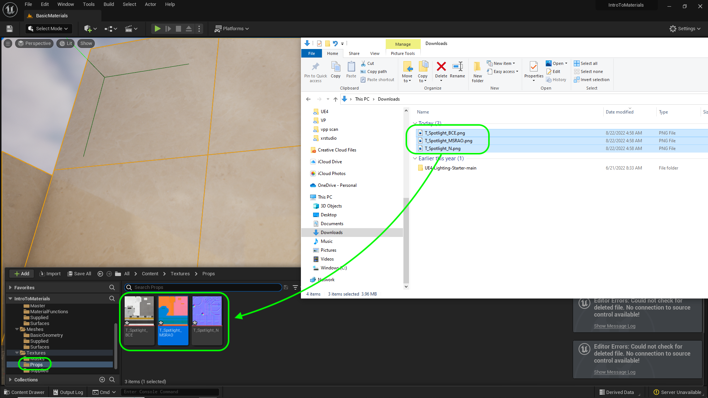

##### `Step 2.`\|`UE5MAT`|:small_blue_diamond: :small_blue_diamond: 

Create a new folder in **Meshes** called `Props`. Drag the **[SM_Spotlight.fbx](../Assets/SM_Spotlight.fbx)** into the **Meshes | Props** folder.  The emissive channel works on nanite models and we need to create a collision volume for these models.  Also, do not create a default material. Press the <kbd>Import All</kbd> button.

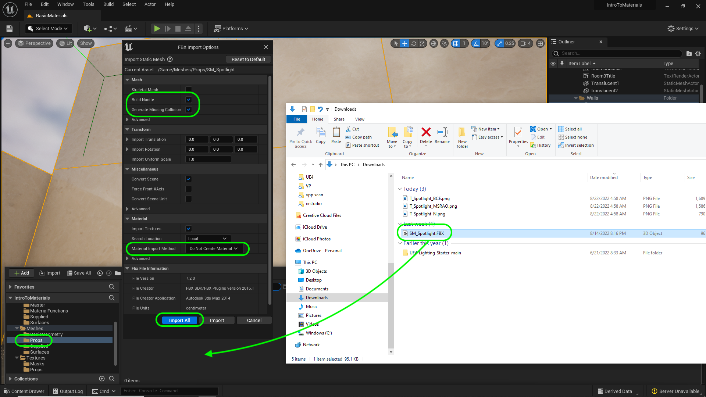

##### `Step 3.`\|`UE5MAT`|:small_blue_diamond: :small_blue_diamond: :small_blue_diamond:

You should have a bracket and lamp mesh.  They are separate meshes so we can rotate the lamp at different angles. Rename them to `SM_SpotlightBracket` and `SM_SpotlightLamp`.

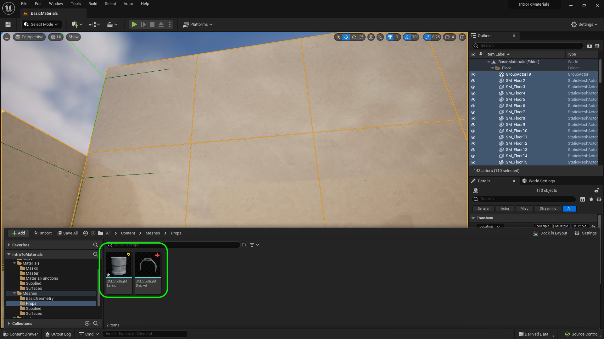

##### `Step 4.`\|`UE5MAT`|:small_blue_diamond: :small_blue_diamond: :small_blue_diamond: :small_blue_diamond:

Go to the **Materials | Master** folder and right click on **M_Basic** and select **Create Material Instance**. Call this new material instance `MI_BrushedSteel`. Move it to the **Material | Surfaces** folder.

##### `Step 5.`\|`UE5MAT`| :small_orange_diamond:

Open up **MI_BrushedSteel** Add change the **Base Color** from white to  `.913`, `.921` and `.915` as the RGB values. Change **Metalic** to `1.0`, **Specular** to `0.3` and **Roughness** to `0.4`.

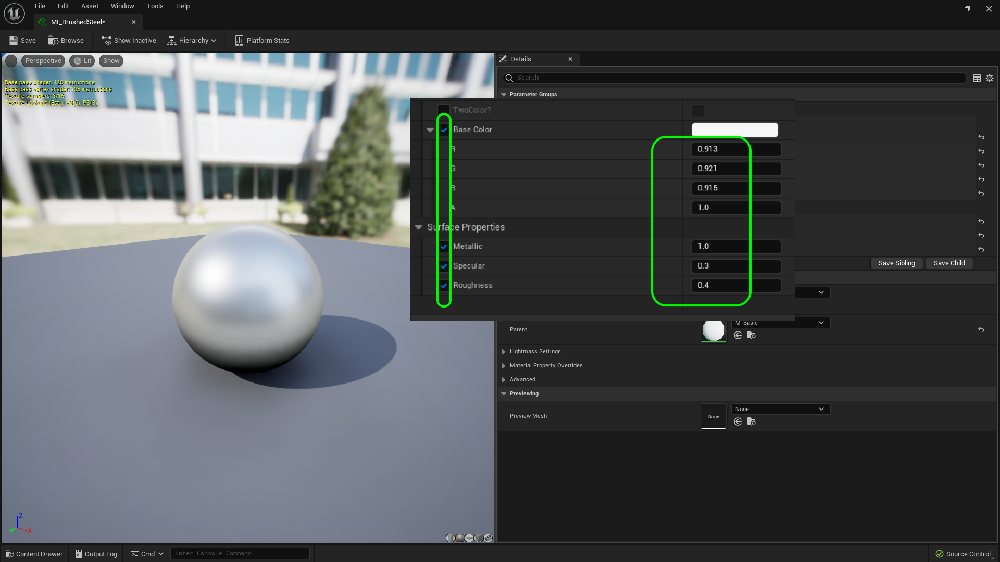

##### `Step 6.`\|`UE5MAT`| :small_orange_diamond: :small_blue_diamond:

Double click the **SM_SpotlightBracket** static mesh. Assign the material you just created **MI_BrushedSteel**.

##### `Step 7.`\|`UE5MAT`| :small_orange_diamond: :small_blue_diamond: :small_blue_diamond:

Right click **MaterialFunctions | MF_Texture** and select duplicate.  Call it `MF_Emissive`.

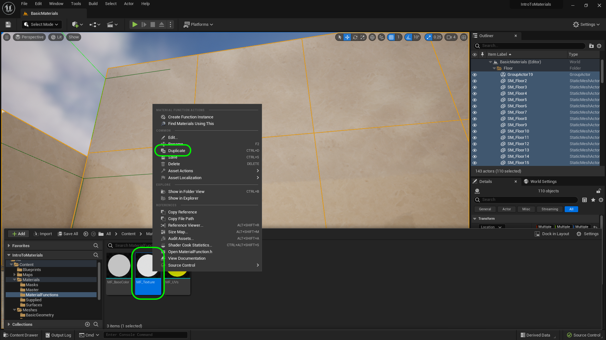

##### `Step 8.`\|`UE5MAT`| :small_orange_diamond: :small_blue_diamond: :small_blue_diamond: :small_blue_diamond:

Now the emissive mask is going to be in the **Alpha** channel of the base color texture.  So add a new **Output** node and call it `Emissive` and set the **Sort Priority** to `4`. 

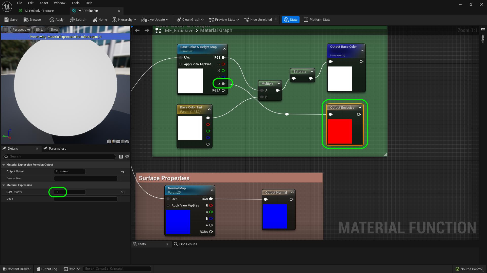

##### `Step 9.`\|`UE5MAT`| :small_orange_diamond: :small_blue_diamond: :small_blue_diamond: :small_blue_diamond: :small_blue_diamond:

Now that we have added an emissive pin we need to move the priority for the **Output Normal** to `5` and **Ambient Occlusion** to `6 `.

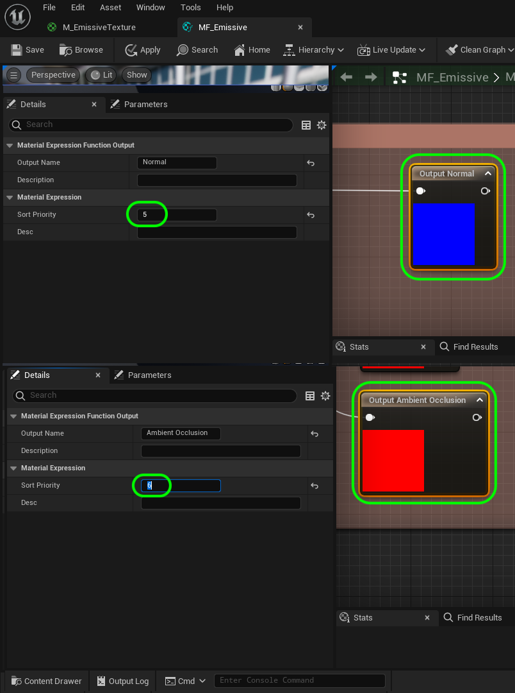

##### `Step 10.`\|`UE5MAT`| :large_blue_diamond:

Go to the **Materials | Master** folder and create a new material named `M_EmissiveTexture`.  Open it up and add a **MF_UVs** and a **MF_Emissive**.  Connect the **UV** to the **Emissive** node.  Then connect all the output pins of the **MF_Emissive** node.  These should be the same as the regular texture but with the addition of the emissive mask.

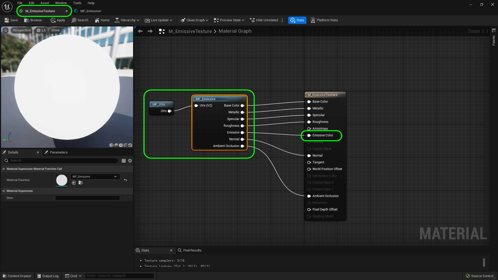

##### `Step 11.`\|`UE5MAT`| :large_blue_diamond: :small_blue_diamond: 

Go back to the **Master** folder and right click on **M_EmissiveTexture** and select **Create Material Instance**. Call it `MI_Spotlight`.  Create a new folder in **Material** called `Props` and move **MI_Spotlight** into this new folder.

##### `Step 12.`\|`UE5MAT`| :large_blue_diamond: :small_blue_diamond: :small_blue_diamond: 

Open up **SM_Spotlight_Lamp** and assign to **Material Slots | Element 0** `MI_Spotlight`.  Assign `T_Spotlight_BCE` to **Base Color & Emissive**.  Assign `T_Spotlight_N` to **Normal Map**.  Finally assign `T_Spotlight_MSRA` to **Metallic | Specular | Roughness | AO**.

##### `Step 13.`\|`UE5MAT`| :large_blue_diamond: :small_blue_diamond: :small_blue_diamond:  :small_blue_diamond: 

Go to Room 4 and drag both meshes (with both selected) into the game (**SM_SpotlightBracket** and **SM_SpotlightLamp**). By selecting both the position will be correct relative to each other with the lap in the hinge correctly.  You can press **F** for focus to get the camera close to where they go in the scene.  Move them to be close to the wall.  Rotate the lamp part to point at the wall so we can have a light shine on it.

##### `Step 14.`\|`UE5MAT`| :large_blue_diamond: :small_blue_diamond: :small_blue_diamond: :small_blue_diamond:  :small_blue_diamond: 

Now it is easier to control the lamp and bracket if we have a proper parent child relationship.  So if we move or rotate the bracket we want the lamp to move and rotate.  But if we rotate the lamp we want it to rotate seperately.

We can just drag **SM_SpotlightLamp** on top of **SM_SpotlightBracket** in the outliner and the lamp should be indented (a child of the bracket).

##### `Step 15.`\|`UE5MAT`| :large_blue_diamond: :small_orange_diamond: 

Now when you move or rotate the bracket both objects move, but you can control the lamp independantly.  

https://user-images.githubusercontent.com/5504953/186121713-0352440d-7b82-4d49-91ce-b7a0c3679685.mp4

##### `Step 16.`\|`UE5MAT`| :large_blue_diamond: :small_orange_diamond:   :small_blue_diamond: 

Now we want to also be able to tint the color of the emission.  So lets open up **MF_Emission** and add a **Vector Pamameter** node that we will call `Emissive Test`.  Make this **Group** `Emissive` and **Sort Priority** `3`.  Create a **Scalar Parameter** node and call it `Emissive Scalar`.  Make the default value `1`, **Group `Emissive` and **Sort Priority** `3`.

##### `Step 17.`\|`UE5MAT`| :large_blue_diamond: :small_orange_diamond: :small_blue_diamond: :small_blue_diamond:

Now illumination on a bright light source like a stage light gets very bright. And in Unreal to have a real bloom on the light you need a value higher than 1. Lets Add a **Scalar Parameter** and call it `Illumination Scalar` that can be adjusted and multiply the mask. Set the default to `6` and connect the nodes. Add a **Multiply** node and multiply the **Emissive** texture by the **Emissive Scalar** and reconnect to the **Emmisive Color** pin to the output of the **Multiply** pin. Press the <kbd>Apply</kbd> button.

Lets  parent Base Lamp to the Bracket.  This way moving the Bracket parent will move the base with it. This will stop up from accidentally separating the model.  Wherever the bracket goes the lamp follows.

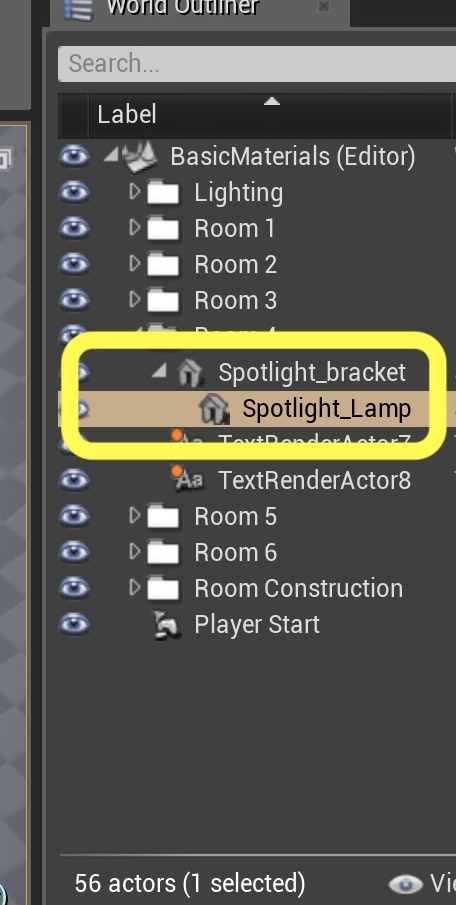

This illumination will not cast a spotlight.  We need to add one to this grouping. Now go to the **Place Actors** tab in the main menu and select **Lights**.  Drag a **Spot Light** and place it over the lamp in the scene.

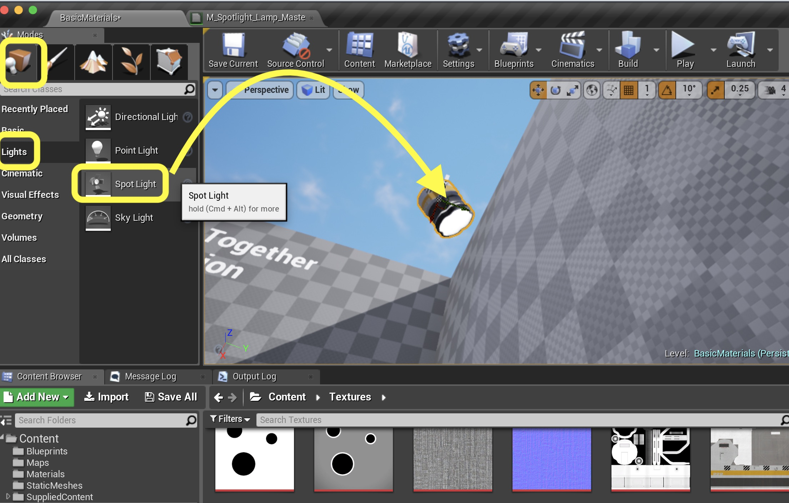

Parent the spotlight to the Lamp.  This way when you move the bracket it will move all the geometry and light and leave them in the right position but currently at the wrong angle.

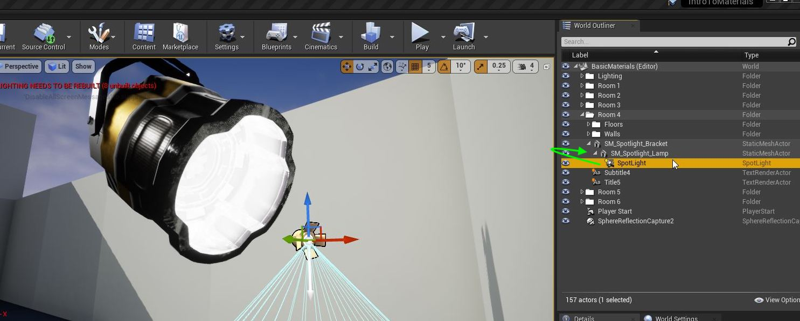

Now click on the newly created spotlight in the scene and click on it.  You should see the rays and they don't match the light. They point straight down.  Lets fix this.

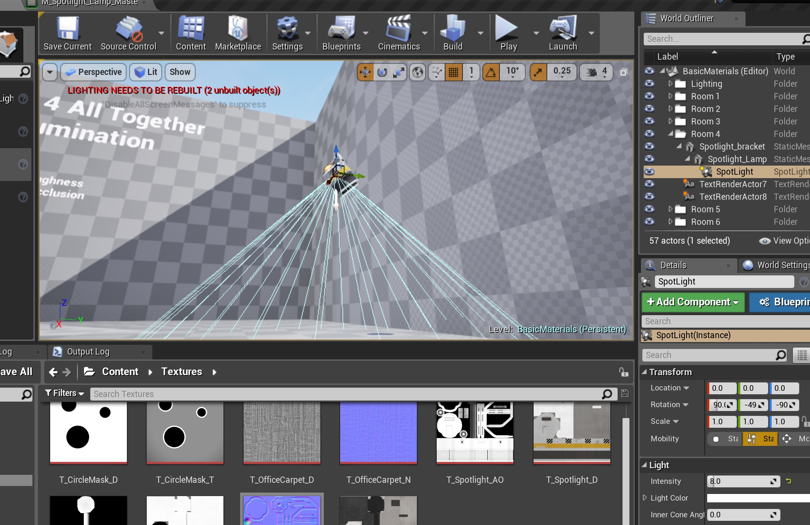

##### `Step 18.`\|`UE5MAT`| :large_blue_diamond: :small_orange_diamond: :small_blue_diamond: :small_blue_diamond: :small_blue_diamond:

Use the **Rotation** tool to position the light to match visually.  Also use the **Translate** tool to make sure it is located in the middle of the light.

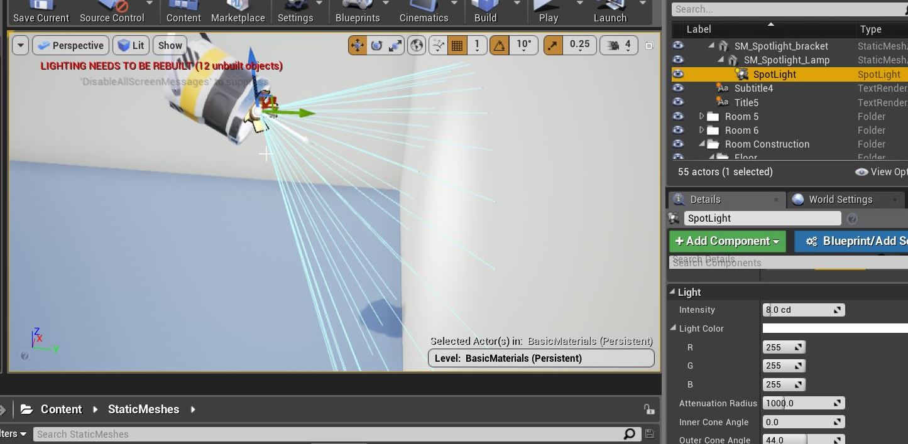

##### `Step 19.`\|`UE5MAT`| :large_blue_diamond: :small_orange_diamond: :small_blue_diamond: :small_blue_diamond: :small_blue_diamond: :small_blue_diamond:

Since we have the game in full daytime with no interiors lets shade this area a bit. Go to **StaticMeshes** and drag and drop **SM_Outside_Wall_EW** and rotate it to be on the ceiling above the lamp in **Room 4**.

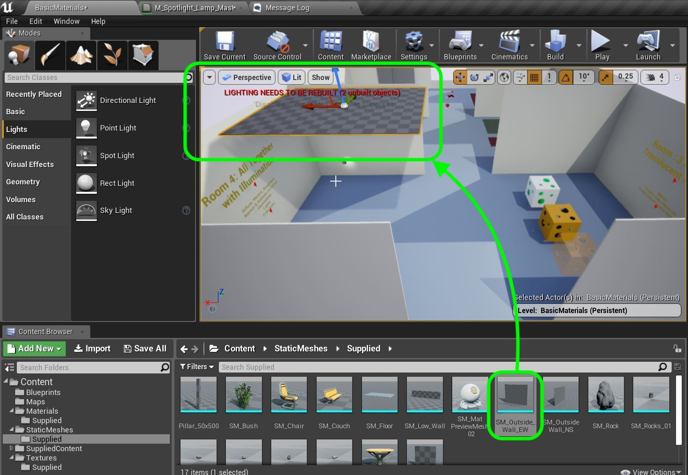

##### `Step 20.`\|`UE5MAT`| :large_blue_diamond: :large_blue_diamond:

Go into **Top** view and adjust it it place so it is perfectly aligned in the corner. Make sure all the static meshes for room 4 are in the correct folder.

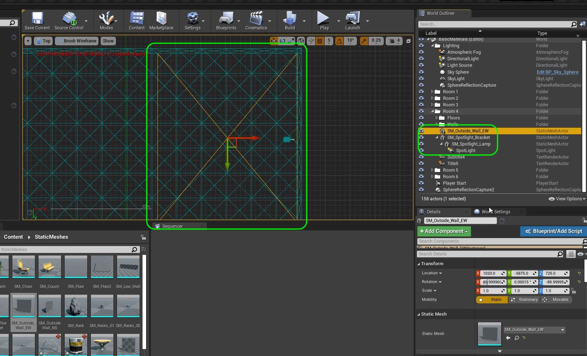

##### `Step 21.`\|`UE5MAT`| :large_blue_diamond: :large_blue_diamond: :small_blue_diamond:

Go to **Materials | Supplied** and add drag and drop the **M_Basic_Wall** material over this ceiling piece in the level.  

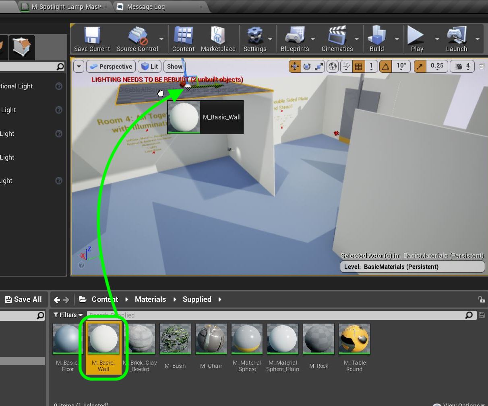

##### `Step 22.`\|`UE5MAT`| :large_blue_diamond: :large_blue_diamond: :small_blue_diamond: :small_blue_diamond:

Rename wall mesh to indicate roof. Press the **Build** button re rebuild the lighting.

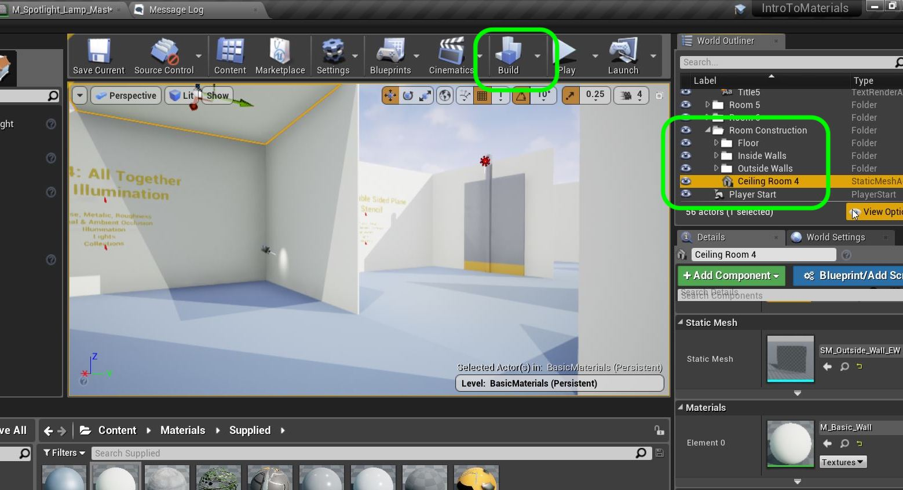

##### `Step 23.`\|`UE5MAT`| :large_blue_diamond: :large_blue_diamond: :small_blue_diamond: :small_blue_diamond: :small_blue_diamond:

Now since there is no reflection capture the very reflective lamp is black as it is reflecting a black map.  We need to add a **Sphere Reflection Capture** actor in front of the lamp an dpress **Build | Build Reflection Captures**.  Put that object in the **Room 4** folder and now we should see the lamp!

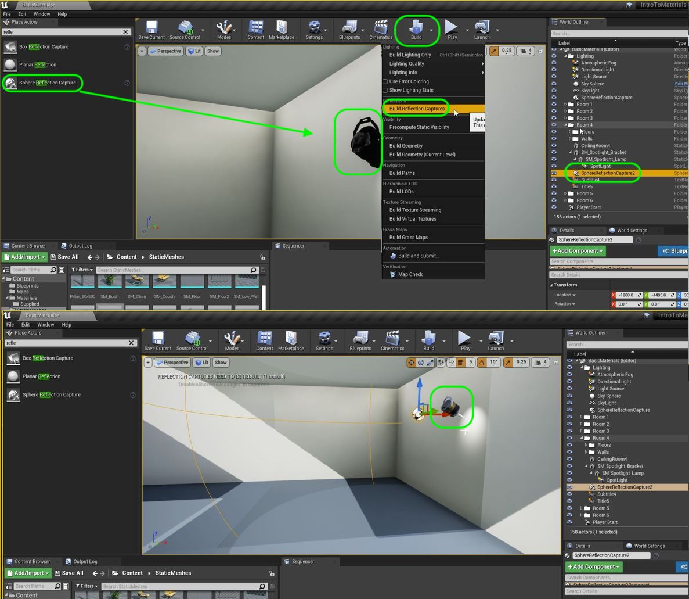

##### `Step 24.`\|`UE5MAT`| :large_blue_diamond: :large_blue_diamond: :small_blue_diamond: :small_blue_diamond: :small_blue_diamond: :small_blue_diamond:

Play the level and look at the light cast in the game.

https://user-images.githubusercontent.com/5504953/131232591-309f5c68-5e70-4a41-801e-9443e88667fa.mp4

##### `Step 25.`\|`UE5MAT`| :large_blue_diamond: :large_blue_diamond: :small_orange_diamond:

Now what if I want to create another lamp but change the color to red.  What would I do? First we need a variable to change the color of the emissive light source. So add a **Vector Parameter** to the **M_Spotlight_Master** material and call it `Light Emissive Color`.

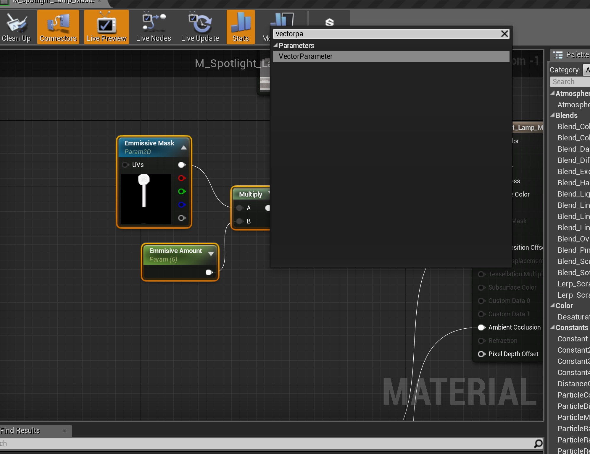

##### `Step 26.`\|`UE5MAT`| :large_blue_diamond: :large_blue_diamond: :small_orange_diamond: :small_blue_diamond:

Make the **Light Emissive Color** node `1, 1, 1` so it won't tint anything we have already created (mulitplying by 1 does nothing). Now add another **Multiply** Node. Connect the output of the first **Multiply** into **A** of the second.  Output the newly created **Vector Parameter** into the **B** node of the second **Multiply**.  Output the second **Multiply** into the **Emissive Color** node of the master material node. Press the <kbd>Apply</kbd> button.

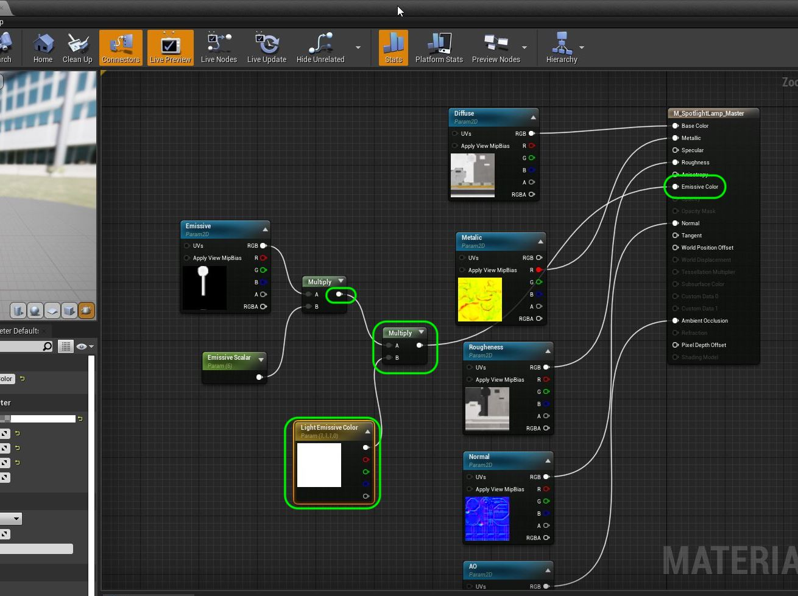

##### `Step 27.`\|`UE5MAT`| :large_blue_diamond: :large_blue_diamond: :small_orange_diamond: :small_blue_diamond: :small_blue_diamond:

Create 3 material instances and put three lights in the room with different colors. Make sure you change the color in each material instance and in the spotlight color as well.  Set them up to look as nice as possible.

https://user-images.githubusercontent.com/5504953/131233164-f424fa9d-337f-4dba-8a02-7b31519ae49e.mp4

##### `Step 28.`\|`UE5MAT`| :large_blue_diamond: :large_blue_diamond: :small_orange_diamond: :small_blue_diamond: :small_blue_diamond: :small_blue_diamond:

OK, now lets finish up this section by savin our work and uploading it to GitHub.  Press **File | Save All** then **Source Conrol | Submit to Source Control...** and add a description.  Press the <kbd>Submit</kbd> button.  Open up **GitHub Desktop** and **Push** the commited work.

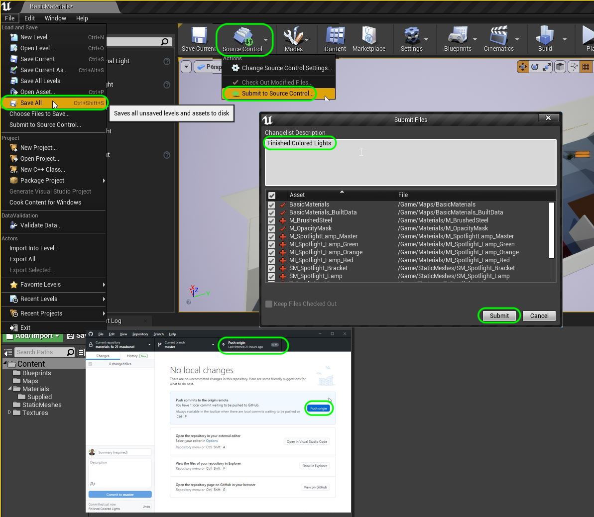

<!--  -->

| [previous](../translucent/README.md#user-content-translucent-blend-mode)| [home](../README.md#user-content-ue4-intro-to-materials) | [next](../two-sided/README.md#user-content-two-sided-material)|
|---|---|---|
