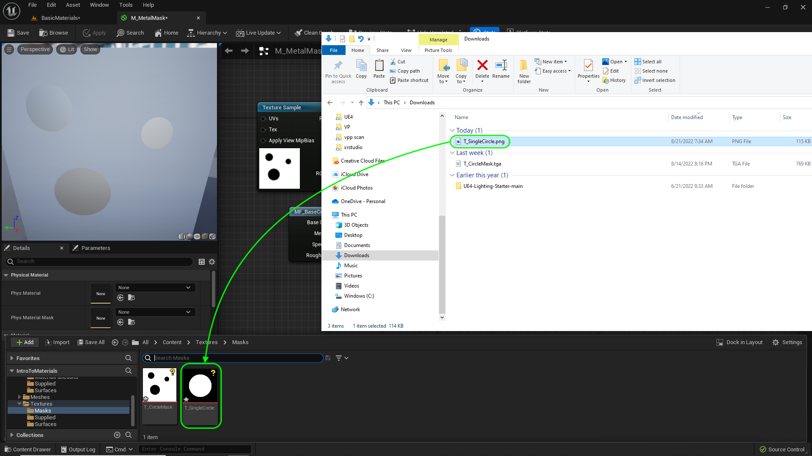
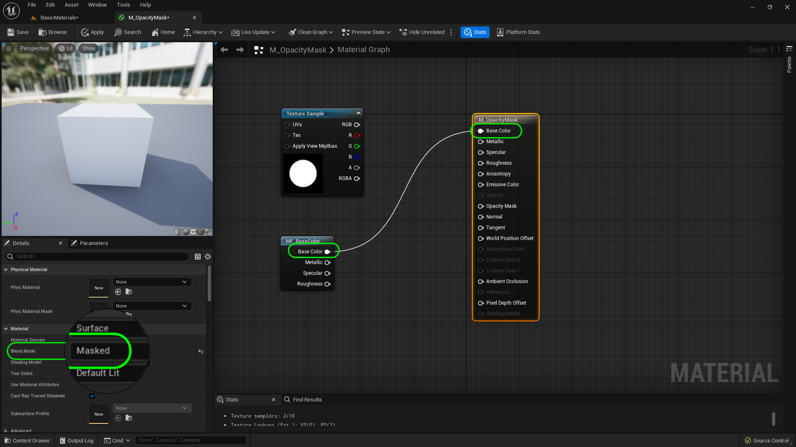

### Masks, Opacity & Translucent

[previous](../color-math/README.md#user-content-material-color-math) • [home](../README.md#user-content-ue4-intro-to-materials) • [next](../translucent/README.md#user-content-masks-opacity--translucent-ii)

We can also use the multiplication node with black and white textures to act as a mask (like in Photoshop).  We are also able to change the mode from **Solid** to **Opacity Mask** to **Translucent**.  We will investigate all of this in room 3. 

 

---

##### `Step 1.`\|`UE5MAT`|:small_blue_diamond:

Open up the editor and move the **Player Start** actor to **Room 3**.

##### `Step 2.`\|`UE5MAT`|:small_blue_diamond: :small_blue_diamond: 

Lets open up **MF_MSRAO**.  If we don' thave a mask for a particular channel (commmon with metallic and specular) or just want to overide the texture with a single value for all pixels.  Lets add this support.  Right click on the graph to add a **Static Switch Parameter**.  Call it `MetallicUseMask?`and **Default Value** it to `true`. Change the **Group** to `Surface Properties` and the **Sort Priority** to `21`.

##### `Step 3.`\|`UE5MAT`|:small_blue_diamond: :small_blue_diamond: :small_blue_diamond:

Add a **Scalar Parameter** node and call it `MetallicAmount`.  Leave the default at `0`. Set the Change the **Group** to `Surface Properties` and the **Sort Priority** to `22`. Connect the ouput of the **Scalar Paremeter** to the **MetallicUseMas? | False** pin.  So if we choose not to use the mask in the texture provided we can have a number used across the entire material. 

##### `Step 4.`\|`UE5MAT`|:small_blue_diamond: :small_blue_diamond: :small_blue_diamond: :small_blue_diamond:

Connect the Red Pin from the texture not to the **MetallicUseMask? | True** pin.  Connect the output of the **MetallicUseMask?** to the **Metallic Output** node.

Repeat this entire process for specular by adding a **Static Switch Parameter**.  Call it `SpecularUseMask?`and **Default Value** it to `true`. Change the **Group** to `Surface Properties` and the **Sort Priority** to `23`. Add a **Scalar Parameter** node and call it `SpecularAmount` and change the default to `0.5`.  Connect the output pin to the **SpecularUseMask | False** pin. Change the **Group** to `Surface Properties` and the **Sort Priority** to `24`. Connect the **SpecularUseMask?** to the **Output Specular** node.  Connect the Green Pin from the texture to the **SpecularUseMask? | True** pin. 

##### `Step 5.`\|`UE5MAT`| :small_orange_diamond:

Repeat this entire process for specular by adding a **Static Switch Parameter**.  Call it `RoughnessUseMask?`and **Default Value** it to `true`. Change the **Group** to `Surface Properties` and the **Sort Priority** to `25`. Add a **Scalar Parameter** node and call it `RoughnessAmount` and change the default to `0.5`.  Connect the output pin to the **RoughnessUseMask | False** pin. Change the **Group** to `Surface Properties` and the **Sort Priority** to `26`. Connect the **RoughnessUseMask?** to the **Output Specular** node.  Connect the Blue Pin from the texture to the **RoughnessUseMask? | True** pin. 

##### `Step 6.`\|`UE5MAT`| :small_orange_diamond: :small_blue_diamond:

Do this one final time and add a **Static Switch Parameter**.  Call it `AOsUseMask?`and **Default Value** it to `true`. Change the **Group** to `Surface Properties` and the **Sort Priority** to `27`. Add a **Scalar Parameter** node and call it `AOAmount` and change the default to `1`.  Connect the output pin to the **AOUseMask | False** pin. Change the **Group** to `Surface Properties` and the **Sort Priority** to `28`. Connect the **AOUseMask?** to the **Output Specular** node.  Connect the White A Pin from the texture to the **AOUseMask? | True** pin.

##### `Step 7.`\|`UE5MAT`| :small_orange_diamond: :small_blue_diamond: :small_blue_diamond:

Go to the **Materials | Material Instances** folder and right click on **MI_WildGrass** and select **Duplicate**.  Call this new material instance `MI_MetallicMaskExample`.

##### `Step 8.`\|`UE5MAT`| :small_orange_diamond: :small_blue_diamond: :small_blue_diamond: :small_blue_diamond:

Create a new folder under **Textures** called `Masks`. PDrag and drop into thi folder **Import** and select **[T_CircleMask_BC.tga](../Assets/T_CircleMask_BC.png)**, **[T_CircleMask_01.tga](../Assets/T_CircleMask_01.png)** and **[T_CircleMask_02.tga](../Assets/T_CircleMask_02.png)**. Double click and see that it is a power of 2 texture and is 512 x 512 with 10 MIP levels.  It is duotone with just black and white.

##### `Step 9.`\|`UE5MAT`| :small_orange_diamond: :small_blue_diamond: :small_blue_diamond: :small_blue_diamond: :small_blue_diamond:

Press the **Place Actors** button and select a **Shape | Cube** to drop in the level.  Position it on the left side of the room.

Add **MI_Mask** material to the cube.

##### `Step 10.`\|`UE5MAT`| :large_blue_diamond:

Change **Roughness** to `0`.  Change the white tint color to **Green** (0, 1, 0). *Press* the <kbd>Play</kbd> button and see that the areas in the mask that were white are metallic and the portions in black are non metalic but green.  Think about why this is so? Arent' the reflections pretty amazing in UE5?

https://user-images.githubusercontent.com/5504953/185811730-86476e82-1011-434c-92e4-0d4a5381381a.mp4

##### `Step 11.`\|`UE5MAT`| :large_blue_diamond: :small_blue_diamond: 

Now what if we wanted the opposite? What if want the green dot to be reflective and the rest of the surface be matte?  We could go to photoshop and invert the image, but we can do this in the material.  Open the **M_MetallicMask** and add a **OneMinus** node. 

Connect the output of the **Texture Sample | R** node to the **1-x** node and put that output in **Metallic**.  Press the <kbd>Apply</kbd> button. Select the cube to preview and now you can see that it the metallic has flipped to affect the dots.  How does it do it?

When you normalize a range between 0 and 1 then the inverse is always 1-x.  So if we have .8, the inverse is 1 - .8 = .2.  If we have 1 then the inverse is 1 - 1 which is 0.  If we have 0 then the inverse is 1-0 which is 1.  So you can see for grey scale normalized maps this is powerful.  We can invert a single channel and leave base color alone so the black dot is still black (turning green).

##### `Step 12.`\|`UE5MAT`| :large_blue_diamond: :small_blue_diamond: :small_blue_diamond: 

*Press* the <kbd>Play</kbd> button and now the metallic part has inverted and the green dot is metallic and the rest is non-metallic based on the mask applied.

https://user-images.githubusercontent.com/5504953/185812222-7728eef9-491a-4199-9841-fa5c5c93fca4.mp4

##### `Step 13.`\|`UE5MAT`| :large_blue_diamond: :small_blue_diamond: :small_blue_diamond:  :small_blue_diamond: 

Now if you wanted to use this as a master material you could change the mask to a parameter so you could replace it.  Typically those these types of tricky materials are one off's.  So lets leave it here for now.

Download [T_SingleCircle.png](../Assets/T_SingleCircle.png) and add it to the **Texures | Masks** folder.  This has a single white dot on a black background.

##### `Step 14.`\|`UE5MAT`| :large_blue_diamond: :small_blue_diamond: :small_blue_diamond: :small_blue_diamond:  :small_blue_diamond: 

We have only dealt with opaque materials.  We can also have holes cut in the materials with translucency.  There are two types of approaches. The faster in terms of performance is an opacity mask. This means that a pixel can be completely transparent.  But there are no partial transparencies. The pixel is opaque or is clear.  Lets take a look.  Create a new **Material** in the **Materials | Master** folder and call it `M_OpacityMask`.

##### `Step 15.`\|`UE5MAT`| :large_blue_diamond: :small_orange_diamond: 

Double click the new Material and add a **Texture Sample** node. Add the **T_SingleCircle** texture. Drag the material function **MF_BaseColor** under the texture sample node.

##### `Step 16.`\|`UE5MAT`| :large_blue_diamond: :small_orange_diamond:   :small_blue_diamond: 

Connect the output of the **MF_Base Color | Base Color** node and connect it to the **Base Color** mode.  Then we need to change the blend mode.  As we want the black portion to cut a hole in the shape.  So change the **Blend** mode to `Masked` on **M_OpacityMask**.

There are different blend modes available in the shaders.  To read more about it go to this section in their [manual](https://docs.unrealengine.com/en-us/Engine/Rendering/Materials/MaterialProperties/BlendModes).

##### `Step 17.`\|`UE5MAT`| :large_blue_diamond: :small_orange_diamond: :small_blue_diamond: :small_blue_diamond:

Connect the **Texture Sample | R** pin to the **Opacity Mask** node.  Wait a second and now there are only dots.

##### `Step 18.`\|`UE5MAT`| :large_blue_diamond: :small_orange_diamond: :small_blue_diamond: :small_blue_diamond: :small_blue_diamond:

Lets flip it.  Add a **1-x** node between the **R** and **Opacity Mask** pins.  Now the circle is black and the hole in the cube is cut by the circle.

##### `Step 19.`\|`UE5MAT`| :large_blue_diamond: :small_orange_diamond: :small_blue_diamond: :small_blue_diamond: :small_blue_diamond: :small_blue_diamond:

Right click on **M_OpacityMaster** and make a **Material Instance** called `MI_OpacityMask`.  Put it in the **Materials | Mask** folder.  Duplicate the cube in room 3 and assign the **MI_OpacityMask** material.  You will now seee the mask.  What is the problem?  Where is the inside of the box?  Why is it blank?  Could it have to do with UVs?

##### `Step 20.`\|`UE5MAT`| :large_blue_diamond: :large_blue_diamond:

If you guessed a uv issue you are right.  They are only pointing outwards.  This can be fixed by opening up **M_OpacityMask** and selecting the main material node.  Change **Two Sided** to `true`.  This will render both directions of the UV (the original and 180°).  Now we see the inside of the box

##### `Step 21.`\|`UE5MAT`| :large_blue_diamond: :large_blue_diamond: :small_blue_diamond:

Connect **Metallic**, **Specular** and **Roughness** in the node chart. Press the <kbd>Apply</kbd> button.

<!--  -->

| [previous](../color-math/README.md#user-content-material-color-math)| [home](../README.md#user-content-ue4-intro-to-materials) | [next](../translucent/README.md#user-content-masks-opacity--translucent-ii)|
|---|---|---|
