### Masks, Opacity & Translucent

[previous](../adding-parameters/README.md#user-content-adding-parameters) • [home](../README.md#user-content-ue4-intro-to-materials) • [next](../translucent/README.md#user-content-translucent-blend-mode)

We can also use the multiplication node with black and white textures to act as a mask (like in Photoshop).  We are also able to change the mode from **Solid** to **Opacity Mask** to **Translucent**.  We will investigate all of this in room 3. 

 

---

##### `Step 1.`\|`UE5MAT`|:small_blue_diamond:

Open up the editor and move the **Player Start** actor to **Room 3**.

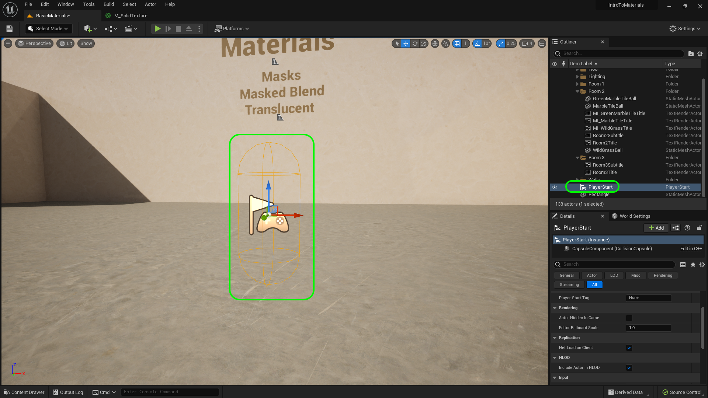

##### `Step 2.`\|`UE5MAT`|:small_blue_diamond: :small_blue_diamond: 

Create a new folder under **Textures** called `Masks`. Press the **Import** button and go to the folder **Import** and select **[T_CircleMask.tga](../Assets/T_CircleMask.tga)**. Double click and see that it is a power of 2 texture and is 512 x 512 with 10 MIP levels.  It is duotone with just black and white.

##### `Step 3.`\|`UE5MAT`|:small_blue_diamond: :small_blue_diamond: :small_blue_diamond:

Create a new material in the **Materials | Master** folder called `M_MetalMask`. 

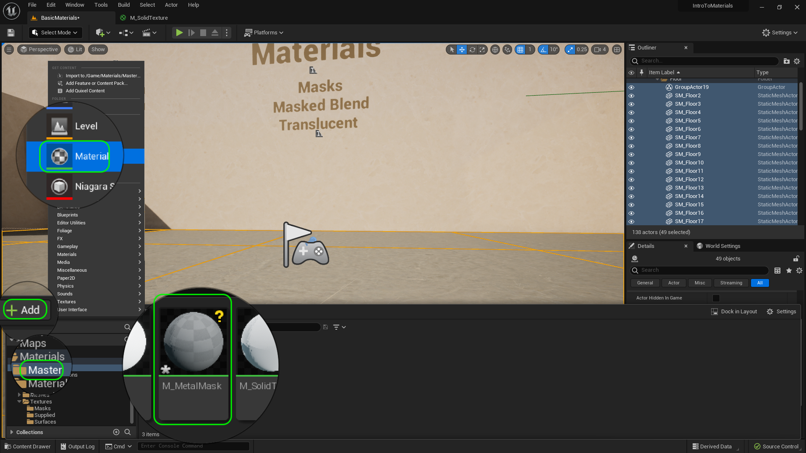

##### `Step 4.`\|`UE5MAT`|:small_blue_diamond: :small_blue_diamond: :small_blue_diamond: :small_blue_diamond:

Open the Material and add a **Texture Sample** node and selected the new texture we just created **T_CircleMask**. Drag the material function **Materials | MaterialFunctions | MF_BaseColor** to the chart under the texture sample.

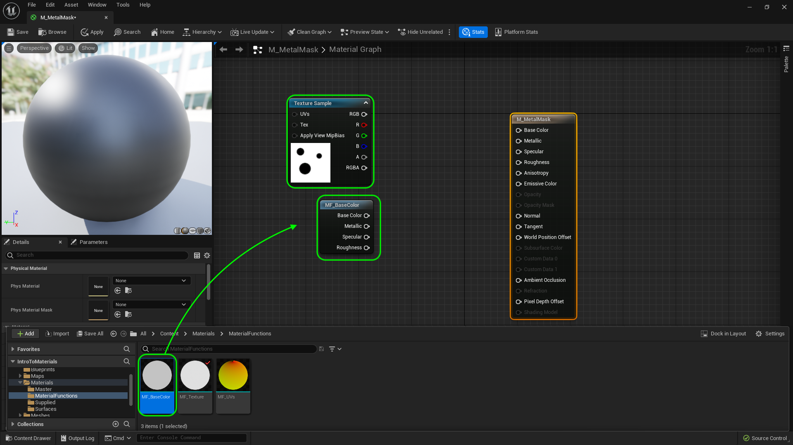

##### `Step 5.`\|`UE5MAT`| :small_orange_diamond:

Lets add these two nodes together.  Right click and type `add` to put a **Add** node on the graph and hook the **Texture Sample | RGB** output with the **MF_BaseColor | Basae Color** output.  The addition will keep it solid white. But when we tinit it, the white section will change and the black portion will stay black.

Connect the output of the **Add** node to the **Base Color** node and look at the result on the sphere. You should see a a solid white sphere.

##### `Step 6.`\|`UE5MAT`| :small_orange_diamond: :small_blue_diamond:

Add a **Saturate** node to the graph and place it between the **Add** node and the **Base Color** pin in **M_MetalMask**. Connect the **Texture Sample | RGB** to the **Metallic** node.  Plug the output of **MF_BaseColor** for **Specular** and **Roughness**.  We will use the mask for metallic.  You will notice that the circles (black part of the mask) are not metalic and the rest is. Press the <kbd>Apply</kbd> button.

##### `Step 7.`\|`UE5MAT`| :small_orange_diamond: :small_blue_diamond: :small_blue_diamond:

Go into the editor and create a material instance of **M_MetalMask** and call it `MI_MetalMask`.  Create a new folder called in **Materials** called `Masks`. Move the new material instance into this folder.

##### `Step 8.`\|`UE5MAT`| :small_orange_diamond: :small_blue_diamond: :small_blue_diamond: :small_blue_diamond:

Press the **Place Actors** button and select a **Shape | Cube** to drop in the level.  Position it on the left side of the room.

##### `Step 9.`\|`UE5MAT`| :small_orange_diamond: :small_blue_diamond: :small_blue_diamond: :small_blue_diamond: :small_blue_diamond:

Add **MI_Mask** material to the cube.

##### `Step 10.`\|`UE5MAT`| :large_blue_diamond:

Change **Roughness** to `0`.  Change the white tint color to **Green** (0, 1, 0). *Press* the <kbd>Play</kbd> button and see that the areas in the mask that were white are metallic and the portions in black are non metalic but green.  Think about why this is so?

https://user-images.githubusercontent.com/5504953/185811730-86476e82-1011-434c-92e4-0d4a5381381a.mp4

##### `Step 11.`\|`UE5MAT`| :large_blue_diamond: :small_blue_diamond: 

Now what if we wanted the opposite? What if want the green dot to be reflective and the rest of the surface be matte?  We could go to photoshop and invert the image, but we can do this in the material.  Open the **M_Metallic** and add a **OneMinus** node. 

Connect the output of the Texture Sample to the 1-x node and put that output in Metallic.  Select the cube to preview and now you can see that it only reflects inside the green dots.

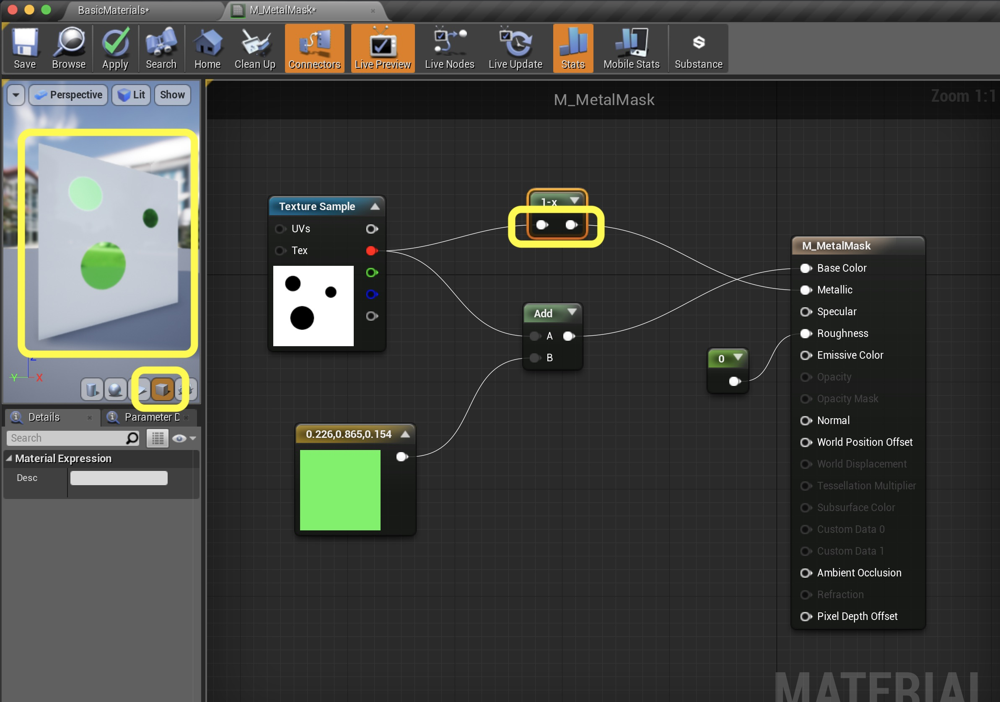

##### `Step 12.`\|`UE5MAT`| :large_blue_diamond: :small_blue_diamond: :small_blue_diamond: 

To see what the 1-X node does, right click and select **Start Previewing Node**.  See how it just inverts the image.  Turn off the preview and press the **Apply** button.

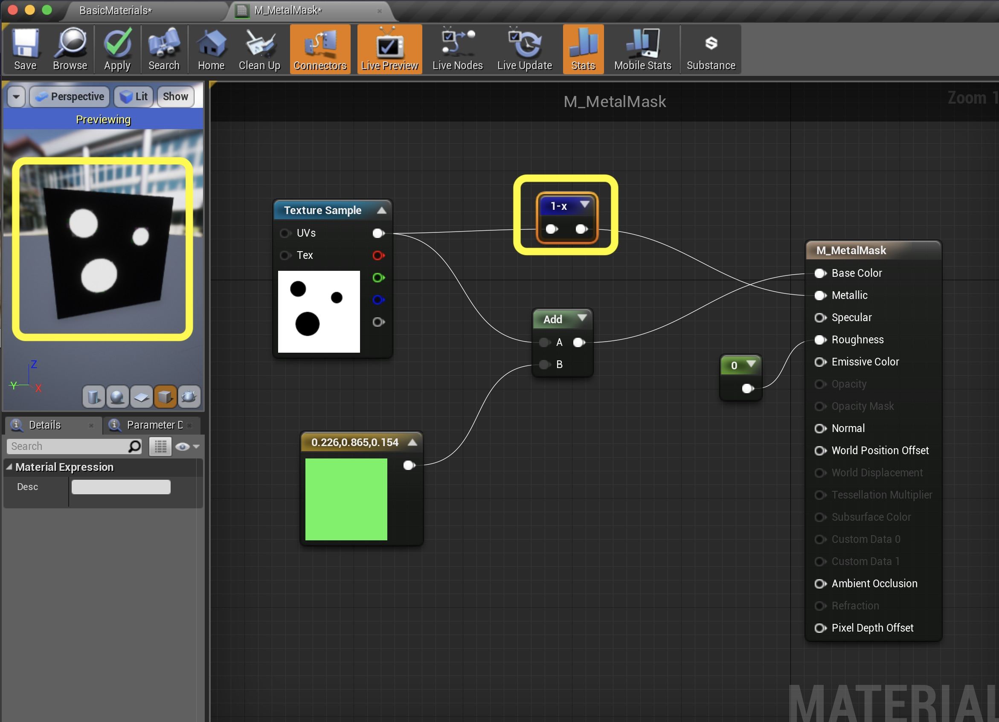

##### `Step 13.`\|`UE5MAT`| :large_blue_diamond: :small_blue_diamond: :small_blue_diamond:  :small_blue_diamond: 

Go into the game and play it and look at the cube.  The metallic effect is now reversed:

https://user-images.githubusercontent.com/5504953/131201170-8152f162-0e6d-4072-b87f-571ddc145cc6.mp4

##### `Step 14.`\|`UE5MAT`| :large_blue_diamond: :small_blue_diamond: :small_blue_diamond: :small_blue_diamond:  :small_blue_diamond: 

We have only dealt with opaque materials.  We can also have holes cut in the materials with translucency.  There are two types of approaches. The faster in terms of performance is an opacity mask. This means that a pixel can be completely transparent.  But there are no partial transparencies. The pixel is opaque or is clear.  Lets take a look.  Create a new **Material** in the **Materials** folder and call it `M_OpacityMask`.

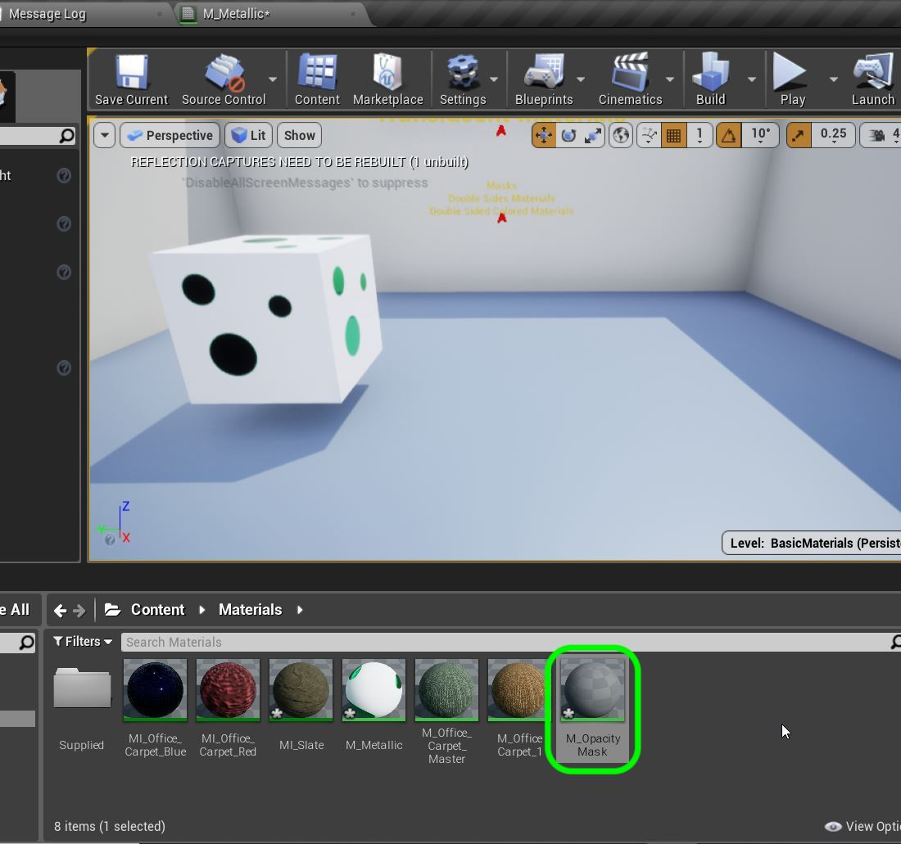

##### `Step 15.`\|`UE5MAT`| :large_blue_diamond: :small_orange_diamond: 

Double click the new Material and add a **Texture Sample** node. Add the **T_CircleMask_D** texture and you should see.

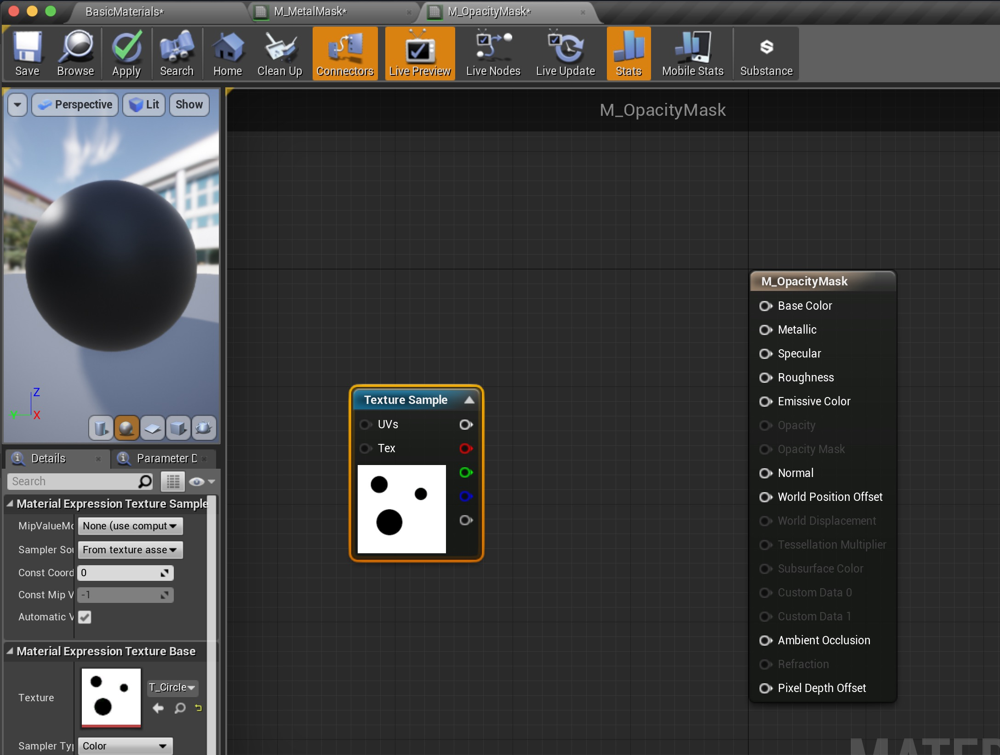

##### `Step 16.`\|`UE5MAT`| :large_blue_diamond: :small_orange_diamond:   :small_blue_diamond: 

Connect the output of the **Texture Sample** node and connect it to the **Opacity Mask** mode.  This does nothing and it is grayed out. We will fix this shortly.

##### `Step 17.`\|`UE5MAT`| :large_blue_diamond: :small_orange_diamond: :small_blue_diamond: :small_blue_diamond:

Add a **Constant 3 Vector** and pick a nice bright color.  I picked orange.

##### `Step 18.`\|`UE5MAT`| :large_blue_diamond: :small_orange_diamond: :small_blue_diamond: :small_blue_diamond: :small_blue_diamond:

Now the Opacity mask is supposed to be clear where there is an alpha (black pixel) and opaque where white.  Right now we just have a solid Orange surface.

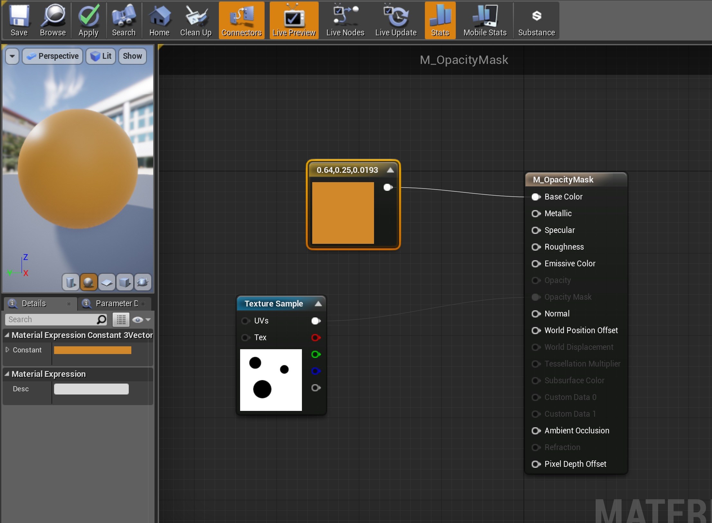

##### `Step 19.`\|`UE5MAT`| :large_blue_diamond: :small_orange_diamond: :small_blue_diamond: :small_blue_diamond: :small_blue_diamond: :small_blue_diamond:

There are different blend modes available in the shaders.  To read more about it go to this section in their [manual](https://docs.unrealengine.com/en-us/Engine/Rendering/Materials/MaterialProperties/BlendModes).  Now select the **Blend Mode** drop down menu and pick **Masked**.

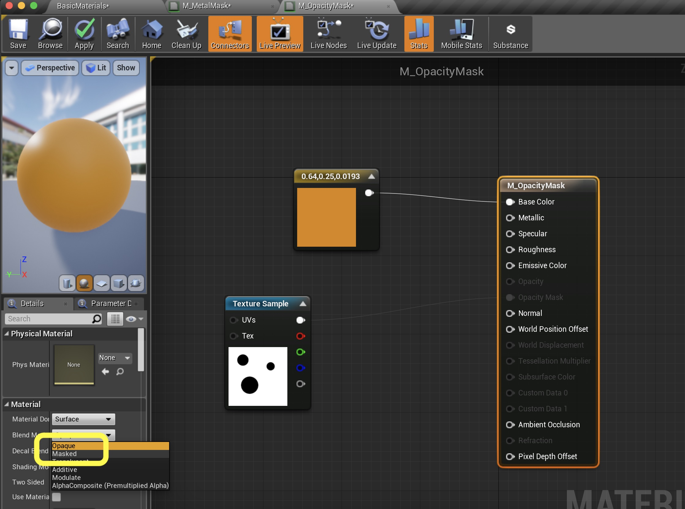

##### `Step 20.`\|`UE5MAT`| :large_blue_diamond: :large_blue_diamond:

Attach the **Texture Sample** to the **Opacity Mask** pin on the material. Now switch to a cube and you will see that the black areas of the map cut into the cube.

##### `Step 21.`\|`UE5MAT`| :large_blue_diamond: :large_blue_diamond: :small_blue_diamond:

Now go to the game and press the **alt** button and drag another copy of the cube.  Assign the **M_OpacityMask** material.

https://user-images.githubusercontent.com/5504953/131201410-ea08a4bc-424b-4b02-be92-8c730669541e.mp4

##### `Step 22.`\|`UE5MAT`| :large_blue_diamond: :large_blue_diamond: :small_blue_diamond: :small_blue_diamond:

You might have noticed that there is no inside of the box.  The entire inside is clear.  Why is that?  In 3-D modelling the light is only reflected where normals are placed.  Typically in closed surfaces like cubes there are only normals on one side.  Double click the cube static mesh (in the **World Outliner**) and click on **Normals**.  You should see green lines pointing outwards.

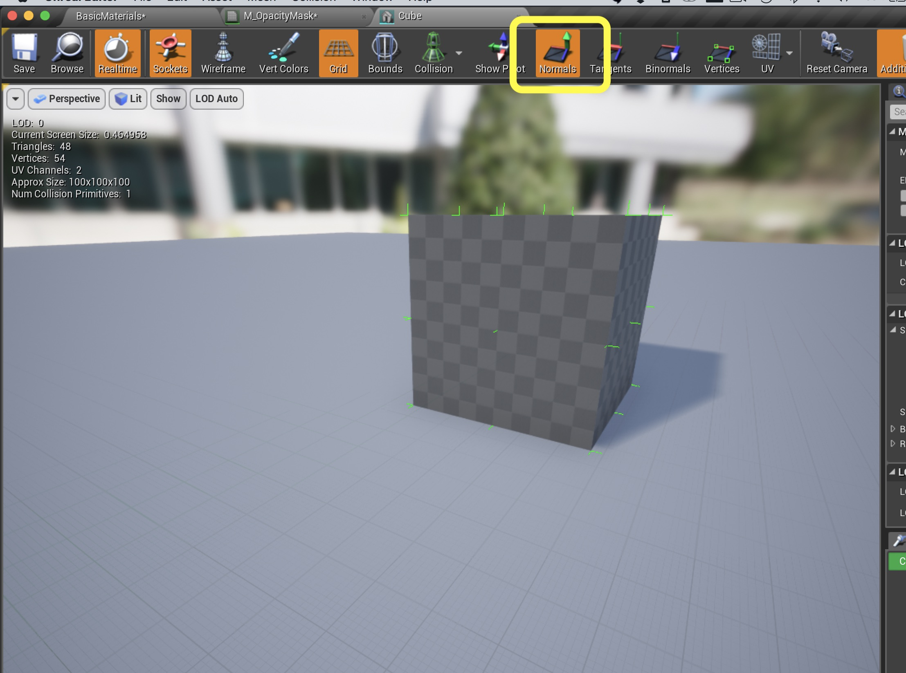

##### `Step 23.`\|`UE5MAT`| :large_blue_diamond: :large_blue_diamond: :small_blue_diamond: :small_blue_diamond: :small_blue_diamond:

In the **Details** panel of your Material there is a **Two Sided** radio button.  This allows you to let the material know that you want to project light on both sides of each face of the object.  Look how much better it looks!  Press the <kbd>Apply</kbd> button.

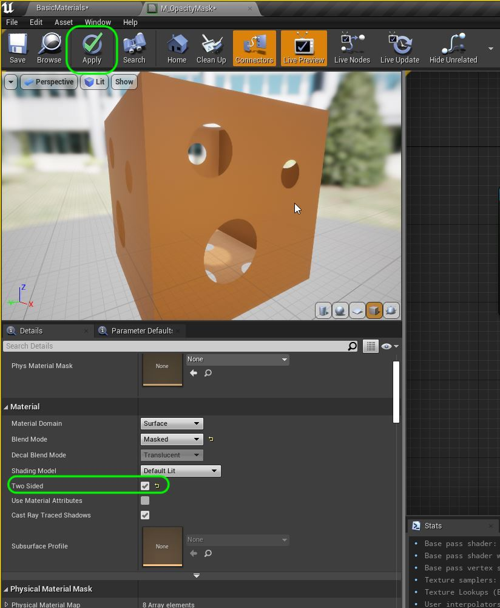

##### `Step 24.`\|`UE5MAT`| :large_blue_diamond: :large_blue_diamond: :small_blue_diamond: :small_blue_diamond: :small_blue_diamond: :small_blue_diamond:

Check out the box in game.  Now it looks more like we expect it to. Next up lets make a mask with semi translucent surfaces.

https://user-images.githubusercontent.com/5504953/131201610-d3b85e54-dc15-440a-9ca1-514654b4ef8e.mp4

##### `Step 25.`\|`UE5MAT`| :large_blue_diamond: :large_blue_diamond: :small_orange_diamond:

OK, now lets finish up this section by savin our work and uploading it to GitHub.  Press **Tile | Save All** then **Source Conrol | Submit to Source Control...** and add a description.  Press the <kbd>Submit</kbd> button.  Open up **GitHub Desktop** and **Push** the commited work.

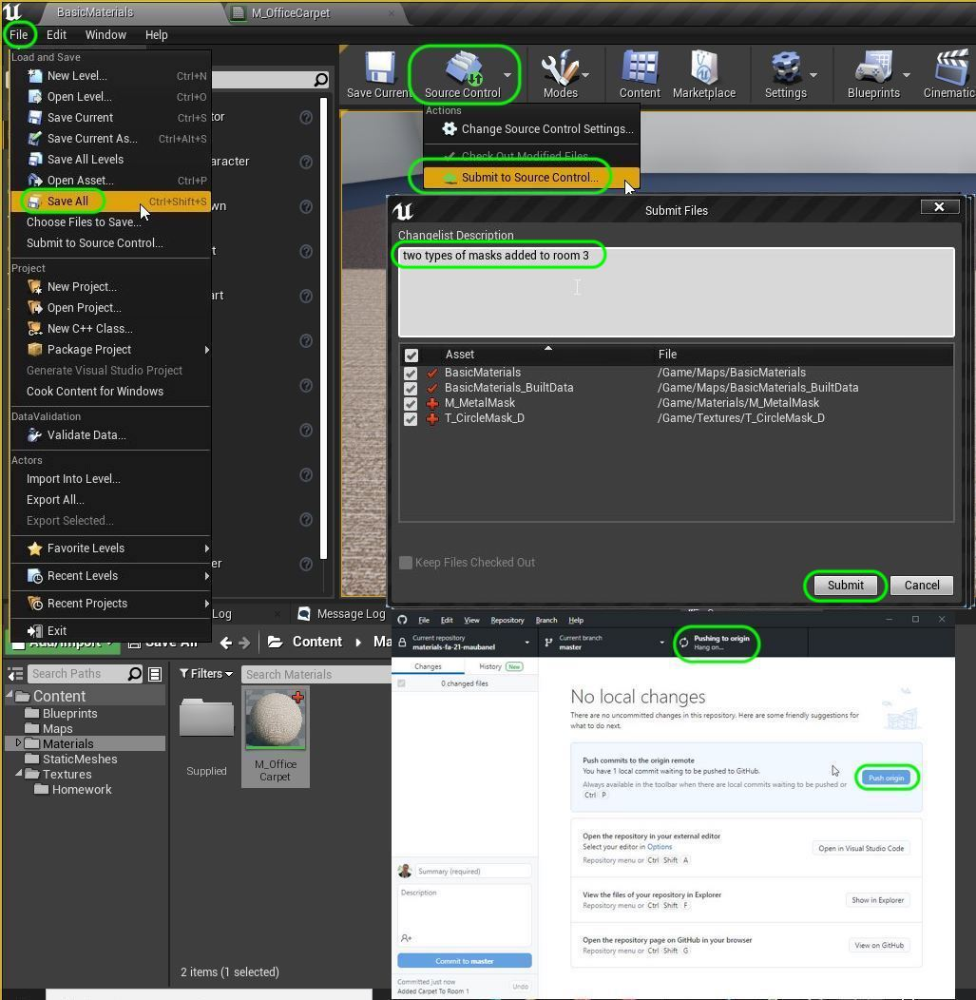

<!--  -->

| [previous](../adding-parameters/README.md#user-content-adding-parameters)| [home](../README.md#user-content-ue4-intro-to-materials) | [next](../translucent/README.md#user-content-translucent-blend-mode)|
|---|---|---|
