### Complex Master Material - Part I

[previous](../anim-uv/README.md#user-content-animate-uvs) • [home](../README.md#user-content-ue4-intro-to-materials) • [next](../master-material-2/README.md#user-content-complex-master-material---part-ii)

Now lets make a Material that is flexible to handle many different situations and can be used as a Material instance for most scenarios.  This is a Material that you can keep using for the rest of the course.  It can be expanded on to include even more nodes on your own.

 

---

##### `Step 1.`\|`SUU&G`|:small_blue_diamond:

Create a new **Material** and call it `M_Base_Master`.  Add a **Texture Sample Parameter 2D** node to it so we can customize the texture.  Call this node `Base Texture`. Import these 4 textures into the **Textures** folder: [T_Cobblestone_BaseColor.tif](../Assets/T_Cobblestone_BaseColor.tif), [T_Cobblestone_OcclusionRoughnessMetallic.tif](../Assets/T_Cobblestone_OcclusionRoughnessMetallic.tif), [T_Cobblestone_Normal.tif](../Assets/T_Cobblestone_Normal.tif) and [T_Cobblestone_Emissive.tif](../Assets/T_Cobblestone_Emissive.tif).

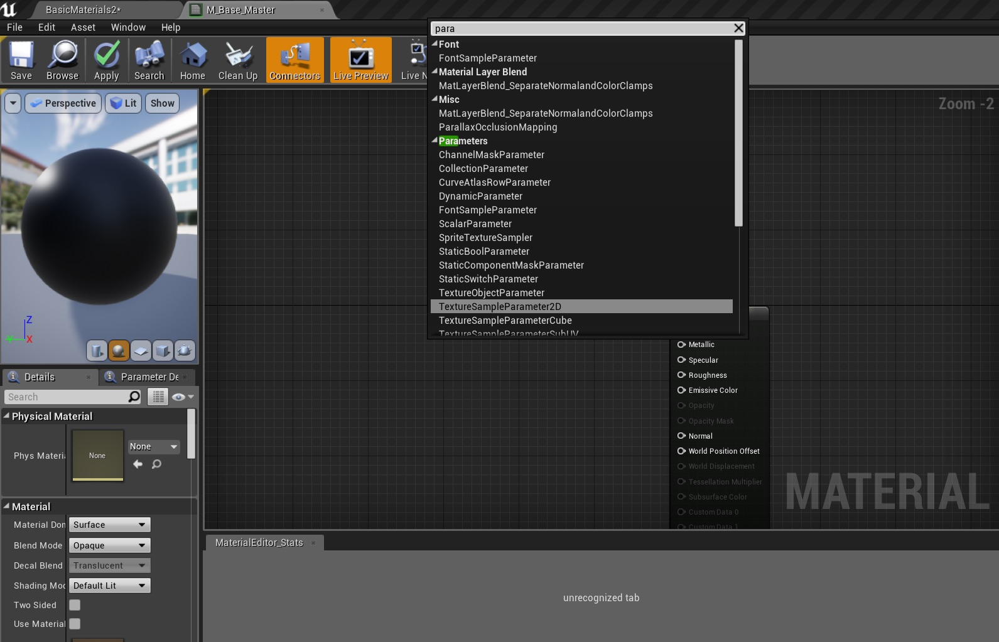

##### `Step 2.`\|`FHIU`|:small_blue_diamond: :small_blue_diamond: 

Assign `T_Cobblestone_BaseColor` to the texture and change its group from **None** to `Diffuse`.

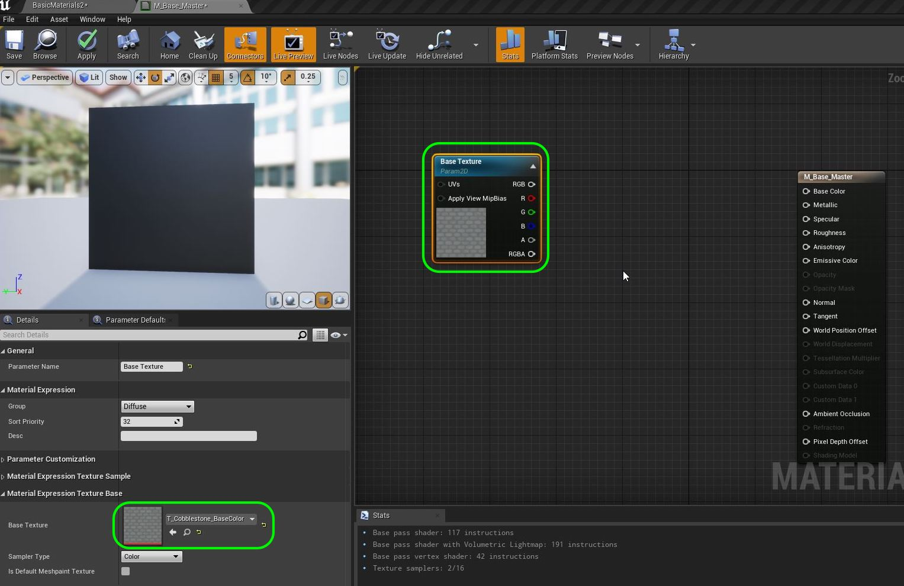

##### `Step 3.`\|`SUU&G`|:small_blue_diamond: :small_blue_diamond: :small_blue_diamond:

Add a **Vector Parameter** node and pick a base color, Name it **Color**. 

Now for a master material we do not want to tint the texture but allow someone to tint it in an instance of the material.  So we will set it to `1, 1, 1`.  This means that it will multiply it by 1 on each channel changing nothing. Set the **Group** to `Diffuse`. 

Add a **Multiply** node and feed the color and texture into the **B** side of the **Multiply** node.  Take the output of the **Vector Parameter** and feed into the **A** side of the **Multiply** node.

Add a **Static Switch Parameter** node.

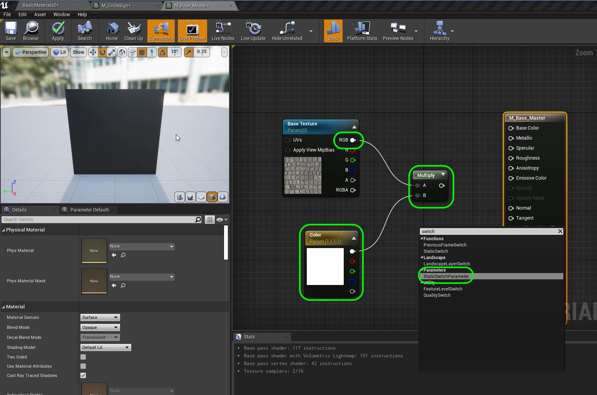

##### `Step 4.`\|`SUU&G`|:small_blue_diamond: :small_blue_diamond: :small_blue_diamond: :small_blue_diamond:

Name the **Switch** `Use Texture?`.  Change the group to `Diffuse`.  Feed the output of the color to the **False** input the the output of the **Multiply** into the **True** input.  Feed the switch output into the **Base Color** in the main node.

##### `Step 5.`\|`SUU&G`| :small_orange_diamond:

Keep the default for the switch at `true` but you can see what this node does when we switch between true and false. Notice in the **Details** panel at the bottom that the number of operations is greater when using a texture versus just a solid color.  Not a huge difference, but you will use less compute power if you do NOT use a texture.

https://user-images.githubusercontent.com/5504953/131262851-dff0b96d-530b-4ae5-a22a-43c7f620446d.mp4

##### `Step 6.`\|`SUU&G`| :small_orange_diamond: :small_blue_diamond:

Add a comment to best explain the nodes.  This allows us to use either a solid color or a texture or a texture multiplied by a color.  Remember if you multiply by white it leaves the texture alone (any number times 1 stays the same). 

##### `Step 7.`\|`SUU&G`| :small_orange_diamond: :small_blue_diamond: :small_blue_diamond:

Lets give the user the ability to customize UV's and not just be stuck with the default 1,1 setting.  Add another **Static Switch Parameter** and call it `Adjust UV Coordinates?` and change the **Group** in the **Details** panel to `UV`.  Also, drop a **Texture Coordionate Node** and leave its default 1,1 setting.

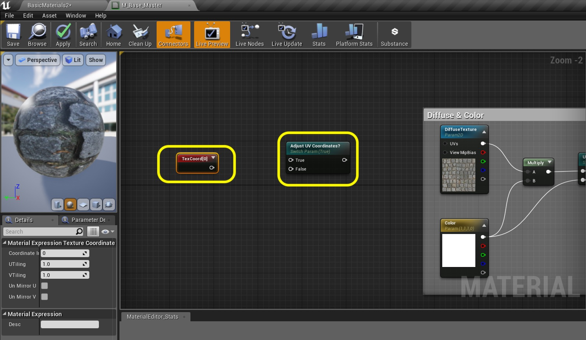

##### `Step 8.`\|`SUU&G`| :small_orange_diamond: :small_blue_diamond: :small_blue_diamond: :small_blue_diamond:

Send the output of the **Texture Coordinate** node to the **False** pin of the **Adjust UV Coordinates** node. Add two **Scalar Parameter** nodes called `UScalar` and `VScalar`.  Set their group to `UV`.  Set their **Default Value** both to `1`.  Combine them in an **Append Vector** node.

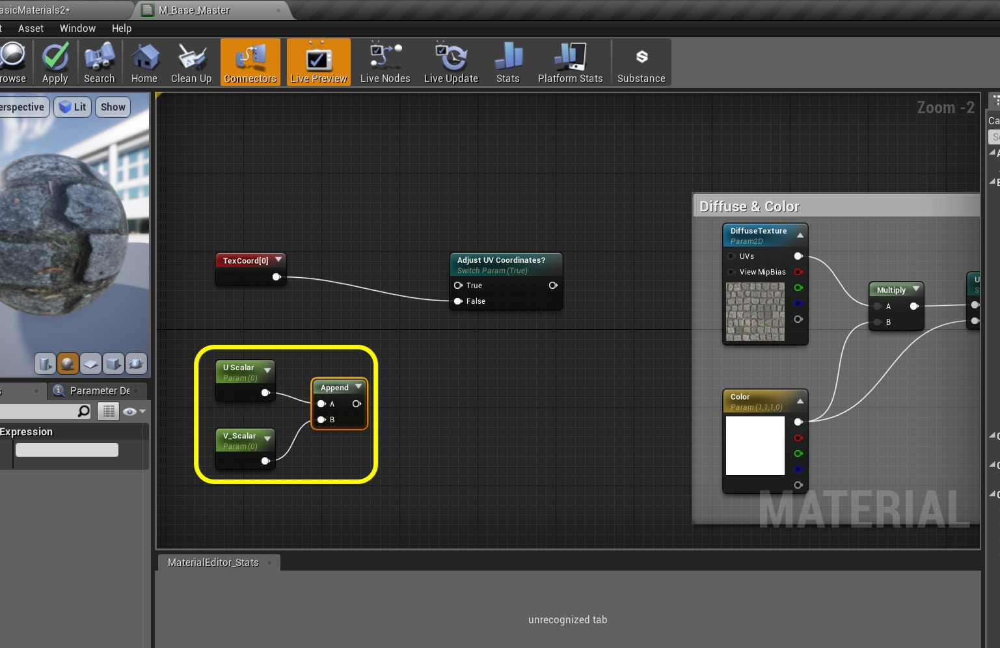

##### `Step 9.`\|`SUU&G`| :small_orange_diamond: :small_blue_diamond: :small_blue_diamond: :small_blue_diamond: :small_blue_diamond:

Add a **Multiply** node sending the output of the **Append** into the **B** input and the output of the **Texture Coordinate** to the **A** output. Send the output of the **Multiply** node to the **True** input of the **Switch Parameter** node.  Send the output of the **Switch** node to the **UVs** input on the texture node.

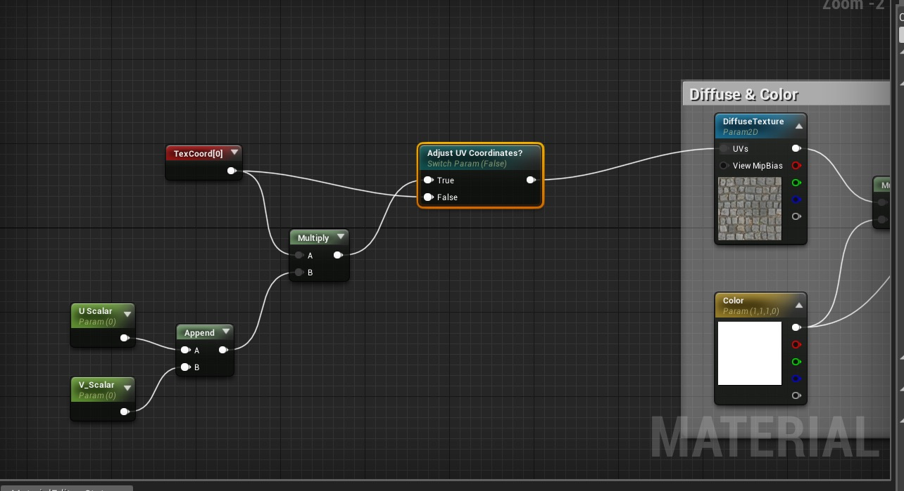

##### `Step 10.`\|`SUU&G`| :large_blue_diamond:

Add a comment to the UV section and clean up your graph which should look like this now:

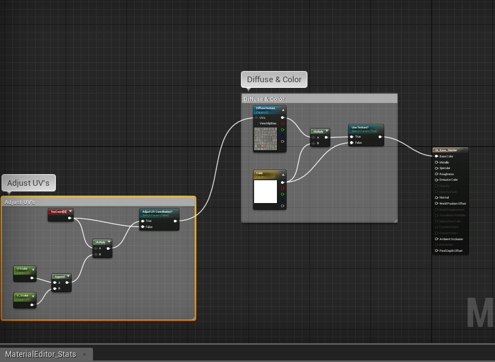

##### `Step 11.`\|`SUU&G`| :large_blue_diamond: :small_blue_diamond: 

Lets create the nodes for the **Metalic** input.  Add a **Static Switch Parameter** and call it `Use Metalic Texture?` and add the group `Metalic`.  Set the **Default Value** to `true`. 

Add a **Scalar Parameter** node call it `Metalic Scalar` and add it to the group `Metalic`.  Send the output of this node to the **False** pin in the **Switch**.  Leave the default at `0` which is non metalic. If you have no metalic mask it is unlikely that the entire surface is metal (if it is set it to `1` in the instance material created for it). 

Add a **Texture Sample Parameter 2D**, call it `Metalic Texture` and assign **T_Cobblestone_OcclusionRoughnessMetalic** base texture to it. Assign it to **Group** `Metalic`. Connect the **Blue** output pin (the order that Adobe Substance Sampler 3D outputs) into the **True** node of the **Use Metalic Texture?** node. 

Connect the output of the **Switch** to the **Metallic** pin.

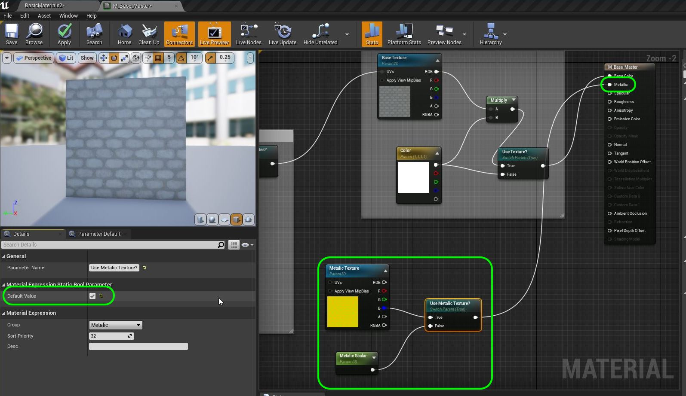

##### `Step 12.`\|`SUU&G`| :large_blue_diamond: :small_blue_diamond: :small_blue_diamond: 

Add a comment then copy and paste the entire **Metalic** group and place it below as we will use this for roughness which will be similar.

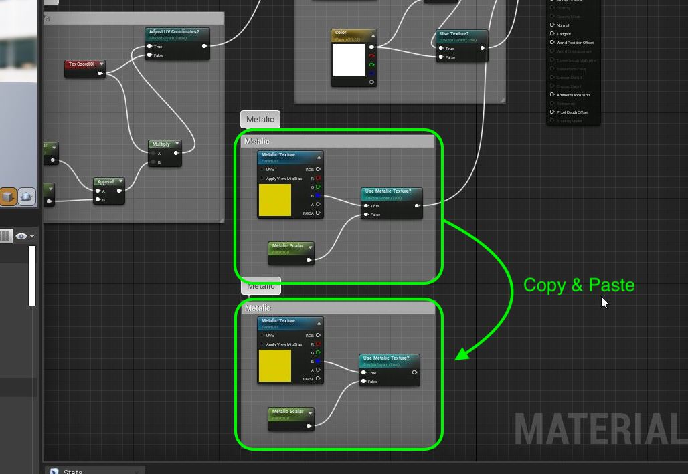

##### `Step 13.`\|`SUU&G`| :large_blue_diamond: :small_blue_diamond: :small_blue_diamond:  :small_blue_diamond: 

Change the names altering **Metallic** to `Roughness`.  Change all the groups to `Roughness`. 

Change the **Switch** to `Use Roughness Texture?`, **Scalar** to `Roughness Scalar` and the texture to `Roughness Texture`. 

The texture will not need to change as it is packed with three differeent and separate channels. Now it is the **Green** pin that we connect to the true as this is the **Roughness** channel in the packed texture (AO, Roughness, Metalic).

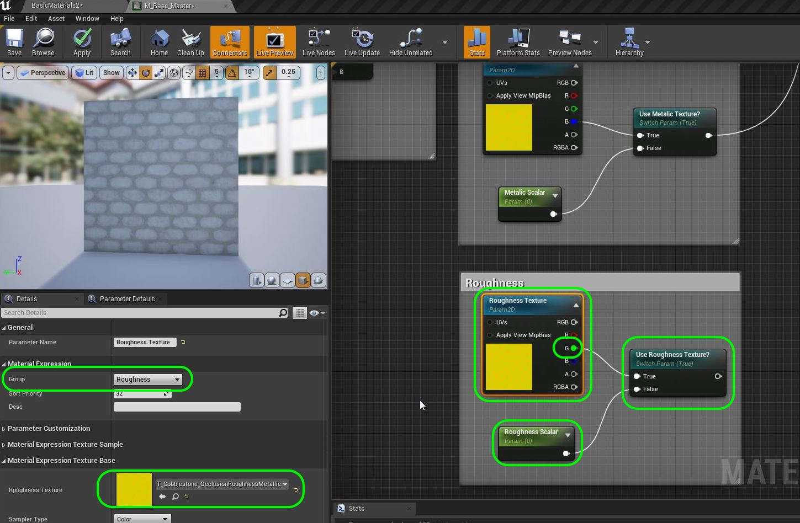

##### `Step 14.`\|`SUU&G`| :large_blue_diamond: :small_blue_diamond: :small_blue_diamond: :small_blue_diamond:  :small_blue_diamond: 

 Connect the output of the **UV Roughness Texture?** node to the **Roughness** input on the shader. Your node graph should look like:

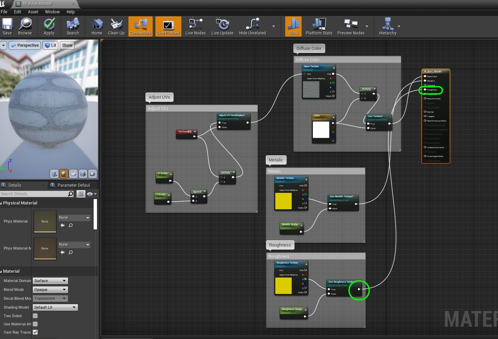

##### `Step 15.`\|`SUU&G`| :large_blue_diamond: :small_orange_diamond: 

The **Emissive** will be a bit different.  Add another **Static Switch Parameter** node, call it `Use Emissive Texture?`.  Add a **Texture Sample Parameter 2D** node called `Emissive Texture`, assign the **T_Cobblestone_Emissive** and add a **Scalar Parameter** node set to `3` called `Emissive Scalar`.  Set all of their groups to `Emissive`.

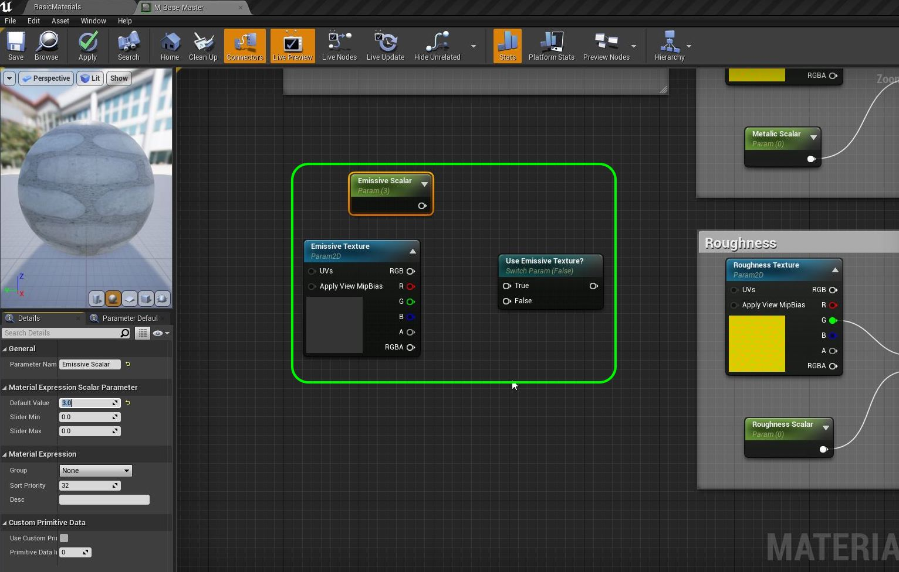

##### `Step 16.`\|`SUU&G`| :large_blue_diamond: :small_orange_diamond:   :small_blue_diamond: 

Add a **Vector Parameter** node called `Emissive Color` and set it group to `Emissive`.  Lets default the emissive color vector to `0, 0, 0` so it is black and has no effect.  Remember when setting the emissive we can go above 1 on each channel to get a brighter glow. Add a **Multiply** node. 

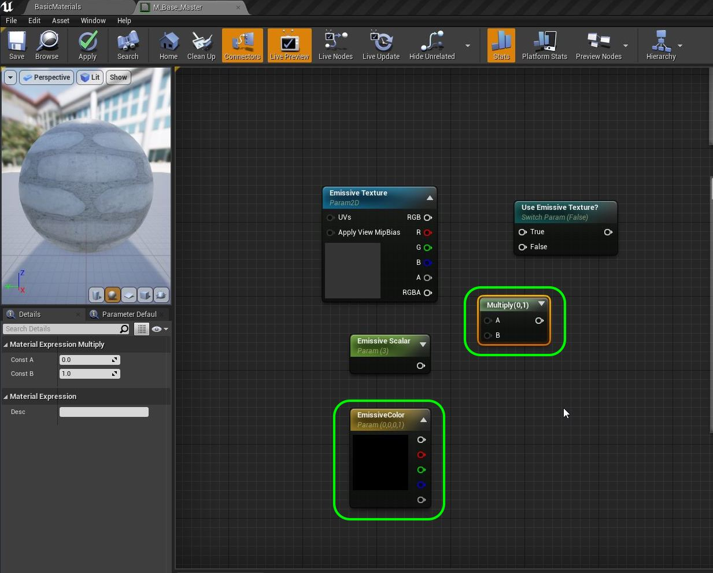

##### `Step 17.`\|`SUU&G`| :large_blue_diamond: :small_orange_diamond: :small_blue_diamond: :small_blue_diamond:

We forgot to hook the output of the UV's to all the added textures.  We need to adjust the UV's of all the textures for the mesh.  Drag the output of **Adjust UV Coordinates?** node to **Metalic Texture, Roughness Texture and Emissive Texture**.

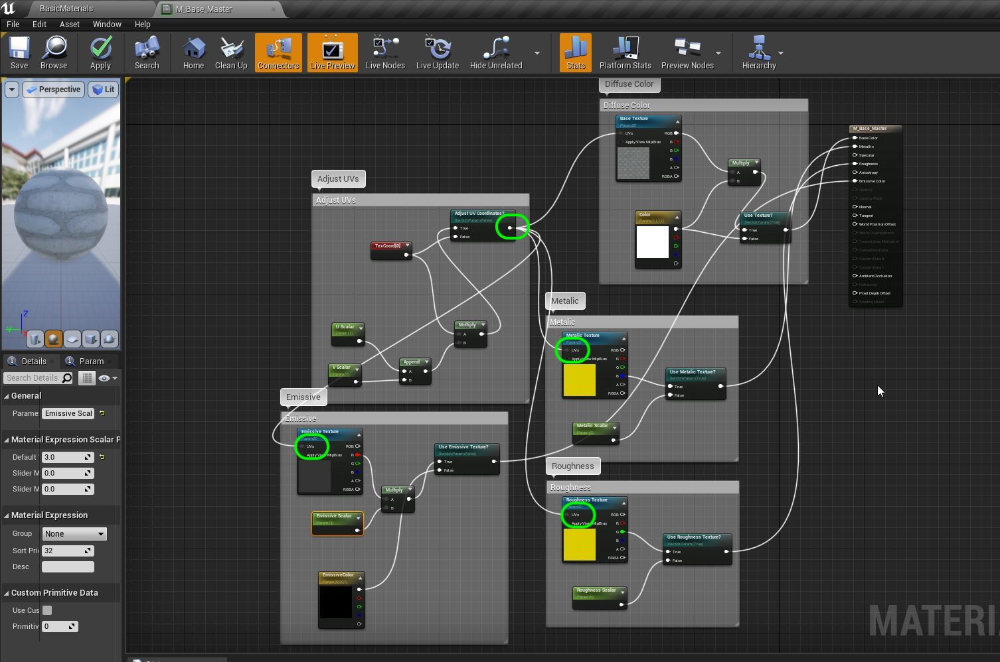

##### `Step 18.`\|`SUU&G`| :large_blue_diamond: :small_orange_diamond: :small_blue_diamond: :small_blue_diamond: :small_blue_diamond:

Connect the output of the **Emissive Texture  | R** red pin to the **A** input of the **Multiply** pin. Send the **Emissive Scalar** output to the **B** side of the **Multiply** pin.  Send the output of the **Multiply** into the **True** pin on the **Use Emissive Texture?** switch.  Connect the output of the **EmissiveColor** into the **False** pin of the Emissive Switch.  Send the output of the s**Use Emissive Texture** switch to the **Emissive Color** pin in the main shader node.

Add a comment around the nodes stating `Emissive`.

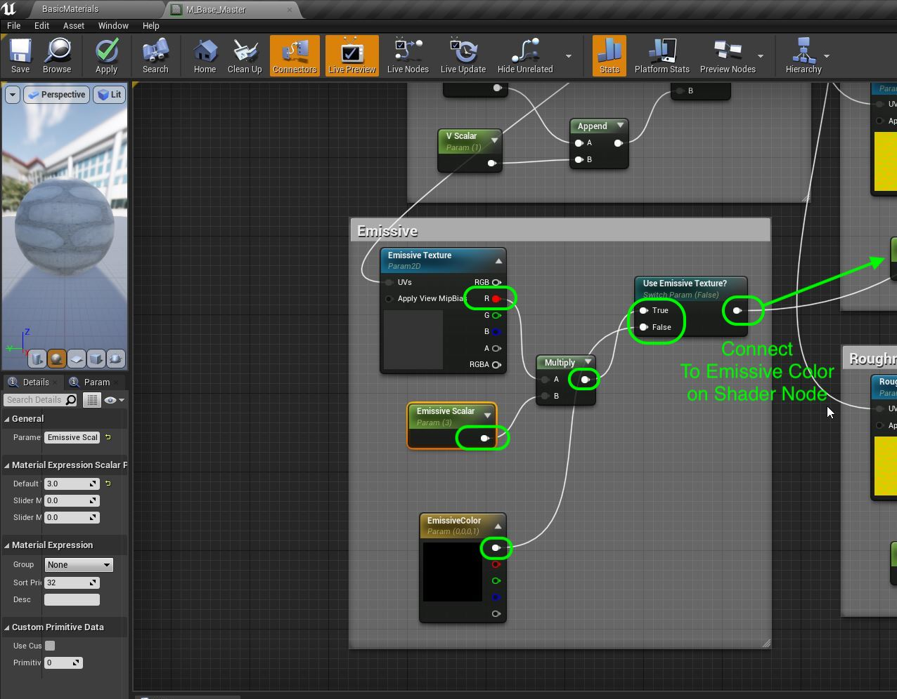

##### `Step 19.`\|`SUU&G`| :large_blue_diamond: :small_orange_diamond: :small_blue_diamond: :small_blue_diamond: :small_blue_diamond: :small_blue_diamond:

Now lets get to the trickiest part of our graph the **Material** normal.  Add a **Texture Sample Parameter 2D** and call it `Normal Texture` and assign it to the `Normal` **Group**.  Select **T_Cobblestone_Normal** as the texture. Add a **Static Switch Parameter** and call it `Use Normal Map?` and assign it to the `Normal` group.  Now add a **Constant Vector 3** to the node tree and assign it `0,0,1` (or blue) and assign the `Normal` option to the **Group**.  This is the orthoganal normal for a plane and will add no bumps or lighting changes.  Send this into the **False** input of the **Switch**.  Send the output of the **Normal Texture** to the **True** pin of the **Switch**.

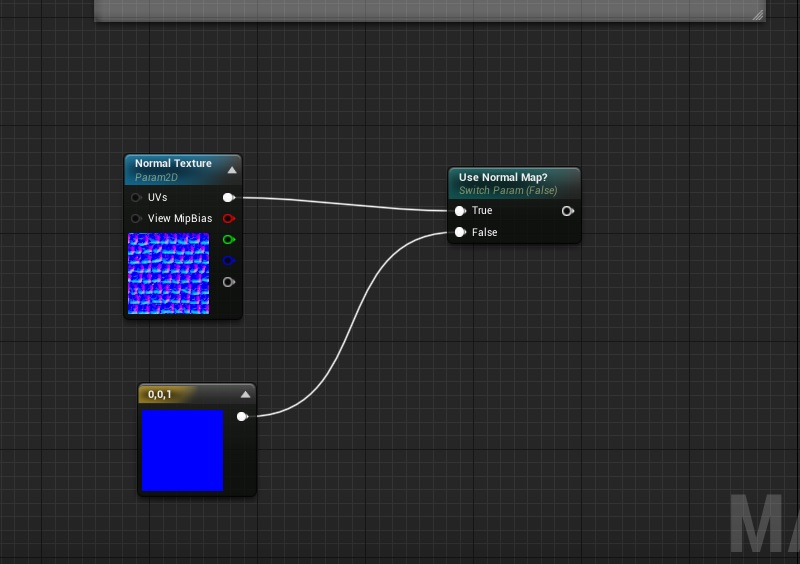

##### `Step 20.`\|`SUU&G`| :large_blue_diamond: :large_blue_diamond:

Add a comment called `Normal Maps` and connect the **UV** input of the **Normal Texture** to the **Adjust UV Coordinates** output pin. Connect the output of the **Use Normal Map?** pin to the **Normal** pin in the main shader.

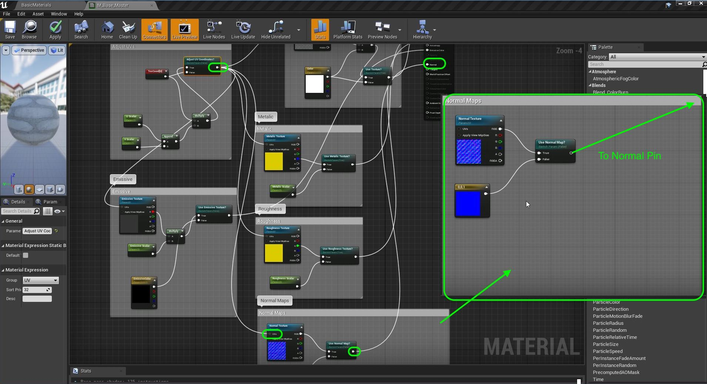

##### `Step 21.`\|`SUU&G`| :large_blue_diamond: :large_blue_diamond: :small_blue_diamond:
Make sure that **Use Texture?**, ***Use Metalic Texture?**, **Use Roughness Texture** and **Use Normal Map?** are all set to **Default** `True` (box checked).  Make sure that **Use Emissive Texture?** and **Adjust UV Coordinates?** have the **Details** set to `False`.

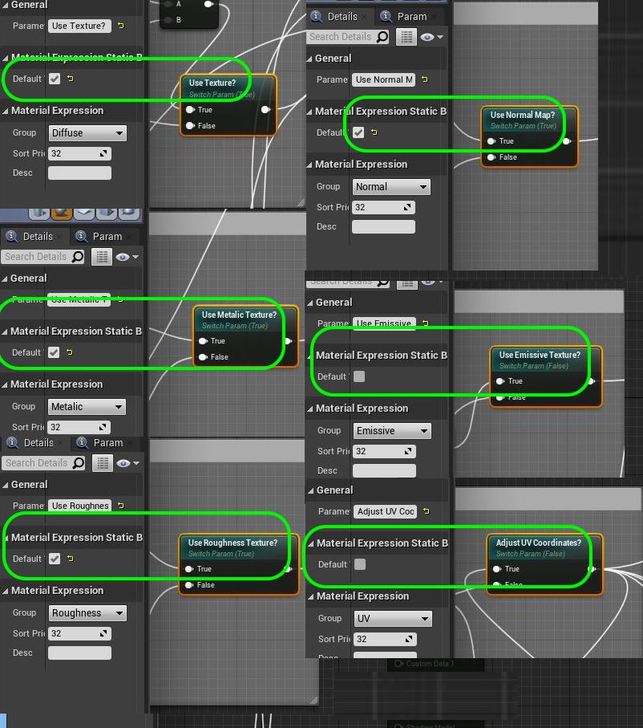

##### `Step 22.`\|`SUU&G`| :large_blue_diamond: :large_blue_diamond: :small_blue_diamond: :small_blue_diamond:

And the entire node graph should look like this.  Press the <kbd>Apply</kbd> button.  

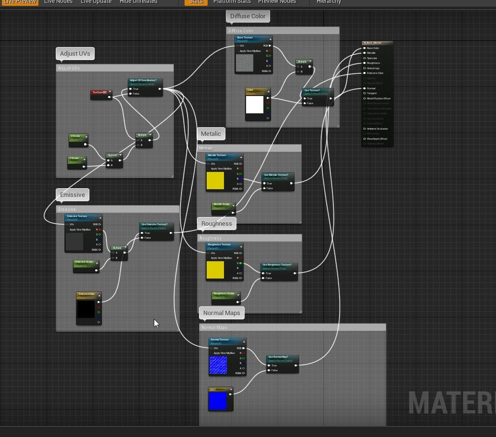

##### `Step 23.`\|`SUU&G`| :large_blue_diamond: :large_blue_diamond: :small_blue_diamond: :small_blue_diamond: :small_blue_diamond:

Scroll over to **Room 9** and add a **Static Meshes | SM_MatPreviewMesh02** to the level. 

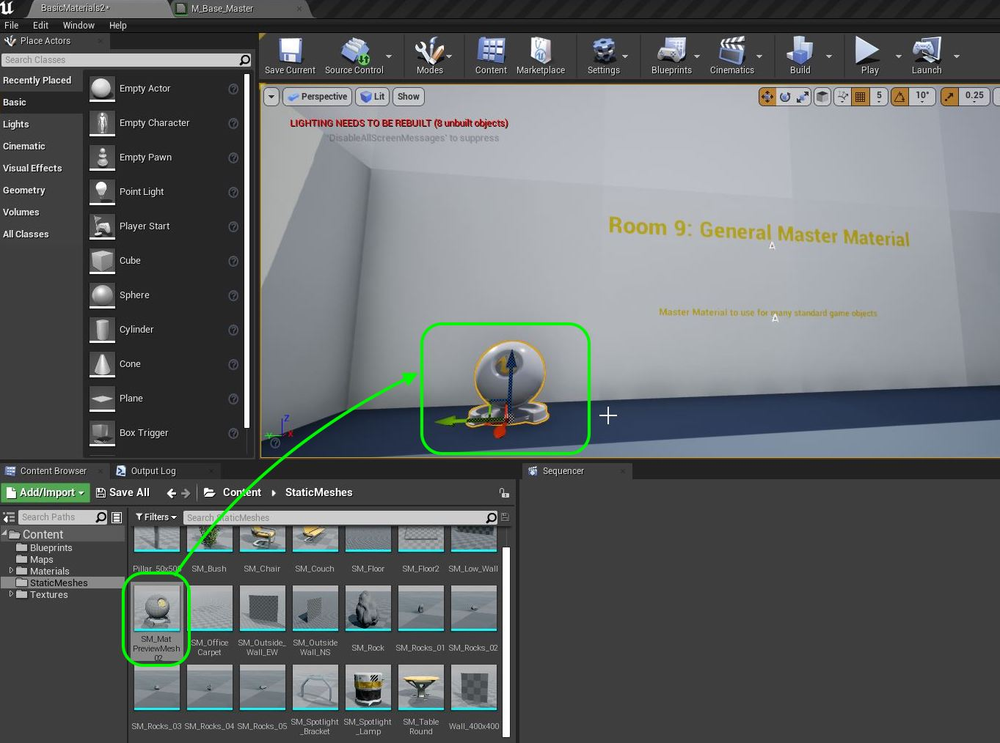

##### `Step 24.`\|`SUU&G`| :large_blue_diamond: :large_blue_diamond: :small_blue_diamond: :small_blue_diamond: :small_blue_diamond: :small_blue_diamond:

Right click on **M_Base_Master** and select **Create Material Instance** and call it `MI_Cobblestone`. Add this to **Element 0** in the **Materials** slot for the Material Preview static mesh. Look at the result in engine!

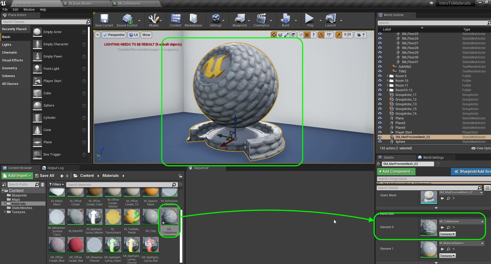

##### `Step 25.`\|`SUU&G`| :large_blue_diamond: :large_blue_diamond: :small_orange_diamond:

Now we can make this even better.  Open **M_Base_Master**.  We can alter the size of the intensity of the normal.  Create 2 **Constant Vector 3** and make one `1,1,0` and the other `0,0,1`.  Take the output of the Yellow Vector 3 and plug into the A side of a **Multiply** node.  Add a **Scalar Parameter** called `Normal Intensity` set to `1` with a **Group** set to `Normal`.  This feeds into the B side of the **Multiply** node.

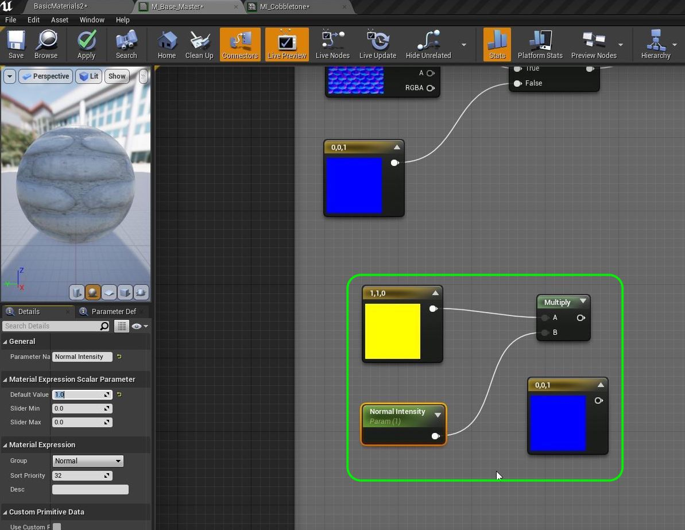

##### `Step 26.`\|`SUU&G`| :large_blue_diamond: :large_blue_diamond: :small_orange_diamond: :small_blue_diamond:

Put an **Add** node and feed the **A** side with the output of the above multiply and the **B** side with the output of the **Blue** constant:

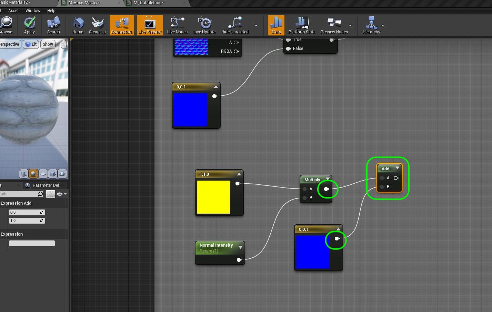

##### `Step 27.`\|`SUU&G`| :large_blue_diamond: :large_blue_diamond: :small_orange_diamond: :small_blue_diamond: :small_blue_diamond:

Add a **Mutliply** node and take the output of the **Add** to channel **B** and the output of the **Normal Map** to the **A** channel. Now Connect the output of the **Multiply** node to the **True** input of the **Use Normal Map?** pin.

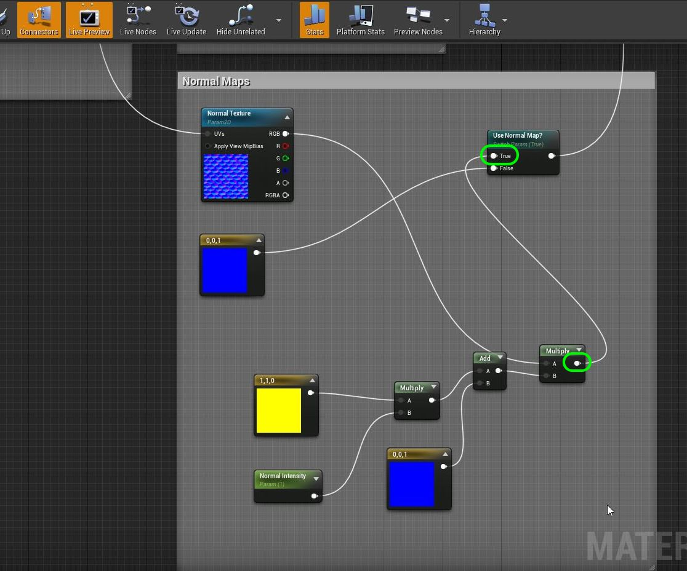

##### `Step 28.`\|`SUU&G`| :large_blue_diamond: :large_blue_diamond: :small_orange_diamond: :small_blue_diamond: :small_blue_diamond: :small_blue_diamond:

When you have complicated nodes you can have comments within comments.  I would select the nodes that affect intensity and give it its own comment:

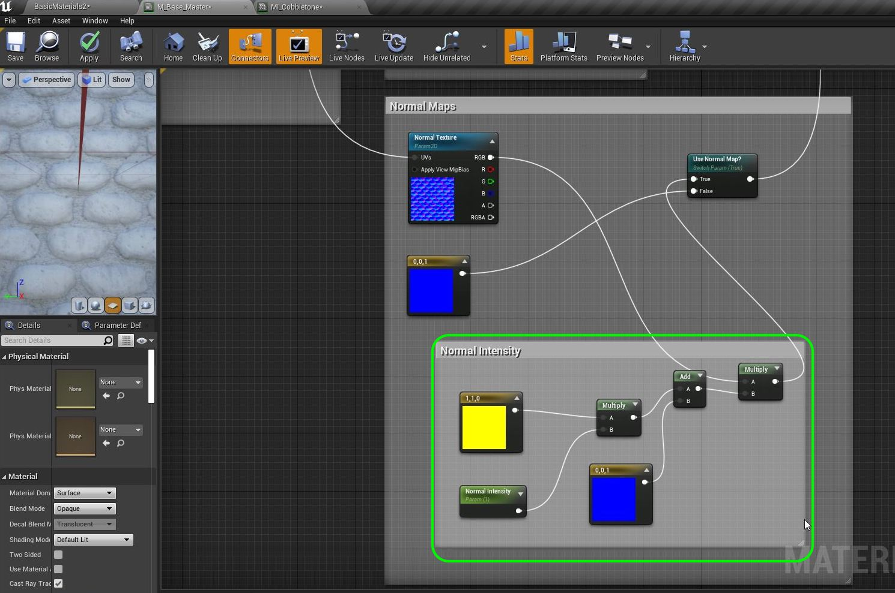

___

| [previous](../anim-uv/README.md#user-content-animate-uvs)| [home](../README.md#user-content-ue4-intro-to-materials) | [next](../master-material-2/README.md#user-content-complex-master-material---part-ii)|
|---|---|---|
