### Complex Master Material - Part II

[previous](../master-material-1/README.md#user-content-complex-master-material---part-i) • [home](../README.md#user-content-ue4-intro-to-materials)

We finish off the master material that we started.

 

---

##### `Step 1.`\|`SUU&G`|:small_blue_diamond:

Press the <kbd>Apply</kbd> button.  Lets go into the **MI_Cobblestone** and set the **Normal Intensity** in the material instance and try different intenstities.  Notice how `0` gets rid of the bounce, `1` is the same as the original and larger numbers enhance it. I will leav it at `0.8`.

https://user-images.githubusercontent.com/5504953/131334862-2a17fdc2-89d5-4b5a-a064-d04a37ba7d16.mp4

##### `Step 2.`\|`FHIU`|:small_blue_diamond: :small_blue_diamond: 

Go back to **M_Base_Master** material. Lets add another common technique.  Surfaces can be complex and have many underlying patterns.  We can create a **Detail Normal** map to add even more subtlety to the bump.  Add another **Static Switch Parameter** and call it `Use Detail Normal?` and group it to `Normal`.  Then add a **Blend Angle Corrected Normal**.

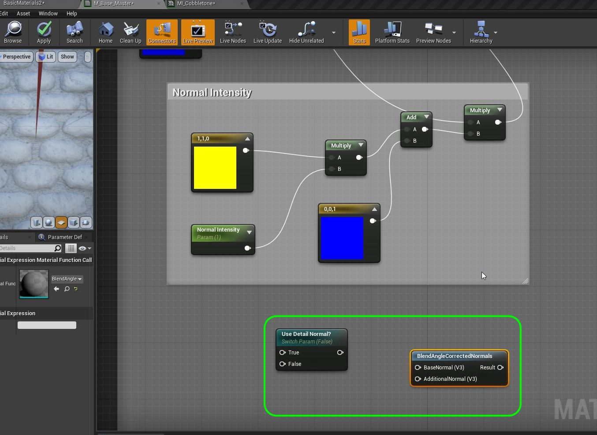

##### `Step 3.`\|`SUU&G`|:small_blue_diamond: :small_blue_diamond: :small_blue_diamond:

We use the blend angle correction as you cannot add normals or multiply normals like colors. More sophisticated math is hapenning under the hood.  Suffice to say that this combines two normal outputs into one and acts like adding two normals together.  

Take the output of the **Switch** for detailed normal and the output of the **Use Normal Map?**  and put them into the two input pin **Base Normal** of the **Blend Angle Corrected Normal**. Connect the output of **Use Detail Normal?** to the **Additional Normal** pin of the **Blend Angle Corrected Normals**. Connect the output back to the **Blend Angle Corrected Normal** to the **Nornal** input in the main node.

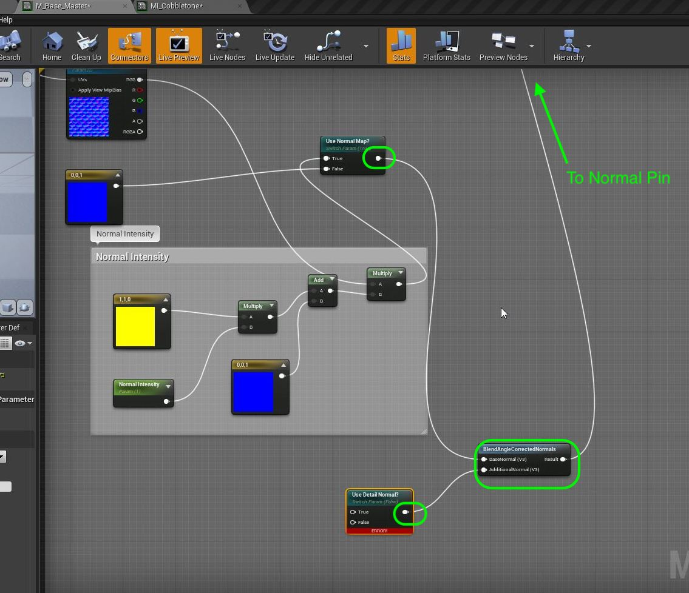

##### `Step 4.`\|`SUU&G`|:small_blue_diamond: :small_blue_diamond: :small_blue_diamond: :small_blue_diamond:

Take the same output of the **Constant Vector 3** that is **0,0,1** and add it to the **False** input of the **Switch** for the detailed normal.  This will add nothing if this is set to false.

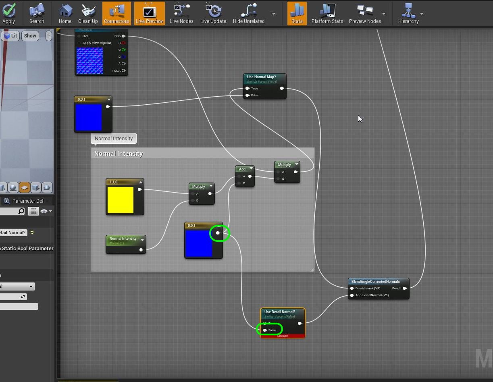

##### `Step 5.`\|`SUU&G`| :small_orange_diamond:

Add a **Multiply** node and connect the output to the **True** input to the detail normal **Switch**.

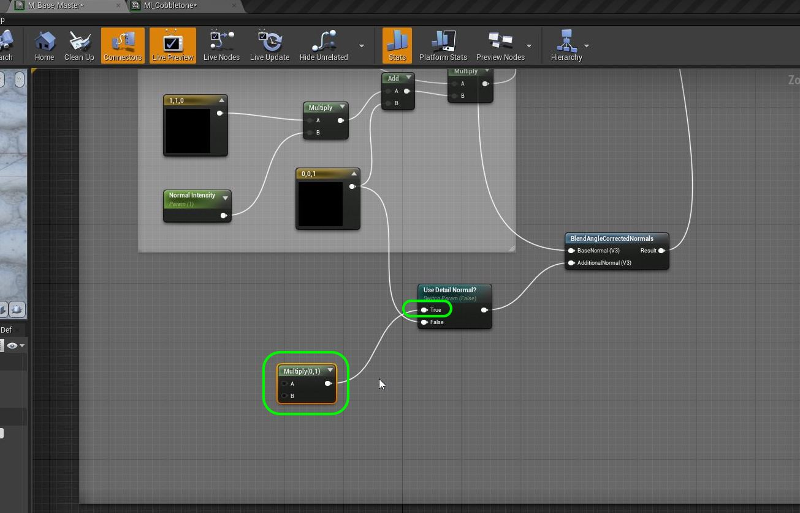

##### `Step 6.`\|`SUU&G`| :small_orange_diamond: :small_blue_diamond:

Add a **Texture Sample Parameter 2D** node and call it `Detail Normal Map`, put it in **Group** `Normal` and assign **T_Detail_Rocky_N** to it.

##### `Step 7.`\|`SUU&G`| :small_orange_diamond: :small_blue_diamond: :small_blue_diamond:

This will not connect to the normals of the larger texture.  We can set up separate UV's for the detail so it repeats over different sizes.  Copy and paste all the **Adjust UV** nodes minus the **Adjust UV Coordinates?** switch. Put them to the left of by the detailed normal texture.  Make room by scaling up your comment box so it all fits.

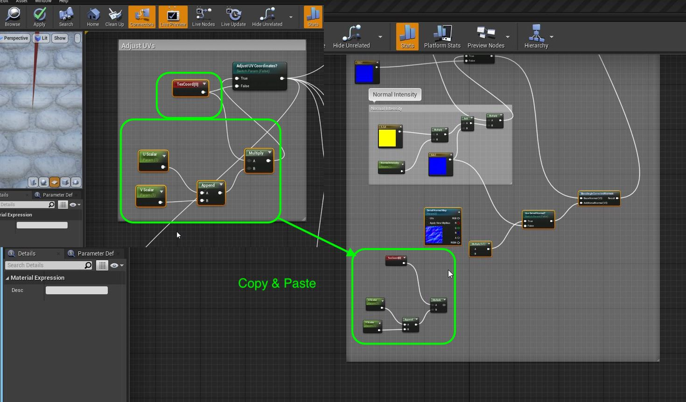

##### `Step 8.`\|`SUU&G`| :small_orange_diamond: :small_blue_diamond: :small_blue_diamond: :small_blue_diamond:

Rename the parameters to `Detail U Scalar` and `Detail V Scalar`.  Change both **Groups** to `Normal`.  Connect the output of the **Multiply** to the UV input of the **Detail Normal Map | UVs** pin.

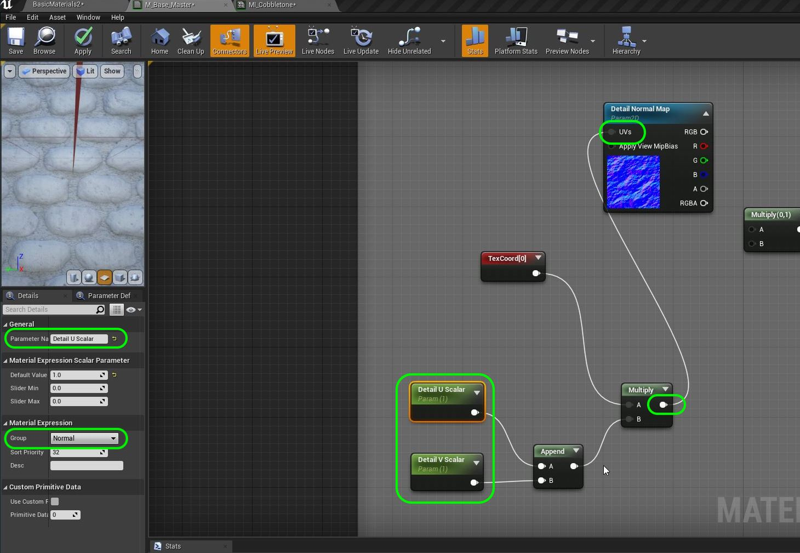

##### `Step 9.`\|`SUU&G`| :small_orange_diamond: :small_blue_diamond: :small_blue_diamond: :small_blue_diamond: :small_blue_diamond:

Now we want to control the intensity of this detailed normal.  Lets copy and paste all the **Normal Intensity** nodes and place them below the **Detail Normal Map**.

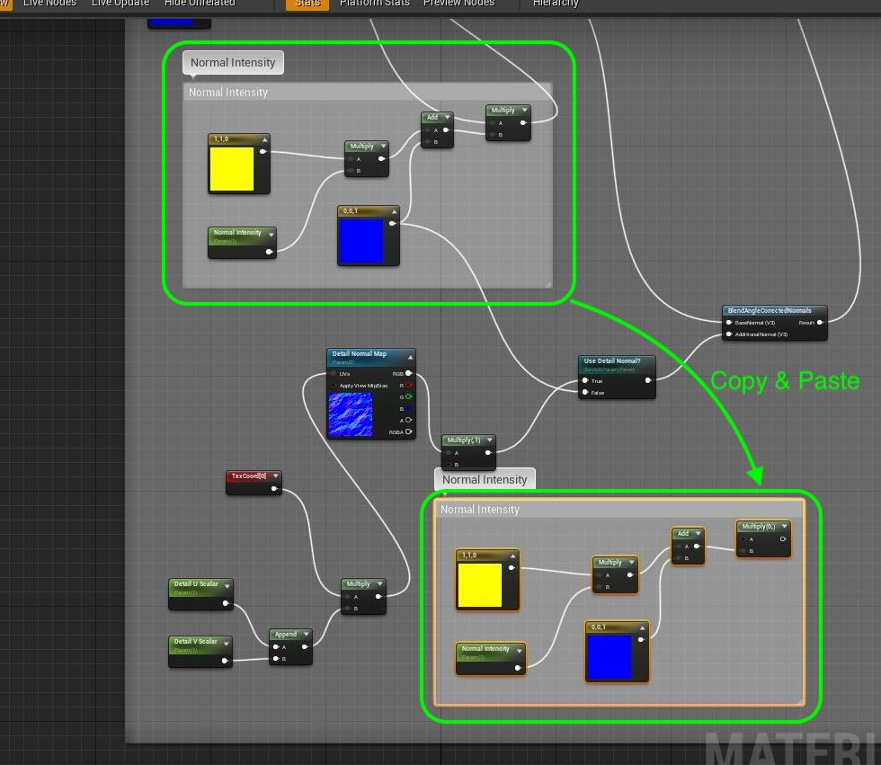

##### `Step 10.`\|`SUU&G`| :large_blue_diamond:
Rename the Scalar to `Detailed Normal Intensity` and change the **Comment** to `Detail Normal Intensity`.  Take the output of the **Multiply** node after the **Detail Normal Map** to the **A** side of the **Multiply** node in the **Detail Normal Intensity**.  Connect the output of the **Detail Normal Intensity | Multiply** node to the **True** input of the **Use Detail Normal?** pin.

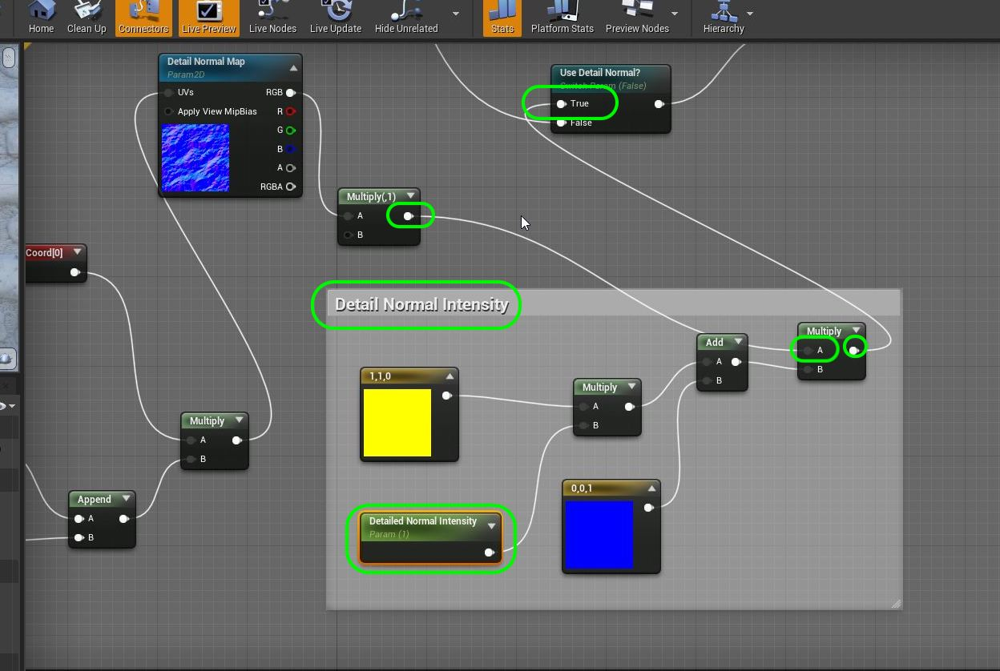

##### `Step 11.`\|`SUU&G`| :large_blue_diamond: :small_blue_diamond: 

Now press the <kbd>Apply</kbd> button on your master and return to your material instance. Make sure your Use Detail Normal is set to true.  Play around with the UV's and Intensity to get an effect you like.  You can see this previewed on the sphere in the instance editor without recompliing.  Notice that when you set **Use Detail Normal?** to `true` that other scalars pop up.  I liked the **Detail U Scalar** and **Detail V Scalar** to be set at `5.0`.  I reduced the **Detailed Normal Intensity** to `0.3` to minimize the effect and make it subtle. This repeat change helps hide the pattern of the main texture.

Go to the game and check out the result on the static mesh material previewer.

https://user-images.githubusercontent.com/5504953/131340917-7fc23b4d-5e92-4809-9557-fe569f38ccf2.mp4

##### `Step 12.`\|`SUU&G`| :large_blue_diamond: :small_blue_diamond: :small_blue_diamond: 

Download [T_Hewn_Stone_BaseColor.tif](../Assets/T_Hewn_Stone_BaseColor.tif), [T_Hewn_Stone_OcclusionRoughnessMetallic.tif](../Assets/T_Hewn_Stone_OcclusionRoughnessMetallic.tif), [T_Hewn_Stone_Emissive.tif](../Assets/T_Hewn_Stone_Emissive.tif) and [T_Hewn_Stone_Normal.tif](../Assets/T_Hewn_Stone_Normal.tif) to the **Textures** folder. Now create a new **Material Instance** from the base master material. Call it `MI_HewnStone`.  In **Room 8**, copy the material static mesh ball and assign this new material instance to slot **0**.

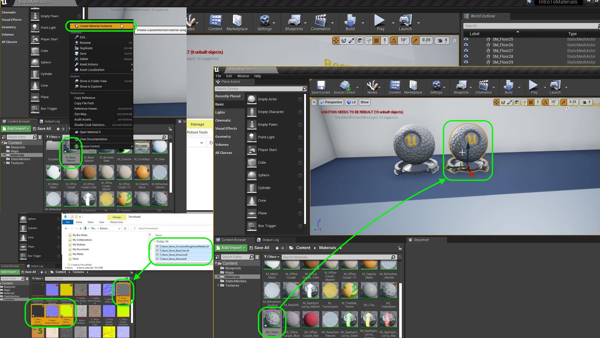

##### `Step 13.`\|`SUU&G`| :large_blue_diamond: :small_blue_diamond: :small_blue_diamond:  :small_blue_diamond: 

Double click the material instance and assign as the **Diffuse Texture** to **T_Hewn_Stone_BaseColor**. Set the **Metallic Texture**, **Roughness Texture** to  **T_Hewn_Stone_OcclusionRoughnessMetalic**. Assign the **Normal** map for the texture **T_Hewn_Stone_Normal** and set the **Detail Normal** to your liking:

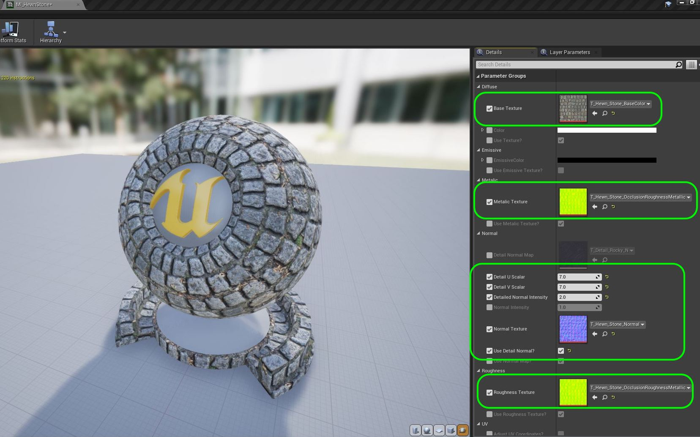

##### `Step 14.`\|`SUU&G`| :large_blue_diamond: :small_blue_diamond: :small_blue_diamond: :small_blue_diamond:  :small_blue_diamond: 

Now save the instance and go ingame to see your two stones using the same master.  Now the first texture looks a bit flat in its lighting.  Inlcuding the **Ambient Occlusion** node will help a lot with self shading on the materials.

https://user-images.githubusercontent.com/5504953/131355634-8d48ad40-4da3-4929-b5ba-ade43ca4ee5a.mp4

##### `Step 15.`\|`SUU&G`| :large_blue_diamond: :small_orange_diamond: 

Open up **M_Base_Master** and copy and paste all the nodes in the **Metalic** group.

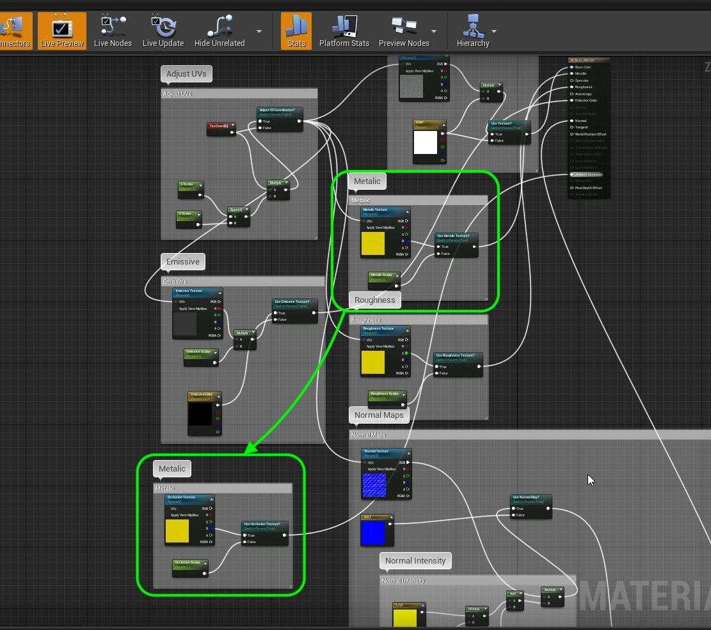

##### `Step 16.`\|`SUU&G`| :large_blue_diamond: :small_orange_diamond:   :small_blue_diamond: 

Change the **Comment** to `Ambient Occlusion`.  Change the Texture to `Occlusion Texture` and use the **R** pin to go to the **True** node.  Rename the switch to `Use Occlusion Texture?`.  Change the scalar to `Occlusion Scalar`, set its **Default** to `1.0`. Change all the node's **Group** settings to `Occlusion`.  Connect the output of the **Use Occlusion Texutre?** to the **Ambient Occlusion** pin on the main shader node.

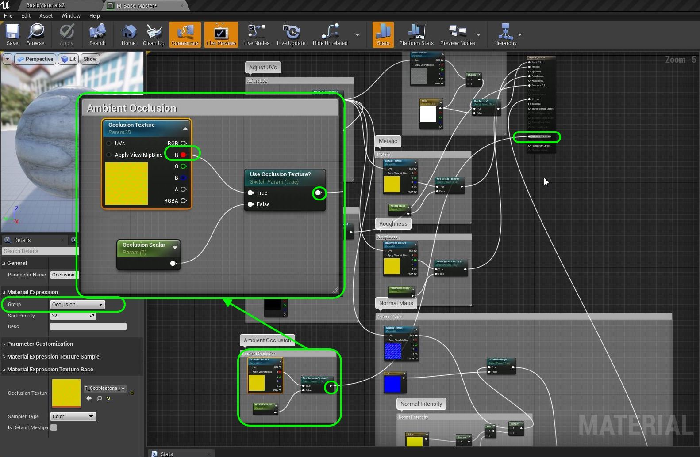

##### `Step 17.`\|`SUU&G`| :large_blue_diamond: :small_orange_diamond: :small_blue_diamond: :small_blue_diamond:

There is a lot more definition of interior shading with the ambient occlusion maps. Play the game and take a look.  Lets create a third material instance next.

https://user-images.githubusercontent.com/5504953/131360729-363abb84-eb83-48a7-a8fc-4b7e279353bd.mp4

##### `Step 18.`\|`SUU&G`| :large_blue_diamond: :small_orange_diamond: :small_blue_diamond: :small_blue_diamond: :small_blue_diamond:

The cobblestone instance was perfect for my needs but I want to use another one with a different hue.  We can actually make an instance of an instance so that it preserves the previous settings.  Right click on **MI_Cobblestone** and select **Create Materail Instance**. Call it `MI_Cobblestone_Beige`. 

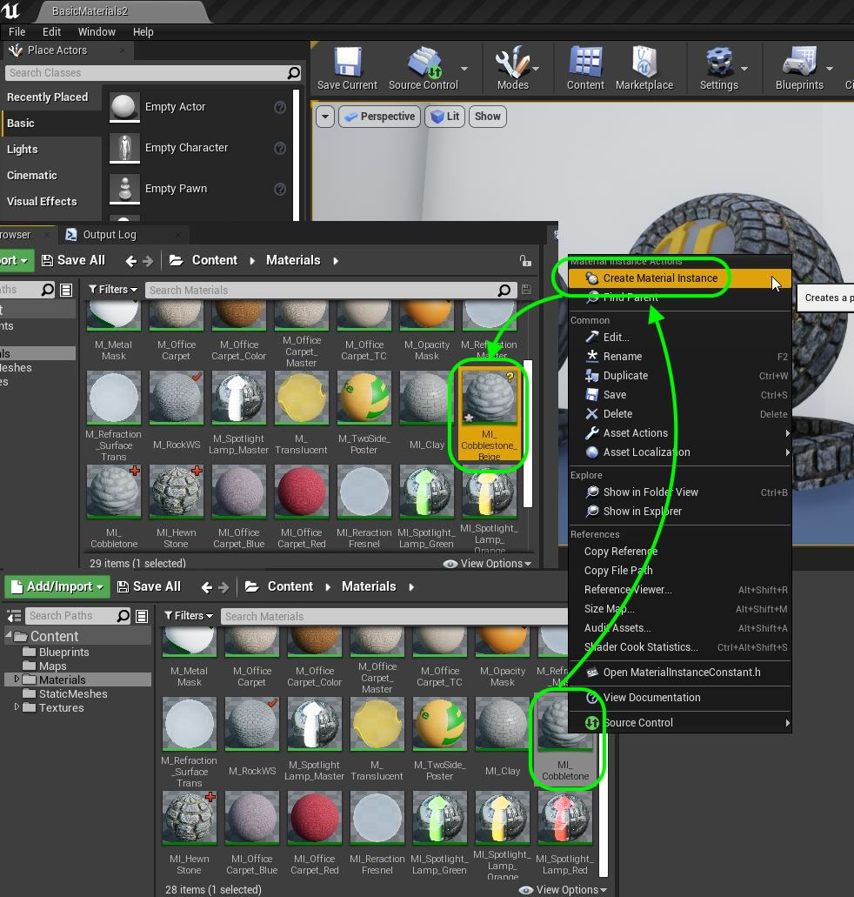

##### `Step 19.`\|`SUU&G`| :large_blue_diamond: :small_orange_diamond: :small_blue_diamond: :small_blue_diamond: :small_blue_diamond: :small_blue_diamond:

Go into the instance and change the **| Color** to a light shade of beige.

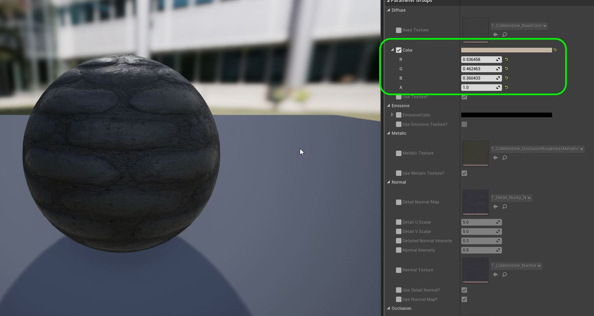

##### `Step 20.`\|`SUU&G`| :large_blue_diamond: :large_blue_diamond:

Add another material sphere and put this new **MI_Cobblestone_Beige** texture and see how fast we can create variations.

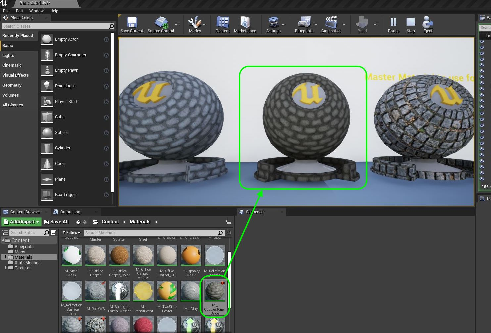

##### `Step 21.`\|`SUU&G`| :large_blue_diamond: :large_blue_diamond: :small_blue_diamond:

Create a new **Material Instance** from the **MI_Cobblestone** and call it `MI_Cobblestone_Emissive`.

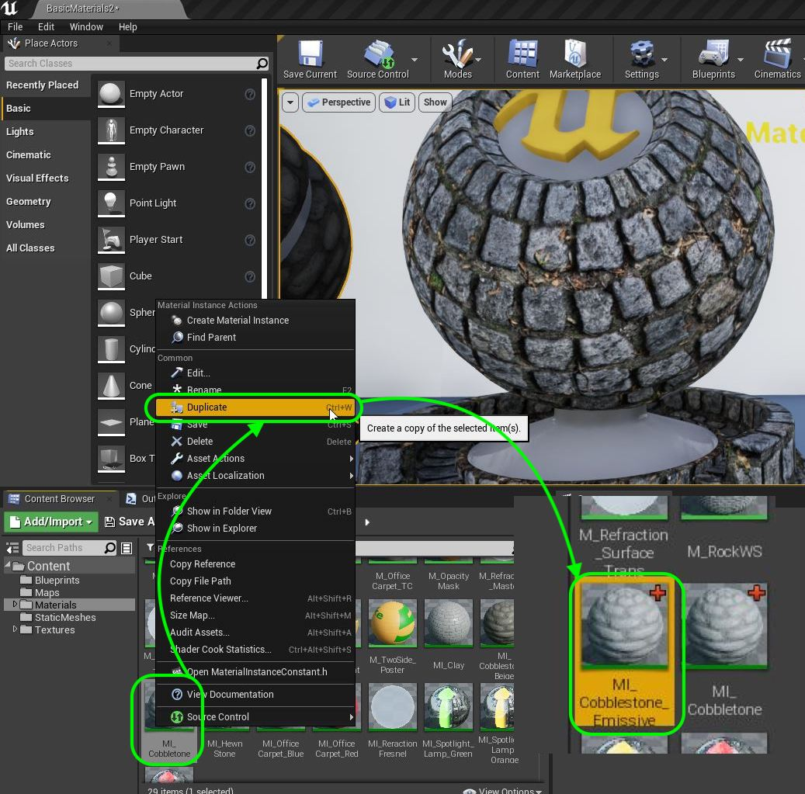

##### `Step 22.`\|`SUU&G`| :large_blue_diamond: :large_blue_diamond: :small_blue_diamond: :small_blue_diamond:

Lets change the size of the times and increase the repeat. Change the **Adjust UV Coordinates?** to `true` and and change the **U Scalar** and **V Scalar** to `2.0`. Change **Use Emissive Texture?** to `true. Add an **Emissive Texture** and use the Chevron we previously imported. Set the **Emissive Scalar** to `.05` for a more subtle effect.

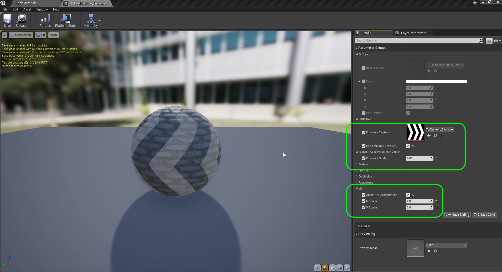

##### `Step 23.`\|`SUU&G`| :large_blue_diamond: :large_blue_diamond: :small_blue_diamond: :small_blue_diamond: :small_blue_diamond:

Press the **Build** button to rebuild all the static lights.  Now run the game and look at the difference we can make with a single master material!

https://user-images.githubusercontent.com/5504953/131368469-60b1fb18-4ce4-4c05-936c-2050bb0b933f.mp4

##### `Step 23.`\|`SUU&G`| :large_blue_diamond: :large_blue_diamond: :small_blue_diamond: :small_blue_diamond: :small_blue_diamond:

That's finally it for **Room 9**. Press **Save All** and update Github by **committing** and **pushing** all the changes made. 

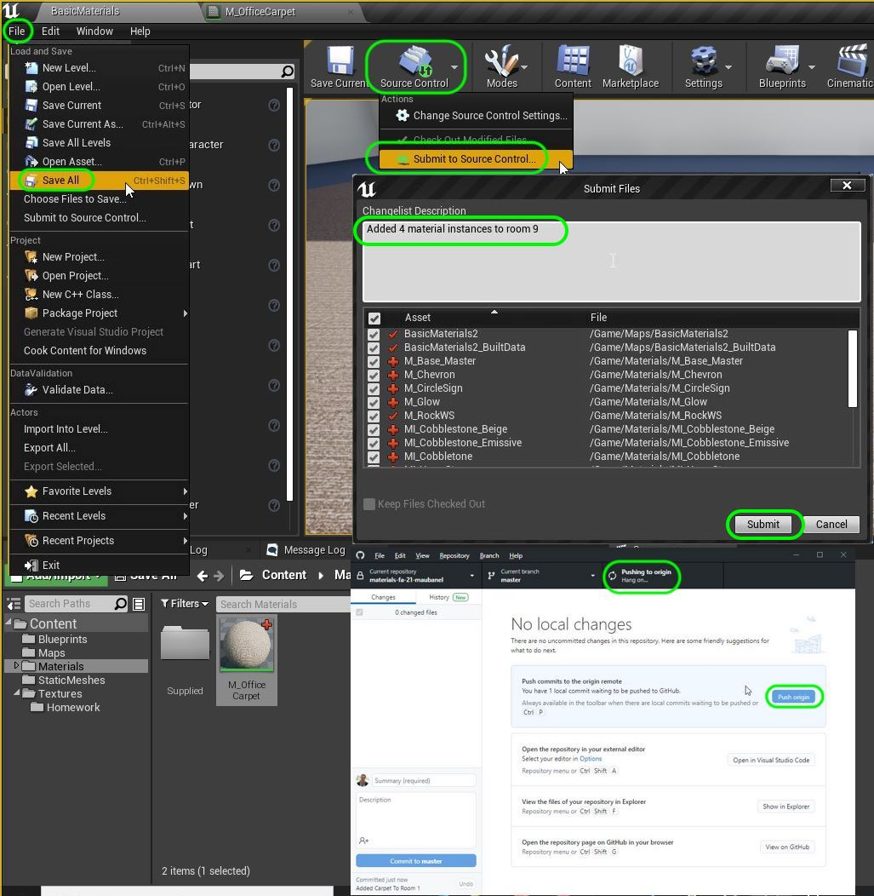

| `materials.textures`\|`THE END`| 
| :--- |
| **That's All Folks!** Thanks for sticking around. That's it for this lesson. |

___

| [previous](../master-material-1/README.md#user-content-complex-master-material---part-i)| [home](../README.md#user-content-ue4-intro-to-materials) |
|---|---|
