### Material Instances

[previous](../color-math/README.md#user-content-material-color-math) • [home](../README.md#user-content-ue4-intro-to-materials) • [next](../adding-parameters/README.md#user-content-adding-parameters)

Now there is a way of setting up materials so that artists can make changes without having to understand the material editor. We can turn nodes into variables that can be edited inside the material without using nodes.  Lets take a look at creating a workflow that is a little more *artist* friendly.

 

---

##### `Step 1.`\|`SUU&G`|:small_blue_diamond:

Materials can be pretty expensive in Unreal.  We can't have too many of them per level.  There is a technique where we can get a lot of variety but not use completely different Materials. If you can use the same Material but different values we can use the same Structural Model.  What we do is we change the nodes to editable values and we allow instances to be made differently.  

Also, some materials can containt hundreds of nodes and very hard to know what to change to get the desired result.

Lets rebuild the carpet Material to allow for instances as we want multiple different types of carpets in the game.

Go to the **Materials** folder and press **Add New**.  Add another Material and name it `M_OfficeCarpet_Master`.  The `_Master` indicates that this material is going to be used in a child instance.

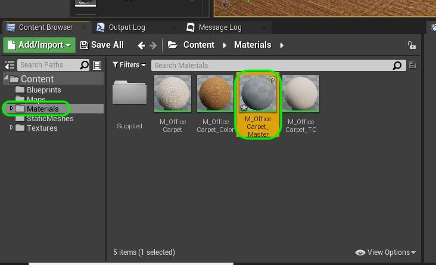

##### `Step 2.`\|`FHIU`|:small_blue_diamond: :small_blue_diamond: 

Lets add our diffuse color map.  But this time we want to expose it as a parameter. This can be done in two ways.  First, right click and select **Texture Sample**.  On this node right click and select **Convert to Parameter**.

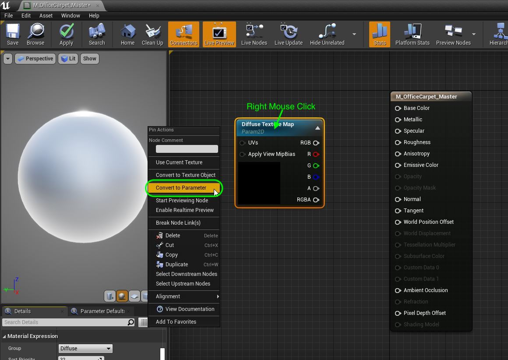

Or you can do it in one step by right clicking and selecting **Texture Sample Parameter 2D**.

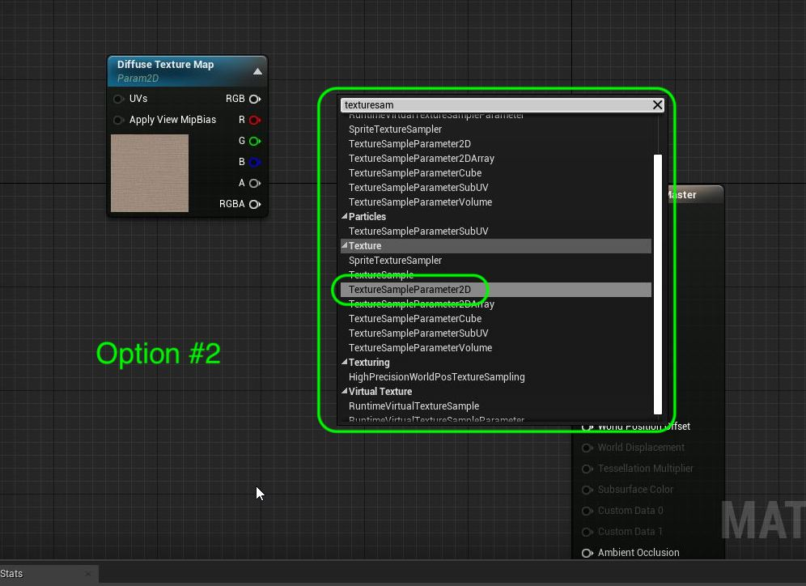

##### `Step 3.`\|`SUU&G`|:small_blue_diamond: :small_blue_diamond: :small_blue_diamond:

Name this node `Diffuse Texture Map` and in the **Details** panel add a new **Group** and call it `Diffuse`.  Select the **T_OfficeCarpet_BC** texture. In the **Group** menu you can type in any name that is not already in the list.  There is no interface to add a new item, you just enter it and it will be added automatically and show up as a selection next time in this project.

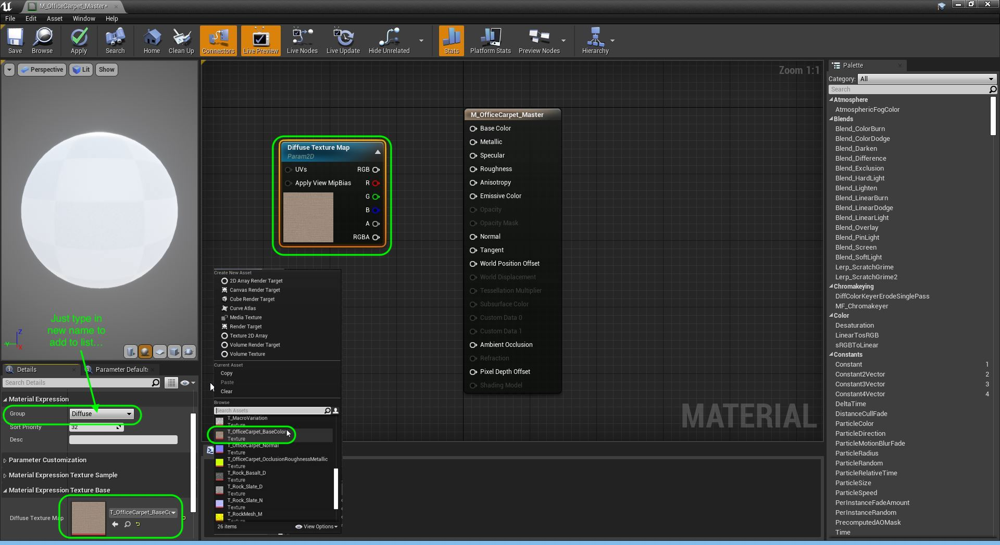

##### `Step 4.`\|`SUU&G`|:small_blue_diamond: :small_blue_diamond: :small_blue_diamond: :small_blue_diamond:

Now do the same thing by adding a **Constant3Vector**.  Right click and and select **Convert to Parameter** (or you could just add a **Vector Parameter**).

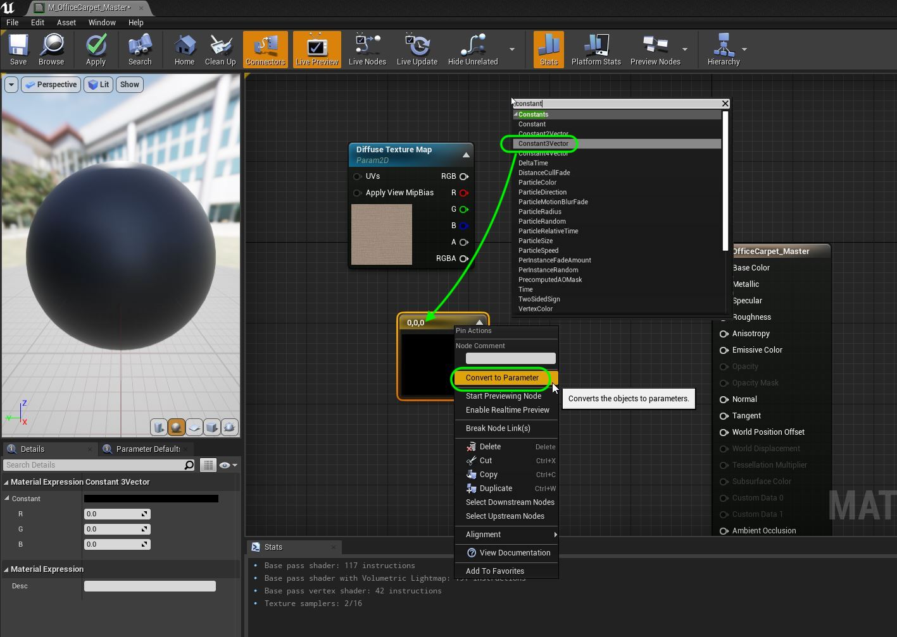

##### `Step 5.`\|`SUU&G`| :small_orange_diamond:

Call this parameter `Diffuse Color` and add the `Diffuse` **Group** in the **Details** panel.

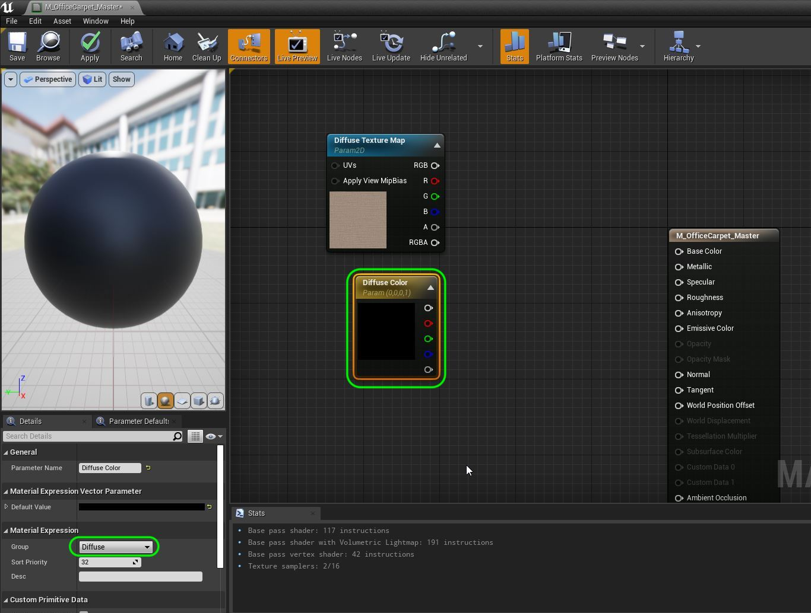

##### `Step 6.`\|`SUU&G`| :small_orange_diamond: :small_blue_diamond:

Double click the **Diffuse Color** and pick the default color for your carpet (you can select white or 1,1,1 if you want to keep the original and not multiply).  Add a **Multiply** node and connect the pins so that the Texture is Multiplied by the Color Tint and hooked into the **Base Color** node. Press the **Apply** button on the top menu.

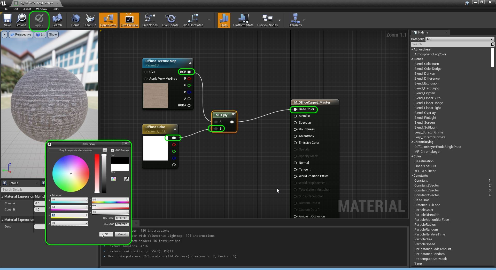

##### `Step 7.`\|`SUU&G`| :small_orange_diamond: :small_blue_diamond: :small_blue_diamond:

Before we finish the rest of this material lets see why this is different.  Lets move into the **Materials** folder and right click on the **M_OfficeCarpet_Master** and select **Create Material Instance**.

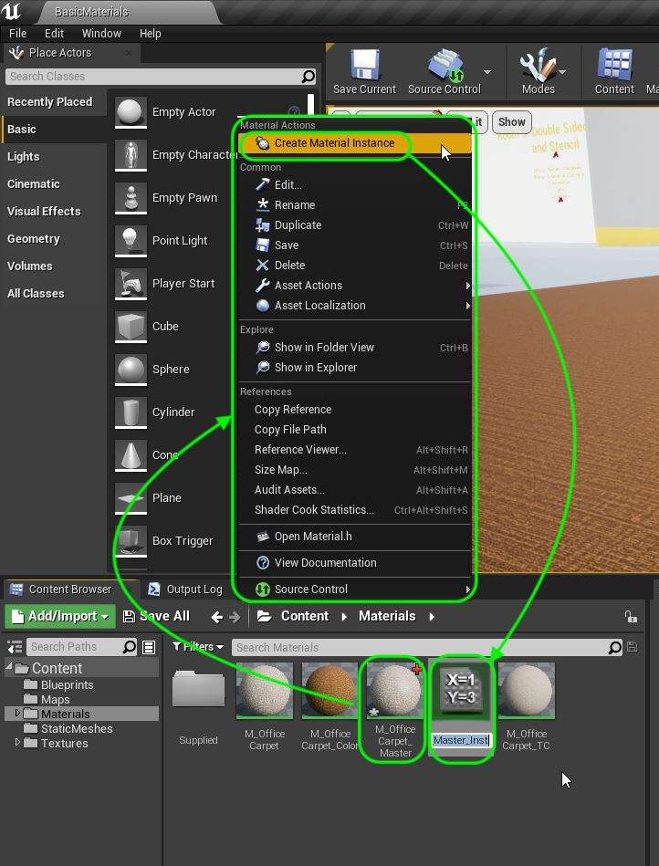

Name this material instance `MI_OfficeCarpet_Red`.

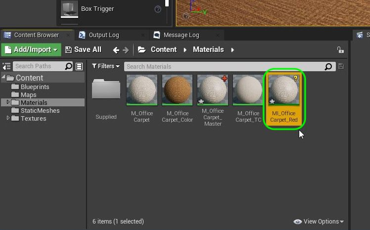

##### `Step 8.`\|`SUU&G`| :small_orange_diamond: :small_blue_diamond: :small_blue_diamond: :small_blue_diamond:

Double click **MI_OfficeCarpet_Red** and take a look at the screen.  The Nodes are gone and you just see a giant material with a **Details** panel to the right. I just see the parameters that I have exposed organized into the groups we created.

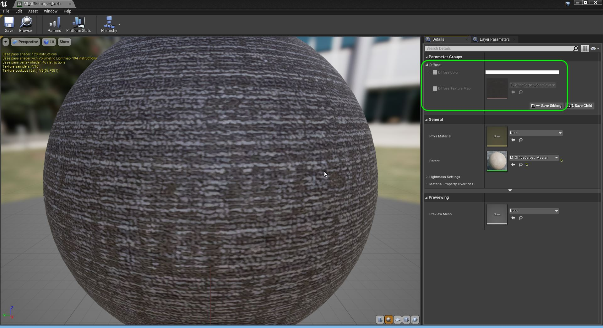

##### `Step 9.`\|`SUU&G`| :small_orange_diamond: :small_blue_diamond: :small_blue_diamond: :small_blue_diamond: :small_blue_diamond:

If we want to edit anything we need to click the radio box next to the parameter we want to change.  Lets change the diffuse color so select the box and double click the color bar to get the color picker.  Select a shade of red. Notice that an instance doesn't need to compile there is no apply button.  The changes are instant, a speed improvement for the person editing the material. This is another reason to use instances when you can.

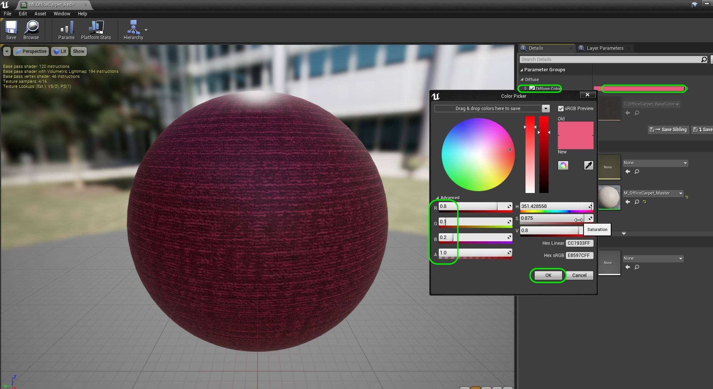

##### `Step 10.`\|`SUU&G`| :large_blue_diamond:

Now would be a good time to go back to the **Content Browser** in the **Materials** folder and select **Save All**.  This will save all of our work. Scroll the camera over to **Room 2** in the level.

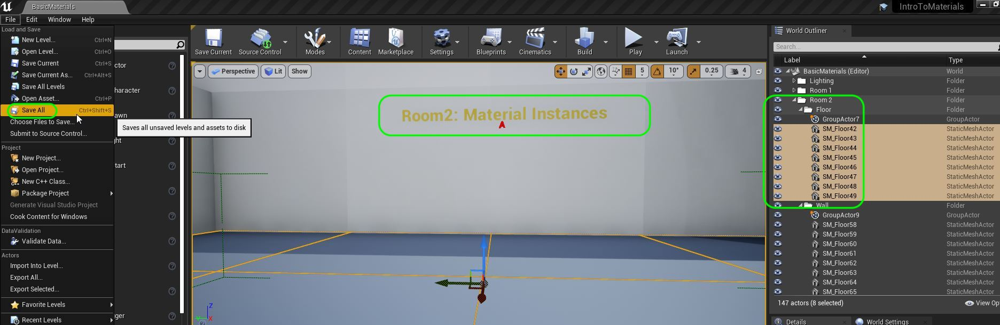

##### `Step 11.`\|`SUU&G`| :large_blue_diamond: :small_blue_diamond: 

Drage a copy of **SM_OfficeCarpet** into **Room 2** and rotate to fit along the left edge.  Add the **MI_OfficeCarpet_Red**.  Check it out in game.

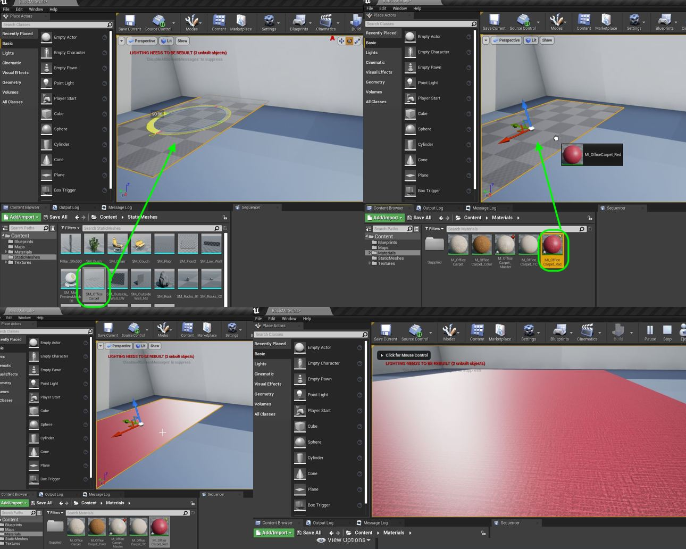

##### `Step 12.`\|`SUU&G`| :large_blue_diamond: :small_blue_diamond: :small_blue_diamond: 

Repeat the same for **MI_OfficeCarpet_Blue** but select a blue color and add a carpet to the room.

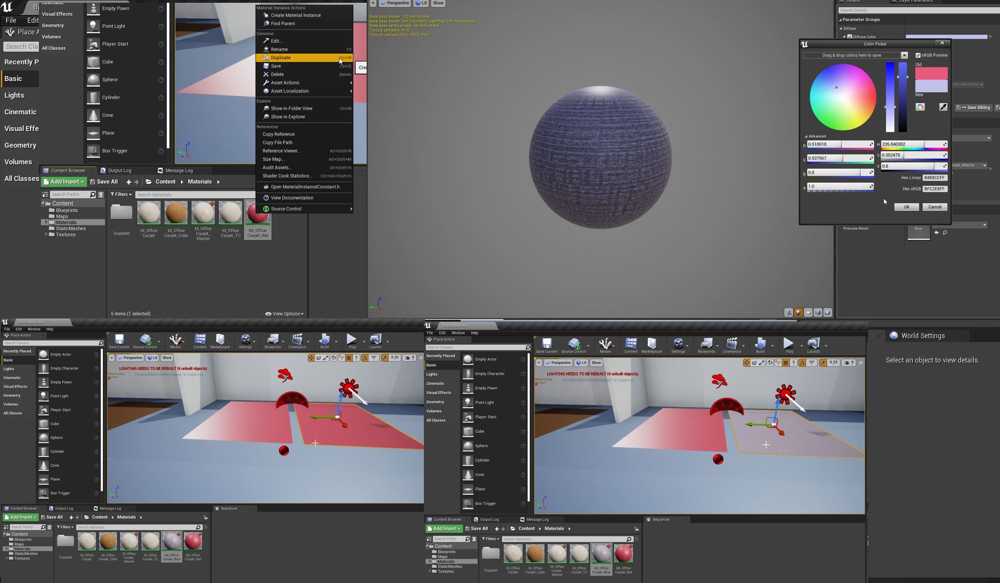

##### `Step 13.`\|`SUU&G`| :large_blue_diamond: :small_blue_diamond: :small_blue_diamond:  :small_blue_diamond: 

Duplicate **MI_Office_Carpet_Red** and call it `MI_Clay`.  We will replace the texture to change the base color entirely!

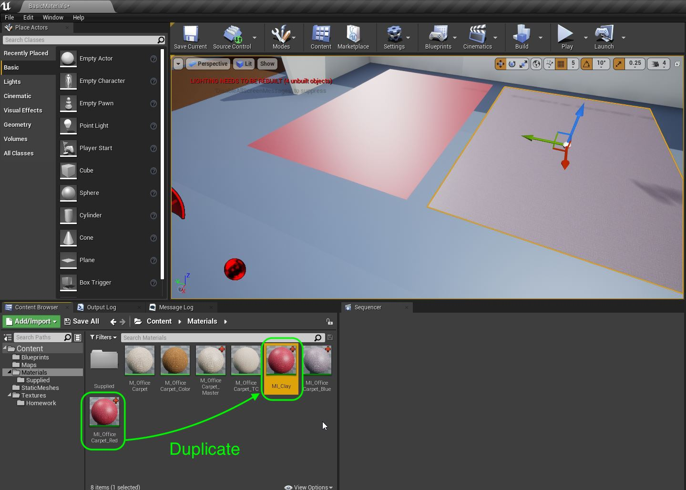

##### `Step 14.`\|`SUU&G`| :large_blue_diamond: :small_blue_diamond: :small_blue_diamond: :small_blue_diamond:  :small_blue_diamond: 

 Turn the **Diffuse Color** off to leave the color in the texture.  Then click **Diffuse Texture Map** and select **T_Brick_Clay_Beveled_D**.  Drag a third carpet in the room and assign the new clay materail.  Look at how you can use the same master material for surfaces with the same property but completely unique texture maps.  This is the one of the super powers of material instances.

 Now please be aware that any changes you make to the master will be reflected in the Instances.  These are children to the Master material.  If you like you can even make instances of instances but the parent child relationship with the master will still hold. So any change to the master will reflect in the children.

##### `Step 15.`\|`SUU&G`| :large_blue_diamond: :small_orange_diamond: 

OK, now lets finish up this section by savin our work and uploading it to GitHub.  Press **File | Save All** then **Source Conrol | Submit to Source Control...** and add a description.  Press the <kbd>Submit</kbd> button.  Open up **GitHub Desktop** and **Push** the commited work.

___

| [previous](../color-math/README.md#user-content-material-color-math)| [home](../README.md#user-content-ue4-intro-to-materials) | [next](../adding-parameters/README.md#user-content-adding-parameters)|
|---|---|---|
