### Refraction and Fresnel

[previous](../decals/README.md#user-content-decals) • [home](../README.md#user-content-ue4-intro-to-materials) • [next](../world-alignment/README.md#user-content-world-aligned-materials)

How do we handle materials like glass that are subtle and reflect and distort the light moving through it?  Unreal gives us different strategies and some are more expensive than others.

 

---

##### `Step 1.`\|`UE5MAT`|:small_blue_diamond:

We are moving on to the final **Room #6** for this level.  When rendering glass or translucent materials they have the property of bending light and acting like a lense.  This called refraction.  Unreal supports this for its transparent textures. Lets move the camera to **Room 6**.

##### `Step 2.`\|`UE5MAT`|:small_blue_diamond: :small_blue_diamond: 

Now create a new material and call it `M_Refraction_Master`. We are creating a master material as we will show you different ways of spending computer time to create a more realistic glass effect.

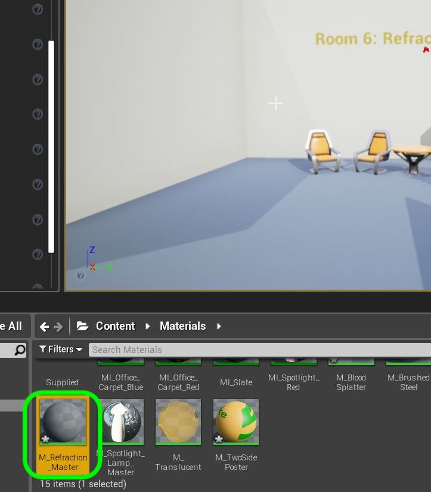

##### `Step 3.`\|`UE5MAT`|:small_blue_diamond: :small_blue_diamond: :small_blue_diamond:

Open the material and in the details panel change the **Blend Mode** to **Translucent**.  Notice that this opens up the **Refraction** pin.

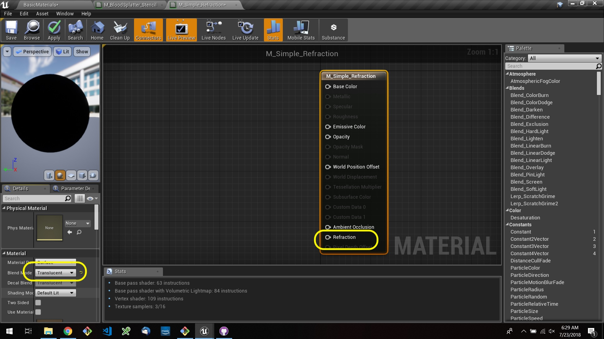

##### `Step 4.`\|`UE5MAT`|:small_blue_diamond: :small_blue_diamond: :small_blue_diamond: :small_blue_diamond:

Add a **Constant 3 Vector** and make it light blue like glass.  Connect it to the base color node.  We will set **R** to `0.66`, **G** to `0.799` and **B** to `.984`. Attach the output to the **Base Color** pin.

##### `Step 5.`\|`UE5MAT`| :small_orange_diamond:

Add a **Constant** and make it `.3` and attach it to **Opacity**.

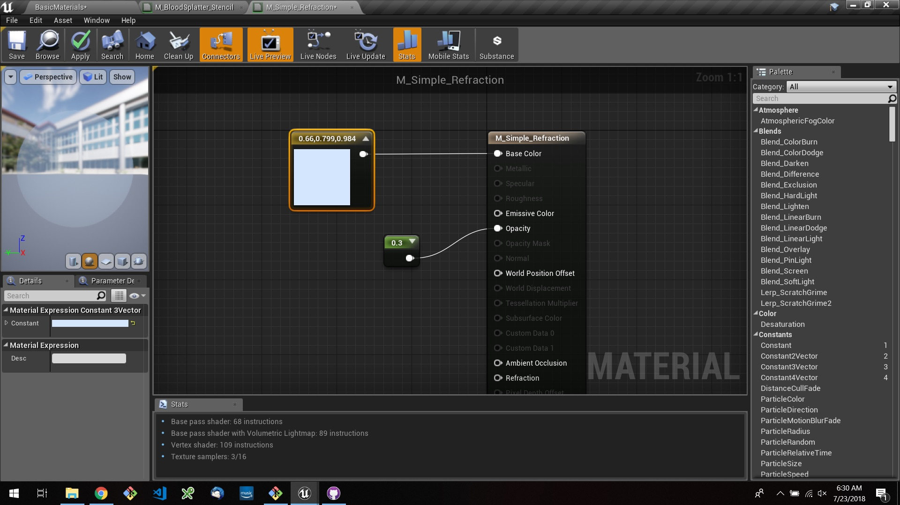

##### `Step 6.`\|`UE5MAT`| :small_orange_diamond: :small_blue_diamond:

Add comments to your nodes by pressing the <kbd>C</kbd> key. Also, since we are seeing **through** the material we want to set up the **Material | Two Sided** to be `true` (selected). You can see this option by selecting the main shader node.

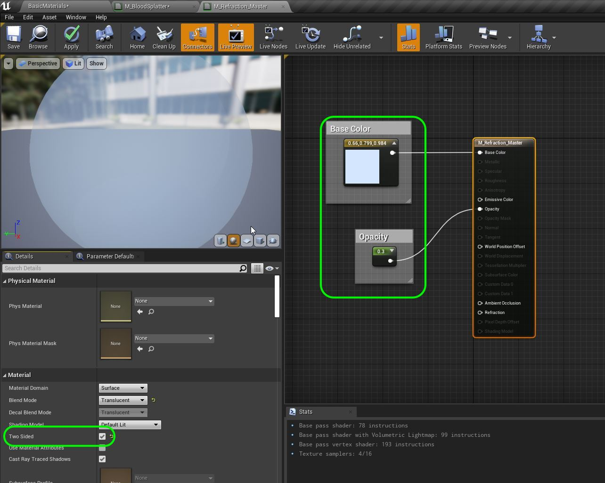

##### `Step 7.`\|`UE5MAT`| :small_orange_diamond: :small_blue_diamond: :small_blue_diamond:

Add a **Constant** node and make it `.1`. Send the output to the **Refraction** input pin in the shader node. Notice how this gets to be like a magnifying glass making objects appear larger.

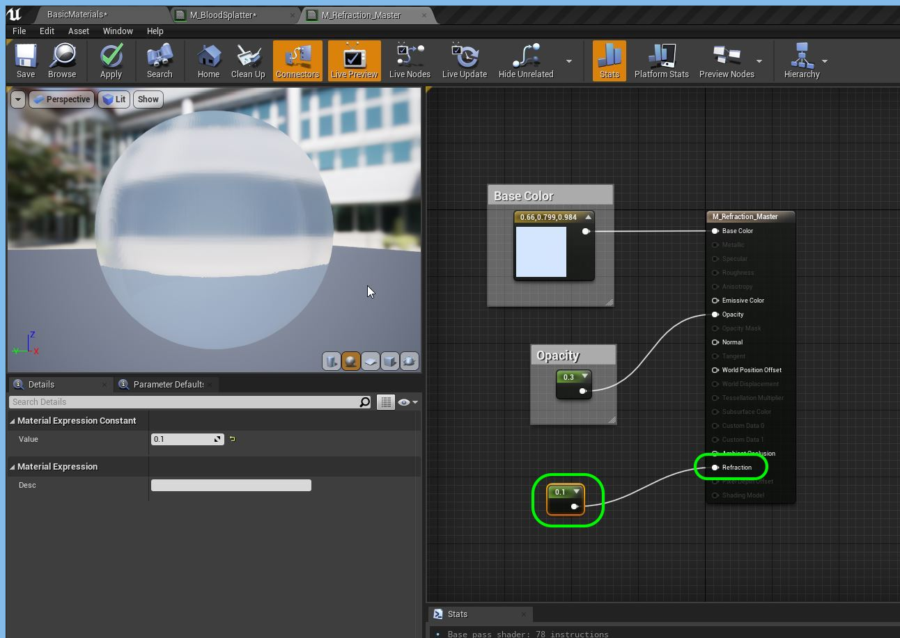

##### `Step 8.`\|`UE5MAT`| :small_orange_diamond: :small_blue_diamond: :small_blue_diamond: :small_blue_diamond:

Change the refraction index to `2.0` and  make things smaller like a wide angle lens.

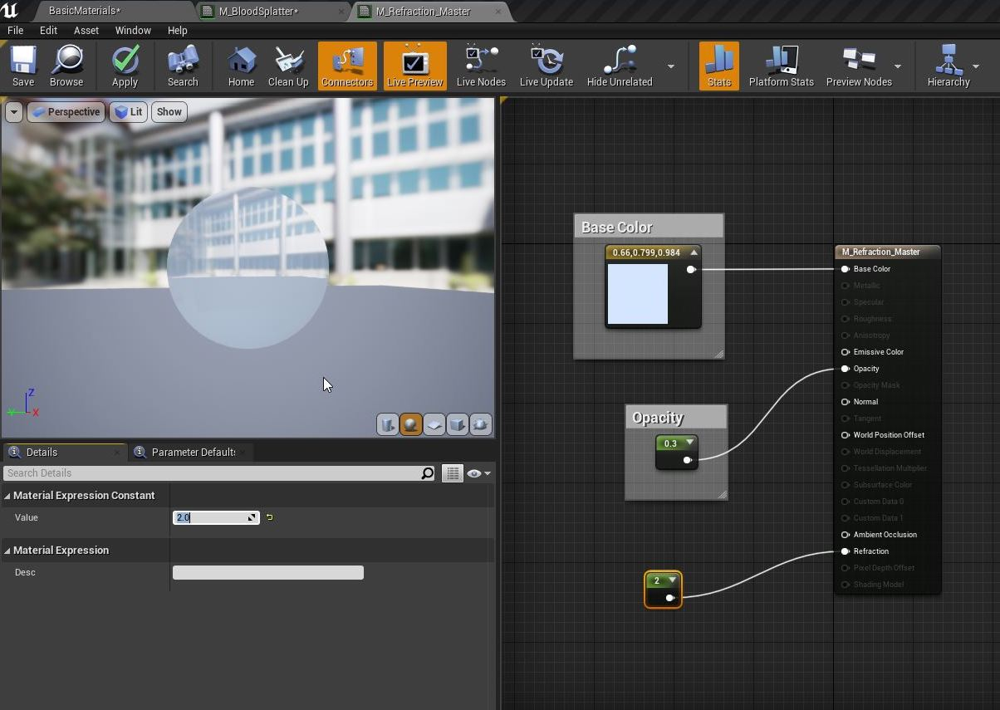

##### `Step 9.`\|`UE5MAT`| :small_orange_diamond: :small_blue_diamond: :small_blue_diamond: :small_blue_diamond: :small_blue_diamond:

Change to the refraction index of glass which is roughly `1.33`.  Add comments to your node. Make material double sided as we see through the object. Press the <kbd>Apply</kbd> button. 

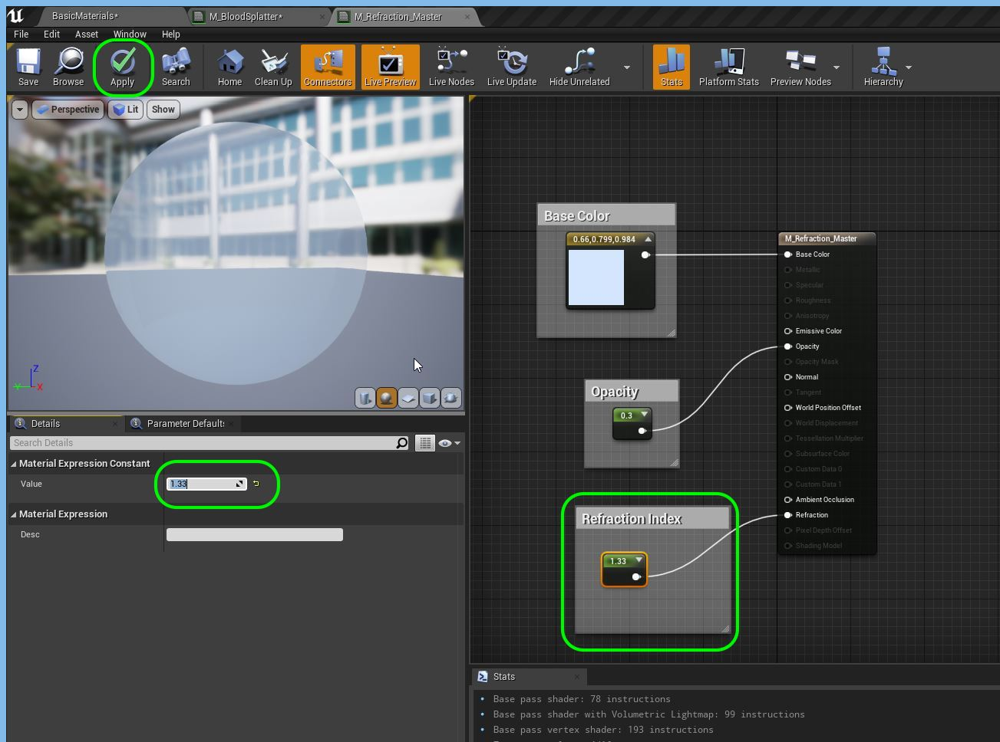

##### `Step 10.`\|`UE5MAT`| :large_blue_diamond:

Add a **Sphere** to your level and scale it up fairly large.  I set mine to `3.0` on **XYZ**.  Make room for it as we will need to fit 4 spheres in the room.

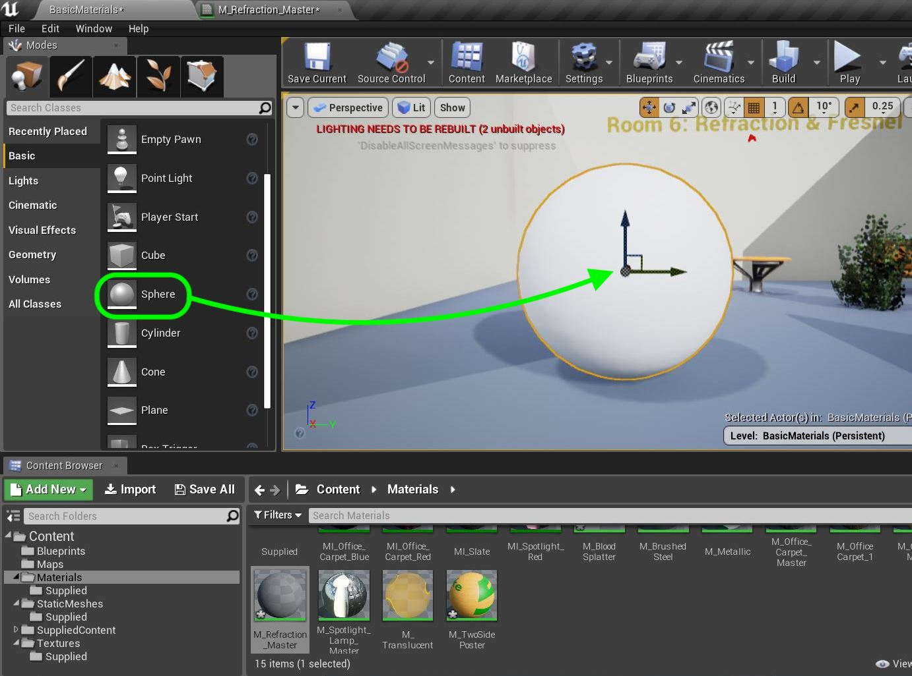

##### `Step 11.`\|`UE5MAT`| :large_blue_diamond: :small_blue_diamond: 

Add the material to the game object and voila, simple glass ball!

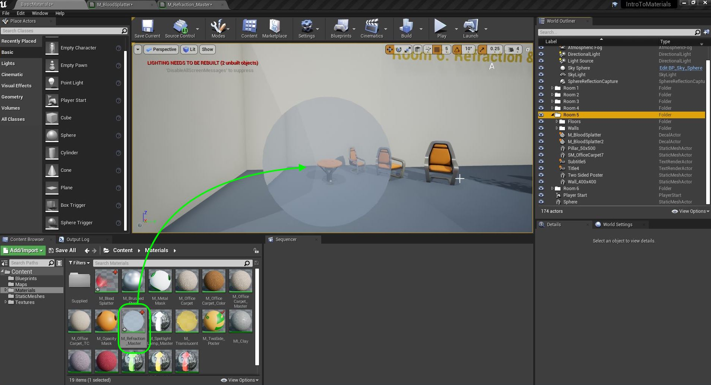

##### `Step 12.`\|`UE5MAT`| :large_blue_diamond: :small_blue_diamond: :small_blue_diamond: 

Now that looks OK in game, but we can make it look better.  If this was a real glass sphere the refraction would be greater around the edges versus the center where the two glass planes are at their furthest distance. Now [Fresnel](https://www.scratchapixel.com/lessons/3d-basic-rendering/introduction-to-shading/reflection-refraction-fresnel) in computer graphics controls the amount of refraction versus reflection of a translucent surface based on the angle.  If you look at a lake, at certain angles it is completely reflective and others completely refractive.  Now we want to be able to toggle this on or off in our instance.  How do we have a path of a Material that we can turn on and off like a light switch?  

Add a **Static Switch Parameter** node to the material and call it `Use Fresnel?`.  Connect the output of the Vector to the input **False**. This means if it is set to false it will behave without the Fresnel.  Ignore the error as we will fix it next.

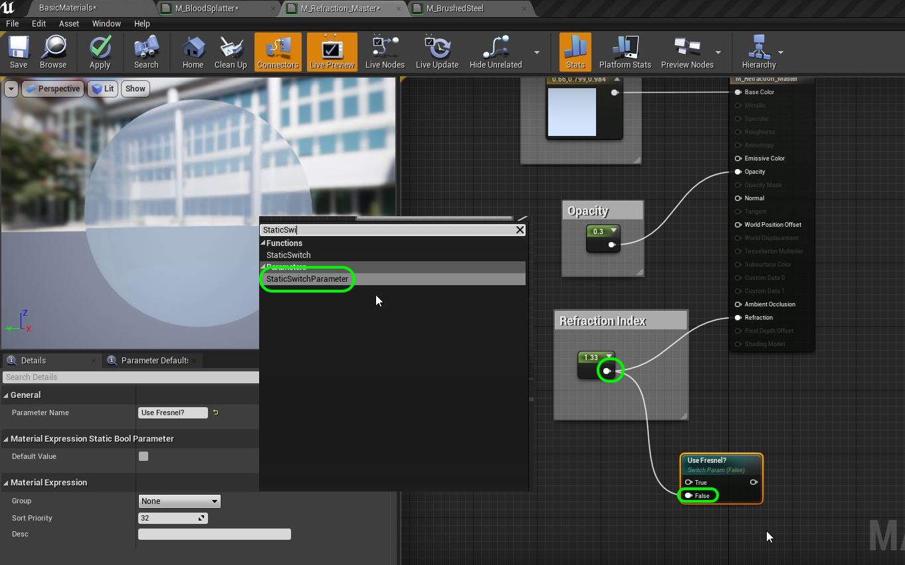

##### `Step 13.`\|`UE5MAT`| :large_blue_diamond: :small_blue_diamond: :small_blue_diamond:  :small_blue_diamond: 

Take the output pin from the **Switch** and connect it to the **Refraction** pin in the main Material node.  Add a **Utility | Fresnel** node and surround all nodes with a comment.

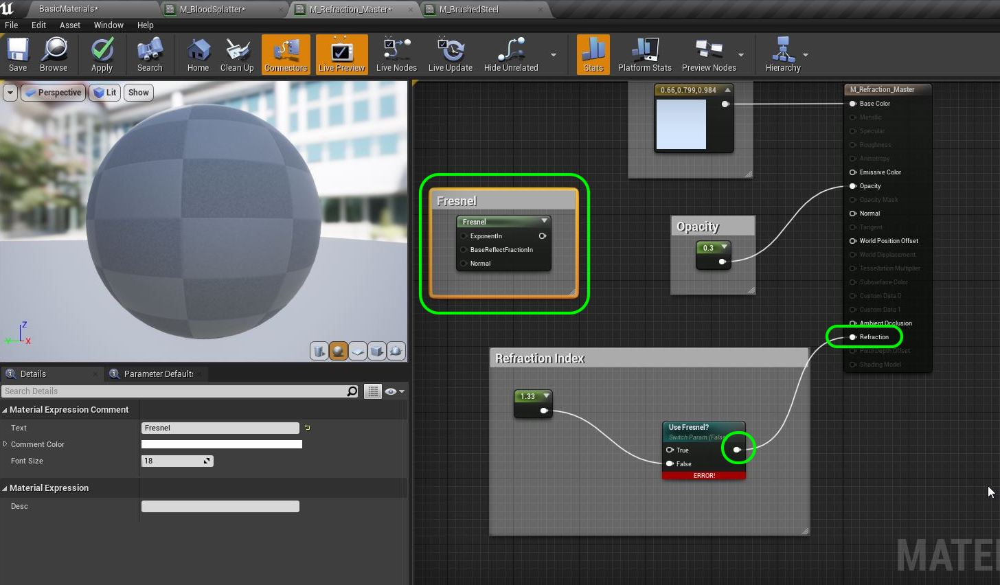

##### `Step 14.`\|`UE5MAT`| :large_blue_diamond: :small_blue_diamond: :small_blue_diamond: :small_blue_diamond:  :small_blue_diamond: 

Now connect the output of the Fresnel node to the **True** pin of the  **Switch**. Press the <kbd>Apply</kbd> button.

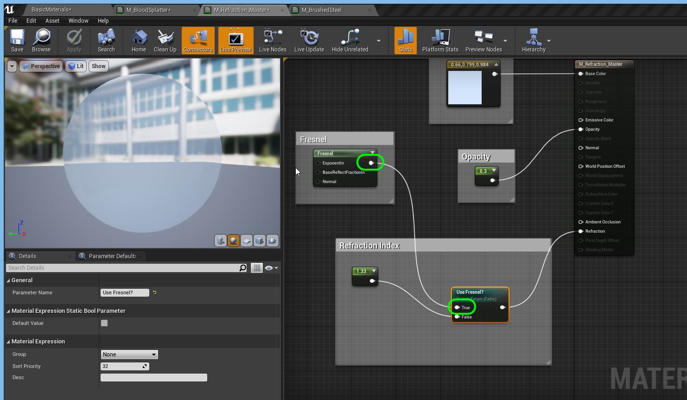

##### `Step 15.`\|`UE5MAT`| :large_blue_diamond: :small_orange_diamond: 

Go into the game and right click on the Material and create a **Material Instance** called `MI_RefractionFresnel`.  Open the Material Instance and make sure **Use Frensnel** is switched to `true` with a checkmark in **both** boxes.

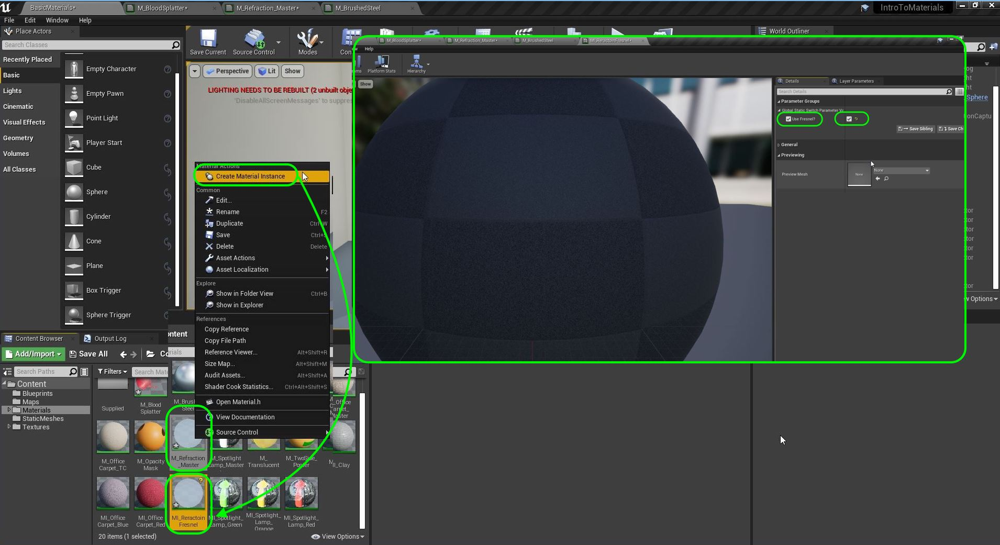

##### `Step 16.`\|`UE5MAT`| :large_blue_diamond: :small_orange_diamond:   :small_blue_diamond: 

Now go into the game and duplicate your first sphere. Assign the **MI_RefractionFresnel** material to another sphere.  Look at it, and oh it is all distorted and upside down.  Why?

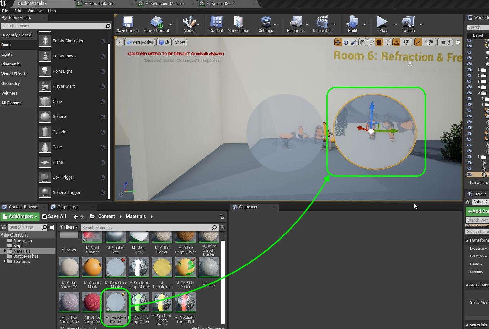

##### `Step 17.`\|`UE5MAT`| :large_blue_diamond: :small_orange_diamond: :small_blue_diamond: :small_blue_diamond:

Go back to the original **M_Simple_Refraction_Transparency_Master** and right click on Fresnel and select **Start Realtime Preview**. Oh, now I I see the problem.  What is happening is that the white pixels are on the edge (a value of 1).  This in the fraction pin does nothing.  In the middle it is black which is near 0 which is MASSIVE magnification.

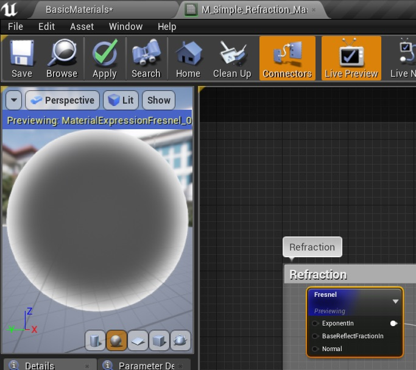

##### `Step 18.`\|`UE5MAT`| :large_blue_diamond: :small_orange_diamond: :small_blue_diamond: :small_blue_diamond: :small_blue_diamond:

So what we want to do is go from 1 to 2.  We can add `1` to the entire fresnel to increase the range.  We do this by dropping in an **Add** node and **Constant** node set to `1` between Fresnel and the Switch like so.

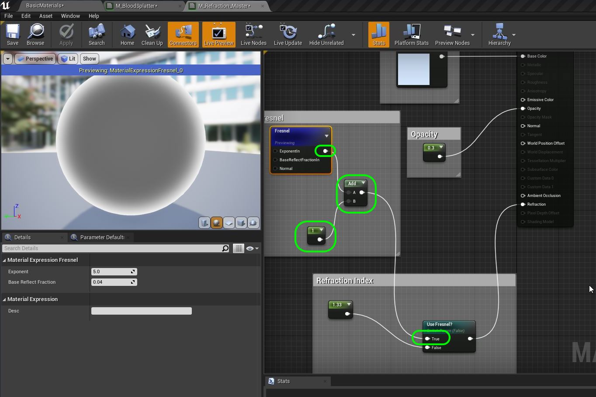

##### `Step 19.`\|`UE5MAT`| :large_blue_diamond: :small_orange_diamond: :small_blue_diamond: :small_blue_diamond: :small_blue_diamond: :small_blue_diamond:

Now if we preview the **Add** node we will not see the outcome of what we are doing.  The game will only render white now and it will be impossilbe to see the difference between the 1.0 and 2.0 pixels.  But it is there!

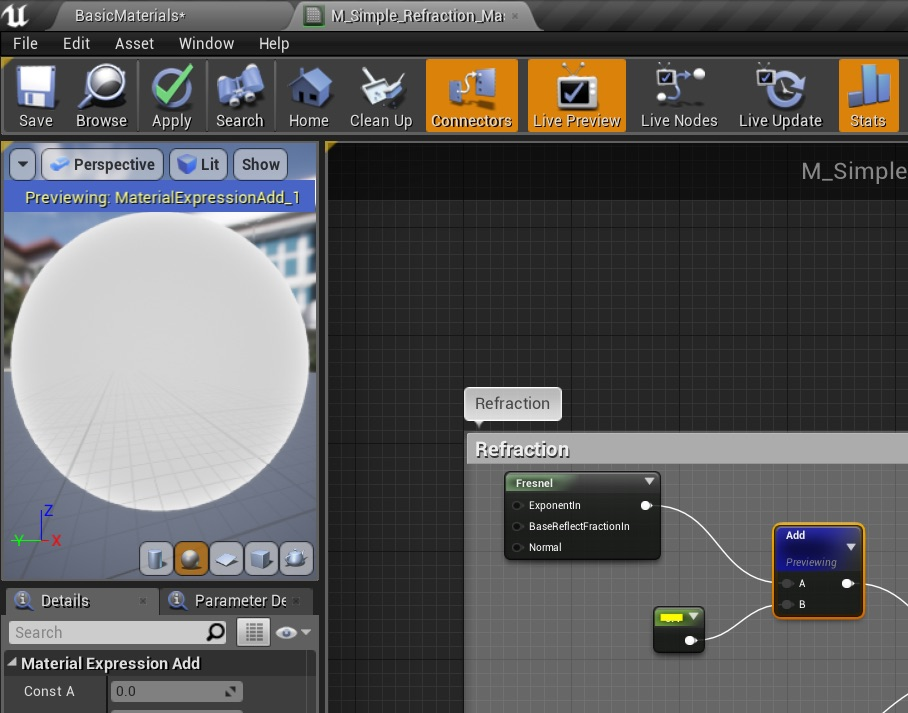

##### `Step 20.`\|`UE5MAT`| :large_blue_diamond: :large_blue_diamond:

Now go into the game and look at the effect. Oooh, this is much better.  Notice that in the center there is very little to no refraction but it gets wider the closer to the edge.  It really adds volume to the shape and looks a lot more realistic. It makes it look like the objects wrap around the edge of the glass.  This is quite effective and making it look more believable.

https://user-images.githubusercontent.com/5504953/131255153-94baaf84-5a8d-49ba-a099-b885581380c1.mp4

##### `Step 21.`\|`UE5MAT`| :large_blue_diamond: :large_blue_diamond: :small_blue_diamond:

But we can make it look better.  Go back to the original **M_Refraction_Master**. Lets add a tiny bit of a glow on the edges to give the shape a bit more definition.  Add a **Constant3Vector** node and make it white (1, 1, 1).  Add a **Multiply** node and plug the output of the **Constant3Vector** into the **A** input of the **Multiply** node.  Take the output of the **Fresnel** and add it to the **B** pin of the **Multiply** node.  We don't take the output from the **Add** node as this would make the entire sphere glow with additoinal glow on the edges.  We want the black in the center and have it glow closer to the edges. Send the output of the **Multiple** node to the **Emissive Color** pin on the main material node. Press the <kbd>Apply</kbd> button.

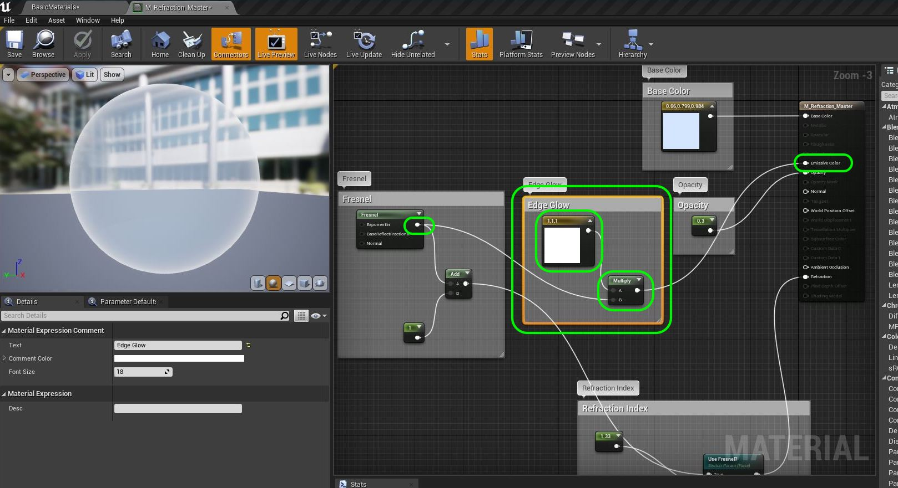

##### `Step 22.`\|`UE5MAT`| :large_blue_diamond: :large_blue_diamond: :small_blue_diamond: :small_blue_diamond:

Now go back into the game and look at the final result.

https://user-images.githubusercontent.com/5504953/131255598-64c86b53-4684-455c-8897-47a43d1dd1f5.mp4

##### `Step 23.`\|`UE5MAT`| :large_blue_diamond: :large_blue_diamond: :small_blue_diamond: :small_blue_diamond: :small_blue_diamond:

Now there are more expensive ways to make the glass look better.  These should be used sparingly in games but for architectural visualizations might give the needed punch for a scene with a dramatic translucent object. Duplicate **M_Refraction_Master**. Name the Material `M_Refraction_SurfaceTrans`.

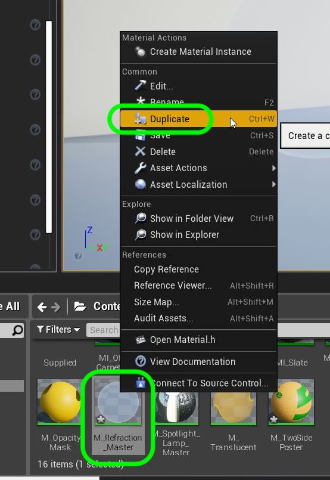

##### `Step 24.`\|`UE5MAT`| :large_blue_diamond: :large_blue_diamond: :small_blue_diamond: :small_blue_diamond: :small_blue_diamond: :small_blue_diamond:

Open up the Material you just created. Go into the details panel under **Translucency**.  Change the **Lighting Mode** to **Surface Translucency Volume**.

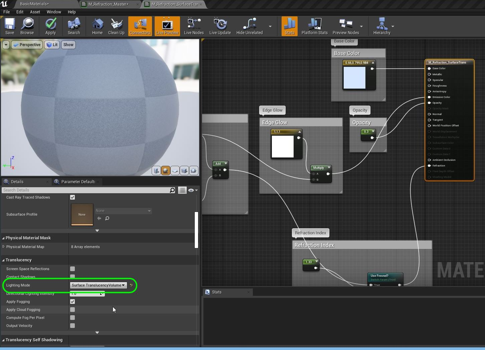

##### `Step 25.`\|`UE5MAT`| :large_blue_diamond: :large_blue_diamond: :small_orange_diamond:

Set the **Default Value** of **Use Fresnel?** node to `true` and press the **Apply Button**. 

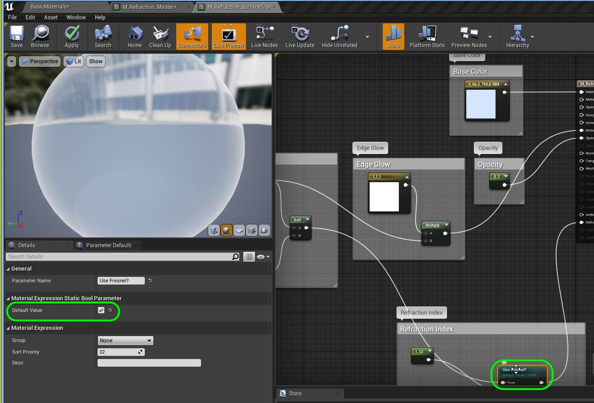

##### `Step 26.`\|`UE5MAT`| :large_blue_diamond: :large_blue_diamond: :small_orange_diamond: :small_blue_diamond:

Go to the game and add a third sphere and assign this new material. Look that it is even more realistic for this translucent sphere in game. Now the difference is pretty subtle but go around the objects and look how the reflections change.

https://user-images.githubusercontent.com/5504953/131256053-80630b37-a8d8-4dcb-b58a-37593f153b9a.mp4

##### `Step 27.`\|`UE5MAT`| :large_blue_diamond: :large_blue_diamond: :small_orange_diamond: :small_blue_diamond: :small_blue_diamond:

Now this is a **VERY** expensive change.  Look at the **Details** panel and see that this lighting model takes a **Lot** more compute time. This looks 3 times more expensive (does it look 3 times as good?)  If you don't notice a different do not use this model as it will be taxing performance unecessarilly. This might be used on a virtual production where you just want everything to look amazing, you get close to the glass volume and have the framerate overhead for an expensive effect.

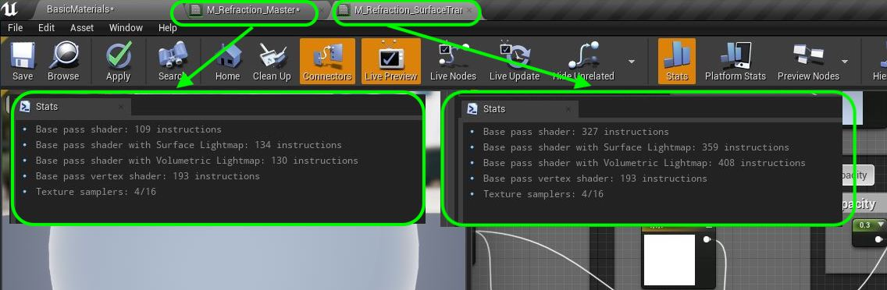

##### `Step 28.`\|`UE5MAT`| :large_blue_diamond: :large_blue_diamond: :small_orange_diamond: :small_blue_diamond: :small_blue_diamond: :small_blue_diamond:

Press **Save All** and update Github by **committing** and **pushing** all the changes made.

<!--  -->

| [previous](../decals/README.md#user-content-decals)| [home](../README.md#user-content-ue4-intro-to-materials) | [next](../world-alignment/README.md#user-content-world-aligned-materials)|
|---|---|---|