### Room 1 Carpet Material

[previous](../tile-texture/README.md#user-content-tileable-texture) • [home](../README.md#user-content-ue4-intro-to-materials) • [next](../texture-coord/README.md#user-content-texture-coordinates)

Lets apply these three textures to a new material and place it in room 1 as an office carpet. 

 

---

##### `Step 1.`\|`SUU&G`|:small_blue_diamond:

Now substance created 3 textures with 5 elements we will need for our carpet in the level.  Drag **T_OfficeCarpet_Normal.tif**, **T_OfficeCarpet_OcculsionRoughnessMetalic.tif** and **T_OfficeCarpet_BaseColor.tif** into the **Content | Textures** folder.

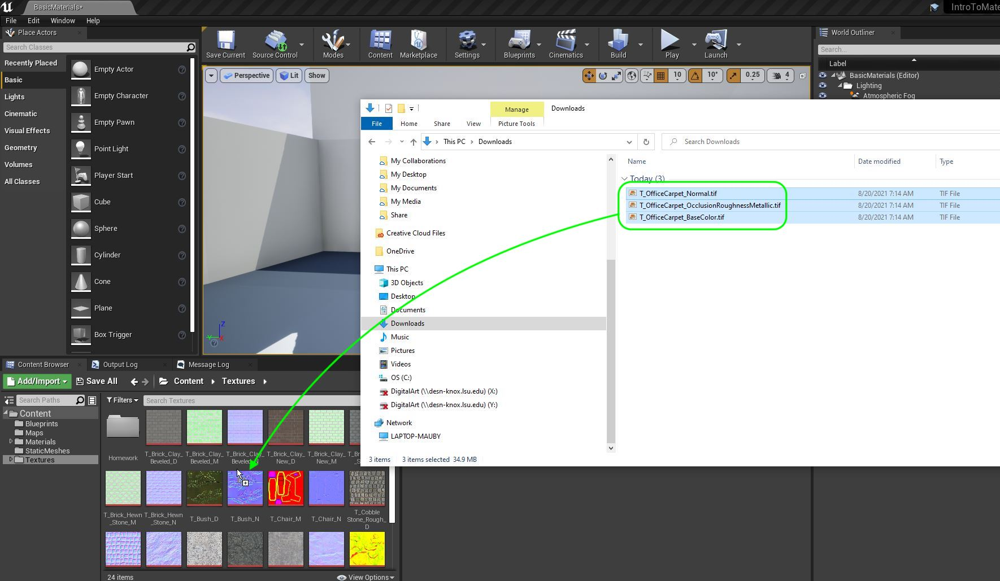

##### `Step 2.`\|`FHIU`|:small_blue_diamond: :small_blue_diamond: 

Double click on **T_OfficeCarpet_BaseColor** and this will open up the pixel color we want in our material.  This indicates what color the light and shadows in the level are interacting with.  Make sure the compression is **Default** as that is usually best with a base color layer.  All looks good. 

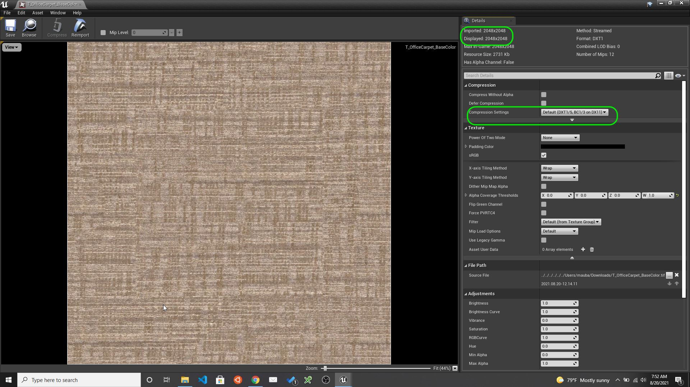

##### `Step 3.`\|`SUU&G`|:small_blue_diamond: :small_blue_diamond: :small_blue_diamond:

Open up **T_OfficeCarpet_Normal** and lets look at the normal map. I double check that the compression is for normal maps.  This is very important as the compression for a base color is about minimizing the size based on portions of the image that the eye is not sensitive to. So it alters the colors in a way that is the least perceptible to the human eye.  A normal map is NOT a color, it is a vector on where light reflects.  So the compression techique has nothing to do with human vision but preserving the accuracy of the vectors while still minimizing size.  I imagine the algorithm it uses is *less lossy*.

I also noticed that the bump is flipped so I selected the **Details | Texture | Flip Green Channel** to get the carpet to bump upwards and not inwards.

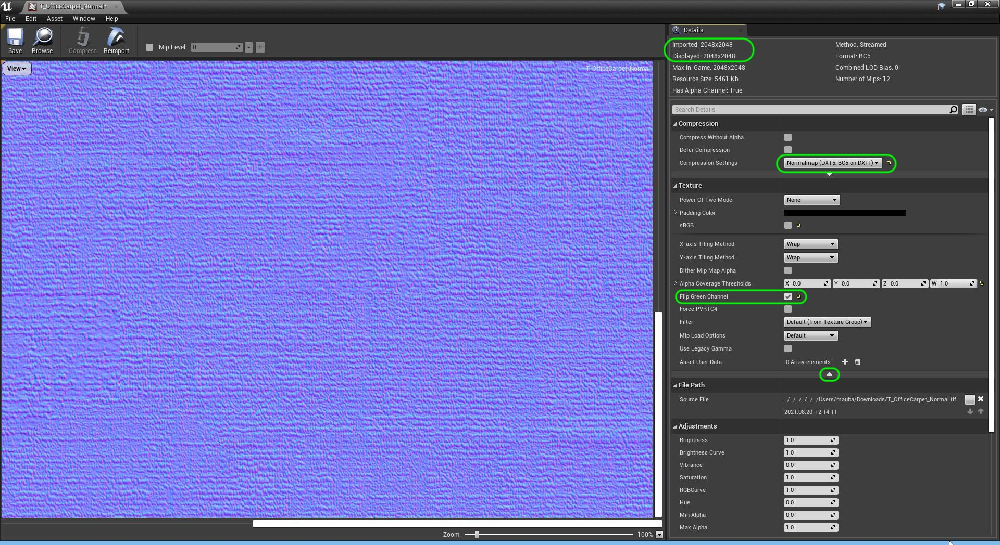

##### `Step 4.`\|`SUU&G`|:small_blue_diamond: :small_blue_diamond: :small_blue_diamond: :small_blue_diamond:

Now a common technique used in games to save memory is to **Texture** pack certain material layers.  Some textures like **Base Color** and **Normal Map** use the **RGB** and sometimes **A** channels.  With **Roughness**, **Metalic** and **Occlusion** it is only using a single chanel (these are gray scale textures).  So rather than using three textures we use one and put each one in a seperate channel.  So the image you see is not helpful, which in this case is nothing it is a pure alpha.

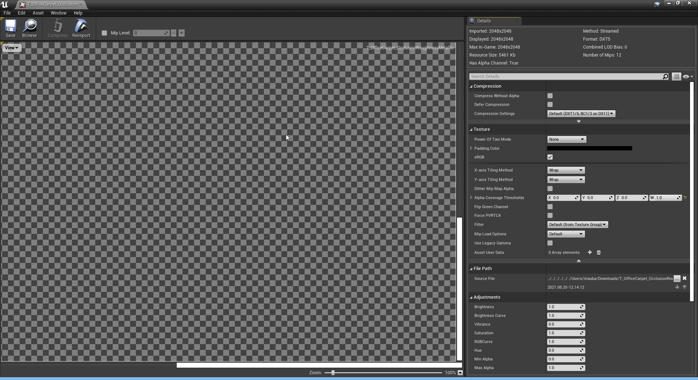

##### `Step 5.`\|`SUU&G`| :small_orange_diamond:

So in **T_OfficeCarpet_OcculsionRoughnessMetalic.tif** the hint of what **RGB** means is in the name.  The **R** channel is Ambient Occlusion, the **G** channel is Roughness and the **B** channel is Metalic. You can see these by selecting **View** and turning channels on and off.  Notice the **Metalic** channel is black (no metalic).  The carpet material had no metalic properties so this would make sense.  Now since we are packing the texture it makes sense to include a solid color.  This would be a waste if this was on its own as we could have plugged a single **Constant** node set to `0` and take no texture memory to get the same result.  But since we have nothing else to put in the blue channel this is fine. This was done automatically by picking the Unreal setting in **Substance**.  Pretty cool!

If your roughness has too much black you will notice you will have a shiny texture in the game.  Go back to **Substance** and adjust the **Roughness | Base Value** on the **Image to Material** layer to be closer to `.9`.

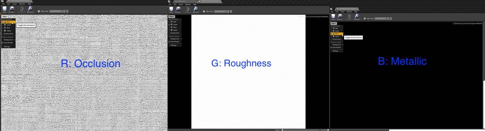

##### `Step 6.`\|`SUU&G`| :small_orange_diamond: :small_blue_diamond:

We have discussed in the modeling walk through about **Base Color**, **Roughness** and **Normal Maps**.  We have not discussed **[Ambient Occlusion](https://en.wikipedia.org/wiki/Ambient_occlusion)**. This is a single channel texture that indicates how much an area of the model is exposed to light. This helps speed up rendering in its slowest portion which is figuring out light and shadows. This is a quick way to determine what parts of the model are convex or block light from entering.

##### `Step 7.`\|`SUU&G`| :small_orange_diamond: :small_blue_diamond: :small_blue_diamond:

Now lets import a static mesh for this texture.  Import **[SM_OfficeCarpet](../Assets/SM_OfficeCarpet.fbx)**. Right click on the <kbd>Raw</kbd> and select <kbd>Save link as...</kbd> (download linked file on mac).  Take the file and drag and drop it into the **StaticMeshes** folder.

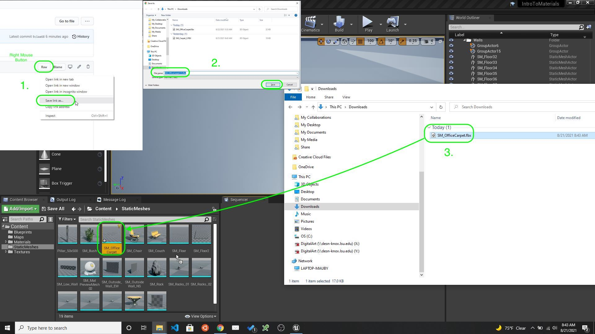

##### `Step 8.`\|`SUU&G`| :small_orange_diamond: :small_blue_diamond: :small_blue_diamond: :small_blue_diamond:

Use our standard import options for a static mesh with no collision volume or lightmap uvs.  Turn off **Skeletal Mesh** as this is a static mesh.  Since we have a floor with collision, we do not need another collision on the carpet so there will be none, turn off **Generate Missing Collision**, make sure **Generate Lightmap UVs** and **Transform Vertex to Absolute** are selected.  Turn off importing material and texture since we created them in **Substance**. When you are happy with your settings press the <kbd>Import</kbd> button.

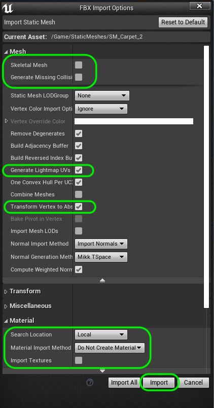

##### `Step 9.`\|`SUU&G`| :small_orange_diamond: :small_blue_diamond: :small_blue_diamond: :small_blue_diamond: :small_blue_diamond:

Open the carpet up to look at it in the editor and double check the collision volume imported correctly. Look at channel **UV 0** and you will see the UV's extend beyond the 0 to 1 region.  This is common in models where you want the texture to tile within the shape. You can have UV's extend beyond this region.  But this would not work for a **Lightmap UV** which is why we generated one on import.  If you look at **UV 1** you will see these UV's all fit within the 0 to 1 space for the lightmap.  We also confirm that there is no collision volume.

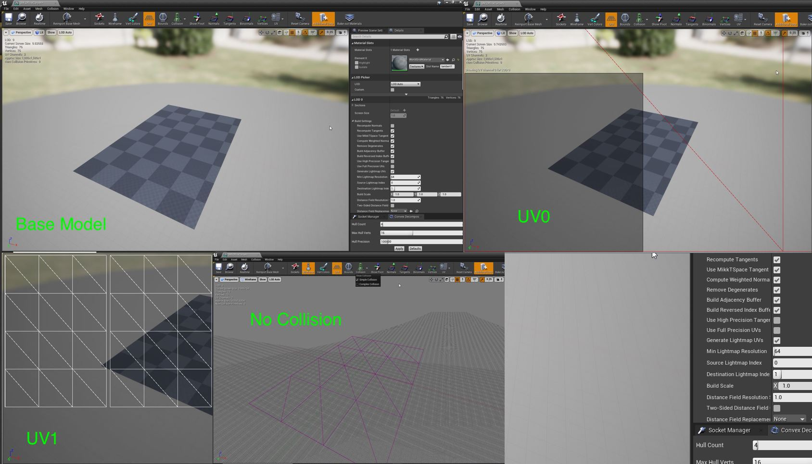

##### `Step 10.`\|`SUU&G`| :large_blue_diamond:

Drag an instance of the carpet and put it in the middle of **Room 1**. Rotate it so that it is on the floor lengthwise. Raise the carpet and then press the <kbd>End</kbd> key so that the carpet is right no top of the ground.  Position it in the far corner.

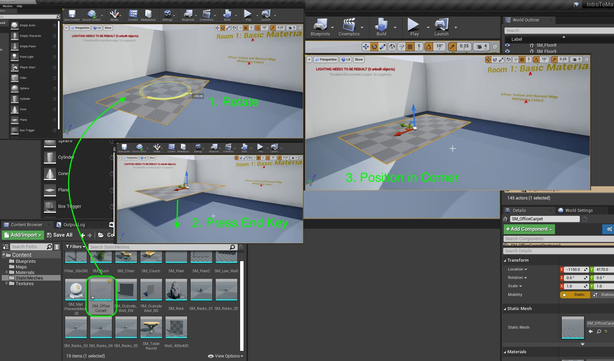

##### `Step 11.`\|`SUU&G`| :large_blue_diamond: :small_blue_diamond: 

Now lets create a new material with the tileable texture we just made. Double click the **Materials** folder and right mouse click and select **Material**. Call this new material `M_OfficeCarpet`.

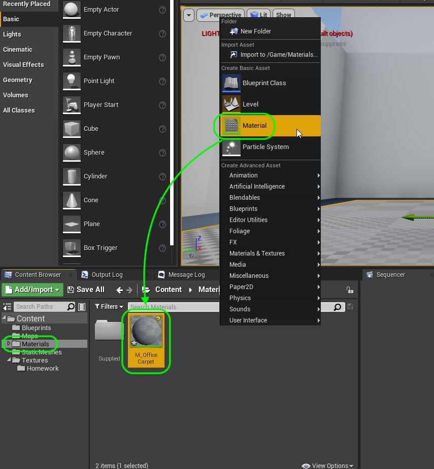

##### `Step 12.`\|`SUU&G`| :large_blue_diamond: :small_blue_diamond: :small_blue_diamond: 

Double click the new Material and look at the editor.  In the top left corner we have a sphere that shows us the Material.  In the main area we have a node with various pins that we can plug texture maps into.  Lets add a node to add the texture we just created.  Right click to the left of the main node and type **TextureSample** (you don't have to spell the whole name it will reduce the choices based on what it finds). A shortcut is to left click while holding the **T** key on the keyboard. 

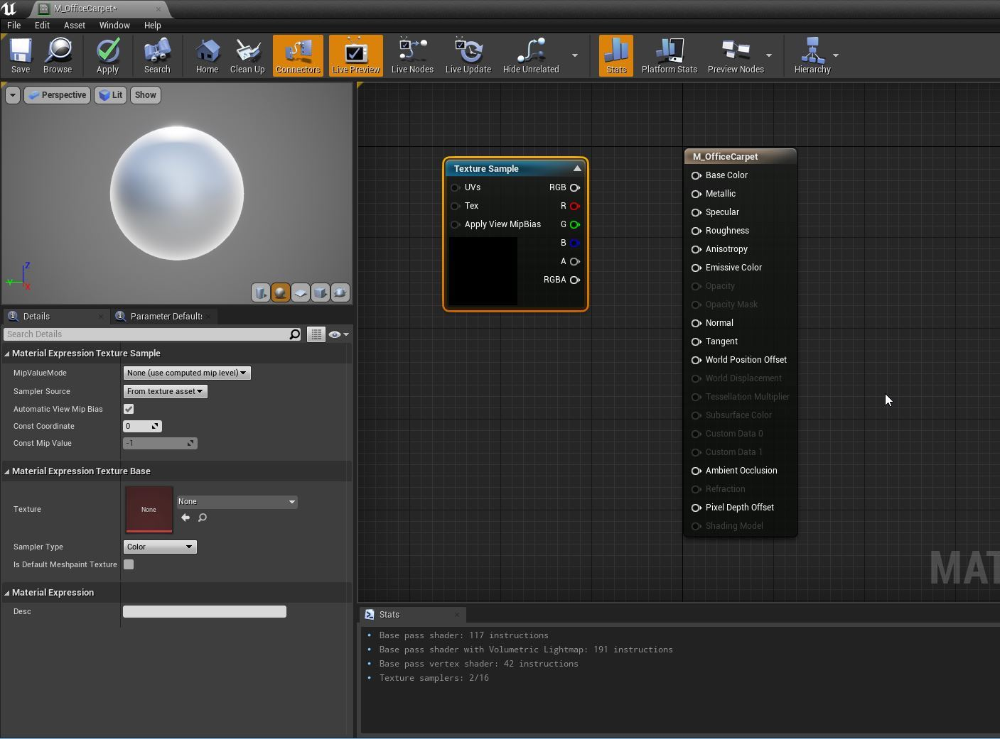

##### `Step 13.`\|`SUU&G`| :large_blue_diamond: :small_blue_diamond: :small_blue_diamond:  :small_blue_diamond: 

You should have a node called **Texture Sample**.  This node has 5 pins.  The top pin on the right has all the channels (Red, Green, Blue and Alpha) and the four pins below have the individual channels (R G B A).  In the **Details** panel we can set up the various settings for the pin but the most important one is assigning a texture.  Select `T_OfficeCarpet_BaseColor`.

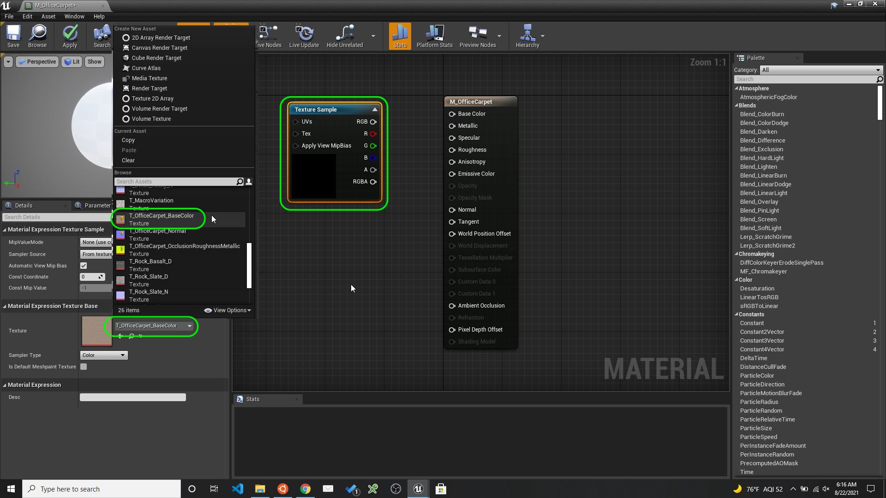

##### `Step 14.`\|`SUU&G`| :large_blue_diamond: :small_blue_diamond: :small_blue_diamond: :small_blue_diamond:  :small_blue_diamond: 

We can at any time preview what the Material looks like from that point in the Node tree.  You right mouse click on the **Texture Sample** node and select **Start Previewing Node**. THis is useful to see what is hapening in the material at any point in the editor. So this material is black but we can preview the base color.  Now if the sphere is white you might need to turn on the **Grid** and **Background** in the **Show** menu.

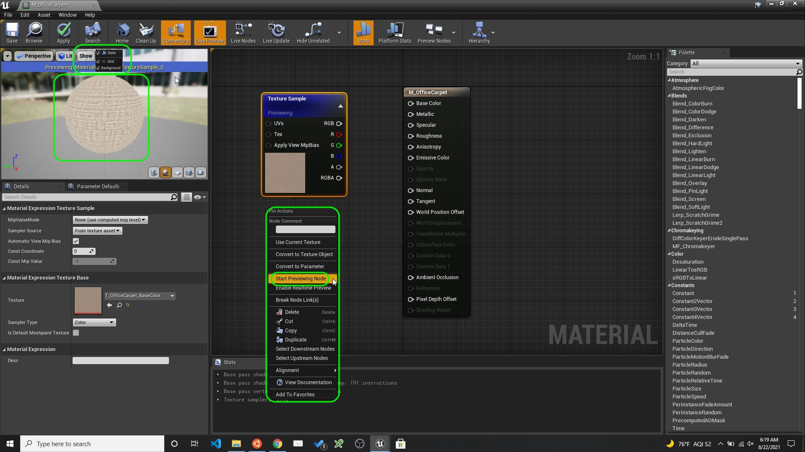

##### `Step 15.`\|`SUU&G`| :large_blue_diamond: :small_orange_diamond: 
Drag the top right pin from the **Texture Sample | RGB** node and connect it to **Base Color**. If it is compatible you will see a green check mark.  Let go of the left mouse button and it should connect the two nodes.

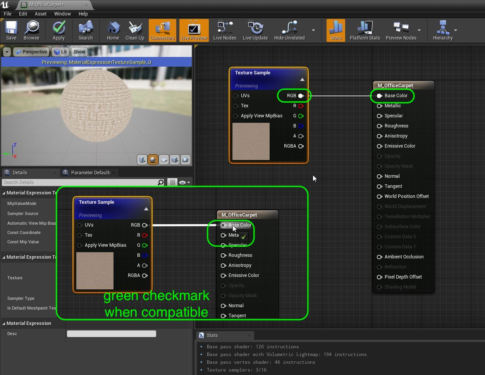

##### `Step 16.`\|`SUU&G`| :large_blue_diamond: :small_orange_diamond:   :small_blue_diamond: 

Now right click on the **Texture Sample** node and select **Stop Previewing Node**.  Now you will see the material on the sphere in the top left corner and it will look the same as it did when previewing the node (which makes sense as that is all we are doing).  Now before you can see it in game you need to press the **Apply** button. It is also good practice to save as this prevents you from losing work if the engine crashes (which it may do).

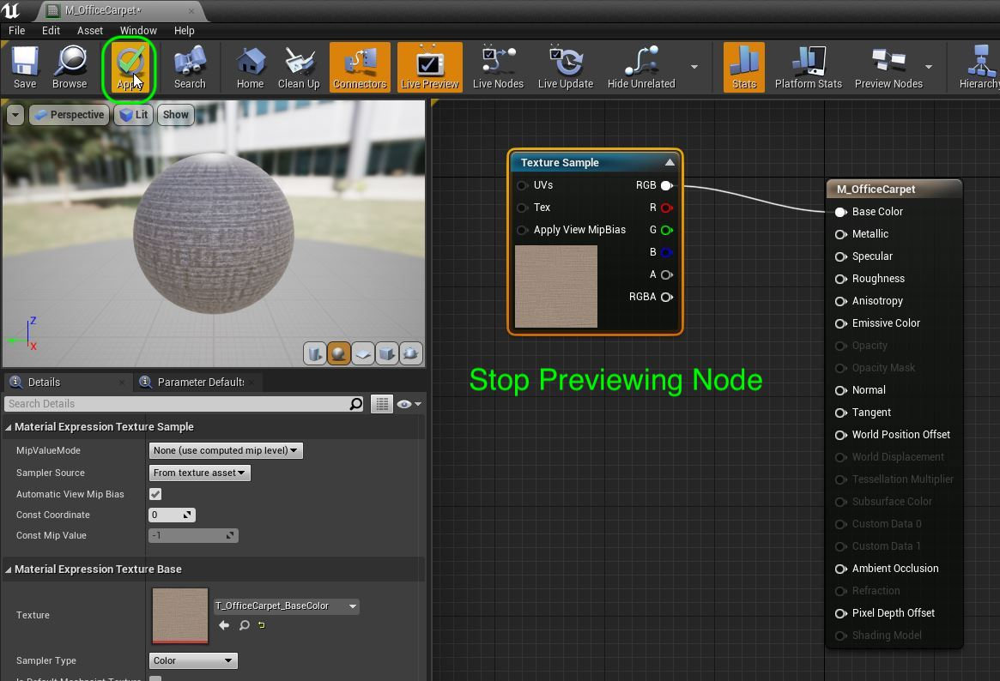

##### `Step 17.`\|`SUU&G`| :large_blue_diamond: :small_orange_diamond: :small_blue_diamond: :small_blue_diamond:

Drag and drop the material on the on the carpet. Press the **Build** button to build the lights.

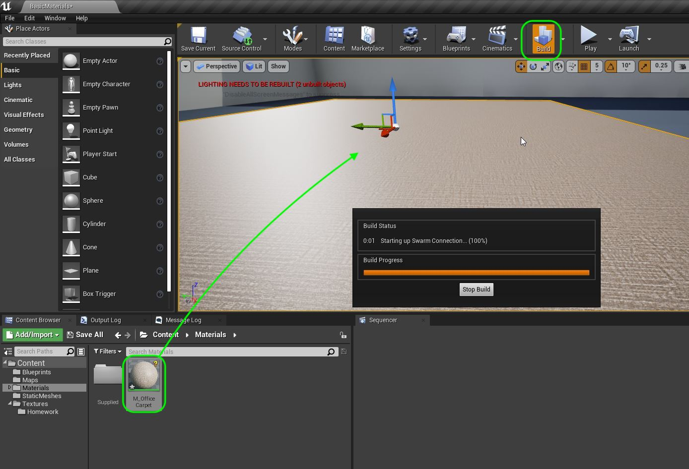

##### `Step 18.`\|`SUU&G`| :large_blue_diamond: :small_orange_diamond: :small_blue_diamond: :small_blue_diamond: :small_blue_diamond:

Play the game and notice that the carpet is flat and bland.

https://user-images.githubusercontent.com/5504953/130353752-fd3b37b5-6627-4421-bc81-8fa74366d35a.mp4

##### `Step 19.`\|`SUU&G`| :large_blue_diamond: :small_orange_diamond: :small_blue_diamond: :small_blue_diamond: :small_blue_diamond: :small_blue_diamond:

Add another **Texture** sample node and add a `T_OfficeCarpet_Normal` texture to it.  Connect the **RGB** output into the **Normal** input on the shader.  Press the <kbd>Apply</kdb> button.

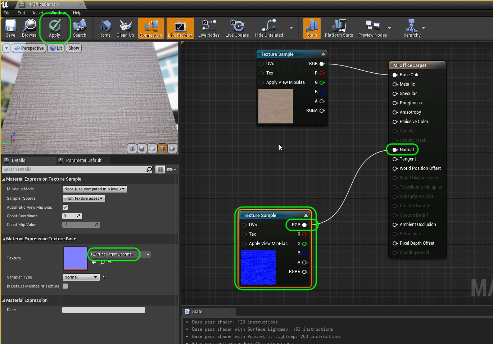

##### `Step 20.`\|`SUU&G`| :large_blue_diamond: :large_blue_diamond:

Play the game again and notice that there is a bit of a bump giving the carpet a bit more life.

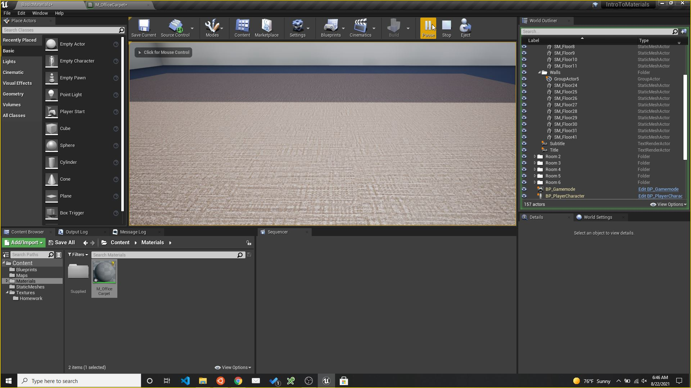

##### `Step 21.`\|`SUU&G`| :large_blue_diamond: :large_blue_diamond: :small_blue_diamond:

Now lets add the node that is texture packed to the material. Add another **Texture** sample node and add a `T_OfficeCarpet_OcclusionRoughnessMetalic` texture to it.  Connect the **R** output into the **Ambient Occlusion**, the **G** into `Roughness` and the **B** inot `Metalic` input pins on the shader.  Press the <kbd>Apply</kdb> button.

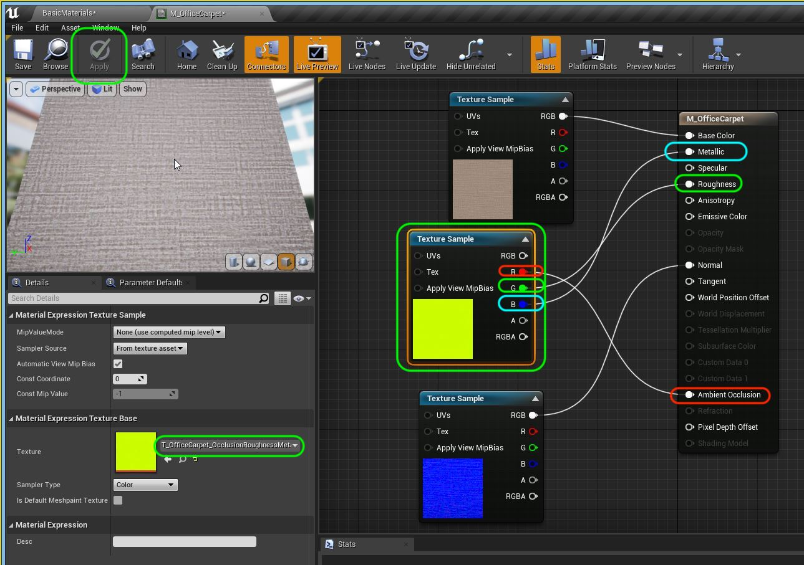

##### `Step 22.`\|`SUU&G`| :large_blue_diamond: :large_blue_diamond: :small_blue_diamond: :small_blue_diamond:

Now play the game and we have the first material that we created on our own.  This is about as basic a material as you can get. The edging of the carpet is not realistic as it should have a border and a rougher edge.  But we will live with this for now.

https://user-images.githubusercontent.com/5504953/130354287-d4b203e6-60b5-4be9-92c1-0fd67ea590cc.mp4

##### `Step 23.`\|`SUU&G`| :large_blue_diamond: :large_blue_diamond: :small_blue_diamond: :small_blue_diamond: :small_blue_diamond:

Lets clean up the **World Outliner** and move **SM_OfficeCarpet** into the `Room1` folder.

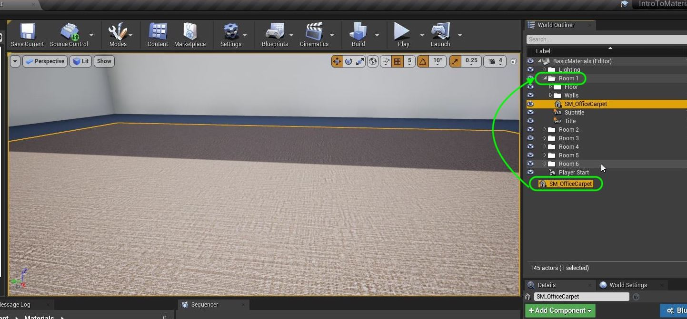

##### `Step 24.`\|`SUU&G`| :large_blue_diamond: :large_blue_diamond: :small_blue_diamond: :small_blue_diamond: :small_blue_diamond: :small_blue_diamond:

OK, now lets finish up this section by savin our work and uploading it to GitHub.  Press **Tile | Save All** then **Source Conrol | Submit to Source Control...** and add a description.  Press the <kbd>Submit</kbd> button.  Open up **GitHub Desktop** and **Push** the commited work.

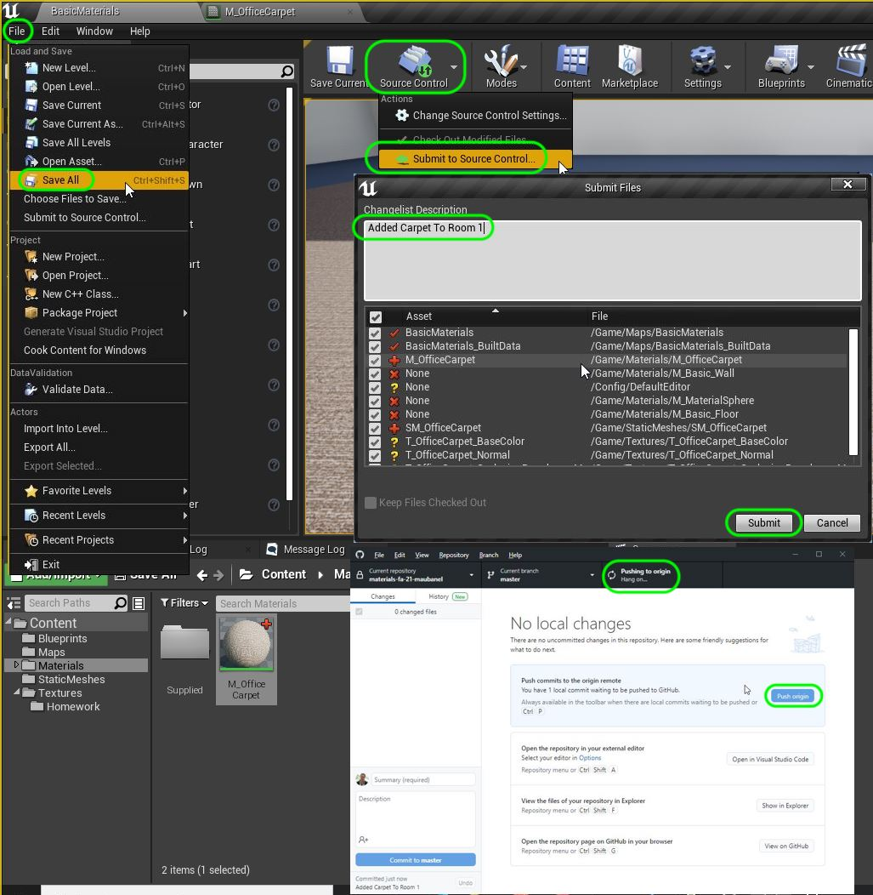
___

| [previous](../tile-texture/README.md#user-content-tileable-texture)| [home](../README.md#user-content-ue4-intro-to-materials) | [next](../texture-coord/README.md#user-content-texture-coordinates)|
|---|---|---|
