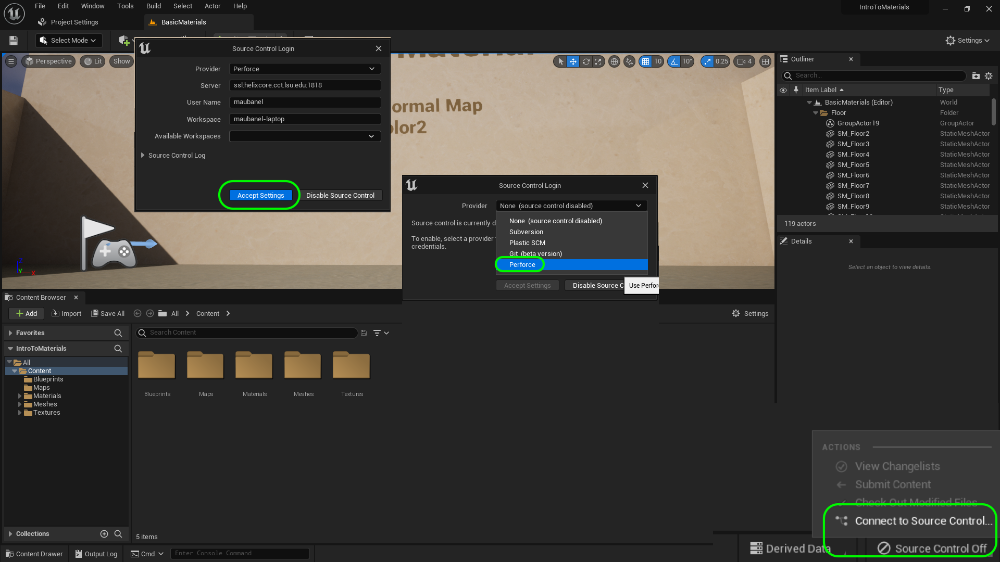
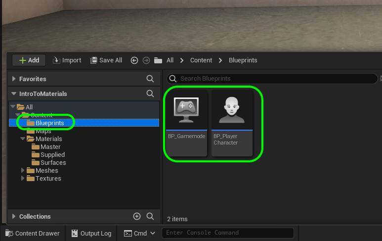
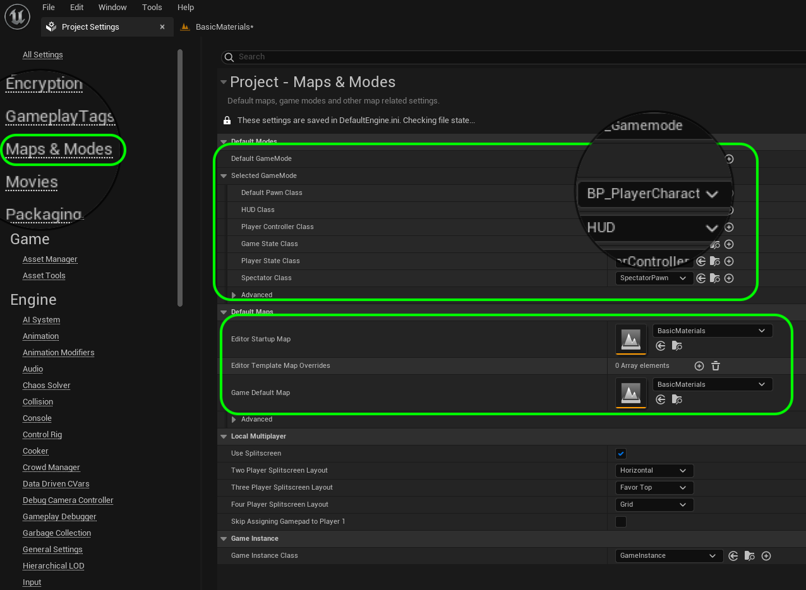
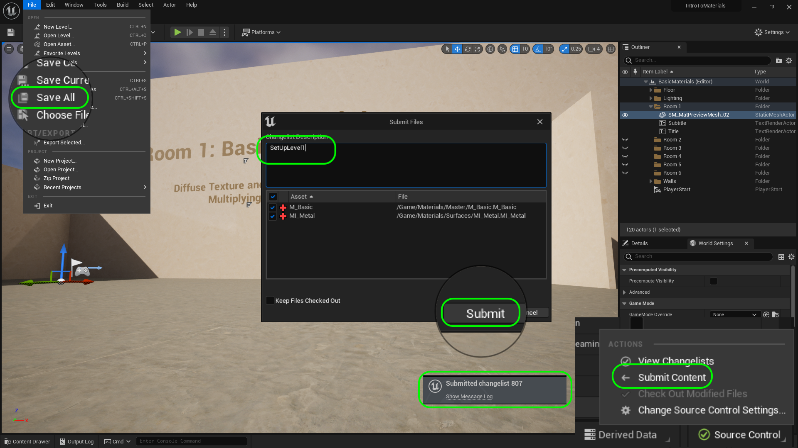

### Setting Up

[home](../README.md#user-content-ue5-intro-to-materials) • [next](../basic/README.md#user-content-basic-material)

We will be downloading a template project with some assets provided to us beforehand.  We will get this set up and start working on materials in Unreal.

 

---
| `required.software`\|`UE5 Materials`| 
| :--- |
| :floppy_disk: &nbsp; &nbsp; You will need to install the latest version of _UE5 5.2.X_ by downloading the [Epic Games Launcher](https://www.epicgames.com/store/en-US/download). You will also need a [P4V](https://www.perforce.com/downloads/helix-visual-client-p4v) account which is free to sign up for as we will be using version control. Lets make sure you can see hidden folders. On the PC follow these [Windows 10 Turn on Hidden Folders](https://support.microsoft.com/en-us/help/4028316/windows-view-hidden-files-and-folders-in-windows-10) directions.For this walk through you will also need [Substance Designer](https://store.substance3d.com/students-teachers) which is free for students. |

##### `Step 1.`\|`UE5MAT`|:small_blue_diamond:

You will find in Perforce a project called **UE5-Materials**. It contains a text file called **LICENSE**. It is the [MIT License](https://opensource.org/license/mit/) which grants you use to the materials that are mine in this project. Please note that some of these materials come from Epic and our not covered by this license.  Please read the above license and if you agree change the name to your name so that your work that you peform will be licensed as open source and available to future students.  This is not a requirement, if you do not want to accept the terms then delete the LICENSE file (delete it inside P4V).

##### `Step 2.`\|`UE5MAT`|:small_blue_diamond: :small_blue_diamond: 

Double click the UE4 project **IntroToMaterials.uproject** to load it. Press **Source Control Off** and select `Connect to Source Control...`.  Select `Perforce` as the **Provider**.  Make sure the settings are correct and you have a valid workspace. Press the <kbd>Accept</kbd> button.

##### `Step 3.`\|`UE5MAT`|:small_blue_diamond: :small_blue_diamond: :small_blue_diamond:

Look at the **World Outliner** on the top right of the screen and select the gear icon and select ***Collapse All**. You will see folders with the walls, floor and lighting. We also have 6 room folders that we will use to create materials in all rooms in this level. The **Player Start** actor determines where the player starts and the direction they look at when the start the game.  In this level we have a first person controller with no mesh representing the player.

##### `Step 4.`\|`UE5MAT`|:small_blue_diamond: :small_blue_diamond: :small_blue_diamond: :small_blue_diamond:

##### `Step 5.`\|`UE5MAT`| :small_orange_diamond:

##### `Step 6.`\|`UE5MAT`| :small_orange_diamond: :small_blue_diamond:

##### `Step 7.`\|`UE5MAT`| :small_orange_diamond: :small_blue_diamond: :small_blue_diamond:

##### `Step 8.`\|`UE5MAT`| :small_orange_diamond: :small_blue_diamond: :small_blue_diamond: :small_blue_diamond:

I have also added a first person **Character** for you to control and possess during the game.  Go to **Settings | Project_Settings** to see the controls.

Now select **Input** and expand **Action Mappings** and **Axis Mappings**.  This shows you that we have implemented a mouse looking around, player movement and jumping.  If you press the triangles you can see the keys that are assigned. 

##### `Step 9.`\|`UE5MAT`| :small_orange_diamond: :small_blue_diamond: :small_blue_diamond: :small_blue_diamond: :small_blue_diamond:

Go to the bottom left and open the Source Panel and click on the Blueprints folder.  You will see two Blueprints.  One called **BP_Gamemode** and the other called **BP_PlayerCharacter**. The gamemode blueprint loads the **BP_PlayerCharacter** when the level is run so that you control a first person character.

##### `Step 10.`\|`UE5MAT`| :large_blue_diamond:

Lets go back back to **Settings | Project_Settings** and select **Maps and Modes**.  You will see that the reason the game booted up in this map was because it was set here previously. Also we are loading the **BP_Gamemode** as the default gamemode.  This will be applied to every level unless you override it. You can see that all we did here is load the player pawn as our first person character `BP_Player_Character`.

##### `Step 11.`\|`UE5MAT`| :large_blue_diamond: :small_blue_diamond: 

Now go to Description and fill in the various modules with the information that you want that you think is important. Fill in the Licensing information, I use the [MIT Open Source License](https://opensource.org/licenses/MIT).

##### `Step 12.`\|`UE5MAT`| :large_blue_diamond: :small_blue_diamond: :small_blue_diamond: 

Now go into **Settings | World Settings** and expand **Game Mode**.  This is overrides the settings that are in project settings for this one level.  We are not overriding our project settings so we can leave it as it is.

##### `Step 13.`\|`UE5MAT`| :large_blue_diamond: :small_blue_diamond: :small_blue_diamond:  :small_blue_diamond: 

OK, that's enough for setup, now run the game and walk around using the <kbd>W A S D</kbd> or <kbd>Arrow</kbd> keys for movement, <kbd>Space Bar</kbd> for jumping and **Mouse** for looking around.  If you want to move faster press the <kbd>Shift</kbd> button while holding your movement keys. You should be able to walk around the various rooms and see that they are all titled.

https://user-images.githubusercontent.com/5504953/185111052-7e821999-d943-4b50-981c-f2dceb163b27.mp4

##### `Step 14.`\|`UE5MAT`| :large_blue_diamond: :small_blue_diamond: :small_blue_diamond: :small_blue_diamond:  :small_blue_diamond: 

Select the **File | Save All** then press the <kbd>Source Control</kbd> button and select **Submit Content**.  If you are prompted, select **Check Out** for all items that are not checked out of source control. Update the **Changelist Description** message and with the latest changes. Make sure all the files are correct and press the <kbd>Submit</kbd> button. A confirmation will pop up on the bottom right with a message about a changelist was submitted with a commit number.

<!--  -->

| [home](../README.md#user-content-ue5-intro-to-materials) | [next](../basic/README.md#user-content-basic-material)|
|---|---|
