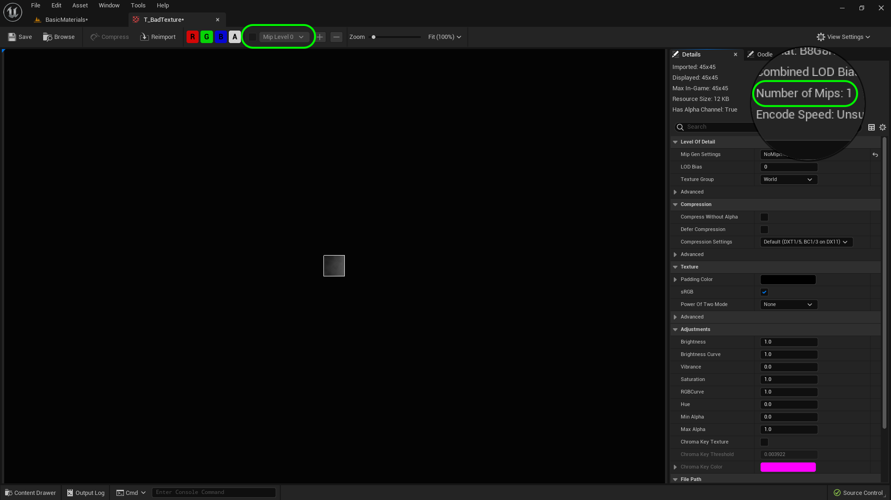

### Solid Material II

[previous](../solid-material/README.md#user-content-solid-material) • [home](../README.md#user-content-ue5-intro-to-materials) • [next](../solid-material-iii/README.md#user-content-solid-material-iii)

Now lets use material functions and instances with this master material to make it scalable and reusable.

 

---

##### `Step 1.`\|`UE5MAT`|:small_blue_diamond:

Now we don't want our master material to have a recognizable texture in it.  We want those to be assigned in the material instance.  So we will create one white and a normal map that is small.  Now for textures to look good the engine uses a technique called [Mip Mapping](https://en.wikipedia.org/wiki/Mipmap) to make the textures look good.  This is making sure that instead of scaling the texture in real time for every object, it prescales the textures and picks the closest side needed by the renderer on that one frame.

The mip map holds sizes from 1 pixel upwards.  So if a texture is 512 by 512, the mip map will contain the 512, 256, 128, 64, 32, 16, 8, 4, 2, 1 pixel sizes.  It would be combined to one texture sheet like the example from Wikipedia shown.

##### `Step 2.`\|`UE5MAT`|:small_blue_diamond: :small_blue_diamond: 

Now if we open up **T_WildGrass_BCH** you can see we have 13 mip levels. You can switch between them to see how they look and you can see the display size being updated.  Now since it is power of 2 it is able to simply average pixel groups to get a high quality reduction.

https://github.com/LSU-UE5/UE5-Materials/assets/5504953/e6ff9b5d-a948-4eea-963d-7888d585973c

##### `Step 3.`\|`UE5MAT`|:small_blue_diamond: :small_blue_diamond: :small_blue_diamond:

So what happens if we have a texture that is not square.  Lets look.  Download [T_BadTexture.png](../Assets/T_BadTexture.png).  Drag and drop it in the **Texture | Surfaces** folder. Open it up.  Now look that there is only one mip level.  This is because the texture is 45 x 45 pixels.  A texture to work properly needs to be a power of two.  It needs to be 1, 2, 4, 8, 16, 32, 64, 128, 256, 512, 1024, 2048, 4096, or 8192 (if your video card can support it).  Now both axis don't need to be the same so you can have a texture that is 2048 x 256, this will mip properly.

##### `Step 4.`\|`UE5MAT`|:small_blue_diamond: :small_blue_diamond: :small_blue_diamond: :small_blue_diamond:

Download our base textures as for our master we don't want to use an actual usefuly texture, just a neutral one.  Download [T_Base_BCH.png](../Assets/T_Base_BCH.png), [T_Base_N.png](../Assets/T_Base_N.png), and [T_Base_MSRAO.png](../Assets/T_Base_MSRAO.png)

##### `Step 5.`\|`UE5MAT`| :small_orange_diamond:

Create a new folder called **Textures | Placeholder**.  Drag the three textures you just downloaded this folder.

##### `Step 6.`\|`UE5MAT`| :small_orange_diamond: :small_blue_diamond:

Open up the base color and normal textures and make sure they have mip levels and that the normal is recognized and using **Regular** and **Normal** compression.  I see they all have a **Mips** level of `7` which is correct as these are only 32 x 32 pixel textures as they are just placehoders.

##### `Step 7.`\|`UE5MAT`| :small_orange_diamond: :small_blue_diamond: :small_blue_diamond:

Now open up the **T_Base_MSRAO** texture.  Now we do have our **7** Mips levels.  Change the compressoin to `Masks`.  This is important as sRGB is for base colors and is based on optimizing for human vision.  This will alter our masks in subtle ways.  So we want to select masks which will turn off **sRGB**.  We forgot to do this for our grass so go back to **T_WildGrass_MSRAO** and change the **Compression Settings** to `Masks`.

##### `Step 8.`\|`UE5MAT`| :small_orange_diamond: :small_blue_diamond: :small_blue_diamond: :small_blue_diamond:

Now this creates an issue in our material.  If you go to the game it is no longer working. Open up **M_OpaqueMSRAO** and change the **Sampler Type** on the masks texture from **Color** to `Masks`.  Press the <kbd>Apply</kbd> button.

##### `Step 9.`\|`UE5MAT`| :small_orange_diamond: :small_blue_diamond: :small_blue_diamond: :small_blue_diamond: :small_blue_diamond:

Now that this fixes our material in the game, select the **MaterialFunction** folder and press the <kbd>+ Add</kbd> button and select **Material | Material Function**.  Call this material function `MF_Base_Texture`.

##### `Step 10.`\|`UE5MAT`| :large_blue_diamond:

Now open up the material function and drag and drop **Textures | Placeholder | T_Base_BCH** to the graph. Connect the output node of the **Texture Sample** to the **Output Result** node.

##### `Step 11.`\|`UE5MAT`| :large_blue_diamond: :small_blue_diamond: 

Now *right click* on the **Texture Sample** node and select **Convert to Parameter**.  Call it `BaseColor`,

##### `Step 12.`\|`UE5MAT`| :large_blue_diamond: :small_blue_diamond: :small_blue_diamond: 

Add a comment box by selecting all the nodes and press the <kbd>C</kbd> key. Now change the **Output Name** to `Base Color` and we will leave the **Sort Priority** at `0`.  We will leave 0 through 19 for base color nodes.

##### `Step 13.`\|`UE5MAT`| :large_blue_diamond: :small_blue_diamond: :small_blue_diamond:  :small_blue_diamond: 

Create a new material function for our masks.  Select the **Materials | Material Function** folder and right click to createa a new **Material | Material Function**.  Call it `MF_MSRAO`.

##### `Step 14.`\|`UE5MAT`| :large_blue_diamond: :small_blue_diamond: :small_blue_diamond: :small_blue_diamond:  :small_blue_diamond: 

Drag **Textures | Placeholder | T_Base_MSRAO** to to the graph.  Right click on it and select **Convert to Parameter**.  Call it `Metallic | Specular | Roughness | AO`.

##### `Step 15.`\|`UE5MAT`| :large_blue_diamond: :small_orange_diamond: 

Copy and paste the **Output** node 3 times.  The first will be called `Metallic` and have a **Sort Priority** of `20`.   The second will be called `Specular` and have a **Sort Priority** of `21`. The third will be called `Roughness` and have a **Sort Priority** of `22` and the final one will be called `Ambient Occlusion` and have a **Sort Priority** of `23`.  We are reserving slot 20-39 for masks.

##### `Step 16.`\|`UE5MAT`| :large_blue_diamond: :small_orange_diamond:   :small_blue_diamond: 

##### `Step 17.`\|`UE5MAT`| :large_blue_diamond: :small_orange_diamond: :small_blue_diamond: :small_blue_diamond:

##### `Step 18.`\|`UE5MAT`| :large_blue_diamond: :small_orange_diamond: :small_blue_diamond: :small_blue_diamond: :small_blue_diamond:

Open up **M_SolidTexture**. Drag the material function **MF_Texture** into the empty graph.

##### `Step 19.`\|`UE5MAT`| :large_blue_diamond: :small_orange_diamond: :small_blue_diamond: :small_blue_diamond: :small_blue_diamond: :small_blue_diamond:

Lets order the input texture parameters.  Change the **Base Color | Height Map** node to **Priority** `0`, **Normal Map** to **Priority** `1` and finall **MSRAO** to `2`.

##### `Step 20.`\|`UE5MAT`| :large_blue_diamond: :large_blue_diamond:

Now lets change the order of the output pins to get them to line up with the material nodes. **Output Base Color** is **Priority** `0`, **Output Metalic** is **Priority** `1`, **Output Specular** is **Priority** `2`, **Output Roughness** is **Priority** `3`, **Output Normal** is **Priority** `4`, **Output Ambient Occlusion* is **Priority** `5`. Press the <kbd>Apply</kbd> button. 

##### `Step 21.`\|`UE5MAT`| :large_blue_diamond: :large_blue_diamond: :small_blue_diamond:

Open up **MF_SolidTexture** and connect the output pins to the input pins of the same name.  Press the <kbd>Apply</kbd> button.

<!--  -->

| [previous](../solid-material/README.md#user-content-solid-material)| [home](../README.md#user-content-ue5-intro-to-materials) | [next](../solid-material-iii/README.md#user-content-solid-material-iii)|
|---|---|---|
