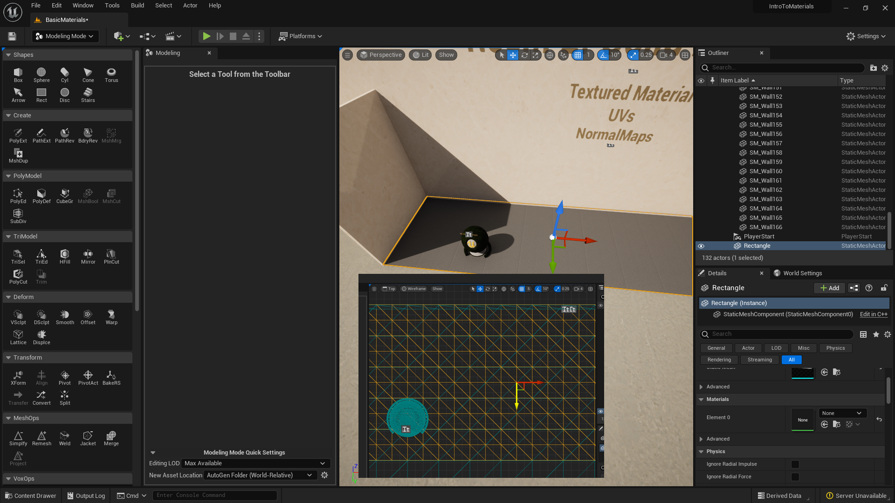
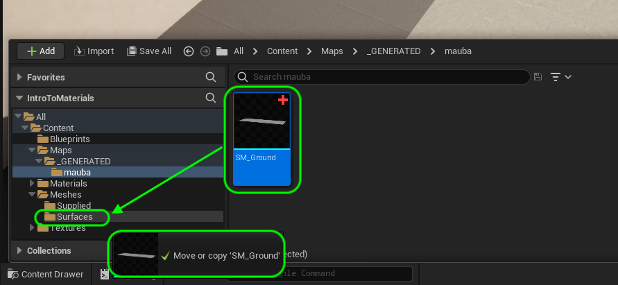
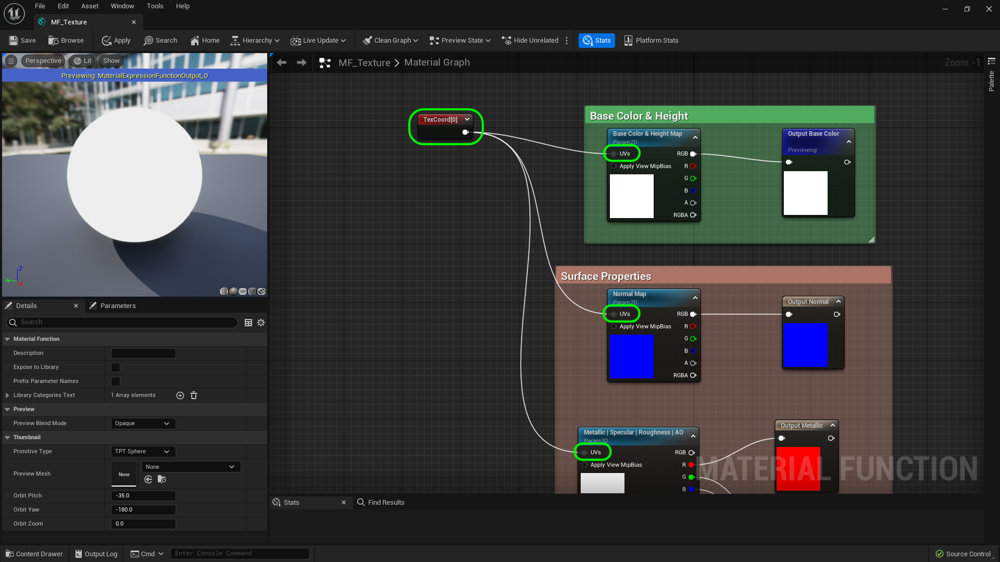
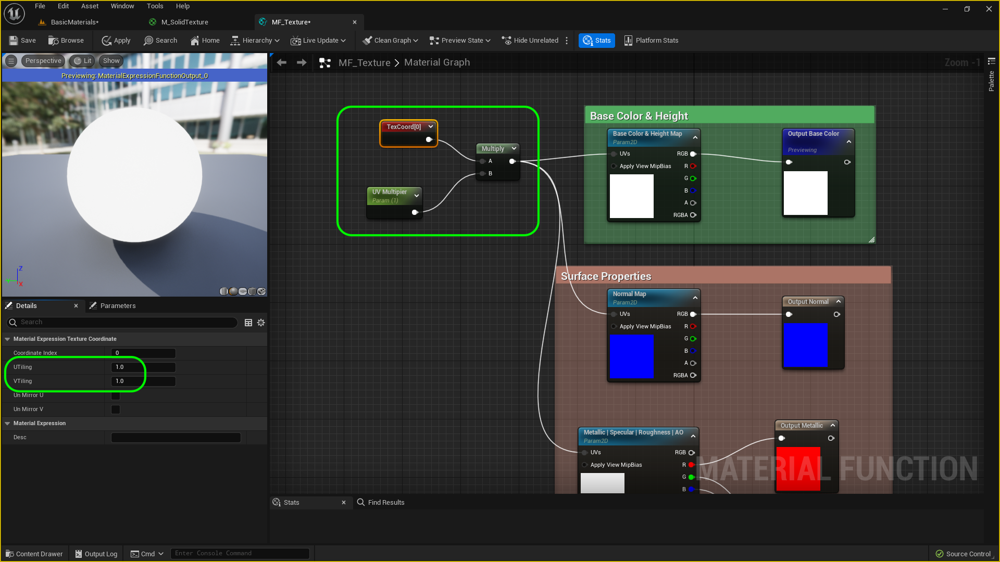
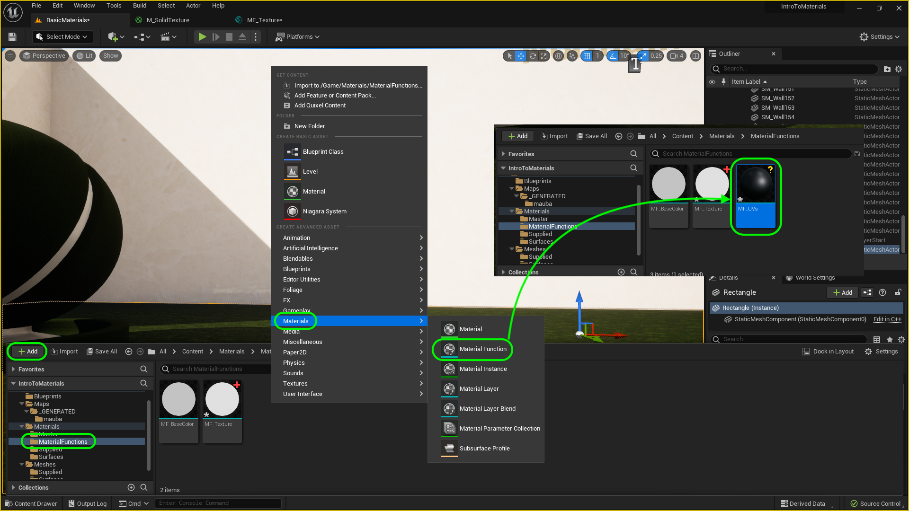
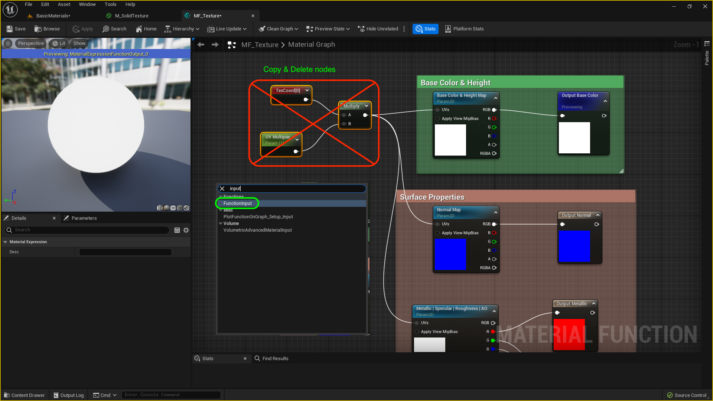

### Solid Material III

[previous](../solid-material-ii/README.md#user-content-solid-material-ii) • [home](../README.md#user-content-ue5-intro-to-materials) • [next](../solid-material-iv/README.md#user-content-solid-material-iv)

Chapter introduction here.

 

---

##### `Step 1.`\|`UE5MAT`|:small_blue_diamond:

Now go into the game and you will notice that our material ball is white based on the this neutral master texture.  We will fix this.

##### `Step 2.`\|`UE5MAT`|:small_blue_diamond: :small_blue_diamond: 

Right click on **M_SolidTexture** and select **Creaet Material Instance** and call it `MI_WildGrass`.  

##### `Step 3.`\|`UE5MAT`|:small_blue_diamond: :small_blue_diamond: :small_blue_diamond:

Move **MI_WildGrass** into the **Materials | Surface** folder.  Then select the material ball and change the **Materials | Element 0** to `MI_WildGrass`. You can change the material by just dragging it onto the model itself and it will light up the area of the model that is changing.

##### `Step 4.`\|`UE5MAT`|:small_blue_diamond: :small_blue_diamond: :small_blue_diamond: :small_blue_diamond:

Open up **MI_WildGrass** and turn on editing on the three textures.  Assign the **Base Color** the texture `T_WildGrass_BCH`, the **Normal Map** the texture `T_WildGrass_N` and finally the four masks the texture `T_Wildgrag_MSRAO`.  Now run the game and you will see that it is back to using the grass texture we originally imported.

https://user-images.githubusercontent.com/5504953/185745402-8e2543ad-661e-4fd4-a666-037e88e2de07.mp4

##### `Step 5.`\|`UE5MAT`| :small_orange_diamond:

If you go to **Meshes | Supplied** and hover the cursor over **SM_Wall** you can get the dimensions of the wall which is 1000 cm squared. This is used for the walls and the floor.

##### `Step 6.`\|`UE5MAT`| :small_orange_diamond: :small_blue_diamond:

Enter modeling mode and select a **Shapes | Rect** to create a plane for the ground to old the grass.  Make it a **Width** of `1000` and a **Depth** of `3000`.  Set the **Width Subdivision** to `10` and the **Depth Subdivision to `30`.

Place it on the floor and select the <kbd>Complete</kbd> button.

##### `Step 7.`\|`UE5MAT`| :small_orange_diamond: :small_blue_diamond: :small_blue_diamond:

Position the model in room so it lines up with the floor textures.   Adjust the height so it doesn't get buried by the existing floor or have any rendering issues fighting with it (1 unit above essentially).

##### `Step 8.`\|`UE5MAT`| :small_orange_diamond: :small_blue_diamond: :small_blue_diamond: :small_blue_diamond:

Go the the **UVs | Layout** and change the **Material Mode** to `Checkerboard`.  Now in my case the UVs look good so I am leaving them alone and pressing the <kbd>Accept</kbd> button.

##### `Step 9.`\|`UE5MAT`| :small_orange_diamond: :small_blue_diamond: :small_blue_diamond: :small_blue_diamond: :small_blue_diamond:

Select the ground plane in the editor and right click and select **Browse to Asset**.  Now rename the mesh `SM_Ground`.

##### `Step 10.`\|`UE5MAT`| :large_blue_diamond:

Create a new folder under **Meshes** called `Surfaces`.  Drag `SM_Ground` and **Move** it into the new **Meshes | Surfaces** folder.

##### `Step 11.`\|`UE5MAT`| :large_blue_diamond: :small_blue_diamond: 

After moving it is always a good idea to right click **Content** and select **Fix up Redirects in Folder**, to clean up the hierachy.  Otherwise hidden files remain that redirect files from their original folder.

##### `Step 12.`\|`UE5MAT`| :large_blue_diamond: :small_blue_diamond: :small_blue_diamond: 

Now drag and drop **MI_WildGrass** onto the ground plane.

##### `Step 13.`\|`UE5MAT`| :large_blue_diamond: :small_blue_diamond: :small_blue_diamond:  :small_blue_diamond: 

*Press* the <kbd>Play</kbd> button and walk around.  Your camera is at 6' in height and the grass texture looks enormous and wrong.  Now we can adjust the amount of tiling within each object.  Lets add this to our material function.

##### `Step 14.`\|`UE5MAT`| :large_blue_diamond: :small_blue_diamond: :small_blue_diamond: :small_blue_diamond:  :small_blue_diamond: 

Rigth click on the open graph and add a **Text Coordinates** node.  Connect the output into the **UVs** input of all three of the textures as we will want to adjust the size of the tiling on all three textures.

##### `Step 15.`\|`UE5MAT`| :large_blue_diamond: :small_orange_diamond: 

Open up **MF_Textures** and select the **TexCoord** node and change the **UTiling** and **VTiling**.  Notice that a value less than `1` increases the size of the tiling and increasing the number larger than `1` reduces it.  I like a value of `20`.  But return it to `1` as we will adjust this in the material instance.

https://user-images.githubusercontent.com/5504953/185763976-2d1fc801-ab76-41b5-9e0e-c14d00c92f82.mp4

##### `Step 16.`\|`UE5MAT`| :large_blue_diamond: :small_orange_diamond:   :small_blue_diamond: 

Right click on the empty graph of **MF_Textures** and select a **Scalar Parameter** node. Name it `UV_Multiplier` and set the default value to `1`.  Also, add a **Multiply** node.

##### `Step 17.`\|`UE5MAT`| :large_blue_diamond: :small_orange_diamond: :small_blue_diamond: :small_blue_diamond:

 Connect the **TextCoord** to the **A** channel of the **Multiply** node and the output of the **UV Multipier** to the **B** side of the **Multiply** node.  Send the output of the **Multiply** node to the three texture **UVs** inputs.  Make sure the **UTiling** and **VTiling** is set to `1`.  Make sure the **UV Multiplier** is also set to `1`. Press the <kbd>Apply</kbd> button.

##### `Step 18.`\|`UE5MAT`| :large_blue_diamond: :small_orange_diamond: :small_blue_diamond: :small_blue_diamond: :small_blue_diamond:

Now you can open up **MI_WildGrass** and set the **UV Multiplier** to 20 and press the **Save** button.  This should get you back to where you were before.

##### `Step 19.`\|`UE5MAT`| :large_blue_diamond: :small_orange_diamond: :small_blue_diamond: :small_blue_diamond: :small_blue_diamond: :small_blue_diamond:

Go to **Materials | Material Functions.  Select the <kbd>+ Add</kbd> button and select **Material | Material Function**.  Call is `MF_UVs`.

##### `Step 20.`\|`UE5MAT`| :large_blue_diamond: :large_blue_diamond:

Now go back to **MF_Texture**.  Lets separate adjusting UV's from the texture as we can reuse it in other materials.  So `copy` and `delete` the three UV nodes **TexCoord**, **Multiply** and **UV Multiplier** node. Now we will need an input node to plug the UV's into.  So right click and select a **Function Input** node.

##### `Step 21.`\|`UE5MAT`| :large_blue_diamond: :large_blue_diamond: :small_blue_diamond:

Open up **MF_UVs** and paste the nodes and attach the output of the **Multiply** node to the **Output UVs** node. Select the **Output** node and the **Output** name to **UVs**. Press the <kbd>Apply</kbd> button.

<!--  -->

| [previous](../solid-material-ii/README.md#user-content-solid-material-ii)| [home](../README.md#user-content-ue5-intro-to-materials) | [next](../solid-material-iv/README.md#user-content-solid-material-iv)|
|---|---|---|
