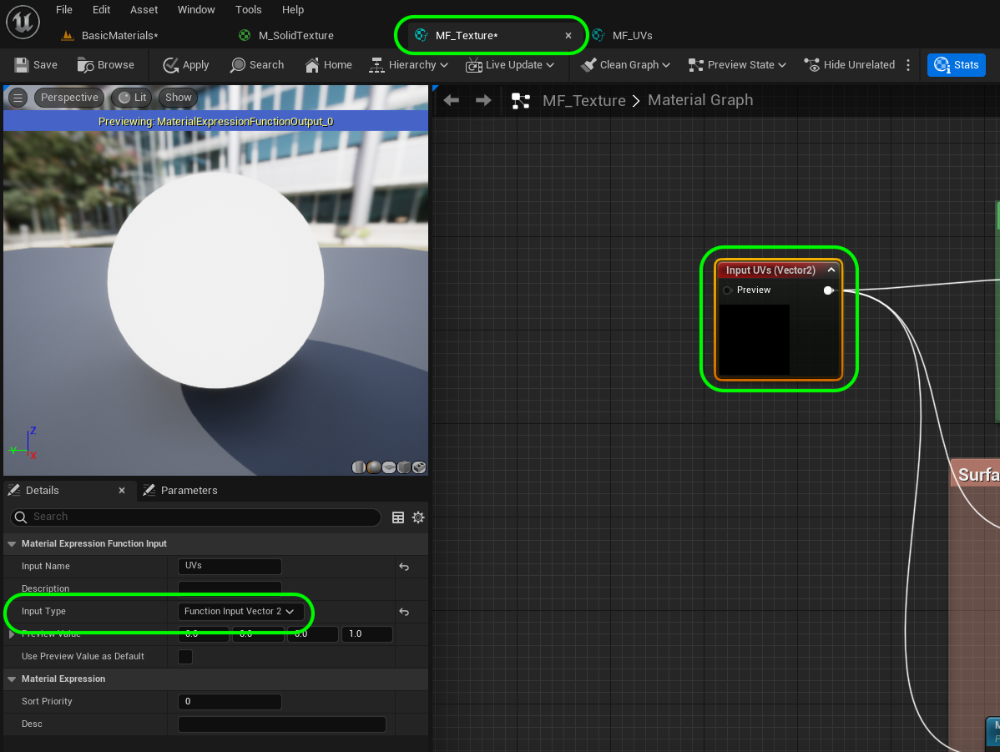
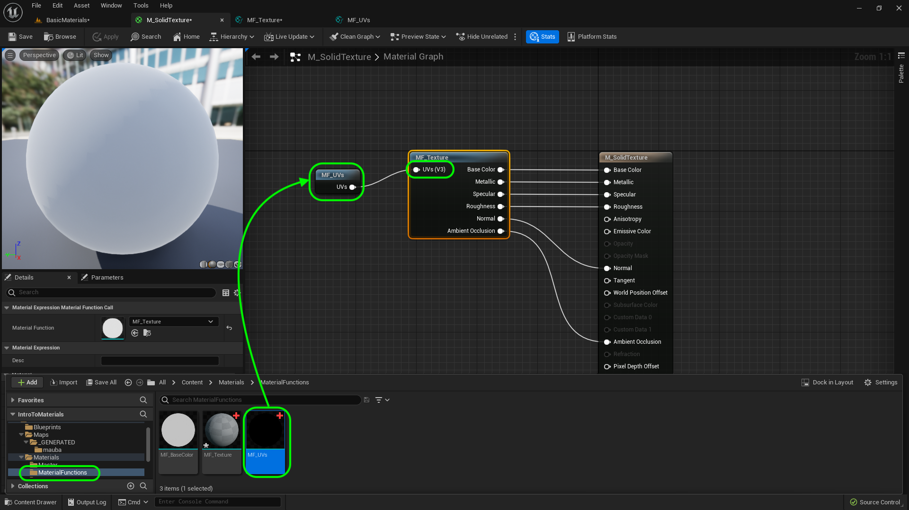
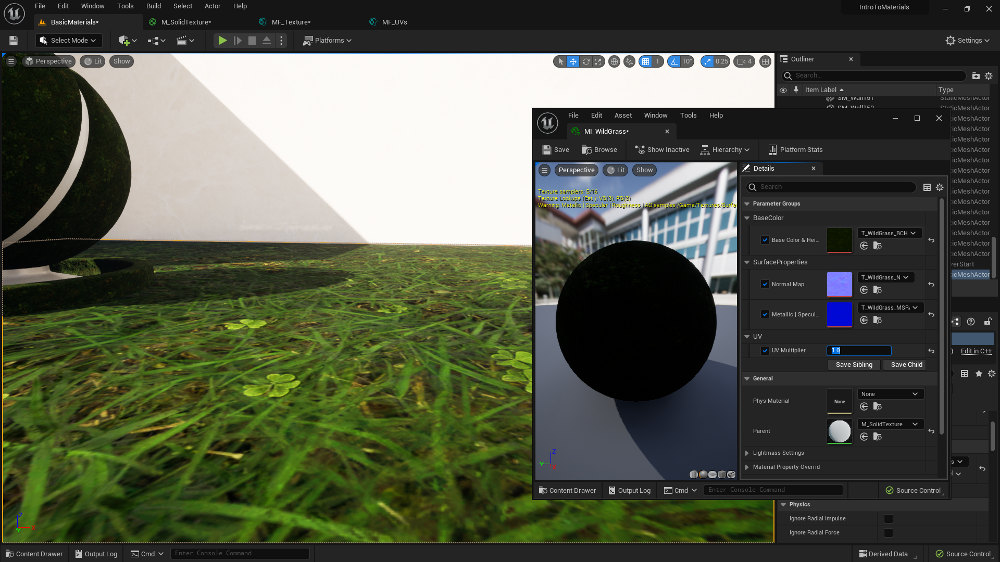
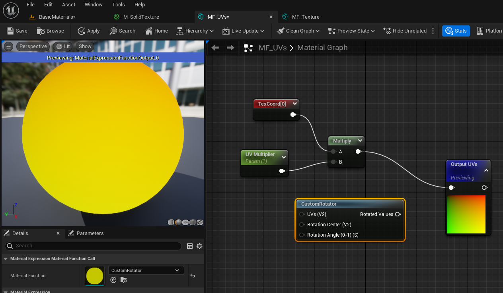
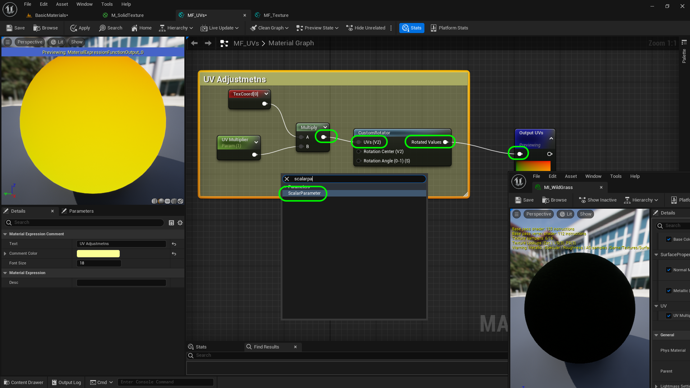
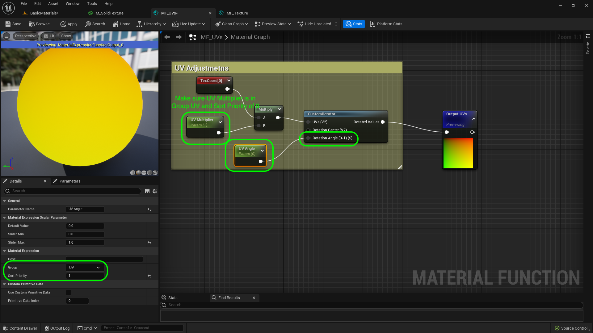

### Solid Material IV

[previous](../solid-material-iii/README.md#user-content-solid-material-iii) • [home](../README.md#user-content-ue5-intro-to-materials) • [next](../)

Lets finish up the ***UVs** for the scale.  We will also look at adding the ability to rotate the texture.  

 

---

##### `Step 1.`\|`UE5MAT`|:small_blue_diamond:

Go back to **MF_Uvs** and change the **Group** in the **UV Multiplier** node to `UV`.

##### `Step 2.`\|`UE5MAT`|:small_blue_diamond: :small_blue_diamond: 

Now there is one thing we need to fix.  Open up **MF_Texture**, select **Input TVs** and change the **Input Type** to `Function Input Vector 2`.  We just need a **U** and a **V** value and the default input was for a full **Vector 3**. Press the <kbd>Apply</kbd> button.

##### `Step 3.`\|`UE5MAT`|:small_blue_diamond: :small_blue_diamond: :small_blue_diamond:

Now lets make the final step and open up **M_SolidTexture**.  Drag a copy of **Materials | MaterialFunctions | MF_UVs** to the chart.  Plug the output into **MF_Texture | UV**. Press the <kbd>Apply</kbd> button.

##### `Step 4.`\|`UE5MAT`|:small_blue_diamond: :small_blue_diamond: :small_blue_diamond: :small_blue_diamond:

Go back to the editor and open up **MI_WildGrass** next to it.  Notice that the sizes have all set back to the original default.

##### `Step 5.`\|`UE5MAT`| :small_orange_diamond:

Set the **UV** multiplier back to 20. Now the scale is a lot better.

##### `Step 6.`\|`UE5MAT`| :small_orange_diamond: :small_blue_diamond:

Now lets add the ability to rotate the texture to add another layer of customization. Open up **MF_UVs** and add a **Custom Rotator** node.

##### `Step 7.`\|`UE5MAT`| :small_orange_diamond: :small_blue_diamond: :small_blue_diamond:

The custom rotator node has three inputs.  One is the UVs which will do the rotation.  The **Rotation Center** allows you to move where the texture rotates from.  We will leave this alone, as it is probably not needed very often.  The rotation angle is a scalar value between `0` and `1`.  This means that all values between 0° and 359° will be fractional between 0 and 1.  So a value of 180 would be 180/359 which is `0.5`.

##### `Step 8.`\|`UE5MAT`| :small_orange_diamond: :small_blue_diamond: :small_blue_diamond: :small_blue_diamond:

No take the output of the **Multiply** node and place it into the input **UVs** node in the **Custom Rotator**.  Take the **Return Value** and send it to the **Output UVs** node.  Select all of the 4 nodes and press the <kbd>C</kbd> key and add a comment `UV Adjustements` and select a color.  Right click on th open graph and select a **Scalar Parameter**>

##### `Step 9.`\|`UE5MAT`| :small_orange_diamond: :small_blue_diamond: :small_blue_diamond: :small_blue_diamond: :small_blue_diamond:

##### `Step 10.`\|`UE5MAT`| :large_blue_diamond:

##### `Step 11.`\|`UE5MAT`| :large_blue_diamond: :small_blue_diamond: 

##### `Step 12.`\|`UE5MAT`| :large_blue_diamond: :small_blue_diamond: :small_blue_diamond: 

##### `Step 13.`\|`UE5MAT`| :large_blue_diamond: :small_blue_diamond: :small_blue_diamond:  :small_blue_diamond: 

##### `Step 14.`\|`UE5MAT`| :large_blue_diamond: :small_blue_diamond: :small_blue_diamond: :small_blue_diamond:  :small_blue_diamond: 

##### `Step 15.`\|`UE5MAT`| :large_blue_diamond: :small_orange_diamond: 

##### `Step 16.`\|`UE5MAT`| :large_blue_diamond: :small_orange_diamond:   :small_blue_diamond: 

##### `Step 17.`\|`UE5MAT`| :large_blue_diamond: :small_orange_diamond: :small_blue_diamond: :small_blue_diamond:

##### `Step 18.`\|`UE5MAT`| :large_blue_diamond: :small_orange_diamond: :small_blue_diamond: :small_blue_diamond: :small_blue_diamond:

##### `Step 19.`\|`UE5MAT`| :large_blue_diamond: :small_orange_diamond: :small_blue_diamond: :small_blue_diamond: :small_blue_diamond: :small_blue_diamond:

##### `Step 20.`\|`UE5MAT`| :large_blue_diamond: :large_blue_diamond:

##### `Step 21.`\|`UE5MAT`| :large_blue_diamond: :large_blue_diamond: :small_blue_diamond:

<!--  -->

| [previous](../solid-material-iii/README.md#user-content-solid-material-iii)| [home](../README.md#user-content-ue5-intro-to-materials) | [next](../)|
|---|---|---|
