### Solid Material

[previous](../basic-iii/README.md#user-content-basic-material-iii) • [home](../README.md#user-content-ue5-intro-to-materials) • [next](../solid-material-ii/README.md#user-content-solid-material-ii)

So last chapter we looked at blending two solid colors on a model.  Now we can also control the color pixel by pixel on the UV's of the model.  So we can use texture maps and we will add another node we have not used yet.  The ambient occlusion node helps with lighting in the darker more shadowed parts of a model.

 

---

##### `Step 1.`\|`UE5MAT`|:small_blue_diamond:

Now we need to download some textures.  Download [T_WildGrass_BCH.png](../Assets/T_WildGrass_BCH.png), [T_WildGrass_N.png](../Assets/T_WildGrass_N.png) and [T_WildGrass_MSRAO.png](../Assets/T_WildGrass_MSRAO.png) to use in our game.

##### `Step 2.`\|`UE5MAT`|:small_blue_diamond: :small_blue_diamond: 

Create a new folders in **Textures** called `Surfaces`.  Drag and drop the three textures above you downloaded.

##### `Step 3.`\|`UE5MAT`|:small_blue_diamond: :small_blue_diamond: :small_blue_diamond:

Double click and open **T_WildGrass.BCH**.  Now it will look strange with all of the channels including **Alpha** picked which i is in this case a height map.  We are using the alpha channel as it is not used in an opaque texture and we can put in a mask. This is because we are channel packing.  

Lets check that **sRGB** is on and it is using **Default Compression**.  We also want to make sure that our height and width are power of 2s (2, 4, 8, 16, 32, 64, 128, 256, 512, 1024, 2048, 4096 etc...). Without this we will not get the 13 Mips layers. This is what we want for our base color.  Most textures that are not in HDR are using sRGB color space.

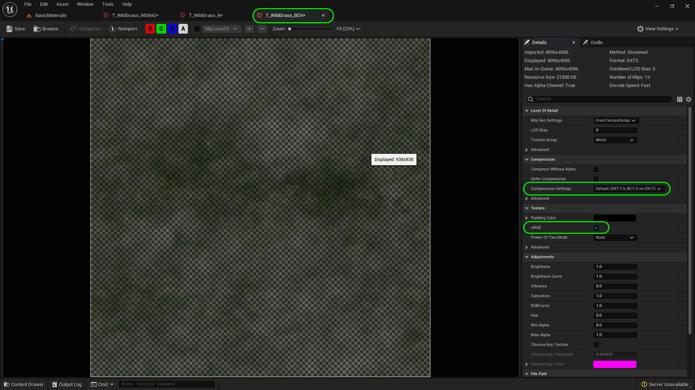

##### `Step 4.`\|`UE5MAT`|:small_blue_diamond: :small_blue_diamond: :small_blue_diamond: :small_blue_diamond:

We are texture packing and if you select the **R,G,B** channels you will see the green grass texture. If you select just the **R G B** channels, you will get the base color texture. If you select just the **A** alpha channel you will get a height mask.  So in our naming of **T_WildGrass.BCH**, the BCH stands for *Base Color & Height*!

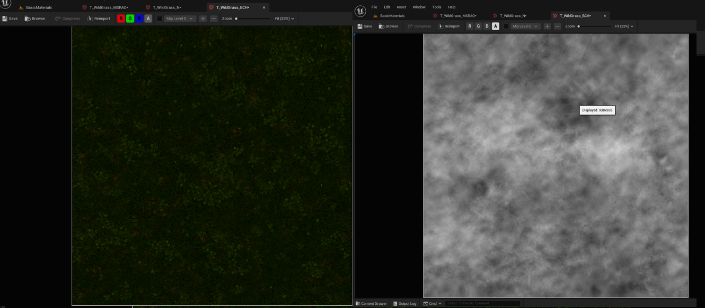

##### `Step 5.`\|`UE5MAT`| :small_orange_diamond:

Open up **T_WildGrass.N**.  The `_N` stands for normal map.  This uses the RGB channel.  We do not pack a texture in the **Alpha** channel as masks and textures use different compression. This compression is special compression for normals.  When we compress a normal texture we are cheating on details the eye has a hard time picking up.  We are saving space by fooling the human eye.  In normal maps, these are not pixels but each value represents a vector for the angle that light bounces off.  So the compression technique is different (and probably more lossless). Most of the time Unreal will select a normal map compression but if it doesn't change the **Compression Settings** to `Normalmap`.

##### `Step 6.`\|`UE5MAT`| :small_orange_diamond: :small_blue_diamond:

Open up **T_WildGrass_MSRAO**.  `_MSRAO` stands for Metallic (packed in R), Specular (packed in S), Roughness (packed in R), and Ambient Occlusion (packed in AO). Notice that the metallic and specular are solid black.  That means there is no metallic or specularity in the grass.  There are textures though for roughness and for ambient occlusion. "_For example, the interior of a tube is typically more occluded (and hence darker) than the exposed outer surfaces, and becomes darker the deeper inside the tube one goes._". So in the top picture is the scene. The middle is the ambient occlusion map and the bottom photo is the render including ambient occlusion.  So you get better definition of darker areas and the scene is higher contrast and more realistic.

##### `Step 7.`\|`UE5MAT`| :small_orange_diamond: :small_blue_diamond: :small_blue_diamond:

[Ambient Occlusion](https://en.wikipedia.org/wiki/Ambient_occlusion) is a single channel grayscale to help the renderer calculate how an area is exposed to ambient light. 

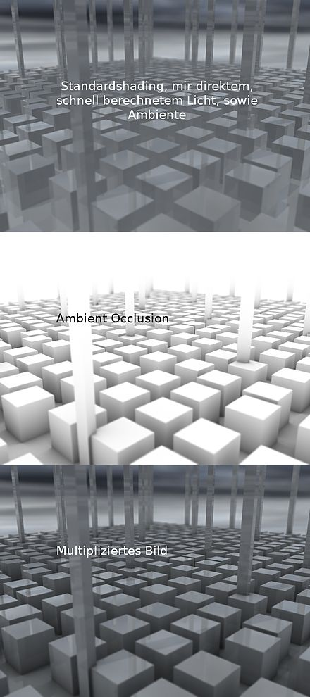

* image from Wikipedia

##### `Step 8.`\|`UE5MAT`| :small_orange_diamond: :small_blue_diamond: :small_blue_diamond: :small_blue_diamond:

Go to the **Materials | Master** folder and press the <kbd>+ Add</kbd> button.  Select a new **Material** and call it `M_Opaque_MSRAO`.

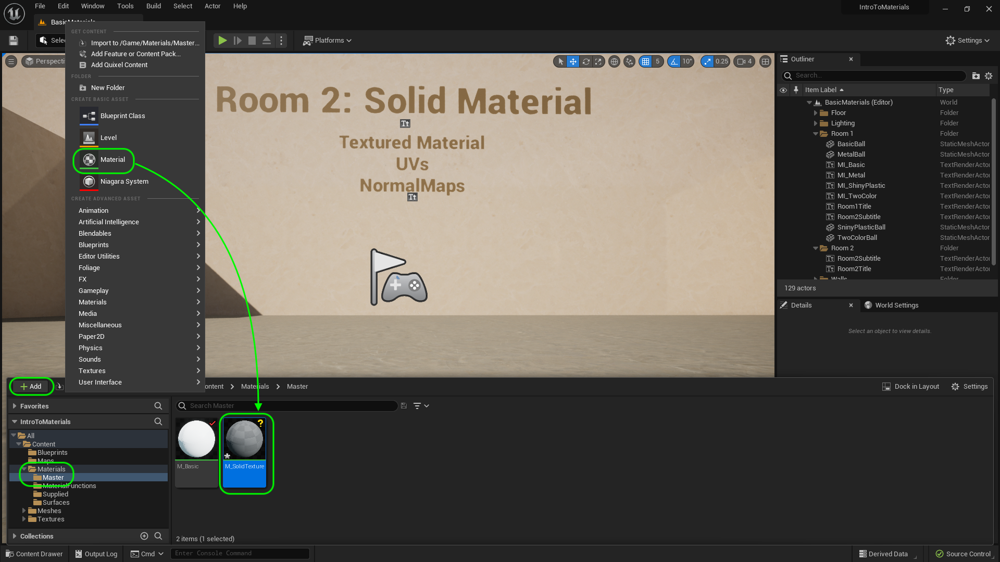

##### `Step 9.`\|`UE5MAT`| :small_orange_diamond: :small_blue_diamond: :small_blue_diamond: :small_blue_diamond: :small_blue_diamond:

Open up **M_SolidTexture**.  Open up the **Content Drawer** (cntrl space bar) and drag the three textures you added to the **Textures | Surfaces** folder onto the graph.

##### `Step 10.`\|`UE5MAT`| :large_blue_diamond:

Now select the texture sample with **T_WildGrass_BCH** and select the **RGB** pin at the top and drag it to **Base Color** in the material node.  Now it is very important not to select the RGBA as we do not have a translucency in this material and it will not use the alpha channel as a height mast but as a transparency.  We are packing a height map in the alpha channel and don't want it altering the base color. Press the <kbd>Apply</kbd> button.

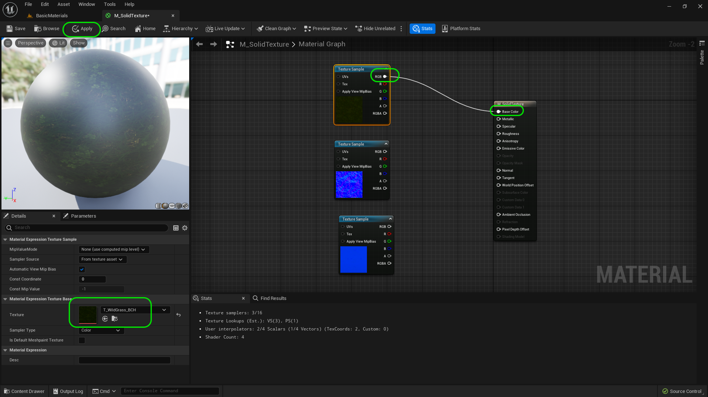

##### `Step 11.`\|`UE5MAT`| :large_blue_diamond: :small_blue_diamond: 

Duplicate a ball/text pair from room 1 and drag it into room 2 (you can hold alt while both objects are selected). 

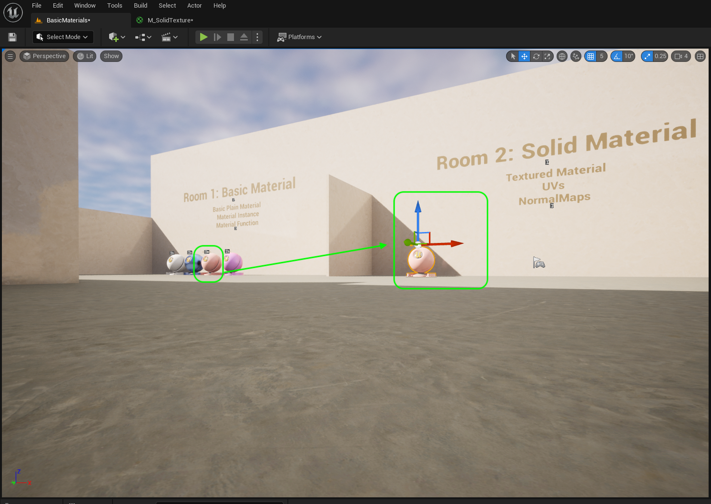

##### `Step 12.`\|`UE5MAT`| :large_blue_diamond: :small_blue_diamond: :small_blue_diamond: 

Select the text in Room 2 and change it to `M_Opaque_MSRAO`. 

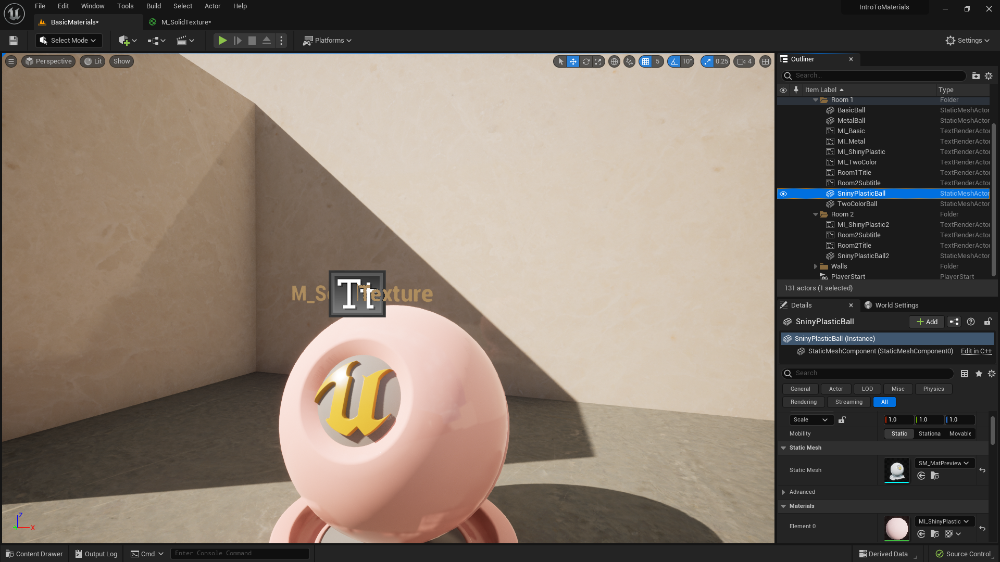

##### `Step 13.`\|`UE5MAT`| :large_blue_diamond: :small_blue_diamond: :small_blue_diamond:  :small_blue_diamond: 

Assign to **Material | Element 0** the **M_Opaque_MSRAO** material. Now you notice that without the other masks this looks flat and it is shiny.  Lets change that.

##### `Step 14.`\|`UE5MAT`| :large_blue_diamond: :small_blue_diamond: :small_blue_diamond: :small_blue_diamond:  :small_blue_diamond: 

Now select the normal map texture, **T_WildGrass_N**.  Double check that the **Sampler Type** is set to `Normal`.  Connect the **RGB** pin to the **Normal** pin in the material.  Press the <kbd>Apply</kbd> button. Now you can see that there is more detail.  It is still too shiny and the roughness and specular are wrong.

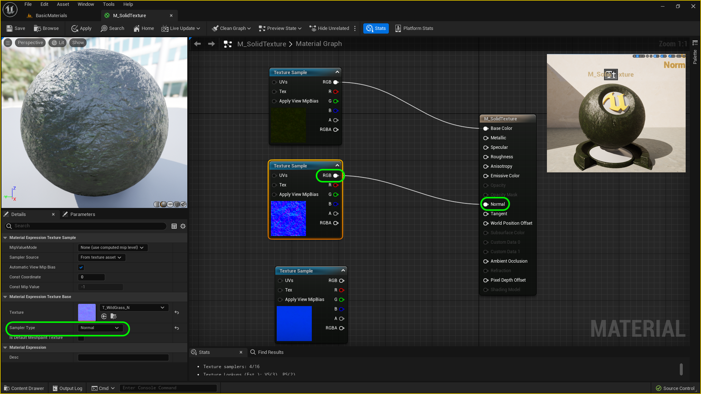

##### `Step 15.`\|`UE5MAT`| :large_blue_diamond: :small_orange_diamond: 

Select the **T_WildGrass_MSRAO**.  The first red **R** pin is for _**M**SRAO or Metallic.  Connect it to the **Metallic** pin.  Nothing happens as the metallic default is `0` and the entire texture is black (or 0).

##### `Step 16.`\|`UE5MAT`| :large_blue_diamond: :small_orange_diamond:   :small_blue_diamond: 

Now connect the second **S** pin to **Specular**.  This is solid black so it will remove all the specularity.  Press the <kbd>Apply</kbd> button. Check it out in game and you will notice that all the sheen (plastic) has been removed.

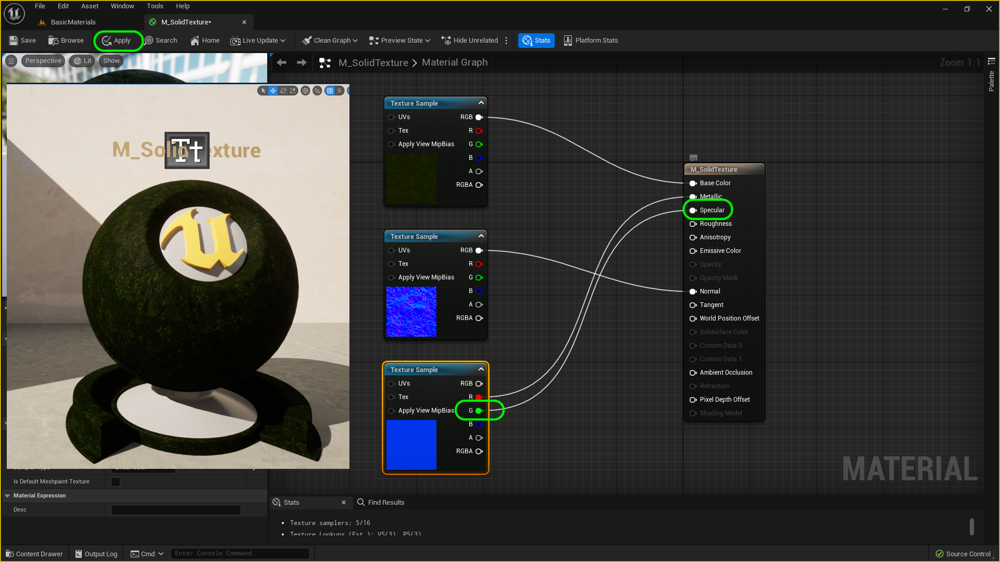

##### `Step 17.`\|`UE5MAT`| :large_blue_diamond: :small_orange_diamond: :small_blue_diamond: :small_blue_diamond:

Now the third mask in the `_MSRAO` is **R** for **Roughness**.  Connect the **blue** pin to the **Roughness** input pin in the shader. Press the <kbd>Apply</kbd> button. Notice that now the texture really takes forms and some areas are rough and others are not.

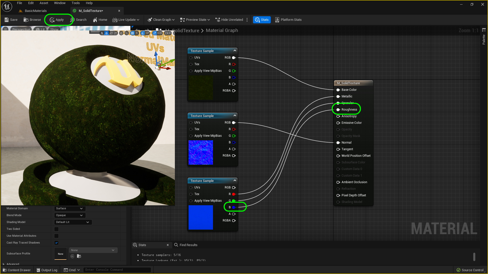

##### `Step 18.`\|`UE5MAT`| :large_blue_diamond: :small_orange_diamond: :small_blue_diamond: :small_blue_diamond: :small_blue_diamond:

Tthe fourth and final mask in the `_MSRAO` is **AO** for **Ambient Occlusion**.  Connect the **alpha** pin to the **Ambient Occlusion** input pin in the shader. Press the <kbd>Apply</kbd> button. There is more depth to the texture as the shading subtelty now comes through.

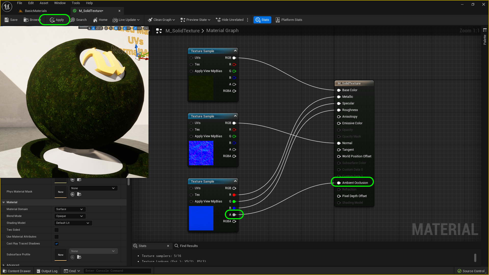

##### `Step 19.`\|`UE5MAT`| :large_blue_diamond: :small_orange_diamond: :small_blue_diamond: :small_blue_diamond: :small_blue_diamond: :small_blue_diamond:

Now grab the **Player Start** actor and move it in front of the material ball in room 2.

##### `Step 20.`\|`UE5MAT`| :large_blue_diamond: :large_blue_diamond:

*Press* the <kbd>Play</kbd> button and take a look at the texture.  This is our first solid opaque texture!

https://github.com/LSU-UE5/UE5-Materials/assets/5504953/841addc2-c5f8-4639-9d19-2b42f8f74330

<!--  -->
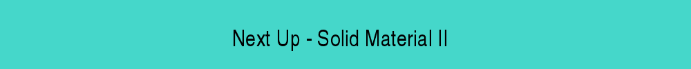

| [previous](../basic-iii/README.md#user-content-basic-material-iii)| [home](../README.md#user-content-ue5-intro-to-materials) | [next](../solid-material-ii/README.md#user-content-solid-material-ii)|
|---|---|---|
