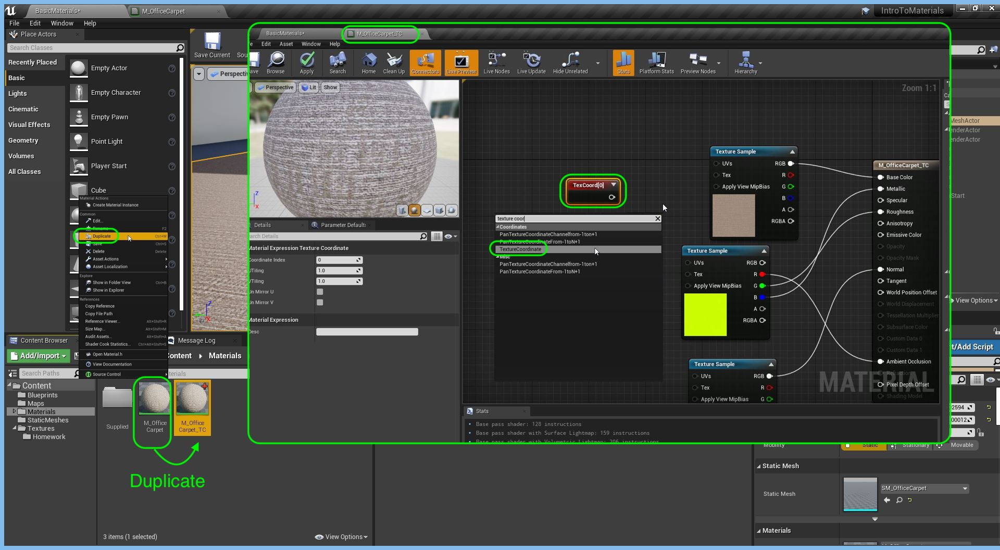
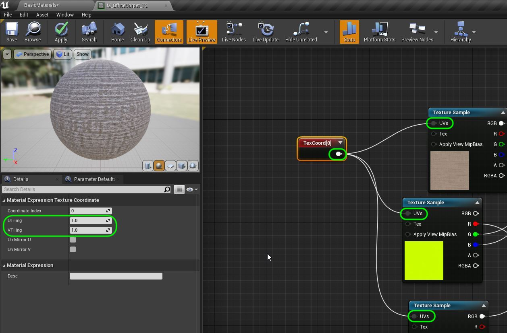
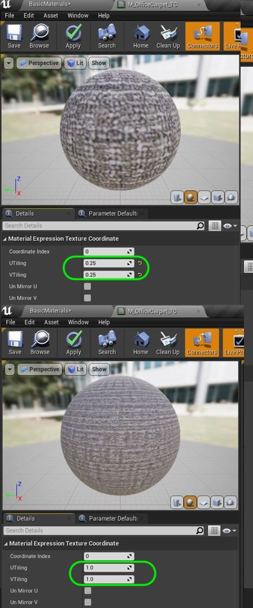
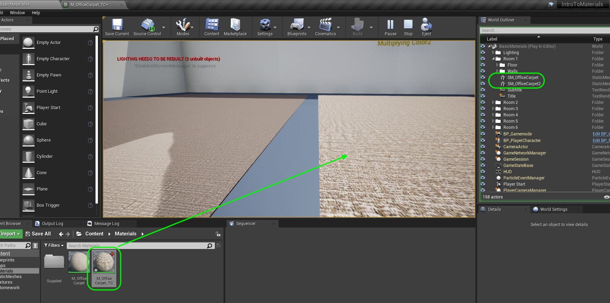
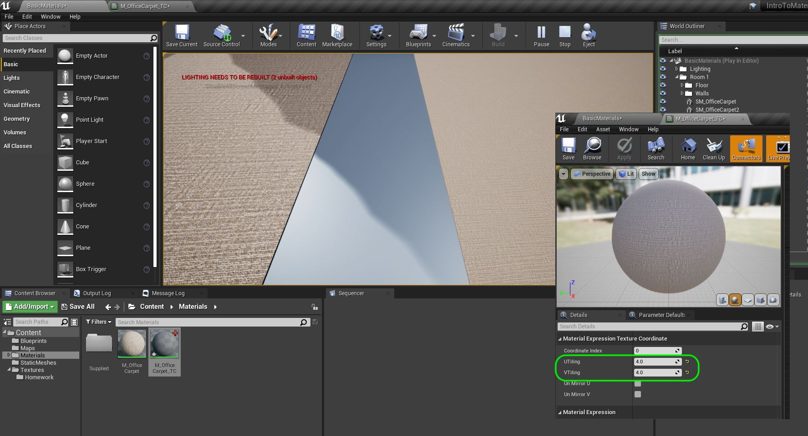
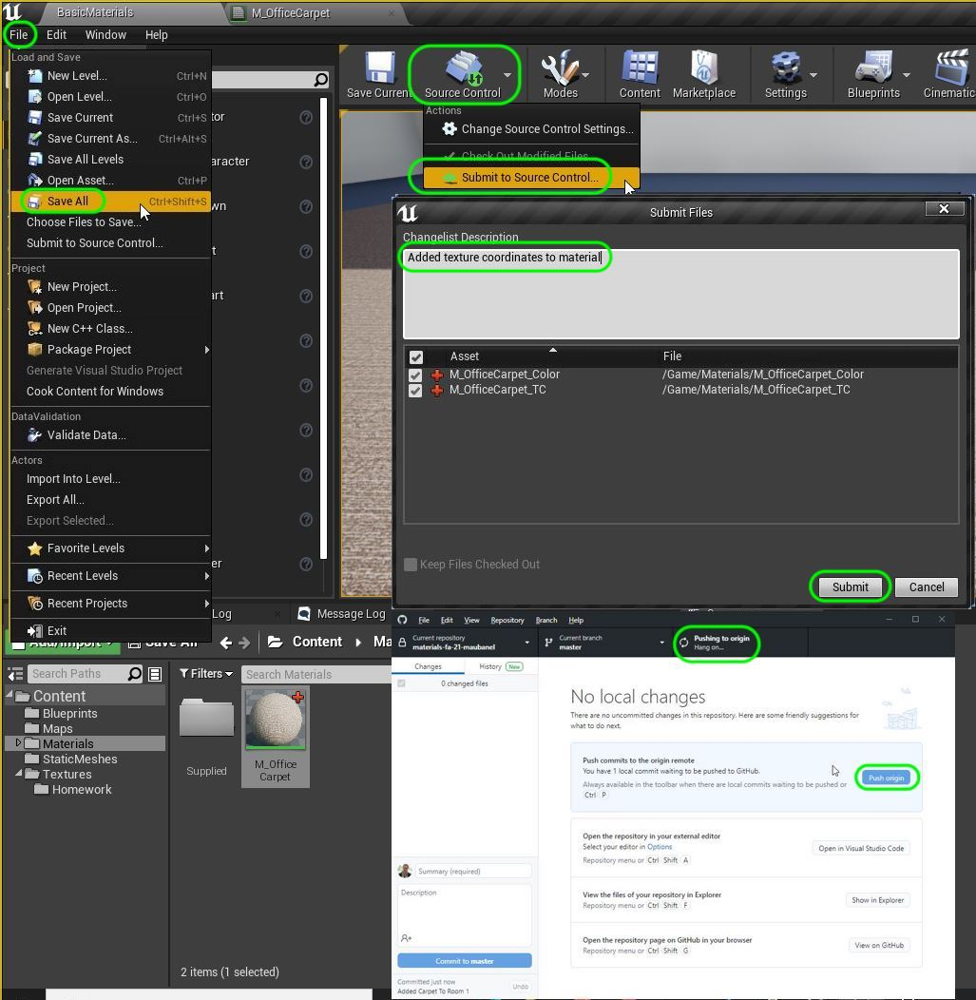

### Texture Coordinates

[previous](../room-1-carpet/README.md#user-content-room-1-carpet-material) • [home](../README.md#user-content-ue4-intro-to-materials) • [next](../color-math/README.md#user-content-material-color-math)

The static mesh **UV 0** dictated how many times the texture will tile on the model.  But sometimes you might want to make adjustments without having to rework the model.  Inside our material shader, we can alter how many time the material is tiled to get the scale of the texture through a texture coordinate in the material UV. Lets look at this now.

 

---

##### `Step 1.`\|`SUU&G`|:small_blue_diamond:

Duplicate click the `M_OfficeCarpet` Material and call it `M_OfficeCarpet_TC`.  Double click to go to the editor and right click in the menu and type **TextureCoordinate**.

##### `Step 2.`\|`FHIU`|:small_blue_diamond: :small_blue_diamond: 

Click on the new **Texture Coordinate** node and look at the **U Tiling** and **V Tiling**. This represents coordinates of the texture with U being the horizontal and V the vertical. They use **U** and **V** as **X & Y** are reserved for the model transform. The number `1` represents one textures as laid out in the **UV 0**. So this would look the same if the texture is used in the modeling software. Now hook up the node coming from **Texture Coordinate** to the **UV** input in all three **Texture** nodes.

##### `Step 3.`\|`SUU&G`|:small_blue_diamond: :small_blue_diamond: :small_blue_diamond:
With the **Texture Coordinate** node selected change the UV to `.25`.  You can see on the object that a single instance of the texture is covering 4 times the space on the faces.  This makes the texture too pixelated. Press the <kbd>Apply</kbd> button to compile the material.

##### `Step 4.`\|`SUU&G`|:small_blue_diamond: :small_blue_diamond: :small_blue_diamond: :small_blue_diamond:

In the game duplicate the carpet and drop the new **M_OfficeCarpet_TC** onto the carpet next to it.  Press run and take a look.

##### `Step 5.`\|`SUU&G`| :small_orange_diamond:

Now change the UV's to `4` in the material so that it scales the UV's and the repeat happens more frequently (liike you are further away from the object).  Look at it in game.

##### `Step 6.`\|`SUU&G`| :small_orange_diamond: :small_blue_diamond:

OK, now lets finish up this section by savin our work and uploading it to GitHub.  Press **Tile | Save All** then **Source Conrol | Submit to Source Control...** and add a description.  Press the <kbd>Submit</kbd> button.  Open up **GitHub Desktop** and **Push** the commited work.

___

| [previous](../room-1-carpet/README.md#user-content-room-1-carpet-material)| [home](../README.md#user-content-ue4-intro-to-materials) | [next](../color-math/README.md#user-content-material-color-math)|
|---|---|---|
