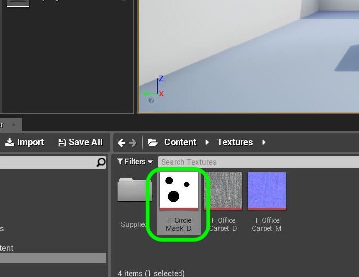
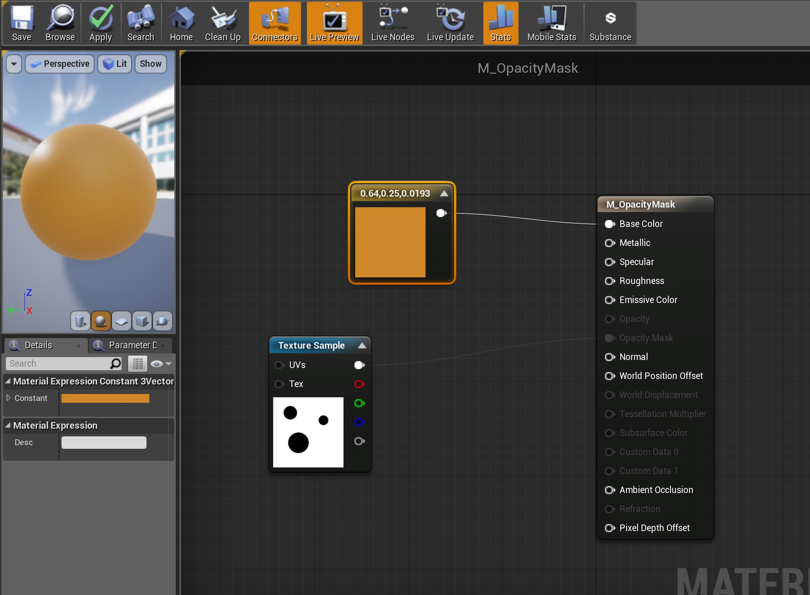

### Texture Masks

[previous](../adding-parameters/README.md#user-content-adding-parameters) • [home](../README.md#user-content-ue4-intro-to-materials) • [next](../translucent/README.md#user-content-translucent-blend-mode)

We do not need to have a single value for each pixel in our base color for our various parameters.  We can apply gray scale masks to alter the material parameters for each pixel.

 

---

##### `Step 1.`\|`SUU&G`|:small_blue_diamond:

Press the **Import** button and go to the folder **Import** and select **[CircleMask_D.tga](../Assets/CircleMask_D.tga)**.

##### `Step 2.`\|`FHIU`|:small_blue_diamond: :small_blue_diamond: 

Rename the file and add `T_` in front of the new file to end up with `T_CircleMask_D`.  Go to the **Materials Folder** and create a new Material called `M_Metallic`.

##### `Step 3.`\|`SUU&G`|:small_blue_diamond: :small_blue_diamond: :small_blue_diamond:

Create a new material in the **Materials** folder called `M_MetalMask`. Open the Material and add a **Texture Sample** node and selected the new texture we just created **T_CircleMask_D**.

##### `Step 4.`\|`SUU&G`|:small_blue_diamond: :small_blue_diamond: :small_blue_diamond: :small_blue_diamond:

Add a **Constant 3 Vector** node and select a strong color. I picked a very bright green.

##### `Step 5.`\|`SUU&G`| :small_orange_diamond:

Lets add these two nodes together.  Right click and type `add` to put a **Add** node on the graph and hook the **Texture Sample | RGB** output with the **Constant 3** output.  The addition will keep the white white, but make the black the green that was created.  

Connect the output of the **Add** node to the **Base Color** node and look at the result on the sphere. You should see a green dot on a white background.

##### `Step 6.`\|`SUU&G`| :small_orange_diamond: :small_blue_diamond:

Add a **Constant** node to the graph set the **Default** to `0`. Plug the output into the **Roughness** pin.  Connect the **Texture Sample | RGB** to the **Metallic** node.  Now every where it is white it will be reflective and every where it is black it will not.  You can see the result on the sphere.

##### `Step 7.`\|`SUU&G`| :small_orange_diamond: :small_blue_diamond: :small_blue_diamond:

Go into the game and move the camera to **Room 3**. Change to **Place** mode and select the **Basic** menu items.  Drag a **Cube** into the game window.  Name the cube `Reflecting Cube` and move it to the **Room 3** folder.

##### `Step 8.`\|`SUU&G`| :small_orange_diamond: :small_blue_diamond: :small_blue_diamond: :small_blue_diamond:

Add the **M_MetalMask** material to the **Reflecting Cube**.  Add to the level a **World Outliner | Lighting | Sphere Reflection Capture** volume. mMake sure the **Influence Radius** is set to `800` and center it over on top of the cube.

##### `Step 9.`\|`SUU&G`| :small_orange_diamond: :small_blue_diamond: :small_blue_diamond: :small_blue_diamond: :small_blue_diamond:

Press the **Build** button to re-build everything including the **Reflection Captures**.

Run the game and go around the cube to look at the reflections.

https://user-images.githubusercontent.com/5504953/131197546-5950fca4-951f-47c5-a2c3-d0d522776b68.mp4

##### `Step 10.`\|`SUU&G`| :large_blue_diamond:

Now what if we wanted the opposite? What if want the green dot to be reflective and the rest of the surface be matte?  We could go to photoshop and invert the image, but we can do this in the material.  Open the **M_Metallic** and add a **OneMinus** node.

##### `Step 11.`\|`SUU&G`| :large_blue_diamond: :small_blue_diamond: 

Connect the output of the Texture Sample to the 1-x node and put that output in Metallic.  Select the cube to preview and now you can see that it only reflects inside the green dots.

##### `Step 12.`\|`SUU&G`| :large_blue_diamond: :small_blue_diamond: :small_blue_diamond: 

To see what the 1-X node does, right click and select **Start Previewing Node**.  See how it just inverts the image.  Turn off the preview and press the **Apply** button.

##### `Step 13.`\|`SUU&G`| :large_blue_diamond: :small_blue_diamond: :small_blue_diamond:  :small_blue_diamond: 

Go into the game and play it and look at the cube.  The metallic effect is now reversed:

https://user-images.githubusercontent.com/5504953/131201170-8152f162-0e6d-4072-b87f-571ddc145cc6.mp4

##### `Step 14.`\|`SUU&G`| :large_blue_diamond: :small_blue_diamond: :small_blue_diamond: :small_blue_diamond:  :small_blue_diamond: 

We have only dealt with opaque materials.  We can also have holes cut in the materials with translucency.  There are two types of approaches. The faster in terms of performance is an opacity mask. This means that a pixel can be completely transparent.  But there are no partial transparencies. The pixel is opaque or is clear.  Lets take a look.  Create a new **Material** in the **Materials** folder and call it `M_OpacityMask`.

##### `Step 15.`\|`SUU&G`| :large_blue_diamond: :small_orange_diamond: 

Double click the new Material and add a **Texture Sample** node. Add the **T_CircleMask_D** texture and you should see.

##### `Step 16.`\|`SUU&G`| :large_blue_diamond: :small_orange_diamond:   :small_blue_diamond: 

Connect the output of the **Texture Sample** node and connect it to the **Opacity Mask** mode.  This does nothing and it is grayed out. We will fix this shortly.

##### `Step 17.`\|`SUU&G`| :large_blue_diamond: :small_orange_diamond: :small_blue_diamond: :small_blue_diamond:

Add a **Constant 3 Vector** and pick a nice bright color.  I picked orange.

##### `Step 18.`\|`SUU&G`| :large_blue_diamond: :small_orange_diamond: :small_blue_diamond: :small_blue_diamond: :small_blue_diamond:

Now the Opacity mask is supposed to be clear where there is an alpha (black pixel) and opaque where white.  Right now we just have a solid Orange surface.

##### `Step 19.`\|`SUU&G`| :large_blue_diamond: :small_orange_diamond: :small_blue_diamond: :small_blue_diamond: :small_blue_diamond: :small_blue_diamond:

There are different blend modes available in the shaders.  To read more about it go to this section in their [manual](https://docs.unrealengine.com/en-us/Engine/Rendering/Materials/MaterialProperties/BlendModes).  Now select the **Blend Mode** drop down menu and pick **Masked**.

##### `Step 20.`\|`SUU&G`| :large_blue_diamond: :large_blue_diamond:

Attach the **Texture Sample** to the **Opacity Mask** pin on the material. Now switch to a cube and you will see that the black areas of the map cut into the cube.

##### `Step 21.`\|`SUU&G`| :large_blue_diamond: :large_blue_diamond: :small_blue_diamond:

Now go to the game and press the **alt** button and drag another copy of the cube.  Assign the **M_OpacityMask** material.

https://user-images.githubusercontent.com/5504953/131201410-ea08a4bc-424b-4b02-be92-8c730669541e.mp4

##### `Step 22.`\|`SUU&G`| :large_blue_diamond: :large_blue_diamond: :small_blue_diamond: :small_blue_diamond:

You might have noticed that there is no inside of the box.  The entire inside is clear.  Why is that?  In 3-D modelling the light is only reflected where normals are placed.  Typically in closed surfaces like cubes there are only normals on one side.  Double click the cube static mesh (in the **World Outliner**) and click on **Normals**.  You should see green lines pointing outwards.

##### `Step 23.`\|`SUU&G`| :large_blue_diamond: :large_blue_diamond: :small_blue_diamond: :small_blue_diamond: :small_blue_diamond:

In the **Details** panel of your Material there is a **Two Sided** radio button.  This allows you to let the material know that you want to project light on both sides of each face of the object.  Look how much better it looks!  Press the <kbd>Apply</kbd> button.

##### `Step 24.`\|`SUU&G`| :large_blue_diamond: :large_blue_diamond: :small_blue_diamond: :small_blue_diamond: :small_blue_diamond: :small_blue_diamond:

Check out the box in game.  Now it looks more like we expect it to. Next up lets make a mask with semi translucent surfaces.

https://user-images.githubusercontent.com/5504953/131201610-d3b85e54-dc15-440a-9ca1-514654b4ef8e.mp4

##### `Step 25.`\|`SUU&G`| :large_blue_diamond: :large_blue_diamond: :small_orange_diamond:

OK, now lets finish up this section by savin our work and uploading it to GitHub.  Press **Tile | Save All** then **Source Conrol | Submit to Source Control...** and add a description.  Press the <kbd>Submit</kbd> button.  Open up **GitHub Desktop** and **Push** the commited work.

___

| [previous](../adding-parameters/README.md#user-content-adding-parameters)| [home](../README.md#user-content-ue4-intro-to-materials) | [next](../translucent/README.md#user-content-translucent-blend-mode)|
|---|---|---|
