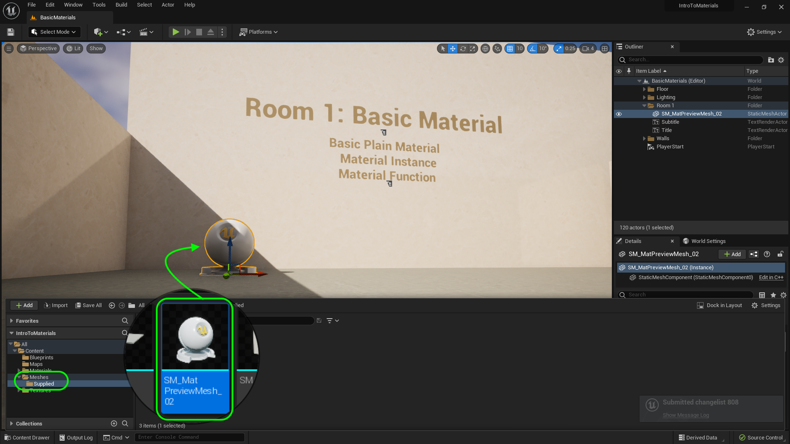
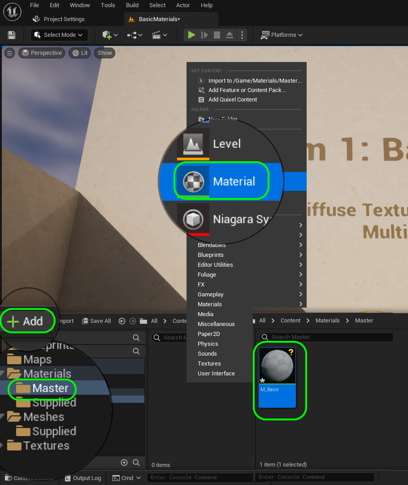
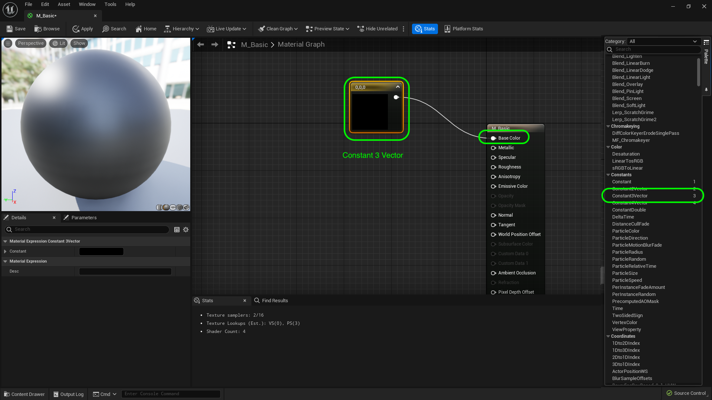
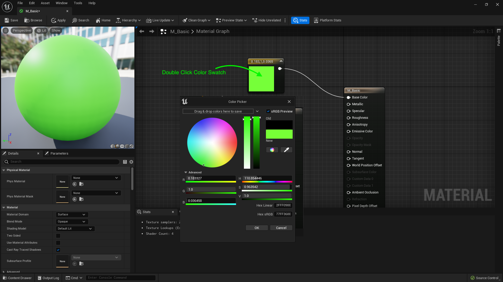
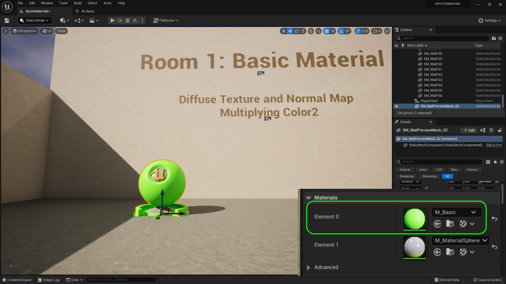
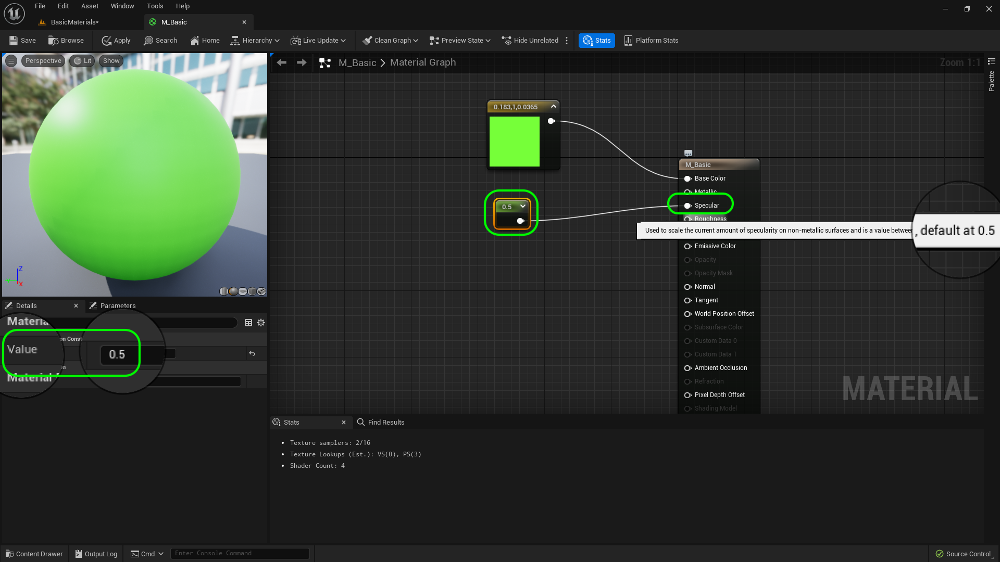
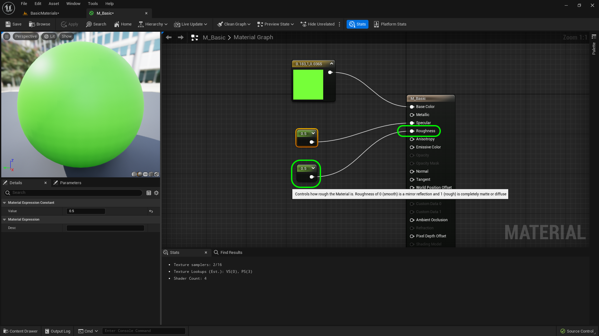
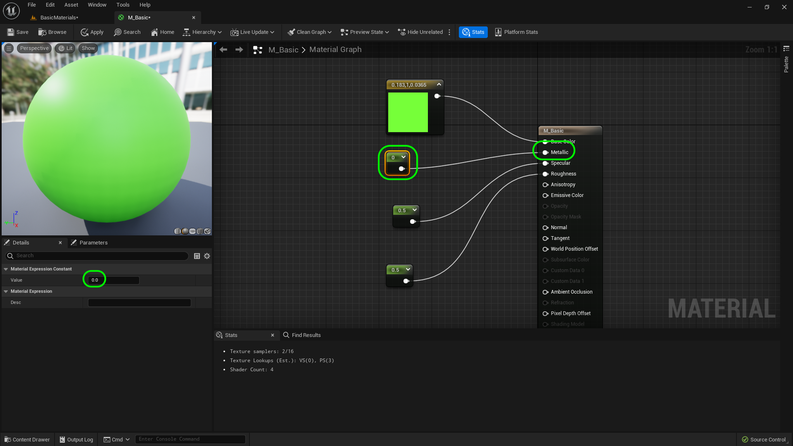
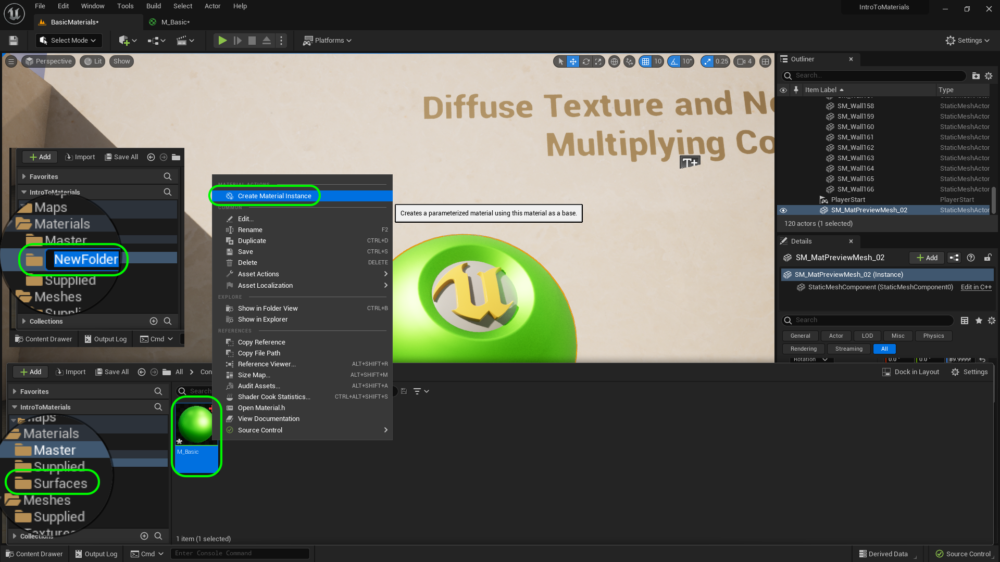
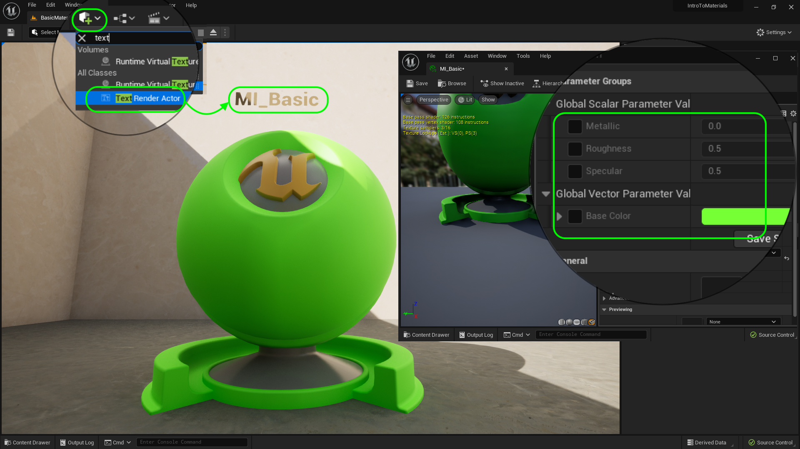

### Basic Material

[previous](../setting-up/README.md#user-content-setting-up) • [home](../README.md#user-content-ue4-intro-to-materials) • [next](../room-1-carpet/README.md#user-content-room-1-carpet-material)

Lets look at the most basic possible material which will be a solid color where we can adjust the material properties.

 

---

##### `Step 1.`\|`UE5MAT`|:small_blue_diamond:

We will use the supplied Unreal material ball to preview our materials.  Go to **Meshes | Supplied** and drag and drop **SM_Mat_PreviewMesh_2** to the level and rotate it towards the camera.

##### `Step 2.`\|`UE5MAT`|:small_blue_diamond: :small_blue_diamond: 

Create a new folder inside **Materials** called `Master`.  We will store all of our master materials here.  Press the <kbd>+ Add</kbd> button and create a new **Material** called `M_Basic`.  This material will feature a simple set of colors and some controls to affect the material in novel ways.

##### `Step 3.`\|`UE5MAT`|:small_blue_diamond: :small_blue_diamond: :small_blue_diamond:

Double click this new material and right click on the empty map and type `Constant 3 Vector` and add this to the graph.  Now you can click on the **Palette** tab and see that the **Constant3Vector** has a shortcut of `3`.  So you can hold the <kbd>3</kbd> button and press the left mouse button and it will also add the same node.  Attach the white pin to the **Base Color** node.  The white pin includes 3 floating point values (3 fractional numbers).  This can represent many things including position (X, Y, Z) or colors (R, G, B). In this case it will represent colors.

##### `Step 4.`\|`UE5MAT`|:small_blue_diamond: :small_blue_diamond: :small_blue_diamond: :small_blue_diamond:

Double click the black swatch in the vector 3 node and you will get a color picker.  Now pick a bold color and you will see the color swatch on the left update. Press the <kbd>Apply</kbd> button.

##### `Step 5.`\|`UE5MAT`| :small_orange_diamond:

The preview window in the top left updates in real time.  We can switch between different meshes to see the material in action.  Notice that the plane is only visible on one side because the normals only face in one direction. You can also select a model in the **Content Drawer** then press the icon on the far right in the material to load that object to preview the mesh with!

https://user-images.githubusercontent.com/5504953/185119200-57dc3c1b-b2f7-42a6-9b98-43e4d1ebc247.mp4

##### `Step 6.`\|`UE5MAT`| :small_orange_diamond: :small_blue_diamond:

Now go into the editor and select the material ball in the scene.  Change **Materials | Element 0** with `M_Basic` and you will see this new material will be applied. If the color doesn't update go back and make sure you have pressed the <kbd>Apply</kbd> button in the material. Now the material ball shows us the new material we made (the second material slot affects the color of the inside of the ball and the foot of the model).

##### `Step 7.`\|`UE5MAT`| :small_orange_diamond: :small_blue_diamond: :small_blue_diamond:

Press the <kbd>1</kbd> button and left click to add a **Constant** node to the scene.  This is a single floating point value.  Plug the output into the **Specular** node. [Specularity](https://en.wikipedia.org/wiki/Specularity) "_means the quantity used in three-dimensional (3D) rendering which represents the amount of reflectivity a surface has. It is a key component in determining the brightness of specular highlights, along with shininess to determine the size of the highlights._"

If you highlight over it, you see it has a default value of `.5`.  So lets change the value from `0` to `.5`. Setting it to `0` means no specularity and `1` would be maximum specularity.

##### `Step 8.`\|`UE5MAT`| :small_orange_diamond: :small_blue_diamond: :small_blue_diamond: :small_blue_diamond:

Now repeat the above step and connect the **Constant Vector** to the roughness pin.  This affects the overall roughness / smoothness of a surface.  We we can set it also to `.5` which I believe is the default. Setting the value to `1` would be the roughest possible surface and `0` would be the smoothest.

##### `Step 9.`\|`UE5MAT`| :small_orange_diamond: :small_blue_diamond: :small_blue_diamond: :small_blue_diamond: :small_blue_diamond:

Lets add one final floating point value and leave it at `0`.  Add a final **Contant Vector** to the graph and connect it to the **Metal** pin. Setting it to `0` would be non metalic and setting it to `1` would be metallic.  Typically unless it is painted metal, or rusty metal this value would only be 0 or 1.

##### `Step 10.`\|`UE5MAT`| :large_blue_diamond:

Now with a material, we can make changes inside the material and the material render updates quickly.  But you have to press the <kbd>Apply</kbd> in game.  Make some changes and check it out in the game.

https://user-images.githubusercontent.com/5504953/185154729-68bb9983-c9b9-429d-bd5a-c94d2f6474fc.mp4

##### `Step 11.`\|`UE5MAT`| :large_blue_diamond: :small_blue_diamond: 

Also each material takes memory.  Is there a way we can share a material and allow it to update more quickly?  Yes, there is!  First play around with various settings and check them out in game.  Don't forget to press the <kbd>Apply</kbd> button.

https://user-images.githubusercontent.com/5504953/185140529-99526d05-22a9-42a9-9ea5-40903f856c6f.mp4

##### `Step 12.`\|`UE5MAT`| :large_blue_diamond: :small_blue_diamond: :small_blue_diamond: 

To allow the ability to share this material amongst almost unlimited variations we need to change everything we would like to edit into a parameter.  So we will right click on the **Vector 3** and select **Convert to Parameter** and call it `Base Color`.  We will do the same thing for the three **Constant Vectors** calling them `Metallic`, `Specular` and `Roughness`.

https://user-images.githubusercontent.com/5504953/185141934-4e6ae610-decc-455e-9dd8-f0495e4e29d3.mp4

##### `Step 13.`\|`UE5MAT`| :large_blue_diamond: :small_blue_diamond: :small_blue_diamond:  :small_blue_diamond: 

Create a new folder under **Materials** and call it `Surfaces`. Now right click on **M_Basic** and call the material instance `MI_Basic`.  We will leave the default settings.

##### `Step 14.`\|`UE5MAT`| :large_blue_diamond: :small_blue_diamond: :small_blue_diamond: :small_blue_diamond:  :small_blue_diamond: 

How you can assign this new material instance to the model.  So change the material from **M_Basic** to **MI_Basic**.  Now when you adjust the settings it not only updates the model in the material right away but also previews the change in the game editor immediately as well.  It also allows artists to update the material without wading through a node chart.

https://user-images.githubusercontent.com/5504953/185163144-e4db7a91-1bba-4e99-87f0-9f103e2ecd6f.mp4

##### `Step 15.`\|`UE5MAT`| :large_blue_diamond: :small_orange_diamond: 

Now reset the material settings back to default to get to the base material look. Press the <kbd>Place Actors</kbd> button and drag a **Text Render Actor** on top of the material ball.  Change the text to `MI_Basic` and select a color and size that works.

##### `Step 16.`\|`UE5MAT`| :large_blue_diamond: :small_orange_diamond:   :small_blue_diamond: 

OK, now lets see the power of the material instance.  Lets create a different color with different material properties using the same master material.  Open up **Materials | Surface | MI_Basic** and right click and select **Duplicate**.  Call this new material instance `MI_Metal`.  In the editor select both the material ball and the title and hold the <kbc>Alt</kbd> button and drag the gizmo and another copy to the right.

https://user-images.githubusercontent.com/5504953/185393031-2ffc57d8-b99d-4c4b-adb1-987e503ee65d.mp4

##### `Step 17.`\|`UE5MAT`| :large_blue_diamond: :small_orange_diamond: :small_blue_diamond: :small_blue_diamond:

Open up **MI_Metal** and change the color.  Assign **Materials | Element1** in the material sphere to `MI_Metal`. Set **Metallic** to `1.0`. Set the **Roughness** to `0.2` and **Specular** to `0.8`. Now *press* the <kbd>Play</kbd> button in the top menu bar to launch the game. Now you have two different looking materials using the exact same base.  Notice how much faster it is to edit without having to to re-compile the material with every change to see it in game.

https://user-images.githubusercontent.com/5504953/185398784-3ab5b55b-c3de-4f92-8ba6-824ad5be31cd.mp4

##### `Step 18.`\|`UE5MAT`| :large_blue_diamond: :small_orange_diamond: :small_blue_diamond: :small_blue_diamond: :small_blue_diamond:

Now select the text actor on top of the metallic material ball and change the **Text** to `MI_Metal`.  Now *press* the <kbd>Play</kbd> button in the top menu bar to launch the game. Now you have completed the two material balls. 

https://user-images.githubusercontent.com/5504953/185399920-9c2d5446-65fe-4794-b438-f99432c316cd.mp4

##### `Step 19.`\|`UE5MAT`| :large_blue_diamond: :small_orange_diamond: :small_blue_diamond: :small_blue_diamond: :small_blue_diamond: :small_blue_diamond:

##### `Step 20.`\|`UE5MAT`| :large_blue_diamond: :large_blue_diamond:

##### `Step 21.`\|`UE5MAT`| :large_blue_diamond: :large_blue_diamond: :small_blue_diamond:

<!--  -->

| [previous](../setting-up/README.md#user-content-setting-up)| [home](../README.md#user-content-ue4-intro-to-materials) | [next](../room-1-carpet/README.md#user-content-room-1-carpet-material)|
|---|---|---|
