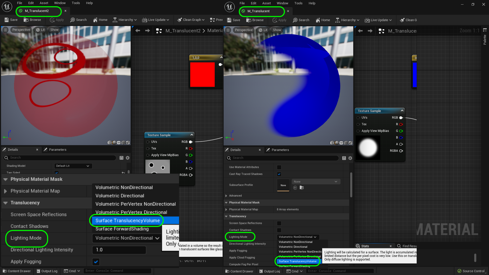

### Masks, Opacity & Translucent II

[previous](../masks/README.md#user-content-masks-opacity--translucent) • [home](../README.md#user-content-ue4-intro-to-materials) • [next](../illumination/README.md#user-content-emissive-material)

Lets see our final opacity mask in action.  Next up we will see What happens when we want to have a complex transluscent alpha on a material?

 

---

##### `Step 1.`\|`UE5MAT`|:small_blue_diamond:

Now in game you can play with the settings and change the tint color.  Notice the shadow respects the transparency.  Now also notice it is either opaque or completely transparent.  There is nothing in between.  This is the most efficient way of rendering transparencies.

##### `Step 2.`\|`UE5MAT`|:small_blue_diamond: :small_blue_diamond: 

Some objects like glass need to be translucent.  Now in games we want to try and limit how many we use.  This material is very expensive computationally and should be used with discretion. Go to the **Textures | Mask** folder and add **[T_CircleMask_T.png](../Assets/T_CircleFeathered.png)** to the game.

##### `Step 3.`\|`UE5MAT`|:small_blue_diamond: :small_blue_diamond: :small_blue_diamond:

Create a new material called `M_Translucent` and place it in your **Materials | Master** folder. Change the blend mode to `Translucent`.  Notice that many pins are no longer available in this render node.  All the releveant PBR pins disappear so we are pretty limited in this expensive mode.

##### `Step 4.`\|`UE5MAT`|:small_blue_diamond: :small_blue_diamond: :small_blue_diamond: :small_blue_diamond:

Now add the mask we just imported to the node chart as a **Texture Sample**.  Then send it to a **1-x** node then on to the **Opacity** pin.  Notice we have a more feathered effect.  Please note this is computationally very expensive.

##### `Step 5.`\|`UE5MAT`| :small_orange_diamond:

Now add a **Constant 3 Vector** and make it solid blue (0, 0, 1).  Put the output pin into **Base Color**.  Set **Two Sided** on the **M_Translucent** node to `true`. Press the <kbd>Apply</kbd> button.
    

##### `Step 6.`\|`UE5MAT`| :small_orange_diamond: :small_blue_diamond:

Create a new **Material Instance** from **M_Translucent** called `MI_Translucent`.  Move it to the **Materials | Mask** folder.  Duplicate a cube and pull it to the right and drop the **MI_Translucent** on the third cube.

##### `Step 7.`\|`UE5MAT`| :small_orange_diamond: :small_blue_diamond: :small_blue_diamond:

Download [T_CircleMask_T.tga](../Assets/T_CircleMask_T.tga) and put it in the **Textures | Masks** folder. Go to **Materials | Master** and duplicate **M_Translucent** and call it `M_Translucent2`.

##### `Step 8.`\|`UE5MAT`| :small_orange_diamond: :small_blue_diamond: :small_blue_diamond: :small_blue_diamond:

Replace the **texture Sample** with the **T_CircleMask_T** texture.  Remove the **1-x** node.  Hook it up to the **Opacity** pin.  Press the <kbd>Apply</kbd> button.

##### `Step 9.`\|`UE5MAT`| :small_orange_diamond: :small_blue_diamond: :small_blue_diamond: :small_blue_diamond: :small_blue_diamond:

Now right click **M_Translucent2** and create a **Material Instance** called `MI_Translucent2`.  Copy another cube and assign the new **MI_Translucent2**. But it doesn't cast a shadow, nor does the previous cube.

##### `Step 10.`\|`UE5MAT`| :large_blue_diamond:

There are two things we need to do to fix this.  Go back to the Material and change the **Lighting Mode** to `Surface Translucency Volume`. Press the <kbd>Apply</kbd> button. Do this for both **M_Translucent** and **M_Translucent2**.

##### `Step 11.`\|`UE5MAT`| :large_blue_diamond: :small_blue_diamond: 

Then go into the game and select the two cubes you previously created. Go into the details panel. Go to the **Lighting | Advanced** section. Look for the Radio line that has **Volumetric Translucent Shadow** and make sure it is set to `true`. Notice the shadows pop back into the scene! 

##### `Step 12.`\|`UE5MAT`| :large_blue_diamond: :small_blue_diamond: :small_blue_diamond: 

*Press* the <kbd>Play</kbd> button and look at the four cubes.  Make any adjustments you need but we should have four different masked cubes.

https://user-images.githubusercontent.com/5504953/185826507-028d08f9-f278-443a-8316-bae7439b4bcb.mp4

##### `Step 13.`\|`UE5MAT`| :large_blue_diamond: :small_blue_diamond: :small_blue_diamond:  :small_blue_diamond: 

Now there is a problem. This is a non-nanite model.  So what happens with a nanite model?  Lets find out.  Go into **Modeling Mode** and select a **Shape | Box** and make it `300` cubed.  We will have 6 subdivisions per dimension.  Place it in the level then press the <kbd>Complete</kbd> button.

##### `Step 14.`\|`UE5MAT`| :large_blue_diamond: :small_blue_diamond: :small_blue_diamond: :small_blue_diamond:  :small_blue_diamond: 

Add a new folder in **Meshes** called `BasicGeometry`. Rename the box `SM_CubeNanite` and move it into the **BasicGeometry** folder.

##### `Step 15.`\|`UE5MAT`| :large_blue_diamond: :small_orange_diamond: 

Open up **SM_CubeNanite** and enable **Nanites**.

##### `Step 16.`\|`UE5MAT`| :large_blue_diamond: :small_orange_diamond:   :small_blue_diamond: 

Assign **MI_MetalMask**.  It works fine.

##### `Step 17.`\|`UE5MAT`| :large_blue_diamond: :small_orange_diamond: :small_blue_diamond: :small_blue_diamond:

Try the two translucent and opacity mask. Notice that the materials don't work. Nanites will not work with either **Opacity Mas** or **Translucent** mode.  It also doesn't work with double sided materials.  You will notice that the material just doesn't render at all.  Put it back to **MI_MetalMask**.

##### `Step 18.`\|`UE5MAT`| :large_blue_diamond: :small_orange_diamond: :small_blue_diamond: :small_blue_diamond: :small_blue_diamond:

Rename items in **Room 3** in the **Outliner** so it makes sense.

##### `Step 19.`\|`UE5MAT`| :large_blue_diamond: :small_orange_diamond: :small_blue_diamond: :small_blue_diamond: :small_blue_diamond: :small_blue_diamond:

Select the **File | Save All** then press the <kbd>Source Control</kbd> button and select **Submit Content**.  If you are prompted, select **Check Out** for all items that are not checked out of source control. Update the **Changelist Description** message and with the latest changes. Make sure all the files are correct and press the <kbd>Submit</kbd> button. A confirmation will pop up on the bottom right with a message about a changelist was submitted with a commit number.

<!--  -->

| [previous](../masks/README.md#user-content-masks-opacity--translucent)| [home](../README.md#user-content-ue4-intro-to-materials) | [next](../illumination/README.md#user-content-emissive-material)|
|---|---|---|
