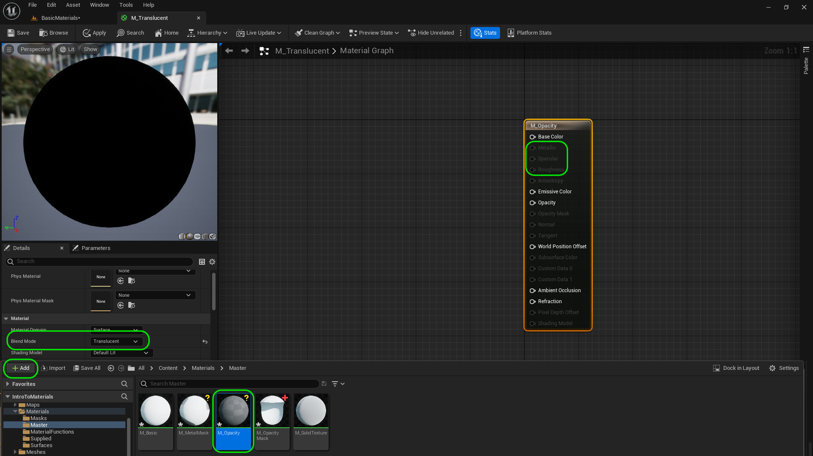
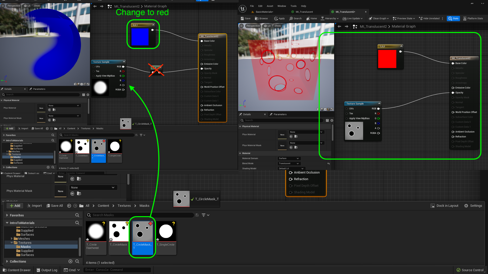
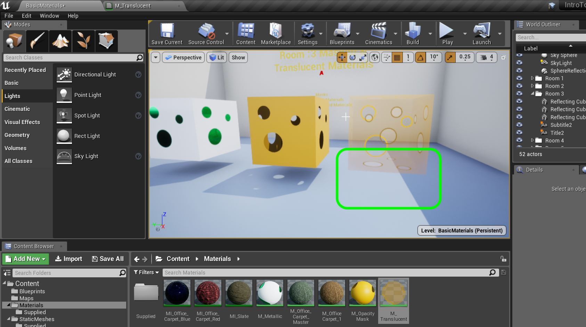
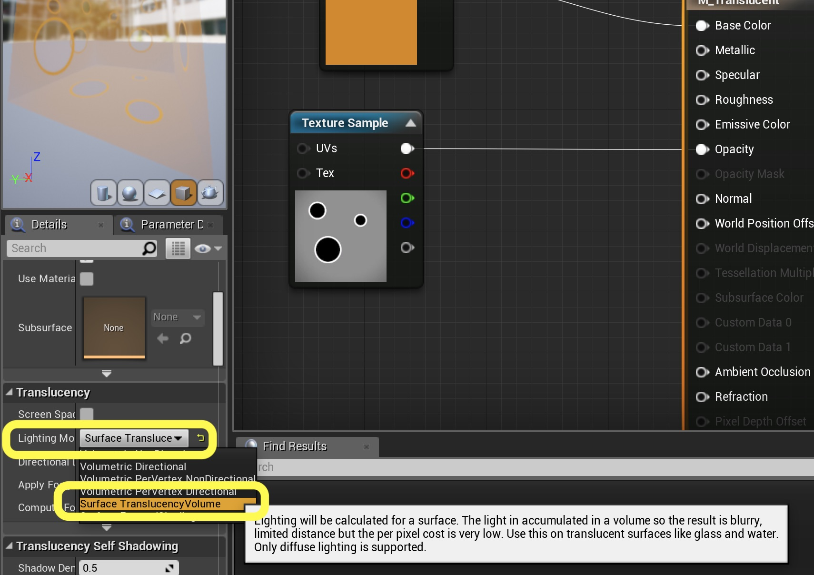
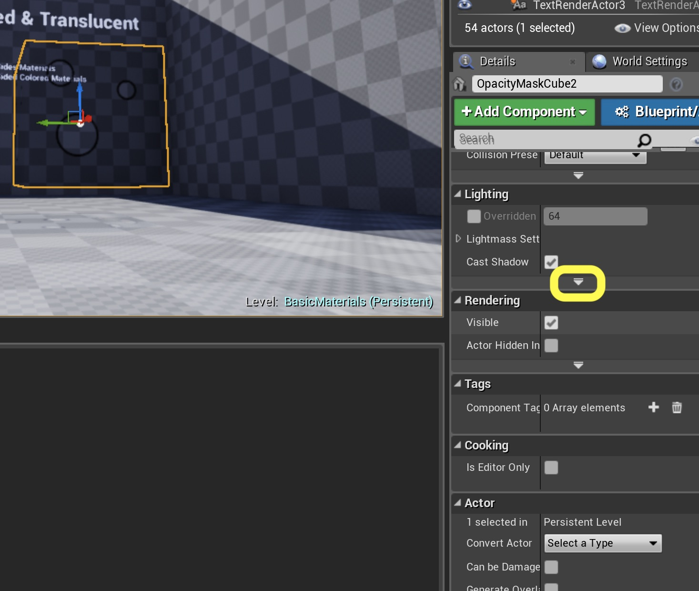
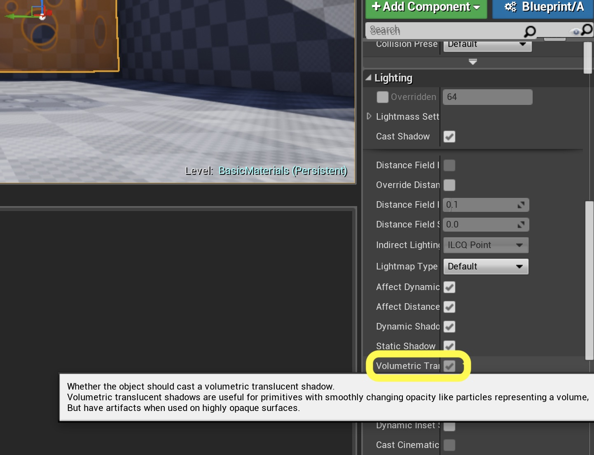
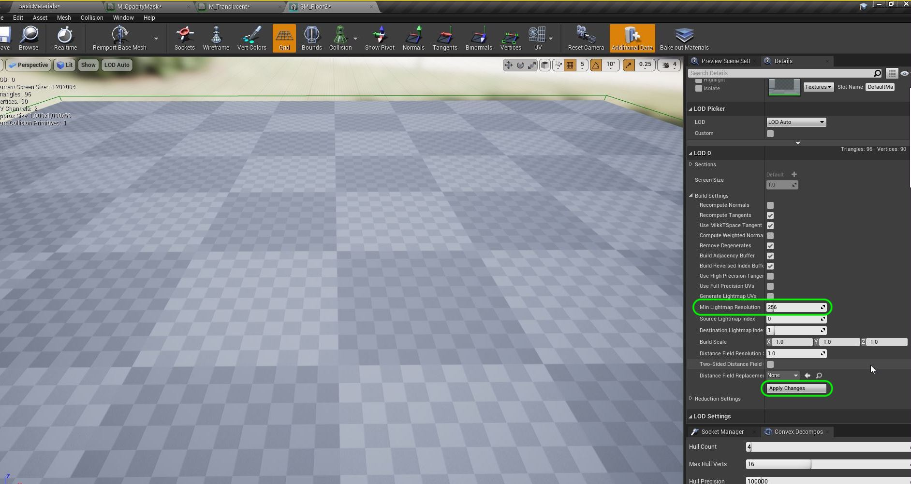
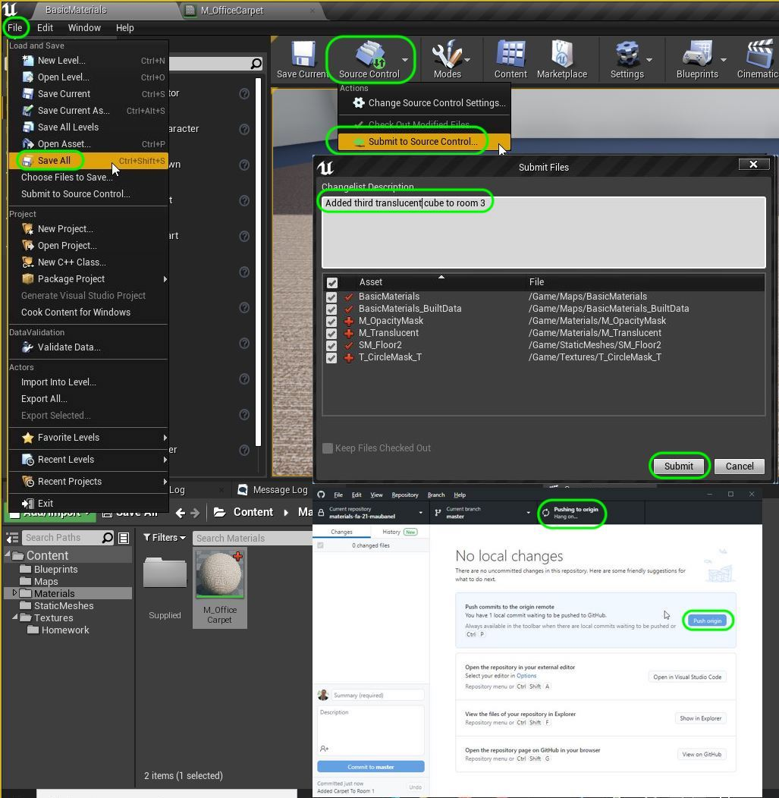

### Masks, Opacity & Translucent II

[previous](../masks/README.md#user-content-masks-opacity--translucent) • [home](../README.md#user-content-ue4-intro-to-materials) • [next](../illumination/README.md#user-content-illumination)

Lets see our final opacity mask in action.  Next up we will see What happens when we want to have a complex transluscent alpha on a material?

 

---

##### `Step 1.`\|`UE5MAT`|:small_blue_diamond:

Now in game you can play with the settings and change the tint color.  Notice the shadow respects the transparency.  Now also notice it is either opaque or completely transparent.  There is nothing in between.  This is the most efficient way of rendering transparencies.

##### `Step 2.`\|`UE5MAT`|:small_blue_diamond: :small_blue_diamond: 

Some objects like glass need to be translucent.  Now in games we want to try and limit how many we use.  This material is very expensive computationally and should be used with discretion. Go to the **Textures | Mask** folder and add **[T_CircleMask_T.png](../Assets/T_CircleFeathered.png)** to the game.

##### `Step 3.`\|`UE5MAT`|:small_blue_diamond: :small_blue_diamond: :small_blue_diamond:

Create a new material called `M_Translucent` and place it in your **Materials | Master** folder. Change the blend mode to `Translucent`.  Notice that many pins are no longer available in this render node.  All the releveant PBR pins disappear so we are pretty limited in this expensive mode.

##### `Step 4.`\|`UE5MAT`|:small_blue_diamond: :small_blue_diamond: :small_blue_diamond: :small_blue_diamond:

Now add the mask we just imported to the node chart as a **Texture Sample**.  Then send it to a **1-x** node then on to the **Opacity** pin.  Notice we have a more feathered effect.  Please note this is computationally very expensive.

##### `Step 5.`\|`UE5MAT`| :small_orange_diamond:

Now add a **Constant 3 Vector** and make it solid blue (0, 0, 1).  Put the output pin into **Base Color**.  Set **Two Sided** on the **M_Translucent** node to `true`. Press the <kbd>Apply</kbd> button.
    

##### `Step 6.`\|`UE5MAT`| :small_orange_diamond: :small_blue_diamond:

Create a new **Material Instance** from **M_Translucent** called `MI_Translucent`.  Move it to the **Materials | Mask** folder.  Duplicate a cube and pull it to the right and drop the **MI_Translucent** on the third cube.

##### `Step 7.`\|`UE5MAT`| :small_orange_diamond: :small_blue_diamond: :small_blue_diamond:

Download [T_CircleMask_T.png](../Assets/T_CircleMask_T.tga) and put it in the **Textures | Masks** folder. Go to **Materials | Master** and duplicate **M_Translucent** and call it `M_Translucent2`.

##### `Step 8.`\|`UE5MAT`| :small_orange_diamond: :small_blue_diamond: :small_blue_diamond: :small_blue_diamond:

##### `Step 9.`\|`UE5MAT`| :small_orange_diamond: :small_blue_diamond: :small_blue_diamond: :small_blue_diamond: :small_blue_diamond:

Go back to the game and it looks better.  But it doesn't cast a shadow.

##### `Step 10.`\|`UE5MAT`| :large_blue_diamond:

There are two things we need to do to fix this.  Go back to the Material and change the **Lighting Mode** to `Surface Translucency Volume`. Press the <kbd>Apply</kbd> button.

##### `Step 11.`\|`UE5MAT`| :large_blue_diamond: :small_blue_diamond: 

Then go into the game and select the cube you previously created. Go into the details panel. Go to the **Lighting** section and there is a downward arrow under **Shadows**.  Click this to expand the selection.

##### `Step 12.`\|`UE5MAT`| :large_blue_diamond: :small_blue_diamond: :small_blue_diamond: 

Look for the Radio Button that has **Volumetric Translucent Shadow** and make sure it is selected. 

##### `Step 13.`\|`UE5MAT`| :large_blue_diamond: :small_blue_diamond: :small_blue_diamond:  :small_blue_diamond: 

Double check that the **Lighting | Directional Light** is **Stationary**. Open up **SM_Floor2** and set the **Min Lightmap Resolution** to `256`. Press the <kbd>Build</kbd> button to rebuild the lights.

##### `Step 14.`\|`UE5MAT`| :large_blue_diamond: :small_blue_diamond: :small_blue_diamond: :small_blue_diamond:  :small_blue_diamond: 

Go into the game and play it and look at the cube.  We have a nice soft shadow next to the hard ones!

https://user-images.githubusercontent.com/5504953/131202770-5b1492a3-0fa7-4579-af31-cd1cf832a67d.mp4

##### `Step 15.`\|`UE5MAT`| :large_blue_diamond: :small_orange_diamond: 
Lets **Save All**, **Build** the lighting and open GitHub Desktop.  Press **Source Control** and add your latest changes to GitHub.  Commit the last set of changes and push them to the server wiht GitHub Desktop.  We are now done with room 3! 

___

| [previous](../masks/README.md#user-content-masks-opacity--translucent)| [home](../README.md#user-content-ue4-intro-to-materials) | [next](../illumination/README.md#user-content-illumination)|
|---|---|---|
