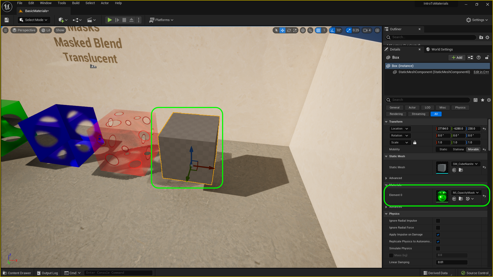
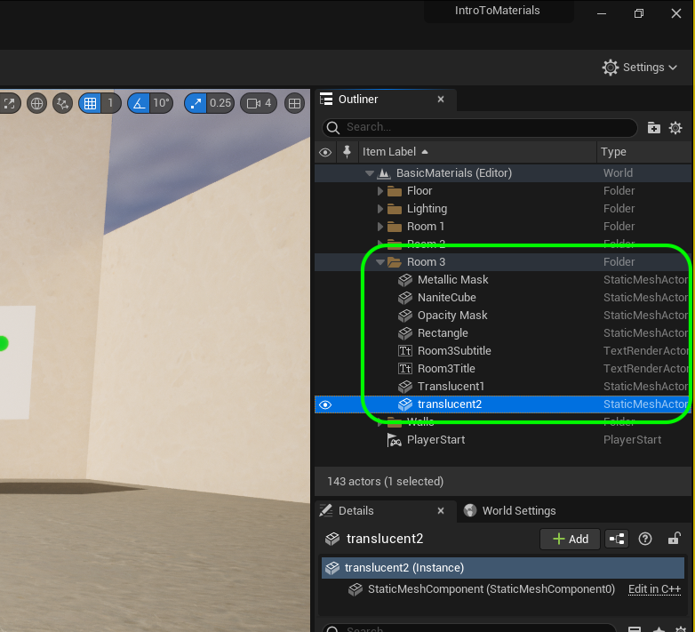
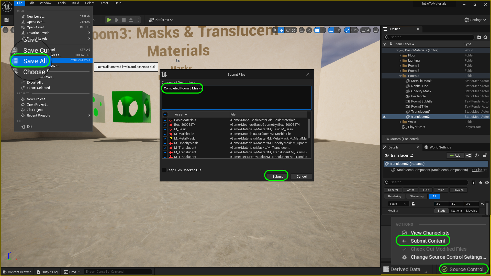

### Masks, Opacity & Translucent II

[previous](../masks/README.md#user-content-masks-opacity--translucent) • [home](../README.md#user-content-ue4-intro-to-materials) • [next](../illumination/README.md#user-content-emissive-material)

Lets see our final opacity mask in action.  Next up we will see What happens when we want to have a complex transluscent alpha on a material?

 

---

##### `Step 1.`\|`UE5MAT`|:small_blue_diamond:

Now lets get the masks to cut some holes.  Open up **MI_Masked_Holes**.  Make it small so you can see both the material instance and the game. Change the **MSRAO** to `T_Base_MSRAO` as we are not using this mask anymore and will go back to the default.  Change the **Roughness** to `0.75`.  Now adjust the **Base Color** texture to `T_GradientMask`. Open up **Material Property Overrides** and change the **Blend Mode** to `Masked`. Now this has no effect as we are not using the alpha channel in the texture.  Go to **Base Color | UseBaseColorAlpha?** and set it to `true`.  Now you have transparent holes.

Now something is wrong, you see right through it there is no inside of the box with the holed.  Go back to **Material Property Overrides** and set **Two Sided** to `true`.  Now you see inside the box as well as nice shadows with the holes on the ground.  

https://github.com/LSU-UE5/UE5-Materials/assets/5504953/568bd2ff-485b-446d-a9bb-a0d4878b8e8c

##### `Step 2.`\|`UE5MAT`|:small_blue_diamond: :small_blue_diamond: 

Some objects like glass need to be translucent.  Now in games we want to try and limit how many we use.  This material is very expensive computationally and should be used with discretion. Go to the **Textures | Mask** folder and add **[T_GradientTransparency.tif](../Assets/T_GradientTransparency.tif)** to the game.

##### `Step 3.`\|`UE5MAT`|:small_blue_diamond: :small_blue_diamond: :small_blue_diamond:

The difference between masks and transparencies is that transparencies can be partially transulcent.  Where it is white it is opaque and black it is completely transparent.  Then a gradient between the two will determine how much it is transparent.  Open up **T_GradientTransparency**.  Notice that it is translucent in the center and the RGB is opaque with another gradient. The center has a hole cut out with a grey scale gradient in it.

##### `Step 4.`\|`UE5MAT`|:small_blue_diamond: :small_blue_diamond: :small_blue_diamond: :small_blue_diamond:

Now go to the **Materials | Master** folder and *right click* on **M_Opaque_MSRAO** and select **Duplicate**.  Call this new master `M_Transparent_MSRAO`

##### `Step 5.`\|`UE5MAT`| :small_orange_diamond:

Open up **M_Transparent_MSRAO** and remove the **Alpha** to **Opacity Mask** connection.  Instead wire it into **Opacity**. Now go to the **Blend Mode** and change it to `Translucent`.  Now if we do not need any of the other masks like Metallic, Specular, Roughness or AO we can leave it. If we need the other pins we need to change the Lighting Mode.
    

##### `Step 6.`\|`UE5MAT`| :small_orange_diamond: :small_blue_diamond:

Change the **Lighting Mode** to `Surface Forward Shading`, now all the pins we had before return.  Caution, this is an expensive shader!

##### `Step 7.`\|`UE5MAT`| :small_orange_diamond: :small_blue_diamond: :small_blue_diamond:

Now add a **Shapes | Plane** to the level and scale it to `2, 2, 2`.  Rotate it so it is facing the center of the room.

##### `Step 8.`\|`UE5MAT`| :small_orange_diamond: :small_blue_diamond: :small_blue_diamond: :small_blue_diamond:

Now go to **Materials | Master** and *right click* on **MI_Transparent_MSRAO** and select **Create Material Instance**.  Call it `MI_Transparent`.  Drag it into the **Materials | Material Instances** folder.

##### `Step 9.`\|`UE5MAT`| :small_orange_diamond: :small_blue_diamond: :small_blue_diamond: :small_blue_diamond: :small_blue_diamond:

Now drag the **MI_Transparent** onto the plane and open up the material instance.  Assign a **Base Color** of `T_GradientTransparency`. Now this is still opaque as the alpha channel is `1` (or completely opaque) by default.

##### `Step 10.`\|`UE5MAT`| :large_blue_diamond:

Now go to **Use Base Color Alpha** and turn it to `true`. Now a semi transparent hole appears on the plane.

##### `Step 11.`\|`UE5MAT`| :large_blue_diamond: :small_blue_diamond: 

Press the <kbd>Play</kbd> button and run around.  Woops the back of the plane is not there and the texture disappears.  Go back to the material instance and turn **Two Sided** to `true`.  Run the game again and now you will see both sides.

https://github.com/LSU-UE5/UE5-Materials/assets/5504953/a1fbb4c0-63b4-4c36-ac5c-e4725c7f0e6c

##### `Step 12.`\|`UE5MAT`| :large_blue_diamond: :small_blue_diamond: :small_blue_diamond: 

##### `Step 13.`\|`UE5MAT`| :large_blue_diamond: :small_blue_diamond: :small_blue_diamond:  :small_blue_diamond: 

Now there is a problem. This is a non-nanite model.  So what happens with a nanite model?  Lets find out.  Go into **Modeling Mode** and select a **Shape | Box** and make it `300` cubed.  We will have 6 subdivisions per dimension.  Place it in the level then press the <kbd>Complete</kbd> button.

##### `Step 14.`\|`UE5MAT`| :large_blue_diamond: :small_blue_diamond: :small_blue_diamond: :small_blue_diamond:  :small_blue_diamond: 

Add a new folder in **Meshes** called `BasicGeometry`. Rename the box `SM_CubeNanite` and move it into the **BasicGeometry** folder.

##### `Step 15.`\|`UE5MAT`| :large_blue_diamond: :small_orange_diamond: 

Open up **SM_CubeNanite** and enable **Nanites**.

##### `Step 16.`\|`UE5MAT`| :large_blue_diamond: :small_orange_diamond:   :small_blue_diamond: 

Assign **MI_MetalMask**.  It works fine.

##### `Step 17.`\|`UE5MAT`| :large_blue_diamond: :small_orange_diamond: :small_blue_diamond: :small_blue_diamond:

Try the two translucent and opacity mask. Notice that the materials don't work. Nanites will not work with either **Opacity Mas** or **Translucent** mode.  It also doesn't work with double sided materials.  You will notice that the material just doesn't render at all.  Put it back to **MI_MetalMask**.

##### `Step 18.`\|`UE5MAT`| :large_blue_diamond: :small_orange_diamond: :small_blue_diamond: :small_blue_diamond: :small_blue_diamond:

Rename items in **Room 3** in the **Outliner** so it makes sense.

##### `Step 19.`\|`UE5MAT`| :large_blue_diamond: :small_orange_diamond: :small_blue_diamond: :small_blue_diamond: :small_blue_diamond: :small_blue_diamond:

Select the **File | Save All** then press the <kbd>Source Control</kbd> button and select **Submit Content**.  If you are prompted, select **Check Out** for all items that are not checked out of source control. Update the **Changelist Description** message and with the latest changes. Make sure all the files are correct and press the <kbd>Submit</kbd> button. A confirmation will pop up on the bottom right with a message about a changelist was submitted with a commit number.

<!--  -->

| [previous](../masks/README.md#user-content-masks-opacity--translucent)| [home](../README.md#user-content-ue4-intro-to-materials) | [next](../illumination/README.md#user-content-emissive-material)|
|---|---|---|
