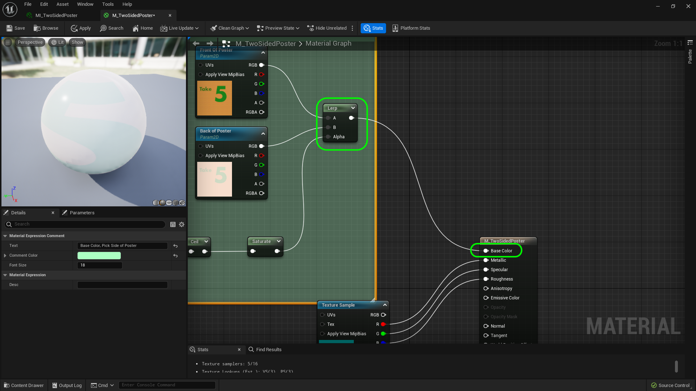

### Two Sided Material II

[previous](../two-sided/README.md#user-content-two-sided-material) • [home](../README.md#user-content-ue5-intro-to-materials) • [next](../decals/README.md#user-content-decals)

Lets finish up with the two sided material.

 

---

##### `Step 1.`\|`UE5MAT`|:small_blue_diamond:

Now we need to clamp the output as we don't want a -1 or any number below 0 or above 1 to get in there when the Alpha only needs a 0 or 1 in this instance (a dot product will return -1 to 1).  So we add a **Saturate** node which clamps values between 0 and 1.  That mean any number number under 0 is 0 and above 1 is 1. Plug the output of this **Saturate** node into the **Alpha** of the **Lerp** node.  

##### `Step 2.`\|`UE5MAT`|:small_blue_diamond: :small_blue_diamond: 

Send the output of the **LERP** node into **Base Color**.  Select all the base color nodes and press the <kbd>C</kbd> button. Add a comment and give the comments a color.

##### `Step 3.`\|`UE5MAT`|:small_blue_diamond: :small_blue_diamond: :small_blue_diamond:

Group the nodes and add comments by pressing the **C** key. Press the **Apply** button and **Save**. 

##### `Step 4.`\|`UE5MAT`|:small_blue_diamond: :small_blue_diamond: :small_blue_diamond: :small_blue_diamond:

Now change the **Preview Mesh** to a **Plane** and rotate around it.  Notice that you are not able to see both sides and the back of the poster is comletely transparent (lacks face normals).

Now make sure you are highlighting the main node and look for **Two Sided** and set it to `True`. We should now have both sides rendering (even though only 1 side has normals).

https://user-images.githubusercontent.com/5504953/186299029-7adae8eb-496b-40d7-a247-f30ab56772b8.mp4

##### `Step 5.`\|`UE5MAT`| :small_orange_diamond:

https://user-images.githubusercontent.com/5504953/186299085-b2419fc5-17a3-4150-9e32-121294a767fa.mp4

##### `Step 6.`\|`UE5MAT`| :small_orange_diamond: :small_blue_diamond:

<!--  -->

| [previous](../two-sided/README.md#user-content-two-sided-material)| [home](../README.md#user-content-ue5-intro-to-materials) | [next](../decals/README.md#user-content-decals)|
|---|---|---|
