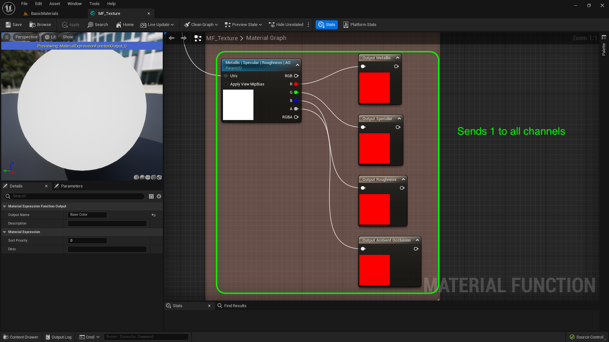
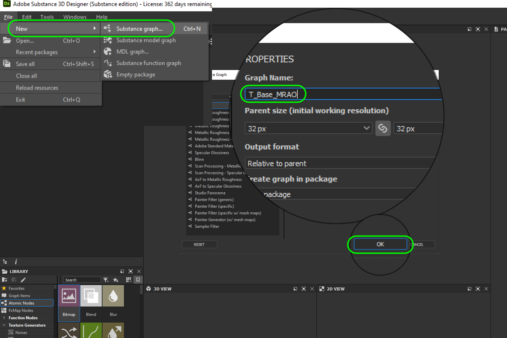
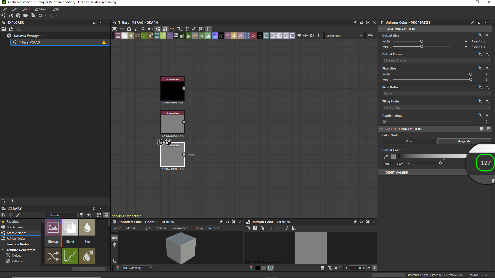
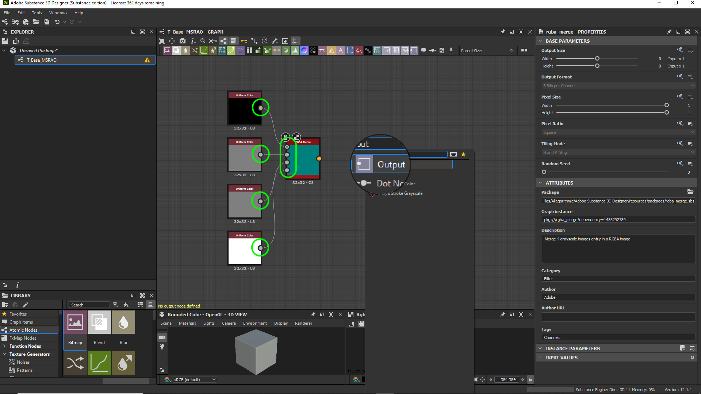
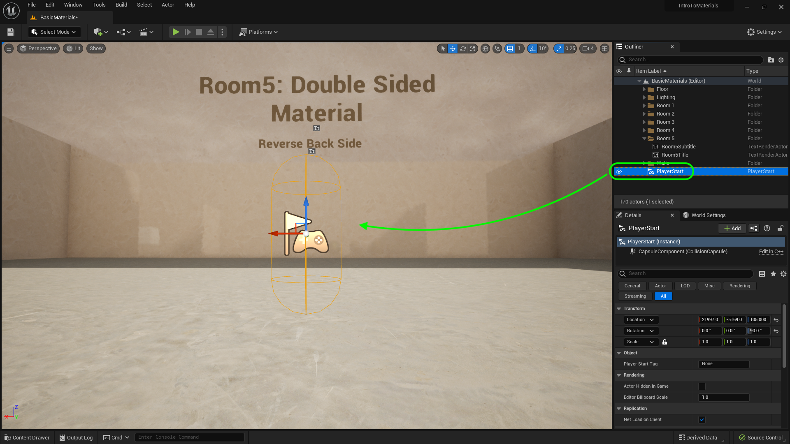
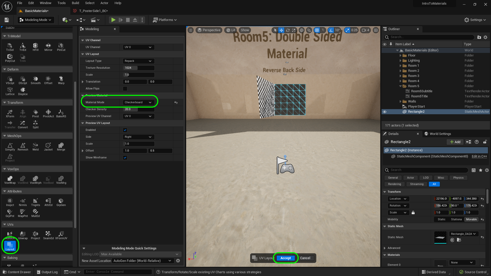
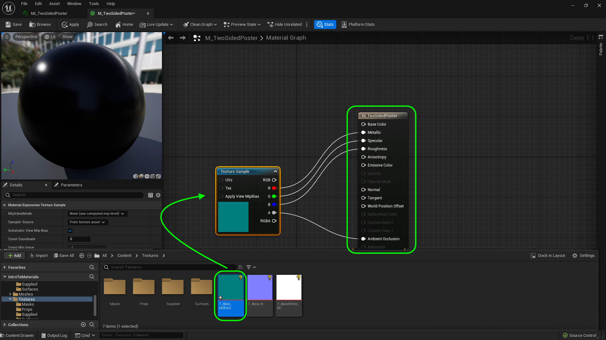
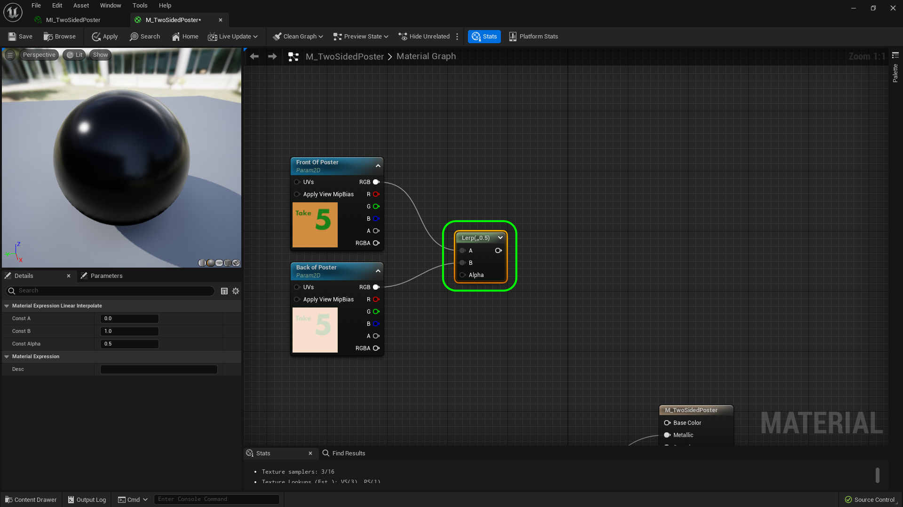
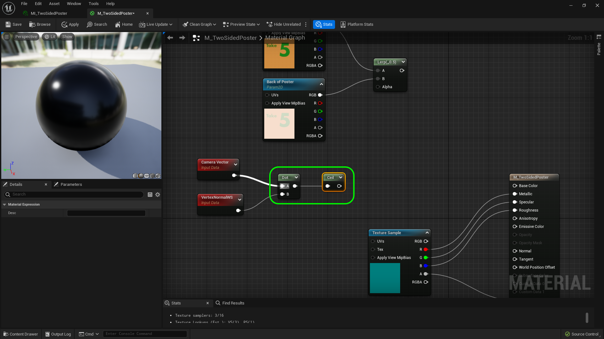

### Two Sided Material

[previous](../illumination-ii/README.md#user-content-emissive-material-ii) • [home](../README.md#user-content-ue4-intro-to-materials) • [next](../two-sided-ii/README.md#user-content-two-sided-material-ii)

Normals point in a single direction so we don't waste compute cycles calculating how light reacts to the inside of shapes that we can't see or enter.  In some cases we want both sides of a polygon to have normals.  You can make adjustments in the shader to affect this without having to do anything in a 3-D modeling package.

 

---

##### `Step 1.`\|`UE5MAT`|:small_blue_diamond:

Now before we begin, I don't want to have a metallic poster so I want to fix a problem we didn't address earlier.  We reused **T_BaseWhite_BC** from the base color for the Metallic, Specular, Roughness and AO channel.  Now for AO, white is fine.  For for the other three it will make it metallic with maximum specularity and reflectiveness which will make it a silver ball.  This doesn't match the **Epic** defaults for these nodes.  We should have a texture with no metallic, .5 for specularity and roughness and 1 for AO. This would be an RGBA that is 0, .5, .5, 1.

##### `Step 2.`\|`UE5MAT`|:small_blue_diamond: :small_blue_diamond: 

Open up **Substance Designer**. Select **File | New | Substance Graph** to create a new output graph.  Name it `T_Base_MSRAO`. Set the **Parent size** to `32` by `32`.  Press the <kbd>OK</kbd> button. 

##### `Step 3.`\|`UE5MAT`|:small_blue_diamond: :small_blue_diamond: :small_blue_diamond:

Select the <kbd>Uniform Color</kbd> button to get a solid color.  Now this is an RGB value so selectx the color node and chnage it to **Grayscale**.  We will leave it as black.

##### `Step 4.`\|`UE5MAT`|:small_blue_diamond: :small_blue_diamond: :small_blue_diamond: :small_blue_diamond:

Copy and paste the grayscale node twice and set them both to `127`.  This will make them `.5` in Specular and Roughness to match the Unreal defaults (255/2 is 127.5).

##### `Step 5.`\|`UE5MAT`| :small_orange_diamond:

Copy and paste another grayscale node for the Ambient Occlusion and make it solid white (no occlusion). Press the <kbd>Space</kbd> bar and press **RGBA Merge** node. 

##### `Step 6.`\|`UE5MAT`| :small_orange_diamond: :small_blue_diamond:

Connect all the pins in order to the RBA merge with the first black going into the top node, the two gray boxes going in the two middle nodes and the white going into the final node.  Remmeber MEtallic, Specular, Roughness and AO.

##### `Step 7.`\|`UE5MAT`| :small_orange_diamond: :small_blue_diamond: :small_blue_diamond:

Add a final **Output** node and attach it to the **RGBA Merge** node.  

Right click on the graph and select **Export outputs as bitmaps**. Name the export `T_Base_BSRAO` and I put it on my desktop. Press the <kbd>Export outputs</kbd> button.

##### `Step 8.`\|`UE5MAT`| :small_orange_diamond: :small_blue_diamond: :small_blue_diamond: :small_blue_diamond:

Drag **T_Base_MSRAO** to the **Textures** directory.

##### `Step 9.`\|`UE5MAT`| :small_orange_diamond: :small_blue_diamond: :small_blue_diamond: :small_blue_diamond: :small_blue_diamond:
 
 Open up **MS_Emissive** and **MS_Texture**.  Put the new `T_Base_MSRAO` into the **Metallic | Specular | Roughness | AO** slot.

##### `Step 10.`\|`UE5MAT`| :large_blue_diamond:

Drag the **Player Start** actor to the front of room 5.

##### `Step 11.`\|`UE5MAT`| :large_blue_diamond: :small_blue_diamond: 

Lets put a poster in the middle of **Room 5**.  Lets put a separate image on each side of a flat plane like having a poster floating in the middle of the room.  Now go to the **Textures | Props** folder and import **[T_PosterSide1_BC.tga](../Assets/T_PosterSide1_BC.tga)** and **[T_PosterSide2_BC.tga](../Assets/T_PosterSide2_BC.tga)**. Drag then into the **Textures | Props** folder

##### `Step 12.`\|`UE5MAT`| :large_blue_diamond: :small_blue_diamond: :small_blue_diamond: 

Enter modelling mode and select a **Rect**.  Make the **Width** and **Dept** `400` cm square.  Make the **Width Subdivsions** & **Depth Subdivision** `5`. Place the plane in the level.  Rotate it to face the camera. Press the <kbd>Complete</kbd> button.

##### `Step 13.`\|`UE5MAT`| :large_blue_diamond: :small_blue_diamond: :small_blue_diamond:  :small_blue_diamond: 

Go to **UVs | Layout** and change the **Material Mode to `Checkerboard`. The uvs are looking good. Press the <kbd>Accept</kbd> button.

##### `Step 14.`\|`UE5MAT`| :large_blue_diamond: :small_blue_diamond: :small_blue_diamond: :small_blue_diamond:  :small_blue_diamond: 

Press the <kbd>+ Add</kbd> button.  Create a new material to place on this plane.  Call it `M_TwoSide_Poster`.  Make sure it is in the **Materials | Master** folder.

##### `Step 15.`\|`UE5MAT`| :large_blue_diamond: :small_orange_diamond: 

Now the return will be negative (back side of plane) or above 0 on same side of plane.  But we don't want any values inbetween.  So we will round up by adding a **Ceil** (Ceiling) node that rounds a fractional number up to the next integer.

##### `Step 16.`\|`UE5MAT`| :large_blue_diamond: :small_orange_diamond:   :small_blue_diamond: 

Open up **M_TwoSide_Poster**. Add a **Texture Sample** node and assign the **T_PosterSide1** to it. Attach the top output pin into the **Base Color** pin in the main Material Node's **Base Color** pin.

##### `Step 17.`\|`UE5MAT`| :large_blue_diamond: :small_orange_diamond: :small_blue_diamond: :small_blue_diamond:

Now rotate around the plane and we have two images.  Notice in this case that the one I wanted in front is backwards, so I swapped the input **A** and **B** to fix this.

##### `Step 18.`\|`UE5MAT`| :large_blue_diamond: :small_orange_diamond: :small_blue_diamond: :small_blue_diamond: :small_blue_diamond:

What does the LERP node do?  Plug in the two textures to the **A** and **B** input.  Disconnect the input to the **Base Color** on the shader node (it is no longer two sided in the previewer, but will be when viewing it regularly - rotate to the front of the poster). 

Right click on the **LERP** node and select **Start Previewing Node**.  You will see that the Const Alpha is `0.5` which blends 50% of both images.  `0` would be 100% of the texture going to **A** and `1` would be 100% of the texture going to **B**.  Lets prove it by giving it a test run.

##### `Step 19.`\|`UE5MAT`| :large_blue_diamond: :small_orange_diamond: :small_blue_diamond: :small_blue_diamond: :small_blue_diamond: :small_blue_diamond:

Add a **Camera Vector WS** and **Vertex Normal WS** node.  This will be the start of our vector arithmetic to determine the side of the plane that the player (camera) is on.

##### `Step 20.`\|`UE5MAT`| :large_blue_diamond: :large_blue_diamond:

Add a **Dot Product** node and connect the two vectors to the inputs.  This will multiply them together and return a single vector. We need a bit of calculus and look at two vectors, the camera and the plane normal in world space.  We take the dot product of both.  If it is negative the lines are looking away from each other if it is above 0 they were looking at each other.  We will round up the dot product and use the Lerp even so that there is only going to be 0 and 1 out of the Lerp node. Add another **Texture Sample** and a **Math | Linear Interpolate** Node.  In the texture sample pick `T_PosterSide2`.

<!--  -->

| [previous](../illumination-ii/README.md#user-content-emissive-material-ii)| [home](../README.md#user-content-ue4-intro-to-materials) | [next](../two-sided-ii/README.md#user-content-two-sided-material-ii)|
|---|---|---|
