### Two Sided Material

[previous](../illumination-ii/README.md#user-content-emissive-material-ii) • [home](../README.md#user-content-ue4-intro-to-materials) • [next](../decals/README.md#user-content-decals)

Normals point in a single direction so we don't waste compute cycles calculating how light reacts to the inside of shapes that we can't see or enter.  In some cases we want both sides of a polygon to have normals.  You can make adjustments in the shader to affect this without having to go back to **Maya**.

 

---

##### `Step 1.`\|`SUU&G`|:small_blue_diamond:

Lets put a poster in the middle of **Room 5**.  Lets put a separate image on each side of a flat plane like having a poster floating in the middle of the room.  Now go to the **Textures** folder and import **[T_PosterSide1.tga](../Assets/T_PosterSide1.tga)** and **[T_PosterSide2.tga](../Assets/T_PosterSide2.tga)**.

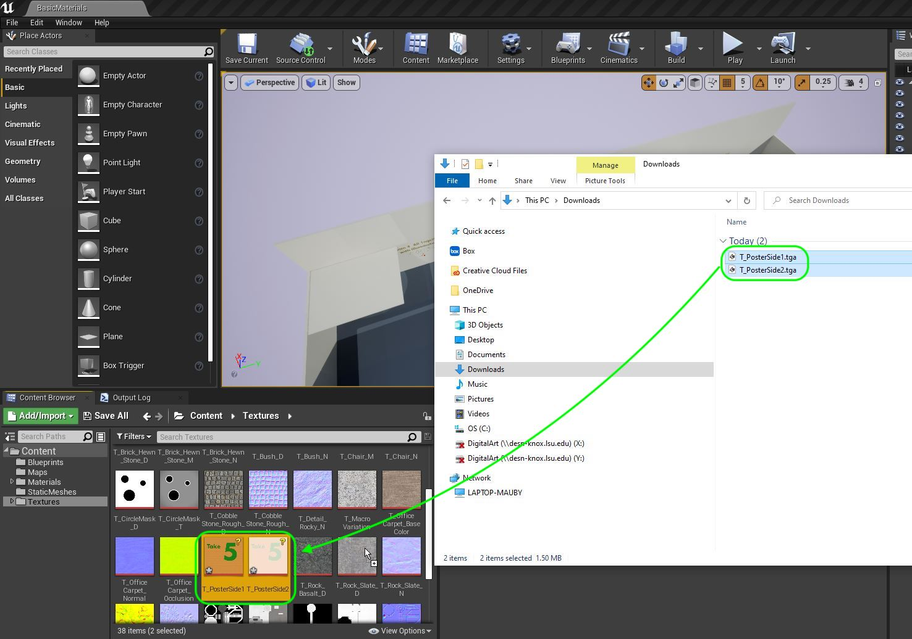

##### `Step 2.`\|`FHIU`|:small_blue_diamond: :small_blue_diamond: 

Now go back to the game, move over to **Room 5** and drop a new **Place Actors | Basic | Plane** in the left side of the room.

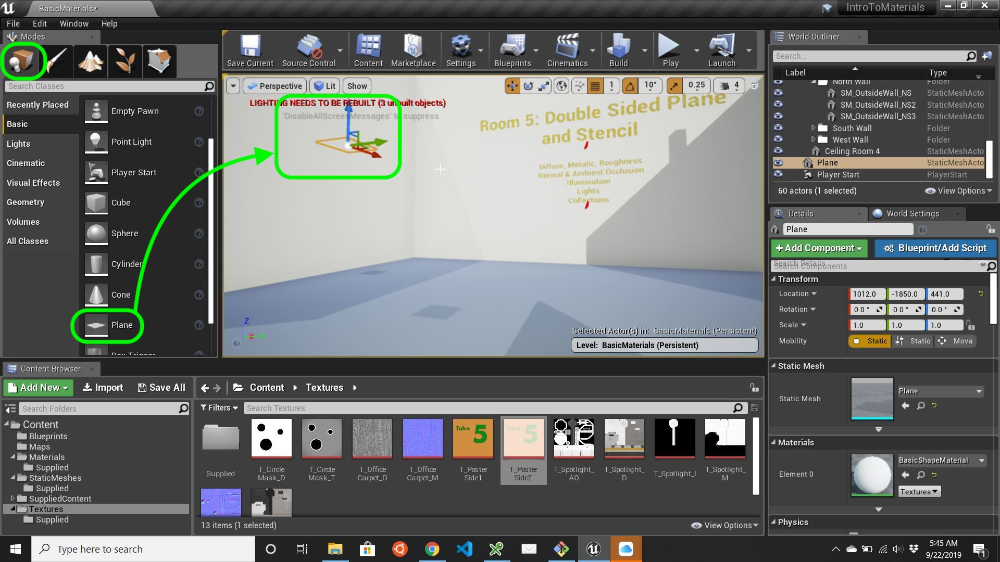

##### `Step 3.`\|`SUU&G`|:small_blue_diamond: :small_blue_diamond: :small_blue_diamond:

Rotate the poster in the room so it is perpendicular to the floor. Change the **Transform | Scale** to `3.0` on the **X** and **Y**.  Now move the poster to the left hand side of the room.

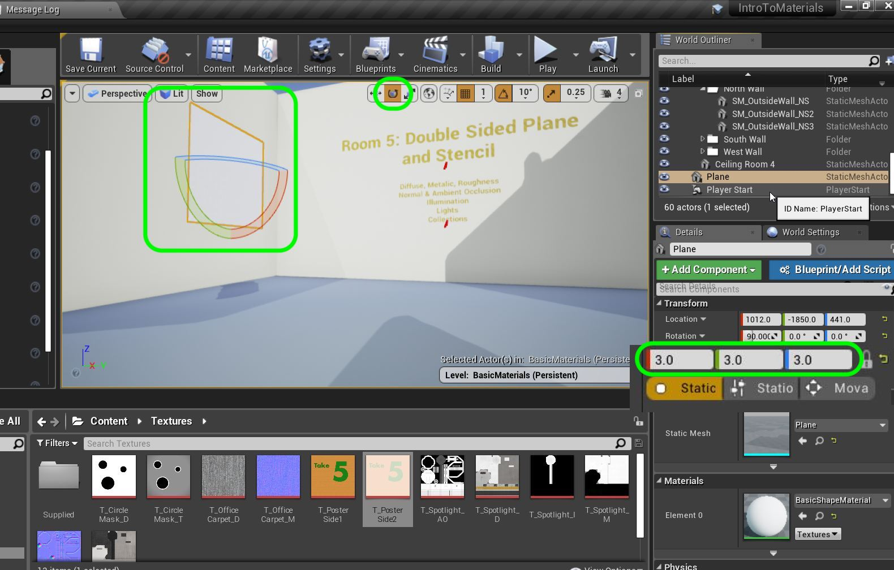

##### `Step 4.`\|`SUU&G`|:small_blue_diamond: :small_blue_diamond: :small_blue_diamond: :small_blue_diamond:

Create a new material to place on this plane.  Call it `M_TwoSide_Poster`.  Make sure it is in the **Materials** folder.

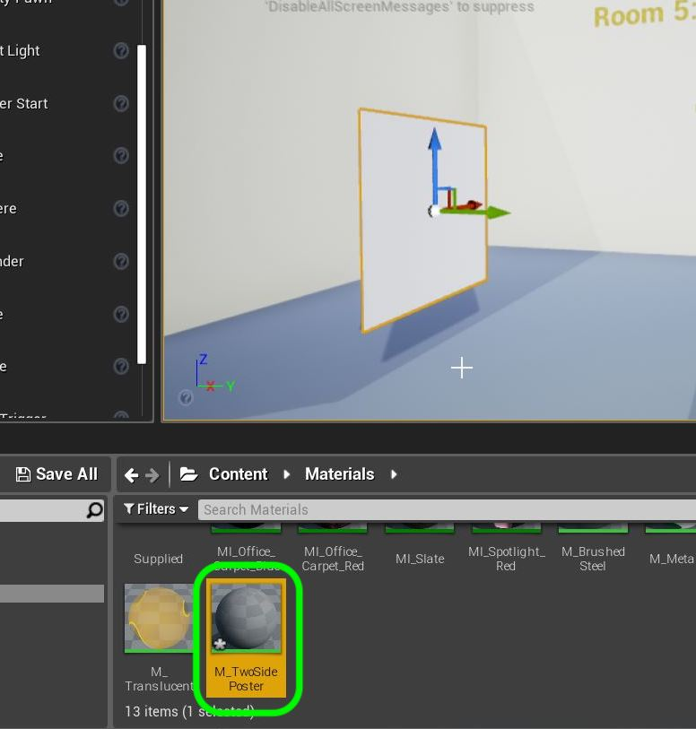

##### `Step 5.`\|`SUU&G`| :small_orange_diamond:

Open up **M_TwoSide_Poster**. Add a **Texture Sample** node and assign the **T_PosterSide1** to it. Attach the top output pin into the **Base Color** pin in the main Material Node's **Base Color** pin.

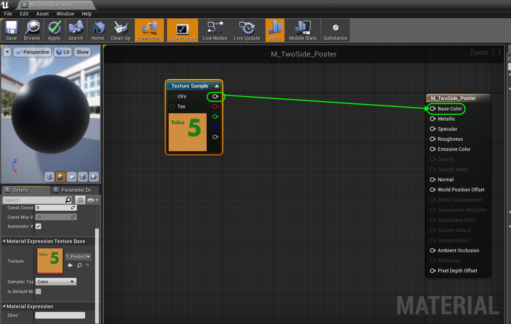

##### `Step 6.`\|`SUU&G`| :small_orange_diamond: :small_blue_diamond:

Now change the **Preview Mesh** to a **Plane** and rotate around it.  Notice that you are not able to see both sides and the back of the poster is comletely transparent (lacks face normals).

https://user-images.githubusercontent.com/5504953/131247772-4bb2c5ef-7842-4ddf-b1e0-75b6e1824342.mp4

##### `Step 7.`\|`SUU&G`| :small_orange_diamond: :small_blue_diamond: :small_blue_diamond:

Now make sure you are highlighting the main node and look for **Two Sided** and set it to `True`. We should now have both sides rendering (even though only 1 side has normals).

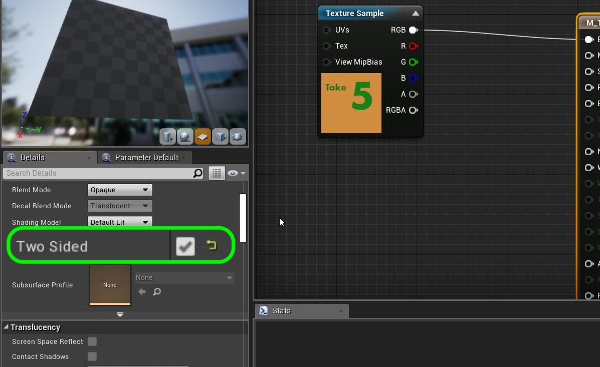

##### `Step 8.`\|`SUU&G`| :small_orange_diamond: :small_blue_diamond: :small_blue_diamond: :small_blue_diamond:

Rotate the camera and notice we have one side of the poster on both sides of the plane.  Now we have the same texture on both sides.  But what if we wanted a different graphic on both sides.  How will we handle it?

https://user-images.githubusercontent.com/5504953/131247852-489eb4ba-7375-4b71-8546-f7196838dac5.mp4

##### `Step 9.`\|`SUU&G`| :small_orange_diamond: :small_blue_diamond: :small_blue_diamond: :small_blue_diamond: :small_blue_diamond:

We need a bit of calculus and look at two vectors, the camera and the plane normal in world space.  We take the dot product of both.  If it is negative the lines are looking away from each other if it is above 0 they were looking at each other.  We will round up the dot product and use the Lerp even so that there is only going to be 0 and 1 out of the Lerp node. Add another **Texture Sample** and a **Math | Linear Interpolate** Node.  In the texture sample pick `T_PosterSide2`.

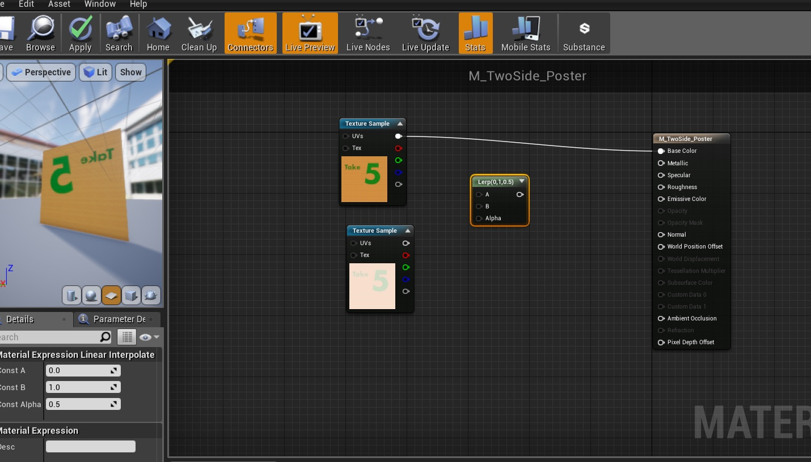

##### `Step 10.`\|`SUU&G`| :large_blue_diamond:

What does the LERP node do?  Plug in the two textures to the **A** and **B** input.  Disconnect the input to the **Base Color** on the shader node (it is no longer two sided in the previewer, but will be when viewing it regularly - rotate to the front of the poster). 

Right click on the **LERP** node and select **Start Previewing Node**.  You will see that the Const Alpha is `0.5` which blends 50% of both images.  `0` would be 100% of the texture going to **A** and `1` would be 100% of the texture going to **B**.  Lets prove it by giving it a test run.

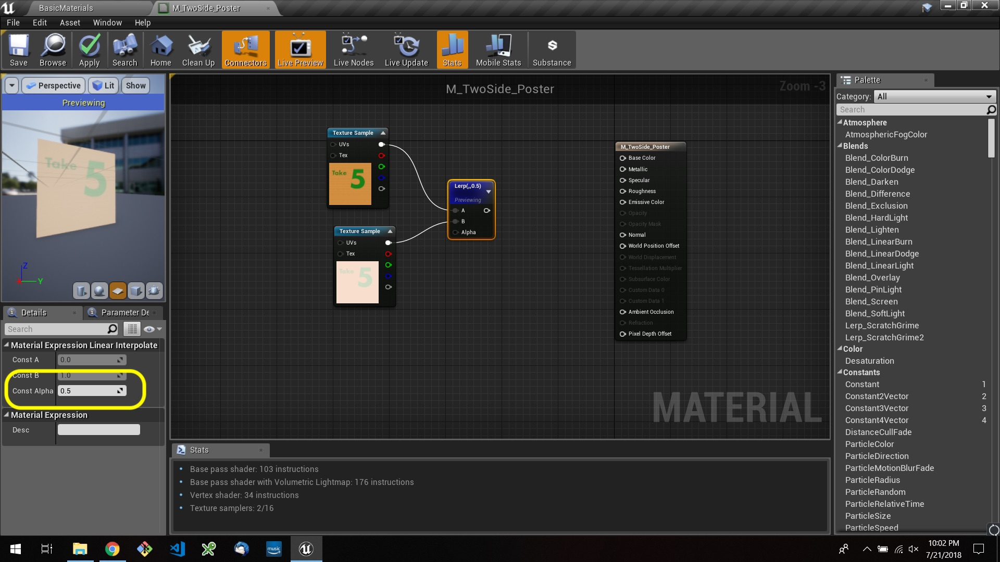

##### `Step 11.`\|`SUU&G`| :large_blue_diamond: :small_blue_diamond: 

Change the **Const Alpha** to `0` and see the image switches to the one in A.

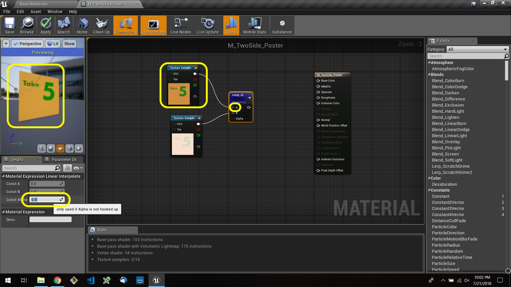

##### `Step 12.`\|`SUU&G`| :large_blue_diamond: :small_blue_diamond: :small_blue_diamond: 

Switch it to `1` and see that now is displays the image in Node B.

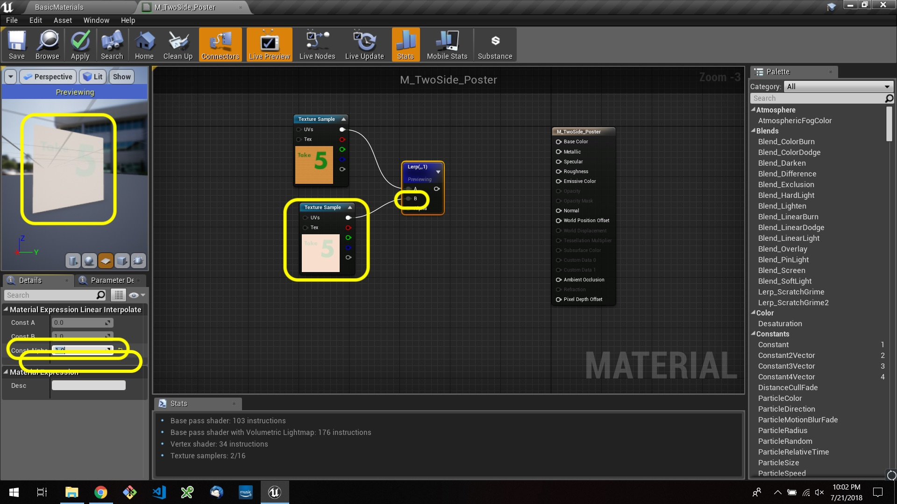

##### `Step 13.`\|`SUU&G`| :large_blue_diamond: :small_blue_diamond: :small_blue_diamond:  :small_blue_diamond: 

Add a **Camera Vector WS** and **Vertex Normal WS** node.  This will be the start of our vector arithmetic to determine the side of the plane that the player (camera) is on.

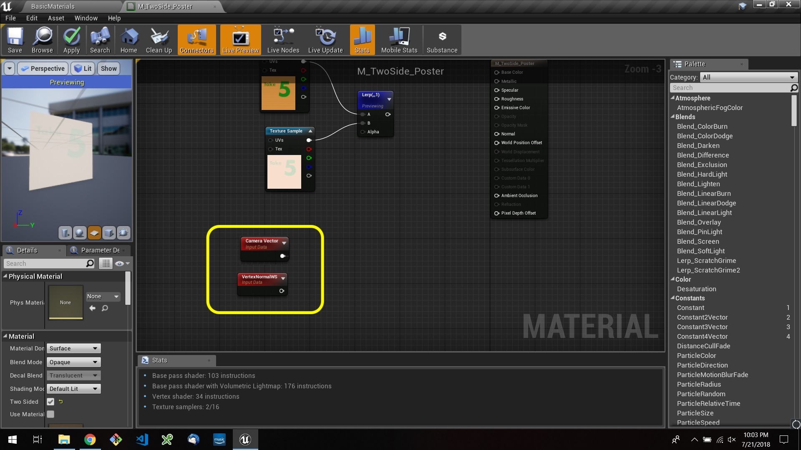

##### `Step 14.`\|`SUU&G`| :large_blue_diamond: :small_blue_diamond: :small_blue_diamond: :small_blue_diamond:  :small_blue_diamond: 

Add a **Dot Product** node and connect the two vectors to the inputs.  This will multiply them together and return a single vector.

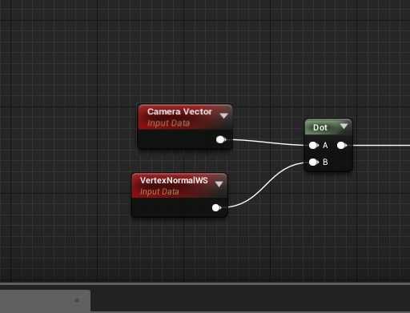

##### `Step 15.`\|`SUU&G`| :large_blue_diamond: :small_orange_diamond: 

Now the return will be negative (back side of plane) or above 0 on same side of plane.  But we don't want any values inbetween.  So we will round up by adding a **Ceil** (Ceiling) node that rounds a fractional number up to the next integer.

##### `Step 16.`\|`SUU&G`| :large_blue_diamond: :small_orange_diamond:   :small_blue_diamond: 

Now we need to clamp the output as we don't want a -1 or any number below 0 or above 1 to get in there when the Alpha only needs a 0 or 1 in this instance (a dot product will return -1 to 1).  So we add a **Clamp** node which defaults to clamping between 0 and 1.  That mean any number number under 0 is 0 and above 1 is 1. Plug the output of this **Clamp** node into the **Alpha** of the **Lerp** node.  Right click the **Lerp Node** and select **Stop Previewing Node**.  Make sure the output of the **Lerp** node goes to the **Base Color** pin.

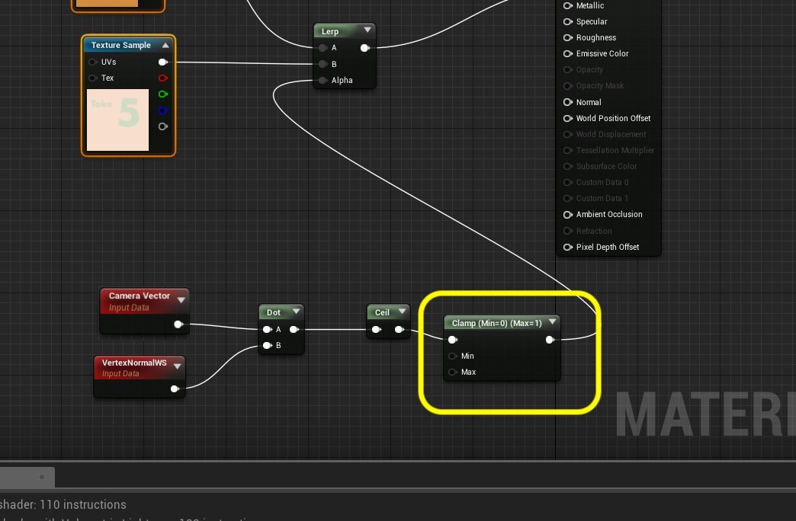

##### `Step 17.`\|`SUU&G`| :large_blue_diamond: :small_orange_diamond: :small_blue_diamond: :small_blue_diamond:

Now rotate around the plane and we have two images.  Notice in this case that the one I wanted in front is backwards, so I swapped the input **A** and **B** to fix this.

https://user-images.githubusercontent.com/5504953/131248351-7f5ceb60-bf38-4905-8de7-a8c95a6ebb34.mp4

##### `Step 18.`\|`SUU&G`| :large_blue_diamond: :small_orange_diamond: :small_blue_diamond: :small_blue_diamond: :small_blue_diamond:

Group the nodes and add comments by pressing the **C** key. Press the **Apply** button and **Save**.

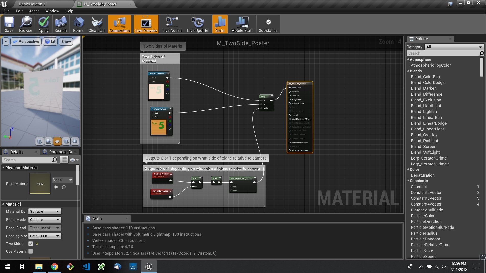

##### `Step 19.`\|`SUU&G`| :large_blue_diamond: :small_orange_diamond: :small_blue_diamond: :small_blue_diamond: :small_blue_diamond: :small_blue_diamond:

Now go into the game and assign the **M_TwoSide_Poster** to the plane.  Make sure it renders correctly.

https://user-images.githubusercontent.com/5504953/131248476-74156024-35ea-4e91-8b7b-17329d27dd1e.mp4

##### `Step 20.`\|`SUU&G`| :large_blue_diamond: :large_blue_diamond:

OK, now lets finish up this section by savin our work and uploading it to GitHub.  Press **File | Save All** then **Source Conrol | Submit to Source Control...** and add a description.  Press the <kbd>Submit</kbd> button.  Open up **GitHub Desktop** and **Push** the commited work.

https://user-images.githubusercontent.com/5504953/131248615-d162e489-f24c-49bb-9493-c3ed44cf1229.mp4
___

| [previous](../illumination-ii/README.md#user-content-emissive-material-ii)| [home](../README.md#user-content-ue4-intro-to-materials) | [next](../decals/README.md#user-content-decals)|
|---|---|---|
