### World Aligned Materials

[previous](../refract/README.md#user-content-refraction-and-fresnel) • [home](../README.md#user-content-ue4-intro-to-materials) • [next](../animation/README.md#user-content-animation)

What happens if I want a long stretch of brick wall that follows different shaped and placed geometries.  It would take a lot of painstaking tweaking to align all the UV's.  There is a better way in unreal to use world coordinates to place the UVs.

 

---

##### `Step 1.`\|`SUU&G`|:small_blue_diamond:

Double click to load **Maps | BasicMaterials2**.

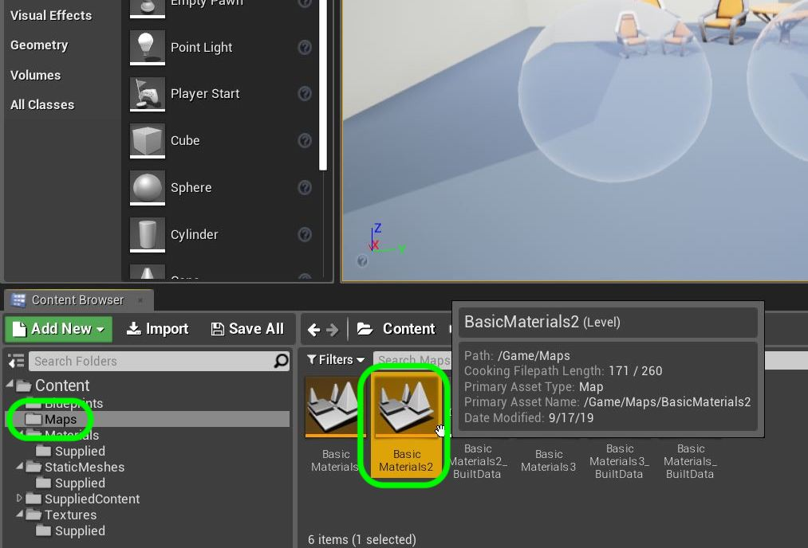

##### `Step 2.`\|`FHIU`|:small_blue_diamond: :small_blue_diamond: 

Now move the camera to **Room 7** and press **Build** to set the lighting in the room.

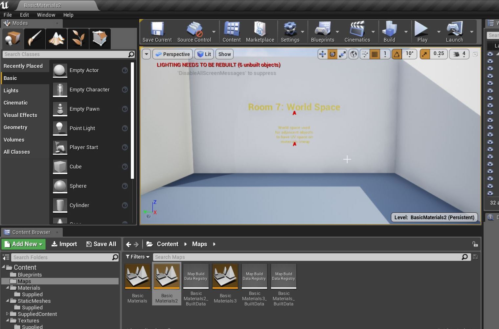

##### `Step 3.`\|`SUU&G`|:small_blue_diamond: :small_blue_diamond: :small_blue_diamond:

Now add **StaticMeshes | Supplied | Wall 400x400** and place them next to each other but offset.  We want to have the bricks line up properly. 

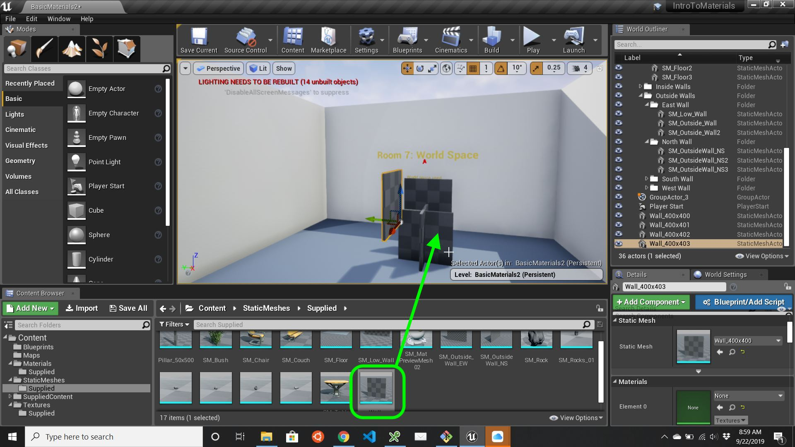

##### `Step 4.`\|`SUU&G`|:small_blue_diamond: :small_blue_diamond: :small_blue_diamond: :small_blue_diamond:

Assign **M_Brick_Clay_Beveled** to the new wall pieces.  Move them and notice that we would have to zoom in to line up the bricks so the rows spread from one wall piece to another.  This is because the material moves with the static mesh. 

We can solve this by using World Space then all the objects will align with the texuture automatically as the textures are fixed to world space and just the mesh moves.  Lets take a look.

https://user-images.githubusercontent.com/5504953/131256618-4eae97a3-729d-465c-8e71-598e5cbd4166.mp4

##### `Step 5.`\|`SUU&G`| :small_orange_diamond:

Add a new **Material** called `M_RockWS`.

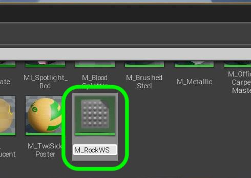

##### `Step 6.`\|`SUU&G`| :small_orange_diamond: :small_blue_diamond:

Open the material and add a **Texture Sample** node adding the **T_Brick_Hewn_Stone_D** texture.

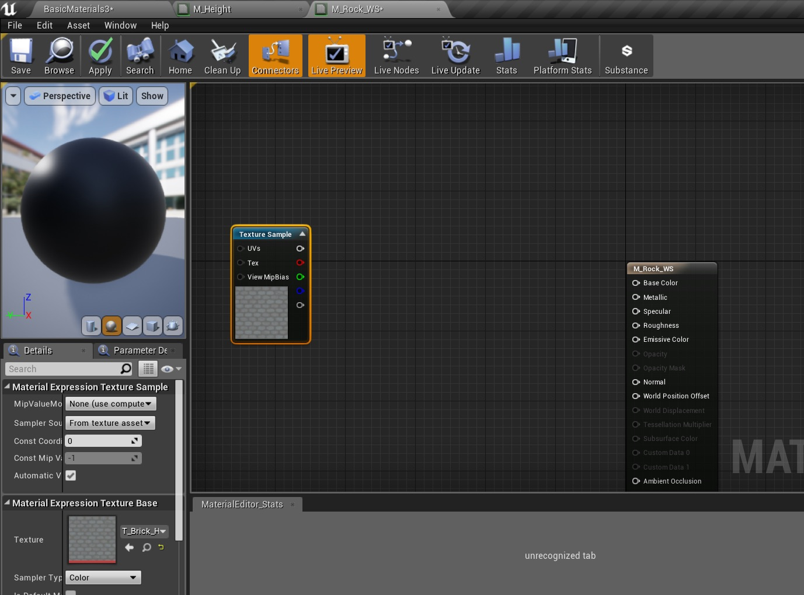

##### `Step 7.`\|`SUU&G`| :small_orange_diamond: :small_blue_diamond: :small_blue_diamond:

Add a **World Aligned Texture** node to the graph.

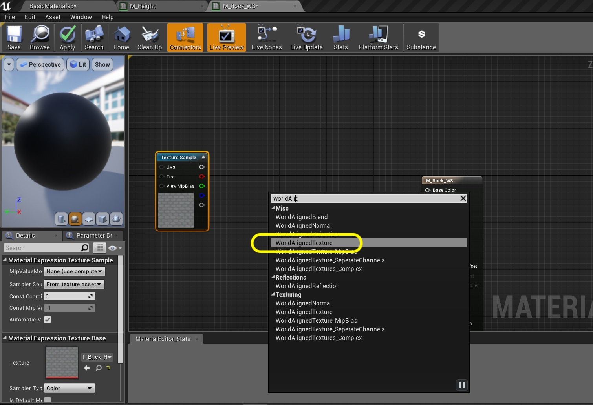

##### `Step 8.`\|`SUU&G`| :small_orange_diamond: :small_blue_diamond: :small_blue_diamond: :small_blue_diamond:

Try to connect the two nodes.  Woops we get an error.

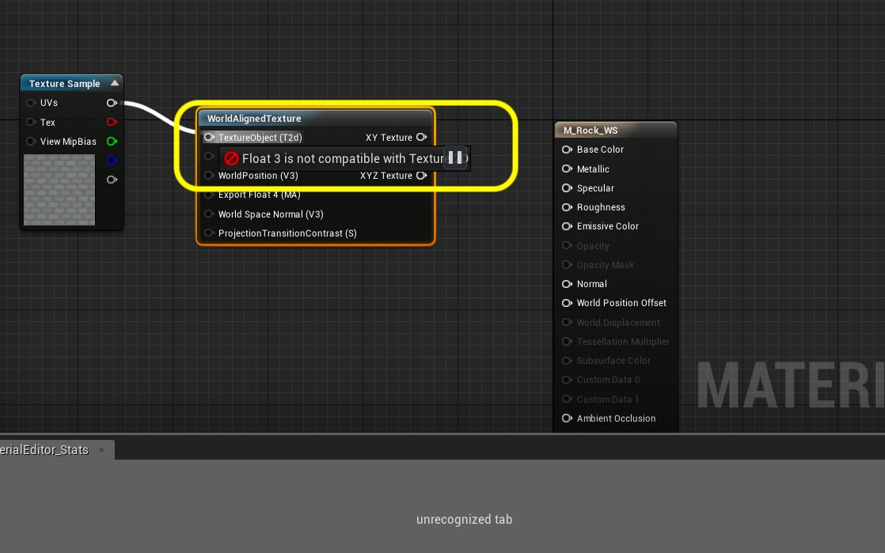

##### `Step 9.`\|`SUU&G`| :small_orange_diamond: :small_blue_diamond: :small_blue_diamond: :small_blue_diamond: :small_blue_diamond:

Highlight over the input of the **World Aligned Textured** node and see that it wants a **Texture Object**. Add a **Texture Object** node and delete the **Texture Sample** node and call it `WSRockDiffuse`. Assign the **T_Brick_Hewn_Stone_D** texture.

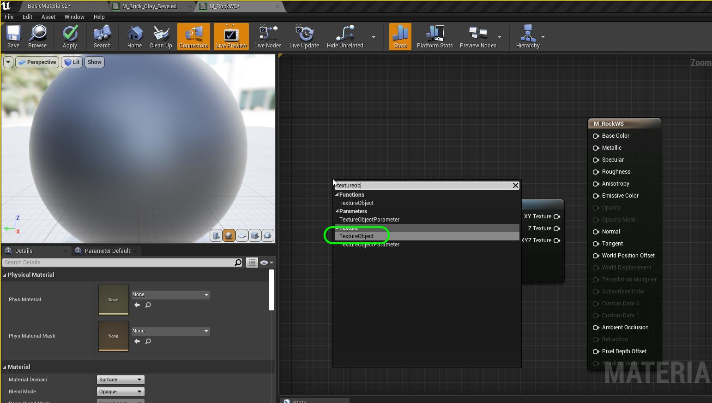

##### `Step 10.`\|`SUU&G`| :large_blue_diamond:

Now connect the output of the Texture Object and plug it into the input of the **World Aligned Texture** node.

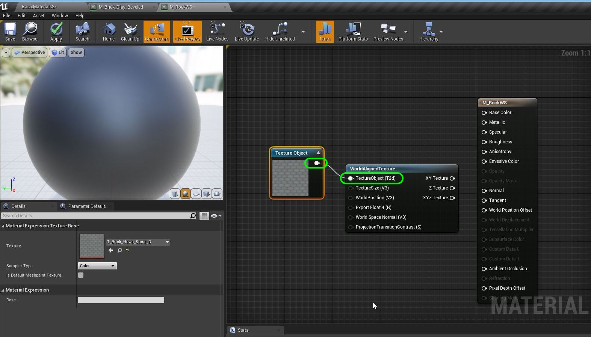

##### `Step 11.`\|`SUU&G`| :large_blue_diamond: :small_blue_diamond: 

Connect the **XYZ Texture** output of the World Aligned Texture node to **Base Color** in the main material node.  Press the <kbd>Apply</kbd> button.

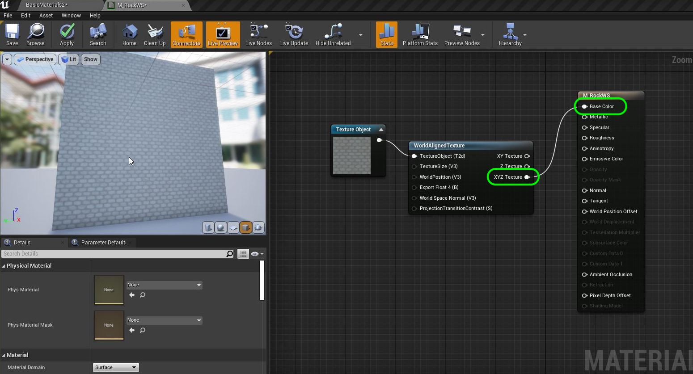

##### `Step 12.`\|`SUU&G`| :large_blue_diamond: :small_blue_diamond: :small_blue_diamond: 

Select all the cube walls and move them into the **Room 7** folder.  Assign **M_RockWS** to them. You should see that even though the rock textures are very small that they align based on world position. When you move the static meshes the texture does not move with them it stays fixed.  So all of the bricks will always align.  This is very useful for long fences and other objects that will be instanced many times.

https://user-images.githubusercontent.com/5504953/131257132-80d4ef0e-827a-4089-9e68-427578ef6c2e.mp4

##### `Step 13.`\|`SUU&G`| :large_blue_diamond: :small_blue_diamond: :small_blue_diamond:  :small_blue_diamond: 

If we go back to the material and hover over the Texture Size node it states that it defaults it to world size of `64, 64, 64`.  UE4's size is 1 unit per milimeter so 6.4 cm or 2.5 inches is not large enough.

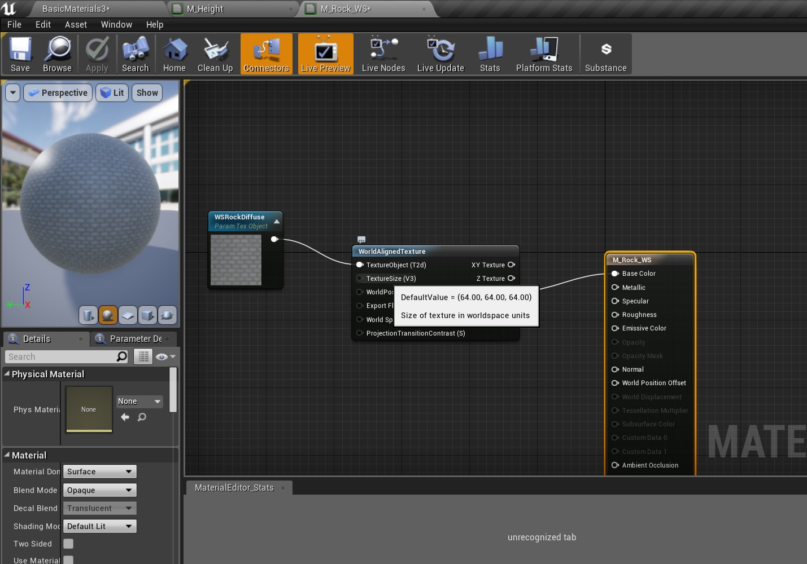

##### `Step 14.`\|`SUU&G`| :large_blue_diamond: :small_blue_diamond: :small_blue_diamond: :small_blue_diamond:  :small_blue_diamond: 

Add a **Constant Vector 3** node set to `128, 128, 128`.  This will effectively double the size.  Connect the output to **Texture Size** on World Aligned Texture node.  Press the **Apply** button. Remember this is not necessarily a color but three floating point numbers.  In this case we are using **R, G, B** to represent the size of the texture we are rendering.

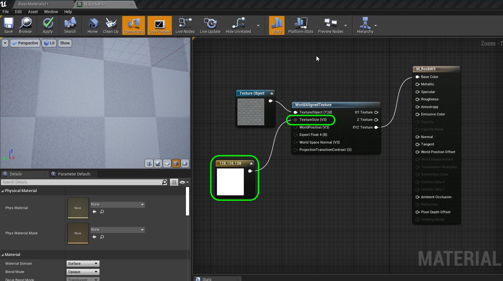

##### `Step 15.`\|`SUU&G`| :large_blue_diamond: :small_orange_diamond: 

Apply the change and look at it in game.

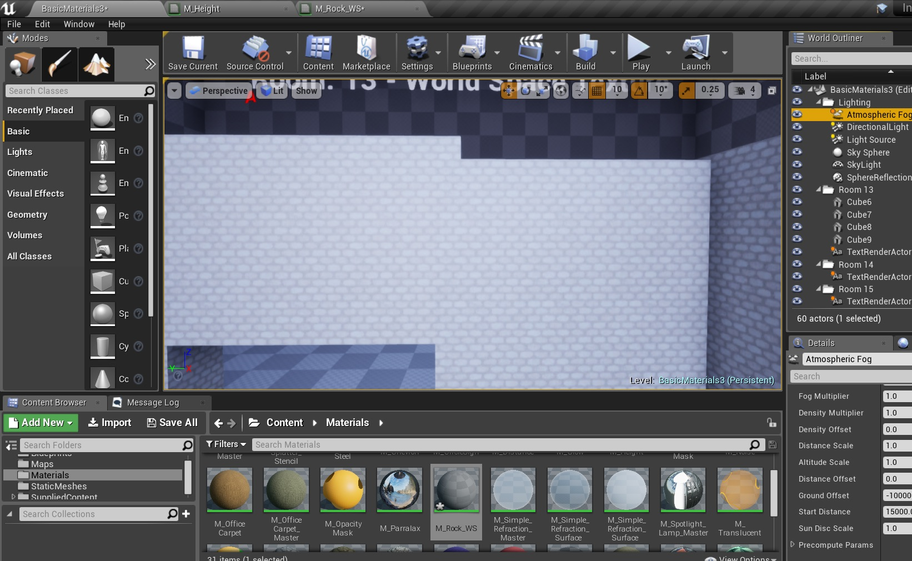

##### `Step 16.`\|`SUU&G`| :large_blue_diamond: :small_orange_diamond:   :small_blue_diamond: 

Add another **Texture Object**, name it `WSRockNormal` and assign **T_Brick_Hewn_Stone_N**, the normal texture texture that goes with this material.

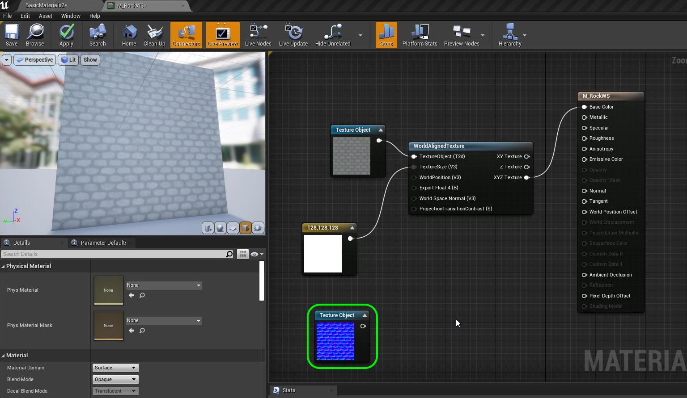

##### `Step 17.`\|`SUU&G`| :large_blue_diamond: :small_orange_diamond: :small_blue_diamond: :small_blue_diamond:

Add a **World Aligned Normal** node.  Connect the **Constant3Vector** to the **Texture Size** to make the normal the same size as the diffuse.  Connect the output of the **Texture Object** pin to the input in **World Aligned Normal | Texture Object**. Send the **XYZ Texture** output to the **Normal** input on the main material node.

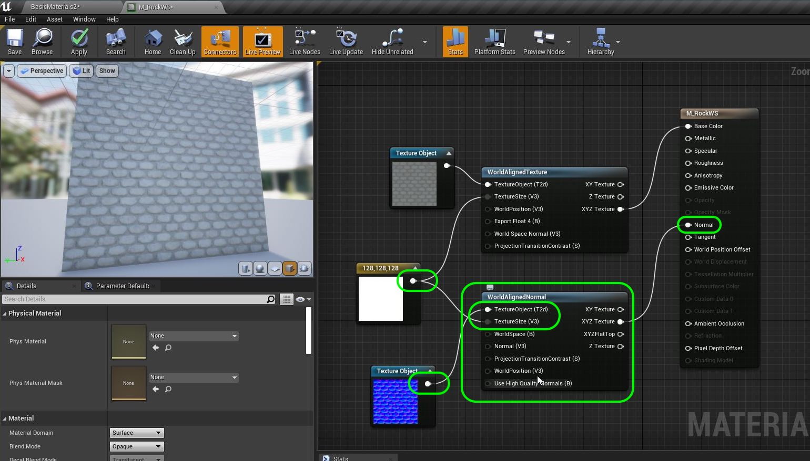

##### `Step 18.`\|`SUU&G`| :large_blue_diamond: :small_orange_diamond: :small_blue_diamond: :small_blue_diamond: :small_blue_diamond:

Add a Scalar and set it to `.95`.  Attach it to the **Roughness** node and press the <kbd>Apply</kbd> button.

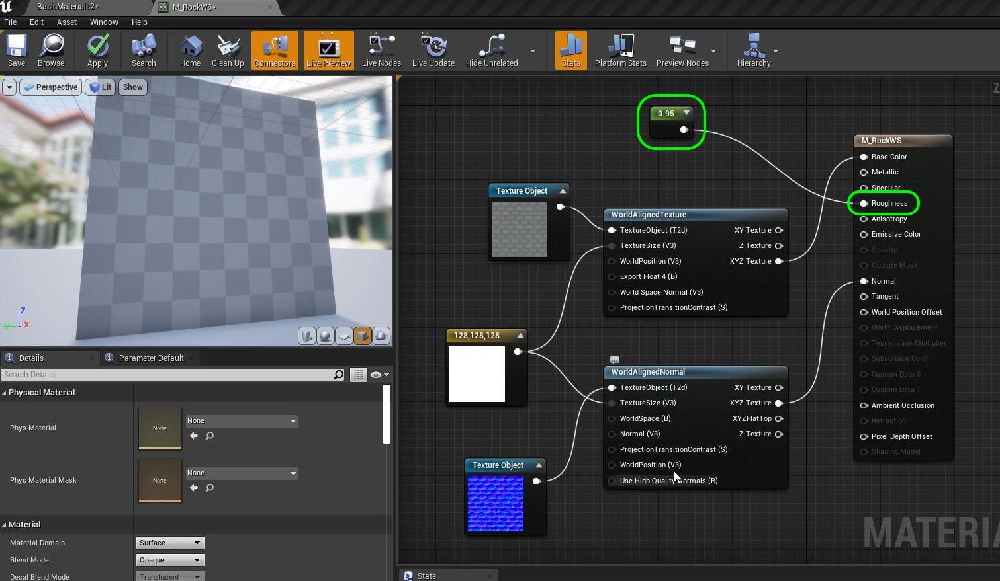  

##### `Step 19.`\|`SUU&G`| :large_blue_diamond: :small_orange_diamond: :small_blue_diamond: :small_blue_diamond: :small_blue_diamond: :small_blue_diamond:

Go into the game and move things around and enjoy your seemless textures.

https://user-images.githubusercontent.com/5504953/131258367-7f9f0868-6329-4c8e-92c2-a3ec597081d5.mp4

##### `Step 20.`\|`SUU&G`| :large_blue_diamond: :large_blue_diamond:

That's it for Room 7. Press **Save All** and **Source Control | Submit to Source Control...** then update Github by **pushing** all the changes made.  Next up we will be animating the brightness of a texture.

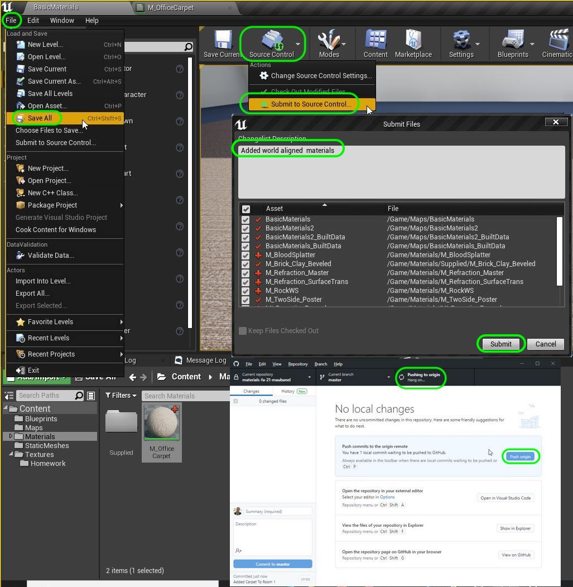

___

| [previous](../refract/README.md#user-content-refraction-and-fresnel)| [home](../README.md#user-content-ue4-intro-to-materials) | [next](../animation/README.md#user-content-animation)|
|---|---|---|
